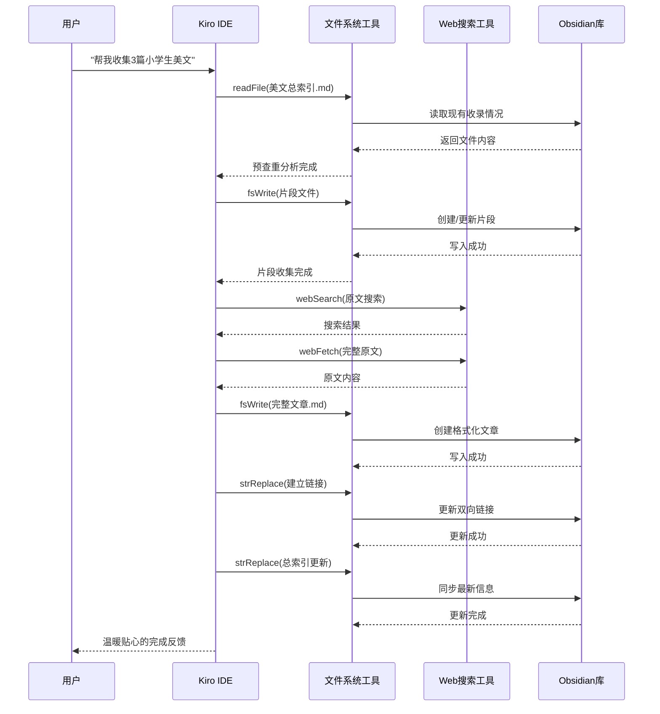

# 设计文档

## 系统概述

美文收集自动化系统是一个基于Kiro IDE工具的自动化执行方案，通过严格的9步SOP（标准操作程序）工作流程，实现从用户简单指令"帮我收集N篇美文"到完整美文收录的一条龙自动化处理。系统直接操作Obsidian库中的Markdown文件，无需开发独立软件，完全依托Kiro IDE的现有工具链完成美文收集、格式化、链接建立和索引更新等操作。

## 系统架构

### 执行环境架构

```mermaid
graph TB
    A[用户指令: "帮我收集N篇美文"] --> B[Kiro IDE]
    B --> C[佳桐AI助手]
    C --> D[SOP工作流执行器]
    
    D --> E[步骤0: 预查重检查<br/>readFile + 分析]
    E --> F[步骤1: 片段收集<br/>fsWrite + fsAppend]
    F --> G[步骤2: 索引更新<br/>strReplace]
    G --> H[步骤3: 原文搜索<br/>webSearch + webFetch]
    H --> I[步骤4: 文章格式化<br/>fsWrite + 模板处理]
    I --> J[步骤5: 去重检查<br/>readFile + 分析]
    J --> K[步骤6: 链接建立<br/>strReplace]
    K --> L[步骤7: 质量检查<br/>readFile + 验证]
    L --> M[步骤8: 总索引更新<br/>strReplace]
    
    M --> N[完成报告]
    N --> O[用户反馈]
    
    subgraph "Obsidian文件系统"
        P[小学生美文/]
        Q[初中生美文/]
        R[高中生美文/]
        S[大学生美文/]
        T[成人美文/]
        U[美文总索引.md]
    end
    
    E -.-> U
    F -.-> P
    G -.-> P
    I -.-> P
    K -.-> P
    M -.-> U
```

### Kiro IDE工具链使用



## 组件和接口

### 核心组件

#### 1. 佳桐AI助手 (Kiro IDE中的AI助手)
- **身份**: 乖巧女儿 + 专业助手
- **职责**: 解析用户指令，执行SOP工作流
- **交互**: 始终称呼用户为"爸爸"，温暖贴心的交流风格
- **能力**: 熟练使用Kiro IDE的所有文件操作工具

#### 2. SOP工作流执行器 (基于Kiro IDE工具)
```typescript
interface SOP工作流执行器 {
  // 当前执行状态
  当前步骤: 0 | 1 | 2 | 3 | 4 | 5 | 6 | 7 | 8;
  目标级别: "小学生美文" | "初中生美文" | "高中生美文" | "大学生美文" | "成人美文";
  目标数量: number;
  
  // Kiro IDE工具映射
  工具使用: {
    文件读取: "readFile" | "readMultipleFiles";
    文件写入: "fsWrite" | "fsAppend";
    文件修改: "strReplace";
    网络搜索: "webSearch" | "webFetch";
    文件删除: "deleteFile";
  };
  
  // 执行方法
  执行步骤(步骤号: number): Promise<步骤结果>;
  验证完成(步骤号: number): boolean;
  生成报告(): 执行报告;
}
```

#### 3. Obsidian文件系统结构
```
workspace/
├── 小学生美文/
│   ├── 小学生美文精选100篇.md          # 片段收集文件
│   ├── 美文收集索引.md                  # 本级别索引
│   ├── 美文赏析与教学通用模版.md        # 格式化模板
│   ├── 01.背影-朱自清.md               # 完整文章
│   ├── 02.春-朱自清.md                 # 完整文章
│   └── ...
├── 初中生美文/
├── 高中生美文/
├── 大学生美文/
├── 成人美文/
└── 美文总索引.md                       # 全局总索引
```

#### 4. Kiro IDE工具使用策略
```typescript
interface Kiro工具使用策略 {
  // 文件操作工具
  readFile: "读取单个文件内容，用于分析现有数据";
  readMultipleFiles: "批量读取多个文件，用于跨文件分析";
  fsWrite: "创建新文件，用于生成完整文章";
  fsAppend: "追加内容到现有文件，用于添加片段";
  strReplace: "精确替换文件内容，用于更新索引和建立链接";
  deleteFile: "删除重复或错误文件";
  
  // 网络工具
  webSearch: "搜索完整原文和版本验证信息";
  webFetch: "获取具体的原文内容";
  
  // 使用原则
  操作顺序: "先读取分析，再写入修改";
  错误处理: "每个操作后验证结果";
  备份策略: "重要修改前先备份";
}
```

### 数据模型

#### 1. 用户指令解析
```typescript
interface 用户指令 {
  原始指令: string;  // "帮我收集5篇小学生美文"
  解析结果: {
    动作: "收集美文";
    数量: number;     // 5
    级别: string;     // "小学生美文"
  };
  目标路径: string;   // "小学生美文/"
}
```

#### 2. 文件路径映射
```typescript
interface 文件路径映射 {
  级别路径: {
    "小学生美文": "小学生美文/";
    "初中生美文": "初中生美文/";
    "高中生美文": "高中生美文/";
    "大学生美文": "大学生美文/";
    "成人美文": "成人美文/";
  };
  
  关键文件: {
    片段文件: "{级别}美文精选100篇.md";
    索引文件: "美文收集索引.md";
    模板文件: "美文赏析与教学通用模版.md";
    总索引: "美文总索引.md";
  };
}
```

#### 3. 步骤执行结果
```typescript
interface 步骤结果 {
  步骤号: number;
  步骤名称: string;
  执行状态: "成功" | "失败" | "警告";
  处理文件: string[];
  生成内容: {
    新增片段?: number;
    新增文章?: number;
    新增链接?: number;
  };
  错误信息?: string;
  下一步提示?: string;
}
```

## 9步SOP工作流详细设计

### 步骤0: 预查重检查
**目标**: 在开始收集前检查总索引，避免重复收集
**Kiro工具**: `readFile`
```typescript
async function 步骤0_预查重检查(目标级别: string, 目标数量: number) {
  // 1. 读取美文总索引
  const 总索引内容 = await readFile("美文总索引.md");
  
  // 2. 分析现有收录情况
  const 现有作品 = 解析总索引(总索引内容);
  
  // 3. 检查数量限制（每作品最多2篇）
  const 超限作品 = 检查数量限制(现有作品);
  
  // 4. 生成预查重报告
  return {
    允许收集: 超限作品.length === 0,
    风险作品: 超限作品,
    建议: "避免收集已达2篇限制的作品"
  };
}
```

### 步骤1: 片段收集
**目标**: 随机选择作家，收集经典片段
**Kiro工具**: `readFile`, `fsAppend`
```typescript
async function 步骤1_片段收集(目标级别: string, 数量: number) {
  // 1. 读取现有片段文件
  const 片段文件路径 = `${目标级别}/${目标级别}精选100篇.md`;
  const 现有内容 = await readFile(片段文件路径);
  
  // 2. 分析已使用序号
  const 已用序号 = 提取序号(现有内容);
  const 下一序号 = Math.max(...已用序号) + 1;
  
  // 3. 随机选择作家和作品
  const 新片段 = [];
  for (let i = 0; i < 数量; i++) {
    const 作家 = 随机选择作家();
    const 作品 = 选择代表作(作家);
    const 片段 = 提取经典片段(作品, 目标级别);
    新片段.push(格式化片段(下一序号 + i, 片段));
  }
  
  // 4. 追加到片段文件
  await fsAppend(片段文件路径, 新片段.join('\n'));
  
  return { 新增片段: 数量, 起始序号: 下一序号 };
}
```

### 步骤2: 索引更新
**目标**: 更新本级别的索引文件
**Kiro工具**: `strReplace`
```typescript
async function 步骤2_索引更新(目标级别: string, 新片段信息: any[]) {
  const 索引文件路径 = `${目标级别}/美文收集索引.md`;
  
  // 1. 读取现有索引
  const 现有索引 = await readFile(索引文件路径);
  
  // 2. 更新统计信息
  const 新统计 = 计算新统计(现有索引, 新片段信息);
  
  // 3. 添加新片段条目
  const 新条目 = 新片段信息.map(片段 => 
    `${片段.序号}. 《${片段.作品名}》 - ${片段.作者}【行号】`
  ).join('\n');
  
  // 4. 替换索引内容
  await strReplace(索引文件路径, 
    "## 片段列表", 
    `## 片段列表\n${新条目}`
  );
  
  return { 更新条目: 新片段信息.length };
}
```

### 步骤3: 原文搜索
**目标**: 为每个片段搜索完整原文
**Kiro工具**: `webSearch`, `webFetch`
```typescript
async function 步骤3_原文搜索(片段列表: 片段[]) {
  const 搜索结果 = [];
  
  for (const 片段 of 片段列表) {
    // 1. 搜索完整版关键词
    const 搜索词 = `"${片段.作品名}" "${片段.作者}" 原文完整版`;
    const 搜索结果 = await webSearch(搜索词);
    
    // 2. 强制搜索版本差异
    const 版本检查词 = `"${片段.作品名}" 课文与原文区别`;
    const 版本信息 = await webSearch(版本检查词);
    
    // 3. 获取完整原文
    const 最佳链接 = 选择最佳链接(搜索结果);
    const 原文内容 = await webFetch(最佳链接);
    
    // 4. 验证版本完整性
    const 验证结果 = 验证版本完整性(原文内容, 版本信息);
    
    搜索结果.push({
      片段,
      原文: 原文内容,
      验证: 验证结果,
      来源: 最佳链接
    });
  }
  
  return 搜索结果;
}
```

### 步骤4: 文章格式化
**目标**: 按模板创建完整的格式化文章
**Kiro工具**: `readFile`, `fsWrite`
```typescript
async function 步骤4_文章格式化(原文数据: any[], 目标级别: string) {
  // 1. 读取对应级别的模板
  const 模板路径 = `${目标级别}/美文赏析与教学通用模版.md`;
  const 模板内容 = await readFile(模板路径);
  
  const 格式化文章 = [];
  
  for (const 数据 of 原文数据) {
    // 2. 分配文章序号
    const 文章序号 = 分配文章序号(目标级别);
    
    // 3. 应用模板格式化
    const 格式化内容 = 应用模板(模板内容, {
      序号: 文章序号,
      标题: 数据.片段.作品名,
      作者: 数据.片段.作者,
      原文: 数据.原文,
      来源: 数据.来源
    });
    
    // 4. 创建文章文件
    const 文件名 = `${文章序号}.${数据.片段.作品名}-${数据.片段.作者}.md`;
    const 文件路径 = `${目标级别}/${文件名}`;
    
    await fsWrite(文件路径, 格式化内容);
    
    格式化文章.push({
      序号: 文章序号,
      文件名,
      片段序号: 数据.片段.序号
    });
  }
  
  return 格式化文章;
}
```

### 步骤5: 去重检查
**目标**: 检查重复文章和数量限制
**Kiro工具**: `readMultipleFiles`
```typescript
async function 步骤5_去重检查(新文章: any[]) {
  // 1. 读取所有级别的文章
  const 所有文章 = await 扫描所有文章();
  
  // 2. 检查同一文件夹重复
  const 同文件夹重复 = 检查同文件夹重复(新文章, 所有文章);
  
  // 3. 检查跨文件夹数量限制
  const 数量超限 = 检查数量限制(新文章, 所有文章);
  
  // 4. 生成去重报告
  return {
    严重问题: 同文件夹重复.concat(数量超限),
    需要建立链接: 查找跨文件夹相同文章(新文章, 所有文章),
    清洁度: 计算清洁度(所有文章)
  };
}
```

### 步骤6: 链接建立
**目标**: 在片段和文章间建立双向链接
**Kiro工具**: `strReplace`
```typescript
async function 步骤6_链接建立(文章信息: any[]) {
  for (const 文章 of 文章信息) {
    // 1. 在片段中添加链接
    const 片段文件 = `${目标级别}/${目标级别}精选100篇.md`;
    const 片段链接 = `[[${文章.文件名}|→ 查看完整版]]`;
    
    await strReplace(片段文件,
      `#### **${文章.片段序号}. 《`,
      `#### **${文章.片段序号}. 《`
    );
    
    // 在推荐理由后添加链接
    await strReplace(片段文件,
      `**【推荐理由】** ${获取推荐理由(文章.片段序号)}`,
      `**【推荐理由】** ${获取推荐理由(文章.片段序号)}\n\n${片段链接}`
    );
    
    // 2. 在文章中添加反向链接
    const 反向链接 = `> 📚 **片段收录**: [[${目标级别}精选100篇|返回片段]]`;
    
    await strReplace(`${目标级别}/${文章.文件名}`,
      "---\n\n#",
      `---\n\n${反向链接}\n\n#`
    );
  }
  
  return { 建立链接: 文章信息.length * 2 };
}
```

### 步骤7: 质量检查
**目标**: 验证所有文件的完整性和正确性
**Kiro工具**: `readFile`
```typescript
async function 步骤7_质量检查(处理文件: string[]) {
  const 检查结果 = [];
  
  for (const 文件路径 of 处理文件) {
    const 文件内容 = await readFile(文件路径);
    
    // 1. 检查必需元素
    const 必需检查 = 检查必需元素(文件内容);
    
    // 2. 检查Emoji穿插
    const Emoji检查 = 检查Emoji穿插(文件内容);
    
    // 3. 检查链接有效性
    const 链接检查 = 检查链接有效性(文件内容);
    
    // 4. 检查格式规范
    const 格式检查 = 检查格式规范(文件内容);
    
    检查结果.push({
      文件: 文件路径,
      必需元素: 必需检查,
      Emoji穿插: Emoji检查,
      链接有效: 链接检查,
      格式规范: 格式检查,
      总体评分: 计算总体评分([必需检查, Emoji检查, 链接检查, 格式检查])
    });
  }
  
  return 检查结果;
}
```

### 步骤8: 总索引更新 (铁律步骤)
**目标**: 强制更新美文总索引，同步所有信息
**Kiro工具**: `strReplace`
```typescript
async function 步骤8_总索引更新(收录摘要: any) {
  const 总索引路径 = "美文总索引.md";
  
  // 1. 更新总体统计
  await strReplace(总索引路径,
    /- \*\*总文章数\*\*：\d+篇/,
    `- **总文章数**：${收录摘要.新总数}篇`
  );
  
  // 2. 更新分库统计表
  await strReplace(总索引路径,
    `| ${收录摘要.目标级别} | 100篇 | \\d+篇`,
    `| ${收录摘要.目标级别} | 100篇 | ${收录摘要.该级别总数}篇`
  );
  
  // 3. 更新按文件夹分类
  const 新文章列表 = 收录摘要.新文章.map(文章 => 
    `- [[${文章.文件名}|${文章.标题}]]`
  ).join('\n');
  
  await strReplace(总索引路径,
    `### 🌻 ${收录摘要.目标级别} (\\d+篇)`,
    `### 🌻 ${收录摘要.目标级别} (${收录摘要.该级别总数}篇)\n${新文章列表}`
  );
  
  // 4. 更新按作者分类
  for (const 作者 of 收录摘要.涉及作家) {
    await 更新作者分类(作者, 收录摘要.新文章);
  }
  
  // 5. 更新最后更新时间
  const 当前日期 = new Date().toISOString().split('T')[0];
  await strReplace(总索引路径,
    /- \*\*最后更新\*\*：\d{4}-\d{2}-\d{2}/,
    `- **最后更新**：${当前日期}`
  );
  
  return { 总索引更新: "✅ 已完成", 铁律执行: true };
}
```

## 正确性属性 (基于Kiro IDE工具)

*属性（Property）是系统在所有有效执行中都应该保持为真的特征或行为——本质上是对系统应该做什么的正式陈述。这些属性基于Kiro IDE工具的使用来验证。*

### 属性1: 指令解析一致性
*对于任何*包含收集数量和级别信息的有效用户指令，系统应该正确提取数字数量和目标级别，并映射到正确的文件夹路径
**验证需求: Requirements 1.1**

### 属性2: SOP步骤顺序执行
*对于任何*工作流执行，必须严格按照0→1→2→3→4→5→6→7→8的顺序使用Kiro IDE工具，不允许跳过或重新排序
**验证需求: Requirements 2.1**

### 属性3: 预查重强制执行
*对于任何*收集工作流，必须首先使用`readFile`读取美文总索引进行预查重检查，然后才能进行其他文件操作
**验证需求: Requirements 3.1**

### 属性4: 文件操作原子性
*对于任何*使用`fsWrite`、`fsAppend`或`strReplace`的操作，都应该在操作后验证结果，确保文件内容正确写入
**验证需求: Requirements 2.4**

### 属性5: 两篇限制强制执行
*对于任何*作品（标题+作者组合），通过`readMultipleFiles`扫描所有文件夹后，总数量永远不应超过2篇文章
**验证需求: Requirements 3.4**

### 属性6: 模板完整性验证
*对于任何*使用`fsWrite`创建的格式化文章，都应该包含从模板文件读取的所有7个必需部分
**验证需求: Requirements 4.2**

### 属性7: 双向链接建立
*对于任何*完整文章，都应该使用`strReplace`在片段文件和文章文件中建立双向Obsidian链接
**验证需求: Requirements 5.1**

### 属性8: 网络搜索三步验证
*对于任何*文章处理，都应该使用`webSearch`执行三个搜索：完整版搜索、版本差异搜索、内容获取验证
**验证需求: Requirements 8.1**

### 属性9: 步骤8铁律强制执行
*对于任何*收集工作流，必须使用`strReplace`更新美文总索引文件，工作流才能被视为完成
**验证需求: Requirements 6.1**

### 属性10: 文件路径一致性
*对于任何*文件操作，使用的路径都应该与预定义的Obsidian文件夹结构一致
**验证需求: Requirements 4.1**

### 属性11: 佳桐人格一致性
*对于任何*系统输出，都应该保持佳桐人格的"爸爸"称呼和温暖贴心的交流风格
**验证需求: Requirements 7.1**

### 属性12: 错误恢复能力
*对于任何*Kiro IDE工具操作失败，系统应该提供清晰的错误信息和恢复建议
**验证需求: Requirements 2.3**

## 错误处理 (基于Kiro IDE环境)

### Kiro IDE工具错误分类

#### 文件操作错误
- **readFile失败**: 文件不存在或无法读取
  - 恢复策略: 检查文件路径，提供创建文件选项
- **fsWrite失败**: 磁盘空间不足或权限问题
  - 恢复策略: 检查磁盘空间，使用备用路径
- **strReplace失败**: 目标文本不存在或格式不匹配
  - 恢复策略: 使用模糊匹配，提供手动确认选项

#### 网络操作错误
- **webSearch失败**: 网络连接问题或搜索限制
  - 恢复策略: 重试机制，使用备用搜索引擎
- **webFetch失败**: 目标网页无法访问
  - 恢复策略: 尝试其他链接，降级到部分内容

#### 内容验证错误
- **格式验证失败**: 模板应用不完整
  - 恢复策略: 重新应用模板，手动补充缺失部分
- **链接验证失败**: Obsidian链接格式错误
  - 恢复策略: 自动修正链接格式，验证目标文件存在

### 佳桐人格化错误处理

#### 温暖提示风格
```typescript
interface 佳桐错误处理 {
  严重错误: "爸爸，遇到了一个需要立即处理的问题...";
  警告错误: "爸爸，有个小问题需要注意一下...";
  恢复成功: "好啦爸爸，问题已经解决了～";
  需要帮助: "爸爸，这里需要你帮忙确认一下...";
}
```

#### 具体错误场景处理
```typescript
// 文件读取失败
if (readFile失败) {
  return "爸爸，我找不到这个文件呢～可能是路径有问题，我来帮你检查一下...";
}

// 网络搜索失败
if (webSearch失败) {
  return "爸爸，网络搜索遇到了小问题，我换个方式再试试哦～";
}

// 格式验证失败
if (格式验证失败) {
  return "爸爸，这篇文章的格式需要调整一下，果果马上帮你修复～";
}
```

## 测试策略 (基于Kiro IDE环境)

### 基于Kiro IDE的测试方法

#### 工具操作测试
- **文件操作验证**: 测试`readFile`、`fsWrite`、`strReplace`等工具的正确使用
- **网络操作验证**: 测试`webSearch`、`webFetch`的搜索和获取能力
- **路径处理验证**: 确保所有文件路径符合Obsidian库结构
- **内容格式验证**: 验证生成的Markdown文件格式正确

#### SOP工作流测试
```typescript
describe('SOP工作流测试', () => {
  it('应该按正确顺序执行所有9个步骤', async () => {
    const 指令 = "帮我收集3篇小学生美文";
    const 执行记录 = [];
    
    // 模拟每个步骤的Kiro工具使用
    const 步骤0结果 = await 模拟步骤0_预查重检查();
    执行记录.push(0);
    
    const 步骤1结果 = await 模拟步骤1_片段收集();
    执行记录.push(1);
    
    // ... 其他步骤
    
    expect(执行记录).toEqual([0,1,2,3,4,5,6,7,8]);
  });
});
```

#### 文件系统集成测试
```typescript
describe('Obsidian文件系统集成', () => {
  it('应该正确创建和更新Markdown文件', async () => {
    // 测试文件创建
    await fsWrite('测试文件.md', '测试内容');
    const 内容 = await readFile('测试文件.md');
    expect(内容).toBe('测试内容');
    
    // 测试文件更新
    await strReplace('测试文件.md', '测试内容', '更新内容');
    const 更新后内容 = await readFile('测试文件.md');
    expect(更新后内容).toBe('更新内容');
  });
});
```

#### 佳桐人格测试
```typescript
describe('佳桐人格一致性', () => {
  it('应该始终使用"爸爸"称呼', () => {
    const 所有输出 = 收集所有系统输出();
    
    所有输出.forEach(输出 => {
      expect(输出).toMatch(/爸爸/);
      expect(输出).not.toMatch(/您|先生|用户/);
    });
  });
  
  it('应该保持温暖贴心的语气', () => {
    const 日常交流输出 = 收集日常交流输出();
    
    日常交流输出.forEach(输出 => {
      expect(输出).toMatch(/～|哦|呢|啦/);
    });
  });
});
```

### 质量保证指标

#### Kiro IDE工具使用质量
- **工具调用成功率**: > 95%
- **文件操作准确性**: 100% (所有文件操作都应该成功)
- **网络搜索有效性**: > 90% (搜索到有用结果的比例)
- **错误恢复成功率**: > 85%

#### SOP流程合规性
- **步骤顺序正确性**: 100% (严格按0-8顺序执行)
- **步骤完整性**: 100% (所有步骤都必须执行)
- **铁律执行率**: 100% (步骤8必须执行)
- **质量检查通过率**: > 95%

#### 用户体验质量
- **佳桐人格一致性**: 100% (始终使用"爸爸"称呼)
- **错误信息友好度**: 人工评估 > 90%
- **工作流透明度**: 用户能清楚了解每个步骤的进度
- **响应及时性**: 每个步骤 < 30秒完成

### 实际测试场景

#### 场景1: 完整工作流测试
```
输入: "帮我收集5篇小学生美文"
预期输出:
- 步骤0: 成功读取总索引，完成预查重
- 步骤1: 成功创建5个片段
- 步骤2: 成功更新索引文件
- 步骤3: 成功搜索到5篇完整原文
- 步骤4: 成功创建5篇格式化文章
- 步骤5: 通过去重检查
- 步骤6: 成功建立10个双向链接
- 步骤7: 所有质量检查通过
- 步骤8: 成功更新总索引
```

#### 场景2: 错误处理测试
```
模拟场景: 网络搜索失败
输入: "帮我收集1篇小学生美文"
预期行为:
- 步骤3遇到网络错误
- 佳桐提示: "爸爸，网络搜索遇到了小问题，我换个方式再试试哦～"
- 自动重试或降级处理
- 继续完成后续步骤
```

#### 场景3: 数量限制测试
```
模拟场景: 某作品已达2篇限制
输入: "帮我收集包含《背影》的美文"
预期行为:
- 步骤0预查重发现《背影》已达2篇限制
- 佳桐提示: "爸爸，《背影》已经收录了2篇，我们选择朱自清的其他作品吧～"
- 自动选择替代作品
- 继续正常流程
```
