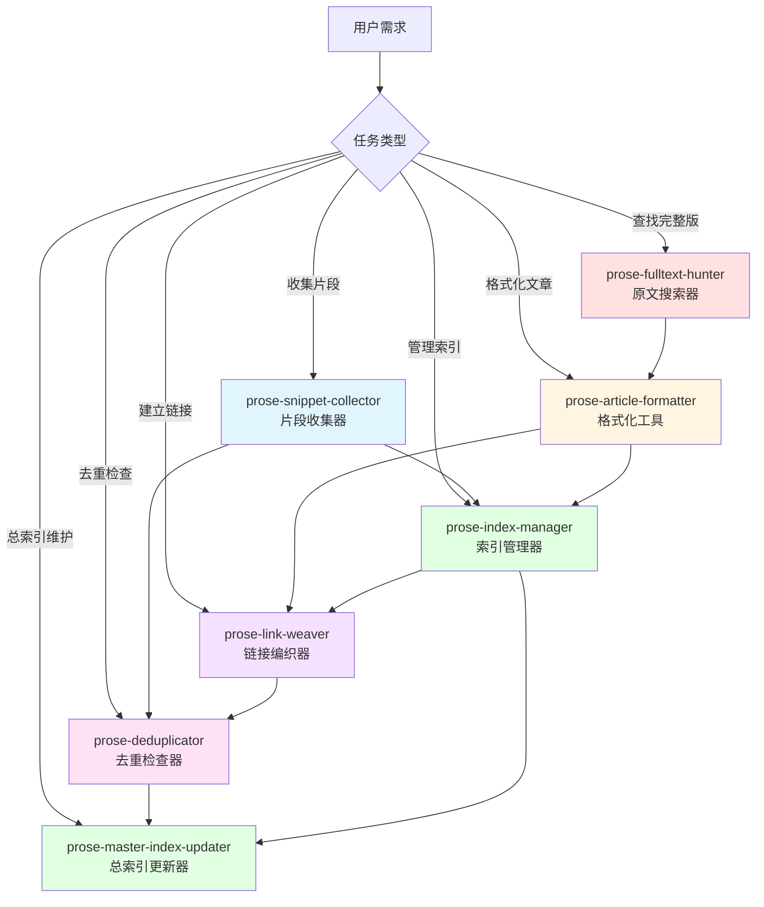
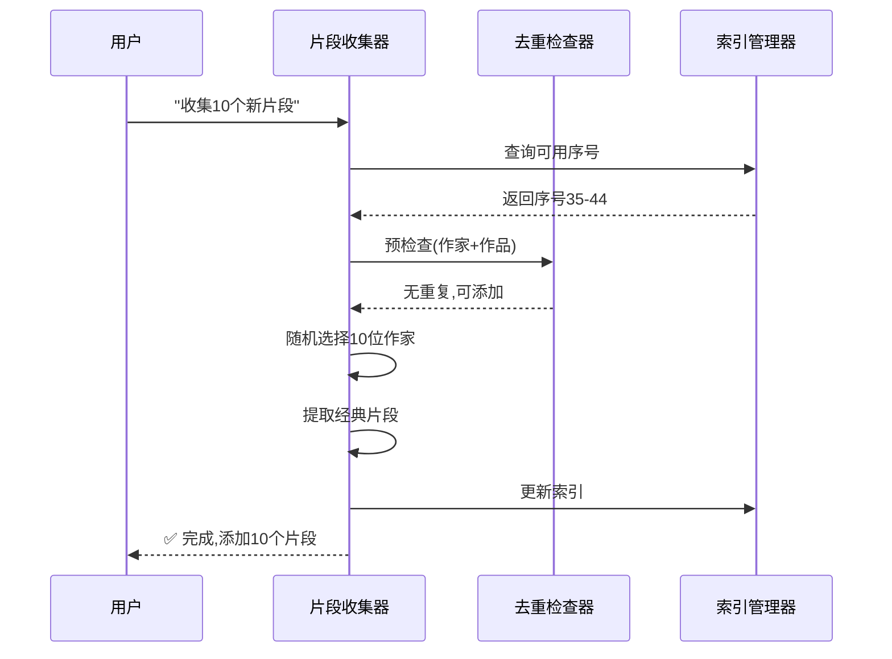
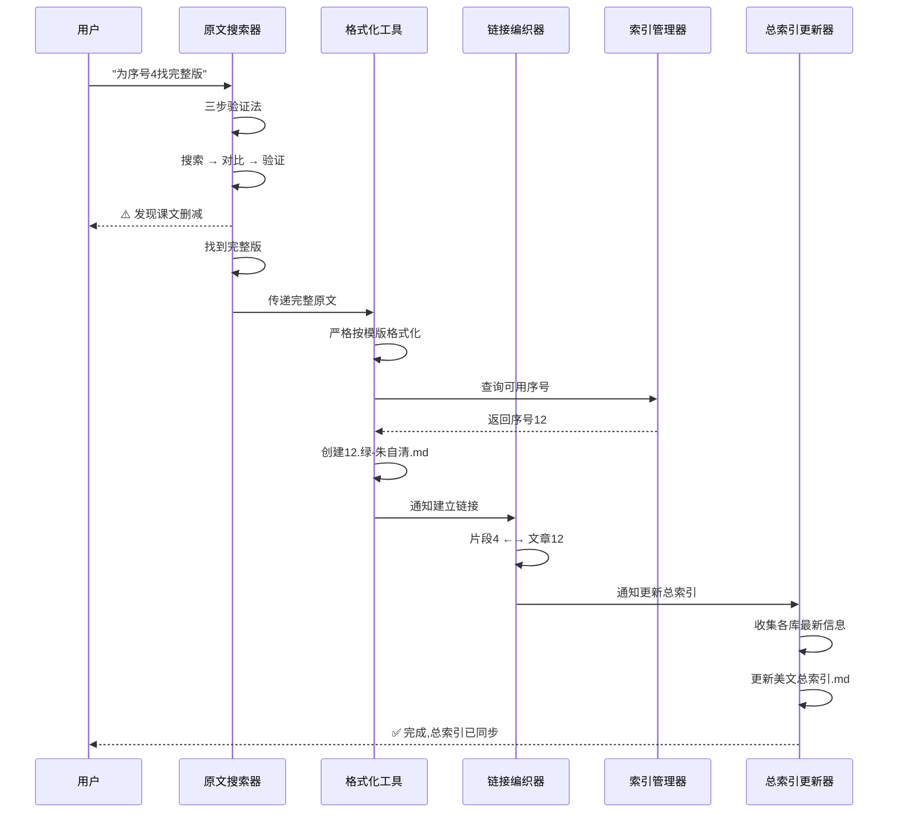
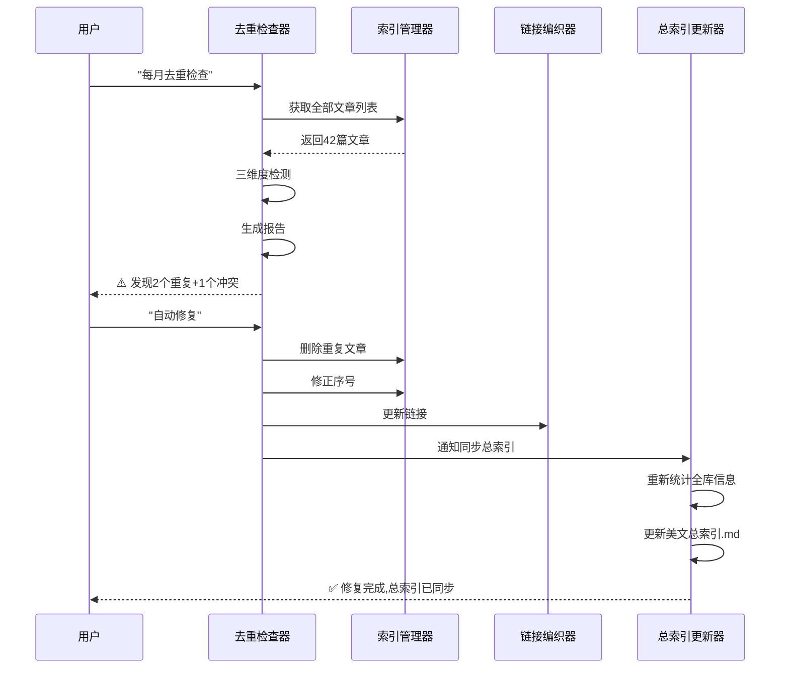

# 🎨 散文收集与整理Skill系统

## 📚 系统概述

这是一个专门为收集和整理**近现代中国文学大家散文**而设计的模块化skill系统。系统由7个协同工作的skills组成,从片段收集到完整版搜索,从格式化到去重检查,再到总索引维护,形成一个完整的美文管理工作流。

## 🏗️ 系统架构



## 📦 Skill列表

### 1. 📚 prose-snippet-collector (片段收集器)
**功能:** 自动收集近现代中国文学大家的散文经典片段

**关键特性:**
- 随机选择著名作家(朱自清、老舍、冰心等)
- 提取200-400字经典片段
- 按100篇为基准批量收录
- 自动去重和多样性控制

**使用场景:**
```
用户: "帮我收集10个新的散文片段"
系统: 随机选择10位作家 → 提取片段 → 格式化 → 添加到文件
```

---

### 2. 🔍 prose-fulltext-hunter (原文搜索器)
**功能:** 搜索完整原文,强制验证是否为删减版

**关键特性:**
- 三步验证法(搜索完整版 → 版本对比 → 版本验证)
- 经典作品删改清单(白鹅、燕子、背影等)
- 优先文学作品集版本,拒绝课文删减版

**使用场景:**
```
用户: "帮我找《白鹅》的完整版"
系统: 搜索 → 发现课文删减 → 找到完整版(含抗战背景+结局)
```

**⚠️ 核心价值:** 这是整个系统的质量控制核心,确保收录真正的完整版!

---

### 3. 🎨 prose-article-formatter (格式化工具)
**功能:** 严格按照"美文赏析与教学通用模版"格式化文章

**关键特性:**
- 强制执行7大板块(YAML、标题、正文、赏析、朗读、练笔、卡片)
- 自动生成教学互动内容
- Emoji分段和美化
- 完整性自检清单

**使用场景:**
```
用户: "按模版创建《绿》"
系统: 读取模版 → 格式化原文 → 生成赏析 → 添加教学板块
```

**⚠️ 核心价值:** 确保每篇文章都符合教学标准,不得缺项!

---

### 4. 📇 prose-index-manager (索引管理器)
**功能:** 管理片段和完整文章的索引,维护序号

**关键特性:**
- 自动检测序号使用情况
- 处理序号冲突(重复/不一致)
- 生成统计报告
- 维护双向链接映射表

**使用场景:**
```
用户: "更新索引"
系统: 扫描文件 → 对比索引 → 检测异常 → 生成报告
```

---

### 5. 🔗 prose-link-weaver (链接编织器)
**功能:** 在片段和完整文章之间建立Obsidian双向链接

**关键特性:**
- 自动建立双向链接
- 断裂链接检测和修复
- 链接有效性验证
- 孤儿文件检测

**使用场景:**
```
用户: 创建了完整文章后
系统: 自动在片段后添加链接 → 在文章开头添加反向链接
```

---

### 6. 🔍 prose-deduplicator (去重检查器)
**功能:** 检测重复文章和序号冲突,提供解决方案

**关键特性:**
- 三维度检测(精确匹配、模糊匹配、内容级)
- 序号冲突检测
- 作家占比检查
- 生成详细报告和建议

**使用场景:**
```
用户: "全库去重检查"
系统: 扫描全库 → 检测重复 → 生成报告 → 提供解决方案
```

---

### 7. 📊 prose-master-index-updater (总索引更新器)
**功能:** 维护和更新美文总索引,确保全库信息同步

**关键特性:**
- 自动同步各文件夹索引信息
- 实时更新统计数据和分类信息
- 维护跨文件夹重复关系记录
- 检索功能完整性验证

**使用场景:**
```
用户: 完成任何收录工作后
系统: 收集各库信息 → 更新总索引 → 验证链接 → 生成报告
```

**⚠️ 核心价值:** 这是整个系统的信息中枢,确保总索引始终反映最新状态!

---

## 🔄 典型工作流

### 工作流1: 收集新片段


### 工作流2: 收集完整版文章


### 工作流3: 定期维护


## 📋 快速开始指南

### 场景1: 我想收集一些新的散文片段
```bash
1. 调用: prose-snippet-collector
2. 说明: "帮我收集10个新的散文片段"
3. 系统会:
   - 随机选择10位著名作家
   - 提取经典片段(200-400字)
   - 自动去重和分配序号
   - 更新索引文件
```

### 场景2: 我想为某个片段找完整版
```bash
1. 调用: prose-fulltext-hunter
2. 说明: "为序号4《绿》找完整版"
3. 系统会:
   - 搜索完整版原文
   - 强制验证是否为删减版
   - 如发现删改会找到完整版
   - 传递给格式化工具
4. 调用: prose-article-formatter
5. 系统会:
   - 严格按模版格式化
   - 创建完整文章文件
   - 自动建立双向链接
6. 调用: prose-master-index-updater
7. 系统会:
   - 更新美文总索引.md
   - 同步各库统计信息
   - 验证链接有效性
```

### 场景3: 我想检查库中的重复和冲突
```bash
1. 调用: prose-deduplicator
2. 说明: "全库去重检查"
3. 系统会:
   - 扫描所有文件
   - 检测重复文章
   - 检测序号冲突
   - 检查作家占比
   - 生成详细报告
4. 根据报告选择:
   - 自动修复(低风险)
   - 人工确认后修复(中风险)
   - 仅提供建议(高风险)
5. 调用: prose-master-index-updater
6. 系统会:
   - 重新统计全库信息
   - 更新美文总索引.md
   - 确保信息准确性
```

### 场景4: 我想更新总索引
```bash
1. 调用: prose-master-index-updater
2. 说明: "更新美文总索引"
3. 系统会:
   - 扫描所有文件夹索引
   - 收集最新统计数据
   - 更新分类和链接信息
   - 验证跨文件夹重复关系
   - 检查链接有效性
   - 生成更新报告
```

## ⚠️ 核心规则(必须遵守)

### 规则1: 作家筛选标准
✅ **必须收录:**
- 近现代中文散文大家
- 有明确文学史地位
- 作品入选权威教材或文学史

❌ **严格排除:**
- 古典作者(如苏轼、王安石等)
- 外文作者(如海伦·凯勒等)
- 网络作家、非文学人物

### 规则2: 完整版强制验证
⚠️ **必做核查:**
- 著名课文必须搜索"xx课文与原文区别"
- 优先采纳文学作品集版本
- 拒绝课文删减版

🔴 **高风险作品(必查):**
- 丰子恺《白鹅》- 删去抗战背景+结局
- 郑振铎《燕子》- 实为《海燕》节选
- 朱自清《背影》- 删去家庭背景

### 规则3: 模版强制执行
📋 **7大板块不得缺项:**
1. YAML元数据
2. 标题区(H1+H3)
3. 📖 原文正文(分段+Emoji)
4. 🌟 美文赏析(3个子板块)
5. 🎭 朗读指导(2个子板块)
6. 🌈 小练笔
7. 📚 知识小卡片

### 规则4: 总索引强制更新
📊 **收录完成后必须执行:**
- 任何收录工作完成后必须更新`美文总索引.md`
- 各文件夹索引更新完成后才能更新总索引
- 总索引必须反映各库的最新状态
- 统计数据必须与实际文件完全一致

🔴 **强制检查项目:**
- 总体统计数据(文章总数、作家数量)
- 分库统计表(各文件夹完成度)
- 跨文件夹重复关系记录
- 所有新增链接的有效性

## 🎯 系统优势

### 1. 模块化设计
- 每个skill专注单一职责
- 可独立使用也可协同工作
- 易于维护和扩展

### 2. 质量保证
- 三道质量防线(原文验证、格式检查、去重检查)
- 强制模版执行
- 完整性自检

### 3. 智能化
- 自动去重和冲突检测
- 智能序号分配
- 双向链接自动维护

### 4. 可追溯性
- 详细的执行报告
- 完整的操作日志
- 清晰的错误提示

## 📚 参考文档

### 项目文档
- `d:\workspace\小学生美文\美文赏析与教学通用模版.md` - 格式化模版
- `d:\workspace\小学生美文\随机挑选片段收集完整原文规则记录.md` - 历史规则记录

### 索引文件
- `d:\workspace\小学生美文\小学生美文精选100篇索引.md` - 片段索引
- `d:\workspace\小学生美文\美文收集索引.md` - 备用索引

### 示例文件
- `d:\workspace\小学生美文\12.绿-朱自清.md` - 完整版范文
- `d:\workspace\小学生美文\32.白鹅-丰子恺.md` - 完整版(含删改部分)
- `d:\workspace\小学生美文\30.燕子-郑振铎.md` - 完整版《海燕》

## 🔧 故障排查

### 问题1: 找不到完整版原文
**解决:**
1. 扩大搜索关键词范围
2. 查阅作家作品集目录
3. 咨询文学专家或图书馆
4. 暂缓收录,标记"待核查"

### 问题2: 序号冲突无法解决
**解决:**
1. 使用`prose-index-manager`生成冲突报告
2. 根据优先级:文件名 > 索引 > 片段标记
3. 使用自然数叠加(101, 102...)
4. 或创建新的100篇文件

### 问题3: 模版格式不全
**解决:**
1. 重新运行`prose-article-formatter`
2. 使用完整性自检清单逐项检查
3. 参考`美文赏析与教学通用模版.md`
4. 对比范文`12.绿-朱自清.md`

### 问题4: 双向链接断裂
**解决:**
1. 运行`prose-link-weaver`的断裂检测
2. 使用批量修复工具
3. 手动检查文件是否重命名或删除
4. 更新链接映射表

## 📊 成功指标

### 质量指标
- ✅ 完整版收录率: 100%(拒绝删减版)
- ✅ 模版完整性: 100%(7大板块不缺项)
- ✅ 清洁度: >95%(无重复和冲突)
- ✅ 链接完整性: >90%(双向链接有效)

### 数量指标
- 📚 片段库: 100篇/阶段
- 📖 完整文章: 根据需求逐步积累
- 👥 作家覆盖: 30+位近现代大家
- 🎨 题材多样性: 写景/状物/记事/哲理均衡

## 🎓 使用建议

### 初学者
1. 先理解6个skills的职责
2. 从简单任务开始(收集片段)
3. 逐步学习完整工作流
4. 遇到问题查看故障排查

### 进阶用户
1. 熟练使用所有skills协同
2. 自定义作家库和筛选标准
3. 建立个人版本差异数据库
4. 优化工作流效率

### 高级用户
1. 扩展skill功能(如添加新的检测维度)
2. 开发自动化脚本
3. 建立多阶段美文库(小学/中学/高中)
4. 贡献改进建议

---

## 📝 版本历史

### v1.0.0 (2025-12-14)
- ✅ 创建6个核心skills
- ✅ 建立完整工作流
- ✅ 制定核心规则
- ✅ 提供详细文档

---

**🎉 感谢使用散文收集与整理Skill系统!**

如有问题或建议,请在项目中提issue或直接联系维护者。

---

*📌 本系统基于真实项目经验和失败教训设计,旨在帮助用户高效、规范地建立高质量的美文资源库。*
