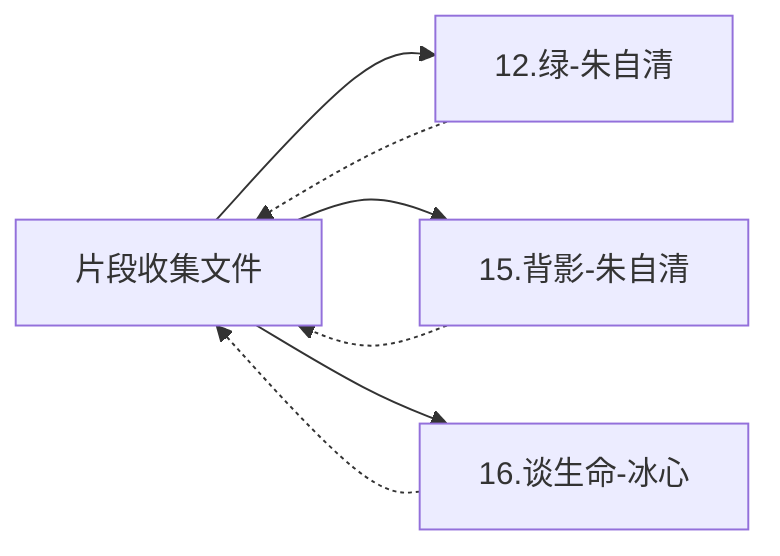

# 🔗 双向链接编织器 (prose-link-weaver)

## 📋 Skill 元数据
```yaml
name: prose-link-weaver
version: 1.0.0
description: 在散文片段和完整文章之间建立Obsidian双向链接,方便快速跳转查看
author: AI Assistant
created: 2025-12-14
tags: [双向链接, Obsidian, 导航, 知识网络]
software: Obsidian
```

## 🎯 核心功能

### 使用场景(支持5级分类)
在片段收集文件和完整文章文件之间建立双向链接,增强文档的连接性。

**分级系统支持:**
- 小学生美文 ↔ 小学美文文章
- 初中生美文 ↔ 初中美文文章
- 高中生美文 ↔ 高中美文文章
- 大学生美文 ↔ 大学美文文章
- 成人美文 ↔ 成人美文文章

**触发条件:**
- 创建完整文章后(自动识别所属级别)
- 用户说"为{级别}建立双向链接"
- 用户说"为序号X添加链接"

## 🔗 Obsidian链接语法

### 基本语法
```markdown
[[文件名]]                          # 链接到文件
[[文件名|显示文本]]                 # 自定义显示文本
[[文件名#标题]]                     # 链接到文件中的特定标题
```

### 实际示例
```markdown
[[12.绿-朱自清]]                     # 链接到完整文章
[[小学生美文精选100篇(完整版)]]       # 链接到片段
[[12.绿-朱自清|查看完整版]]           # 自定义显示
```

## 🏗️ 链接建立流程

### Step 1: 识别对应关系
**输入信息:**
```yaml
片段信息:
  序号: 4
  作品名: 绿
  作者: 朱自清
  所在文件: 小学生美文精选100篇(完整版).md
  所在行号: 64-71

完整文章:
  文件名: 12.绿-朱自清.md
  标题: 绿(完整版)
```

### Step 2: 在片段文件中添加链接
**位置:** 在片段的推荐理由后

**格式:**
```markdown
#### **4. 《绿》 - 朱自清**

> 梅雨潭闪闪的绿色招引着我们...

**【推荐理由】** 朱自清先生用极富想象力的语言描绘梅雨潭的绿...

[[12.绿-朱自清|→ 查看完整版]]

---
```

**变体选择:**
- 简洁版: `[[12.绿-朱自清]]`
- 友好版: `[[12.绿-朱自清|→ 查看完整版]]`
- 明确版: `[[12.绿-朱自清|🔗 完整原文]]`

### Step 3: 在完整文章中添加反向链接
**位置:** 在YAML元数据后,标题前

**格式:**
```markdown
---
title: 绿
source: 散文集《踪迹》
...
---

> 📚 **片段收录**: [[小学生美文精选100篇(完整版)|返回片段]]

# 💚 绿(完整版)
### —— 朱自清
```

**变体选择:**
- 精准版: `[[小学生美文精选100篇(完整版)]]`
- 友好版: `[[小学生美文精选100篇(完整版)|返回片段]]`
- 图标版: `[[小学生美文精选100篇(完整版)|📖 查看片段]]`

## 📊 批量链接模式

### 场景: 新创建5篇完整文章
```yaml
待建立链接:
  - 片段35 ←→ 14.匆匆-朱自清.md
  - 片段36 ←→ 15.背影-朱自清.md
  - 片段37 ←→ 16.谈生命-冰心.md
  - 片段38 ←→ 17.荷叶·母亲-冰心.md
  - 片段39 ←→ 19.紫藤萝瀑布-宗璞.md
```

### 执行流程
```
For each 对应关系:
  1. 在片段文件中找到序号位置
  2. 在推荐理由后插入链接
  3. 在完整文章文件开头插入反向链接
  4. 验证链接有效性
  5. 记录到链接映射表
```

### 输出报告
```markdown
✅ **批量链接建立完成**

📊 **本次处理:**
- 建立双向链接: 5组
- 更新片段文件: 1个
- 更新完整文章: 5个

🔗 **链接详情:**
1. 片段35 ←→ [[14.匆匆-朱自清]]
2. 片段36 ←→ [[15.背影-朱自清]]
3. 片段37 ←→ [[16.谈生命-冰心]]
4. 片段38 ←→ [[17.荷叶·母亲-冰心]]
5. 片段39 ←→ [[19.紫藤萝瀑布-宗璞]]

✅ **链接验证:** 全部有效
```

## 🔍 链接验证

### 验证维度
1. **文件存在性**: 目标文件是否存在
2. **锚点有效性**: `#4`锚点是否可定位
3. **语法正确性**: Obsidian链接语法是否正确
4. **循环检测**: 是否存在循环引用

### 验证工具
```python
def validate_link(link_text, source_file):
    """
    验证Obsidian链接
    返回: (is_valid, error_message)
    """
    # 解析链接
    match = re.match(r'\[\[(.*?)\]\]', link_text)
    if not match:
        return False, "链接语法错误"
    
    target = match.group(1)
    
    # 分离文件名和锚点
    if '#' in target:
        filename, anchor = target.split('#', 1)
    else:
        filename = target
        anchor = None
    
    # 检查文件是否存在
    if not os.path.exists(f"{filename}.md"):
        return False, f"目标文件不存在: {filename}"
    
    # 检查锚点(如果有)
    if anchor:
        # 读取目标文件,检查是否有对应标题
        with open(f"{filename}.md", 'r') as f:
            content = f.read()
            if f"#{anchor}" not in content:
                return False, f"锚点不存在: {anchor}"
    
    return True, "链接有效"
```

## 🛠️ 链接维护工具

### 断裂链接检测
```
功能: 扫描所有文件,检测断裂的链接
输出: 断裂链接报告

示例输出:
⚠️ **发现3个断裂链接**
1. 小学生美文精选100篇(完整版).md:行64
   链接: [[35.背影-朱自清]]
   问题: 目标文件已重命名为15.背影-朱自清.md
   
2. 15.背影-朱自清.md:行10
   链接: [[小学生美文精选100篇(完整版)#35]]
   问题: 锚点#35已不存在
   
3. 美文收集索引.md:行120
   链接: [[45.春-朱自清]]
   问题: 目标文件不存在
```

### 批量修复工具
```
功能: 自动修复常见的链接问题

支持修复:
1. 文件重命名导致的断裂
2. 锚点变更导致的断裂
3. 批量更新链接格式

示例:
输入: "批量更新链接格式为友好版"
执行: [[12.绿-朱自清]] → [[12.绿-朱自清|→ 查看完整版]]
```

### 链接映射表
```markdown
# 片段←→完整文章链接映射表

| 片段序号 | 片段文件 | 完整文章文件 | 链接状态 | 更新时间 |
|---------|---------|-------------|---------|----------|
| 4 | 小学生美文精选100篇(完整版).md | 12.绿-朱自清.md | ✅有效 | 2025-12-12 |
| 35 | 小学生美文精选100篇(完整版).md | 14.匆匆-朱自清.md | ✅有效 | 2025-12-13 |
| 50 | 小学生美文精选100篇(完整版).md | null | ⏳待收录 | - |
```

## 💡 高级功能

### 智能链接建议
```
场景: 用户创建了新的完整文章

功能:
1. 扫描片段文件
2. 根据作品名+作者匹配对应片段
3. 建议建立链接

示例:
✨ **发现可建立链接:**
新文章: 18.散步-莫怀戚.md
匹配片段: 序号65《散步》- 莫怀戚
建议: 建立双向链接?
[✓ 是] [✗ 否]
```

### 链接网络可视化
```
功能: 生成链接关系图

示例输出(Mermaid格式):

```

### 孤儿文件检测
```
功能: 检测没有任何链接的文件

输出:
⚠️ **发现2个孤儿文件(无双向链接):**
1. 20.火烧云-萧红.md
   - 无片段收录
   - 建议: 为其创建片段或添加到索引

2. 25.晨雾-冰心.md
   - 片段已删除
   - 建议: 重新建立链接或标记状态
```

## 🔗 与其他Skill协同

### 触发时机
- `prose-article-formatter` 创建完整文章后 → 自动触发
- `prose-index-manager` 检测到新的对应关系 → 提示建立链接
- 用户手动请求 → 批量建立或修复

### 数据共享
- 从 `prose-index-manager` 获取对应关系
- 向 `prose-index-manager` 报告链接状态

## 📝 使用示例

### 示例1: 创建完整文章后自动建立链接
```
触发: prose-article-formatter 完成格式化

输入:
  新文章: 12.绿-朱自清.md
  对应片段: 序号4

执行:
  1. 在片段4后添加: [[12.绿-朱自清|→ 查看完整版]]
  2. 在12.绿-朱自清.md开头添加: [[小学生美文精选100篇(完整版)#4|返回片段]]
  3. 验证链接有效性
  4. 更新链接映射表

输出:
  ✅ 双向链接已建立
  📖 片段 ←→ 完整文章
```

### 示例2: 批量修复断裂链接
```
触发: 用户重命名了文件

检测:
  发现断裂链接:
  - [[35.背影-朱自清]] → 文件已改为15.背影-朱自清

执行:
  1. 扫描所有文件
  2. 替换: 35.背影 → 15.背影
  3. 更新锚点: #35 → #36
  4. 验证修复结果

输出:
  ✅ 修复完成: 3处
  ⚠️ 需手动处理: 1处
```

---

*📌 此skill让美文库变成一个互联的知识网络,提升阅读和学习的便利性!*
