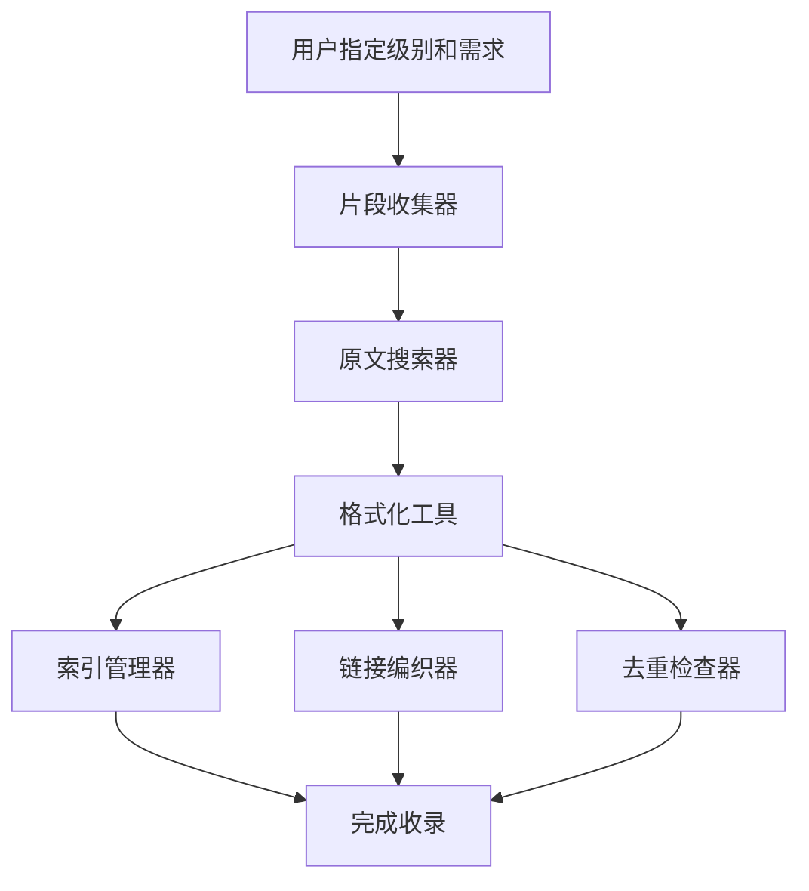

# 🎓 美文分级收录系统指南 (v2.0)

> 基于"小学生美文"的成功经验，扩展为5级完整体系，覆盖从小学到成人的全阶段美文收录需求。

---

## 📊 系统概览

### 5级分类体系

| 级别 | 文件夹路径 | 标签前缀 | 模版类型 | 适用年龄 |
|------|-----------|---------|---------|---------|
| 📚 小学 | `d:\workspace\小学生美文\` | `小学生美文` | 教学通用模版 | 6-12岁 |
| 📖 初中 | `d:\workspace\初中生美文\` | `初中生美文` | 教学通用模版 | 12-15岁 |
| 📕 高中 | `d:\workspace\高中生美文\` | `高中生美文` | 教学通用模版 | 15-18岁 |
| 📘 大学 | `d:\workspace\大学生美文\` | `大学美文` | 研究通用模版 | 18+岁 |
| 📗 成人 | `d:\workspace\成人美文\` | `成人美文` | 人生通用模版 | 成人 |

---

## 🎯 级别定位与差异

### 📚 小学阶段

**阅读目标**: 培养阅读兴趣、基础写作技巧

**内容特点**:
- 片段长度: 150-300字
- 正文长度: 600-1500字
- 语言风格: 清新明快、生动活泼
- 主题偏好: 写景状物、童趣生活

**推荐作家**:
朱自清、老舍、冰心、巴金、郭沫若、叶圣陶、丰子恺

**核心板块**:
```
原文正文 → 美文赏析(写作特点+学习要点+优美词句) 
→ 朗读指导 → 小练笔 → 知识小卡片
```

**Skill使用**:
```bash
# 收集片段
"帮我收集10个小学美文片段"

# 格式化文章
"将《白鹅》格式化为小学美文"

# 更新索引
"更新小学美文索引"
```

---

### 📖 初中阶段

**阅读目标**: 文学鉴赏能力、写作技巧提升

**内容特点**:
- 片段长度: 200-400字
- 正文长度: 800-2000字
- 语言风格: 清新隽永、富有哲理
- 主题偏好: 人生感悟、自然哲思

**推荐作家**:
鲁迅、老舍、朱自清、冰心、萧红、汪曾祺、史铁生、宗璞、贾平凹

**核心板块**:
```
原文正文 → 美文赏析(艺术手法+主题思想+精彩语段) 
→ 朗读与批注 → 写作借鉴 → 文学常识 → 中考链接
```

**与小学版的区别**:
- ✅ 增加"主题思想"的深层挖掘
- ✅ 增加"批注示范"环节
- ✅ 新增"中考链接"模块
- ✅ 区分"艺术手法"和"写作技法"

**Skill使用**:
```bash
# 收集片段
"帮我收集8个初中美文片段，侧重哲理类"

# 格式化文章
"将《散步》格式化为初中美文"

# 检查重复
"检查初中美文重复"
```

---

### 📕 高中阶段

**阅读目标**: 文学批评能力、思辨思维、审美鉴赏

**内容特点**:
- 片段长度: 300-500字
- 正文长度: 1500-5000字
- 语言风格: 深刻隽永、思想性强
- 主题偏好: 文化反思、人性探索

**推荐作家**:
鲁迅、周作人、废名、沈从文、汪曾祺、张爱玲、钱钟书、梁实秋、余光中、史铁生、余秋雨

**核心板块**:
```
原文正文(含版本说明) → 文学赏析(艺术特色+主题意蕴+细读文本) 
→ 批评视角 → 写作借鉴 → 作家作品 → 高考链接 → 知识网络
```

**与初中版的区别**:
- ✅ 增加"批评视角"(多元解读)
- ✅ 增加"细读文本"(段落级深度分析)
- ✅ 增加"文学史定位"
- ✅ 建立"知识网络"(专题+思想脉络)

**Skill使用**:
```bash
# 收集片段
"帮我收集6个高中美文片段，包含京派和海派作家"

# 搜索原文
"找《雅舍》的完整版，用于高中美文"

# 格式化文章
"将《我与地坛》格式化为高中美文，注重批评视角"
```

---

### 📘 大学阶段

**阅读目标**: 学术研究、理论批评、跨学科视野

**内容特点**:
- 片段长度: 不限(注重学术价值)
- 正文长度: 不限
- 语言风格: 多样化
- 主题偏好: 学术探讨、理论应用

**推荐作家**:
周作人、废名、沈从文、张爱玲、钱钟书、汪曾祺、木心、阿城、王小波、余华、格非

**核心板块**:
```
原文正文 → 版本校勘(文本流变) → 学术研究(文本细读+理论批评+风格学) 
→ 语境研究 → 作家研究 → 互文性研究 → 研究综述 → 参考文献
```

**与高中版的区别**:
- ✅ 增加"版本校勘"
- ✅ 增加多种"理论批评视角"(形式主义/结构主义/读者反应批评等)
- ✅ 增加"风格学分析"
- ✅ 增加"语境研究"(历史语境+作者生平+接受史)
- ✅ 增加"互文性研究"
- ✅ 增加"研究综述"和"参考文献"

**Skill使用**:
```bash
# 收集片段
"帮我收集适合学术研究的大学美文片段"

# 搜索原文
"找《道旁儿》的完整版，需要版本校勘信息"

# 格式化文章
"将《受戒》格式化为大学美文，注重叙事学分析"
```

---

### 📗 成人阶段

**阅读目标**: 人生智慧、审美品味、心灵滋养

**内容特点**:
- 片段长度: 不限(注重共鸣感)
- 正文长度: 不限
- 语言风格: 优美、有共鸣感
- 主题偏好: 人生哲思、情感治愈、生活美学

**推荐作家**:
**民国大家**: 周作人、梁实秋、林语堂、丰子恺  
**当代散文**: 汪曾祺、史铁生、余秋雨、木心、阿城、刘亮程、李娟  
**港台作家**: 余光中、简媜、张晓风、龙应台、林清玄  
**治愈系**: 林清玄、毕淑敏、周国平、梁晓声

**核心板块**:
```
原文正文 → 深度品读(文学之美+人生启示+金句摘录) 
→ 生活映照(情感共鸣+实践智慧+心灵成长) 
→ 作者世界 → 延伸阅读 → 品读札记 → 推荐人群 → 生活应用
```

**与学生版的区别**:
- ✅ 完全去应试化(无考点、无练习)
- ✅ 强调生活化(与生活的连接和实践)
- ✅ 个性化(个人体验和重读记录)
- ✅ 治愈性(心灵成长和情感共鸣)

**Skill使用**:
```bash
# 收集片段
"帮我收集8个适合成人阅读的治愈系美文片段"

# 搜索原文
"找林清玄《清欢》的完整版"

# 格式化文章
"将《目送》格式化为成人美文，注重人生启示"
```

---

## 🔄 工作流程

### 标准流程(适用于所有级别)



#### 流程1: 收集片段
```bash
用户: "帮我收集10个初中美文片段"
↓
Skill: prose-snippet-collector
- 识别级别: 初中
- 定位目录: d:\workspace\初中生美文\
- 选择合适作家(鲁迅、史铁生等)
- 提取200-400字片段
- 更新索引
↓
输出: 10个符合初中难度的片段
```

#### 流程2: 搜索完整原文
```bash
用户: "帮我找《散步》的完整版，用于初中美文"
↓
Skill: prose-fulltext-hunter
- 识别级别: 初中
- 三步验证法搜索
- 检查是否为课文删减版
- 输出完整版原文
↓
输出: 完整版原文+版本说明
```

#### 流程3: 格式化文章
```bash
用户: "将《散步》格式化为初中美文"
↓
Skill: prose-article-formatter
- 识别级别: 初中
- 读取初中模版
- 按7大板块格式化
- 自动检查完整性
↓
输出: 18.散步-莫怀戚.md (初中版)
```

#### 流程4: 建立链接和索引
```bash
自动触发: prose-index-manager + prose-link-weaver
- 分配序号(检查已用序号)
- 更新索引文件
- 建立双向链接
- 去重检查
↓
完成: 文章正式收录
```

---

## 💡 使用技巧

### 技巧1: 明确指定级别

**推荐做法**:
```bash
✅ "帮我收集10个初中美文片段"
✅ "将《背影》格式化为高中美文"
✅ "检查大学美文重复"
```

**避免模糊**:
```bash
❌ "帮我收集片段"(不知道收录到哪个级别)
❌ "格式化这篇文章"(不知道用哪个模版)
```

### 技巧2: 跨级别对比

同一文章可以收录到不同级别,但需要不同的处理:

**示例: 朱自清《背影》**

- **小学版**: 侧重父爱、细节描写
- **初中版**: 增加批注、情感变化分析
- **高中版**: 文学史地位、细读文本、批评视角
- **大学版**: 版本校勘、叙事学分析、接受史
- **成人版**: 人生感悟、代际关系、情感共鸣

### 技巧3: 季节性/专题性收集

**示例**:
```bash
# 春季专题
"帮我为初中美文收集5个写春天的片段"

# 人生哲思专题
"帮我为成人美文收集治愈系散文"

# 作家专题
"帮我收集汪曾祺的散文，分别收录到高中和成人"
```

### 技巧4: 批量操作

**示例**:
```bash
# 批量收集
"帮我为小学、初中、高中各收集5个片段"

# 批量检查
"全局去重检查，检查所有级别的重复"

# 批量建链
"为初中美文的所有文章建立双向链接"
```

---

## 🔍 质量标准

### 必须遵守的"三大铁律"

#### 铁律1: 作家筛选
✅ **必须收录**: 近现代中文散文大家，有明确文学史地位  
❌ **严格排除**: 古典作者、外文作者、网络作家

#### 铁律2: 完整版验证
✅ **必须收录**: 原文完整版(尤其小学/初中/高中)  
❌ **严格排除**: 课文删减版、节选版  
🔍 **强制搜索**: "课文与原文区别"

#### 铁律3: 模版执行
✅ **必须遵守**: 100%符合对应级别的模版  
❌ **严格禁止**: 缺板块、缺Emoji、缺YAML  
📝 **自动检查**: 完整性清单逐项核对

---

## 📈 系统扩展

### 当前支持的级别
- [x] 小学生美文 (已有48篇)
- [x] 初中生美文 (新建)
- [x] 高中生美文 (新建)
- [x] 大学生美文 (新建)
- [x] 成人美文 (新建)

### 未来可扩展方向
- [ ] 按文体分类(记叙文、议论文、说明文)
- [ ] 按专题分类(亲情、自然、哲思、文化)
- [ ] 按流派分类(京派、海派、乡土)
- [ ] 按时代分类(民国、现代、当代)

---

## 🎯 常见问题

### Q1: 同一篇文章可以收录到多个级别吗?
**A**: 可以,但必须使用不同模版和不同深度。

示例:《背影》可以有小学版(侧重父爱描写)、初中版(增加批注)、高中版(文学批评)。

---

### Q2: 如何判断一篇文章适合哪个级别?
**A**: 参考以下标准:

**篇幅**:
- 小学: 600-1500字
- 初中: 800-2000字
- 高中: 1500-5000字
- 大学/成人: 不限

**难度**:
- 小学: 语言通俗、主题明确
- 初中: 有哲理、需思考
- 高中: 思想深刻、需批判性思维
- 大学: 有学术研究价值
- 成人: 有人生智慧和共鸣感

---

### Q3: 片段和完整文章的关系?
**A**: 
- 片段是"引子",完整文章是"深度学习"
- 片段收集在索引文件中,完整文章单独成文件
- 通过双向链接连接片段和完整文章

---

### Q4: 如何处理同一文章的不同版本?
**A**: 
- **课文版 vs 完整版**: 必须使用完整版
- **初版 vs 修订版**: 使用作者最后定稿版
- **简体版 vs 繁体版**: 使用简体版,标注"已转简体"

---

## 📚 核心文档位置

### 模版文件
```
小学: d:\workspace\小学生美文\美文赏析与教学通用模版.md
初中: d:\workspace\初中生美文\美文赏析与教学通用模版.md
高中: d:\workspace\高中生美文\美文赏析与教学通用模版.md
大学: d:\workspace\大学生美文\美文赏析与研究通用模版.md
成人: d:\workspace\成人美文\美文赏析与人生通用模版.md
```

### 索引文件
```
小学: d:\workspace\小学生美文\美文收集索引.md
初中: d:\workspace\初中生美文\美文收集索引.md
高中: d:\workspace\高中生美文\美文收集索引.md
大学: d:\workspace\大学生美文\美文收集索引.md
成人: d:\workspace\成人美文\美文收集索引.md
```

### Skills文件
```
d:\workspace\.skills\prose-snippet-collector\SKILL.md
d:\workspace\.skills\prose-fulltext-hunter\SKILL.md
d:\workspace\.skills\prose-article-formatter\SKILL.md
d:\workspace\.skills\prose-index-manager\SKILL.md
d:\workspace\.skills\prose-link-weaver\SKILL.md
d:\workspace\.skills\prose-deduplicator\SKILL.md
```

---

## 🎉 开始使用

### 第一步: 选择目标级别
```bash
"我想收集初中美文"
```

### 第二步: 收集片段或格式化文章
```bash
"帮我收集10个初中美文片段"
或
"将《散步》格式化为初中美文"
```

### 第三步: 查看成果
检查对应文件夹中的文章和索引文件

---

*🎓 分级收录系统让美文收集更加系统化、专业化、精准化！*
