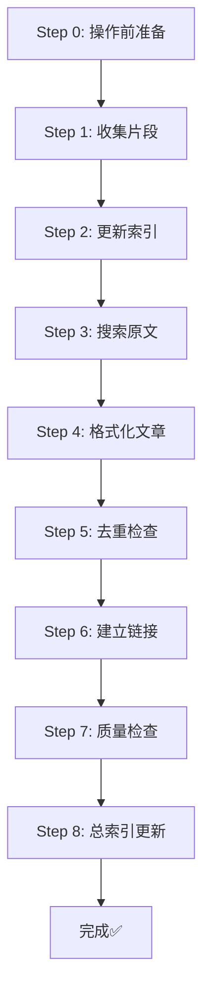
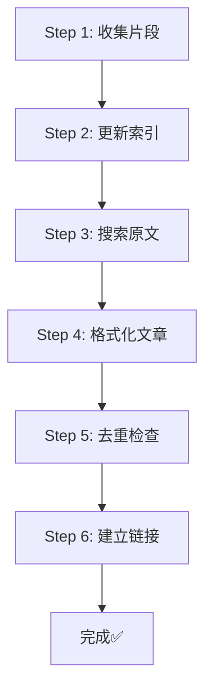

# 🔄 美文收集标准工作流程 v3.0

> **核心原则**：每次收集美文时，必须严格按照以下9个步骤依次执行，不可跳过或颠倒顺序！

---

## 📋 完整工作流程（9个步骤）





---

## 🔍 Step 0️⃣: 操作前准备 - **预查重步骤**

### 📚 执行内容
- **必须先检查总索引**：仔细阅读`美文总索引.md`的完整内容
- **了解现有分布**：查看各文件夹的文章收录情况
- **识别重复风险**：标记可能重复的作品和作家
- **规划收集策略**：避免收集重复内容

### ✅ 检查清单
```markdown
- [ ] 已完整阅读《美文总索引.md》
- [ ] 已了解各文件夹现有文章
- [ ] 已标记潜在重复风险
- [ ] 已规划非重复收集策略
```

### 🎯 关键点
- **优先级最高**：此步骤必须在任何其他步骤之前执行
- **不可跳过**：跳过Step 0视为严重违规
- **减少重复**：通过预查大幅降低重复概率
- **提升效率**：避免无效收集工作

### 📂 输出
- 预查重分析报告（记录在笔记中）
- 非重复作品收集策略

---

## Step 1️⃣: 收集片段 (prose-snippet-collector) - **执行前必须完成Step 0**

### 📚 执行内容
- 创建或更新 `{级别}美文精选100篇.md`
- 收集N个经典片段（200-400字）
- 每个片段包含：序号、作品名、作者、内容引用、推荐理由

### ✅ 输出示例
```markdown
#### **1. 《散步》 - 莫怀戚**

> {片段内容...}

**【推荐理由】** {推荐语}

---
```

### 🎯 关键点
- 片段长度：小学150-300字，初中200-400字，高中300-500字
- 必须来自近现代中文散文大家
- 避免重复（检查作品名+作者组合）

### 📂 输出文件
- `d:\workspace\{级别}美文\{级别}美文精选100篇.md`

---

## Step 2️⃣: 更新索引 (prose-index-manager)

### 📚 执行内容
- 更新 `美文收集索引.md`
- 记录片段列表
- 更新统计信息

### ✅ 输出示例
```markdown
## 📖 片段列表

### 已收集片段
1. 《散步》 - 莫怀戚
2. 《秋天的怀念》 - 史铁生
3. 《济南的冬天》 - 老舍
```

### 🎯 关键点
- 记录片段序号和作品信息
- 更新收录统计（总计篇数、片段数、完整文章数）
- 标记状态（待收集完整版）

### 📂 输出文件
- `d:\workspace\{级别}美文\美文收集索引.md`

---

## Step 3️⃣: 搜索原文 (prose-fulltext-hunter)

### 📚 执行内容
- 为每个片段搜索完整版原文
- **强制执行三步验证法**：
  1. 搜索完整版关键词
  2. **必须**搜索"课文与原文区别"
  3. 版本验证（字数、结构、特征）

### ✅ 核查清单
```markdown
- [ ] 已搜索"课文与原文区别"
- [ ] 已确认是否存在删改
- [ ] 已对比字数
- [ ] 确认为完整版 ✅
```

### 🎯 关键点
- **铁律**：宁可不收录，也不能收录删减版
- 高风险作品必查：丰子恺《白鹅》、郑振铎《燕子》等
- 优先选择文集版本

### 📂 输出
- 版本核查报告（记录在笔记中）
- 完整版原文内容

---

## Step 4️⃣: 格式化文章 (prose-article-formatter)

### 📚 执行内容
- **必须先读取对应级别的模版文件**
- 严格按照模版创建完整文章
- 100%符合模版要求（YAML+Emoji+所有板块）

### ✅ 初中模版板块（7个）
1. YAML元数据
2. 标题区（含Emoji）
3. 📖 原文正文
4. 🌟 美文赏析（艺术手法+主题思想+精彩语段）
5. 🎭 朗读与批注
6. 🌈 写作借鉴
7. 📚 文学常识 + 🎯 中考链接

### 🎯 关键点
- **铁律**：任何新收录文章必须100%符合模版，不得缺项
- 必须包含所有Emoji
- YAML必须包含：title、source、created、tags、完整版标签
- 原文标注字数

### 📂 输出文件
- `d:\workspace\{级别}美文\{序号}.{作品名}-{作者}.md`
- 例如：`01.散步-莫怀戚.md`

---

## Step 5️⃣: 去重检查 (prose-deduplicator)

### 📚 执行内容
- 检查文件夹内所有文章
- 三级去重检查：
  1. **文件名去重**：检查序号是否重复
  2. **作品去重**：检查"作品名+作者"组合是否重复
  3. **内容去重**：检查是否有相同内容

### ✅ 检查清单
```markdown
- [ ] 序号无重复（1-100）
- [ ] 作品名+作者无重复
- [ ] 片段与完整文章一致
```

### 🎯 关键点
- 如发现重复，立即处理（删除或重新编号）
- 跨级别检查（如果同一作品在不同级别）
- 记录去重结果

### 📂 输出
- 去重检查报告（如有问题）

---

## Step 6️⃣: 建立链接 (prose-link-weaver)

### 📚 执行内容
- 建立片段→完整文章的双向链接
- 建立文章之间的相关链接
- 更新索引文件的链接

### ✅ 链接类型
1. **片段→完整文章**：在片段下方添加 `[[文件名]]`
2. **完整文章→片段**：在"相关作品"添加返回链接
3. **文章→文章**：在"相关作品"添加同主题文章链接
4. **索引链接**：更新索引文件的所有链接

### 🎯 关键点
- 使用标准链接格式：`[[文件名|显示文本]]`
- 片段链接格式：`[[文件名#标题|显示文本]]`
- 确保所有链接可点击跳转

### 📂 需要更新的文件
- `{级别}美文精选100篇.md`
- 所有完整文章的 `.md` 文件
- `美文收集索引.md`

---

## 🚀 执行示例：收集3篇初中美文

### 输入命令
```
"参考.skill，帮我收集3篇初中生美文"
```

### 执行过程

**Step 1: 收集片段**
```
✅ 创建文件：初中生美文精选100篇.md
✅ 收集片段：《散步》《秋天的怀念》《济南的冬天》
```

**Step 2: 更新索引**
```
✅ 更新文件：美文收集索引.md
✅ 记录片段：3个片段
```

**Step 3: 搜索原文**
```
✅ 核查版本：《散步》- 完整版 ✅
✅ 核查版本：《秋天的怀念》- 完整版 ✅
✅ 核查版本：《济南的冬天》- 完整版 ✅
```

**Step 4: 格式化文章**
```
✅ 读取模版：初中生美文\美文赏析与教学通用模版.md
✅ 创建文章：01.散步-莫怀戚.md（7个板块）
✅ 创建文章：02.秋天的怀念-史铁生.md（7个板块）
✅ 创建文章：03.济南的冬天-老舍.md（7个板块）
```

**Step 5: 去重检查**
```
✅ 序号检查：1-3 无重复
✅ 作品检查：无重复
✅ 内容检查：一致
```

**Step 6: 建立链接**
```
✅ 片段→文章：3个链接
✅ 文章→片段：3个链接
✅ 文章→文章：2个链接
✅ 更新索引：完成
```

### 最终输出
```
📊 收录统计：
- 预查重：✅ 已完成（Step 0执行）
- 片段：3个
- 完整文章：3篇
- 双向链接：8个
- 涉及作家：3位
- 🚨 总索引更新：✅ 已完成（铁律执行）
- 工作流程状态：✅ 完整结束（9步全部执行）
```

---

## ⚠️ 注意事项

### 1. 不可跳过步骤
- ❌ **错误**：直接创建完整文章，跳过片段收集
- ❌ **严重违规**：跳过Step 0预查重就执行其他步骤
- ✅ **正确**：严格按照0→1→2→3→4→5→6→7→8的顺序

### 2. 不可颠倒顺序
- ❌ **错误**：先格式化文章，再收集片段
- ❌ **严重违规**：不执行Step 0就直接收集片段
- ✅ **正确**：先预查重，再收集片段，最后更新总索引

### 3. 每个步骤都要完成
- ❌ **错误**：格式化文章后就停止，不建立链接
- ❌ **严重违规**：执行Step 8前就停止工作
- ✅ **正确**：必须执行完Step 8才算完整完成

### 4. 必须验证版本
- ❌ **错误**：直接使用找到的第一个版本
- ✅ **正确**：严格执行三步验证法

### 5. 必须符合模版
- ❌ **错误**：缺少板块、Emoji或YAML
- ✅ **正确**：100%符合对应级别模版

### 6. 必须预查重
- ❌ **严重违规**：不执行Step 0预查重
- ✅ **正确**：优先执行Step 0，规划非重复策略

### 7. 必须完成总索引
- ❌ **严重违规**：不执行Step 8总索引更新
- ✅ **正确**：必须执行Step 8才算完成

---

## 📊 质量检查清单

### 完成后自检
- [ ] **Step 0**：已预查重，规划非重复策略
- [ ] **Step 1**：片段文件已创建，格式正确
- [ ] **Step 2**：索引文件已更新，信息准确
- [ ] **Step 3**：已执行三步验证，确认完整版
- [ ] **Step 4**：文章100%符合模版，无缺项
- [ ] **Step 5**：已去重检查，无重复
- [ ] **Step 6**：双向链接已建立，可点击跳转
- [ ] **Step 7**：质量检查已完成，符合标准
- [ ] **🚨 Step 8**：总索引已更新，工作流程完整结束

### 文件检查
- [ ] 片段文件：`{级别}美文精选100篇.md` ✅
- [ ] 完整文章：`{序号}.{作品名}-{作者}.md` ✅
- [ ] 索引文件：`美文收集索引.md` ✅
- [ ] 所有链接可用 ✅

---

## 🔗 相关文档

- [[快速参考卡]] - 快速查询命令和模版
- [[分级收录系统指南]] - 详细了解5级体系
- [[prose-snippet-collector/SKILL]] - Step 1 详细说明
- [[prose-index-manager/SKILL]] - Step 2 详细说明
- [[prose-fulltext-hunter/SKILL]] - Step 3 详细说明
- [[prose-article-formatter/SKILL]] - Step 4 详细说明
- [[prose-deduplicator/SKILL]] - Step 5 详细说明
- [[prose-link-weaver/SKILL]] - Step 6 详细说明

---

## 📝 版本记录

- **v3.0.0** (2025-12-21): 更新为9步工作流程
- 新增Step 0预查重步骤（优先级最高）
- 新增Step 7质量检查与修复步骤
- 新增Step 8总索引更新（铁律步骤）
- 强调预查重不可跳过，违规后果加重

- **v2.0.0** (2025-12-14): 首次创建标准工作流程
- 明确6个步骤的执行顺序
- 添加执行示例和质量检查清单

---

*🎯 严格遵循此工作流程，确保美文收集的质量和一致性！*
