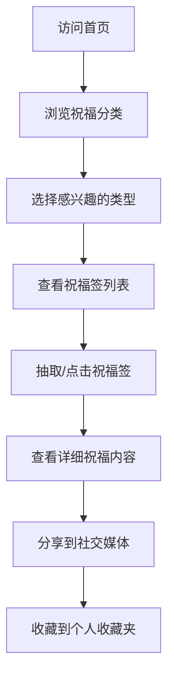
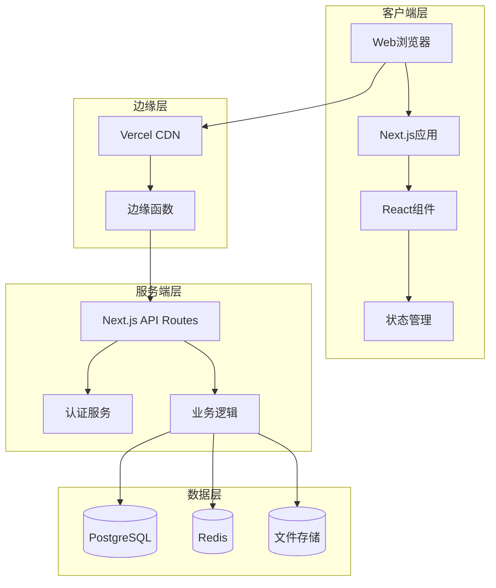

# 🐴 马年祝福签网站 - 技术设计文档

> [!info] 项目概述
> 本项目基于 SkillsMP (skillsmp.com) 的网站风格和交互逻辑，打造一个马年新年祝福主题的互动网页。用户可以浏览不同类别的祝福签，点击后查看详细的祝福内容，类似于抽签/书签的体验。

---

## 📑 目录

1. [[#🎯 项目定位]]
2. [[#🎨 视觉风格分析]]
3. [[#📊 功能模块设计]]
4. [[#🏗️ 技术架构]]
5. [[#📁 数据模型]]
6. [[#🔌 API接口设计]]
7. [[#🎨 前端组件]]
8. [[#🚀 开发路线图]]
9. [[#📚 附录]]

---

## 🎯 项目定位

### 核心概念

| 项目 | SkillsMP (原版) | 马年祝福签 (新) |
|------|-----------------|-----------------|
| **定位** | AI技能市场 | 新年祝福互动平台 |
| **核心内容** | AI助手技能 | 祝福语/签文 |
| **用户行为** | 发现→安装技能 | 浏览→抽取→分享祝福 |
| **内容来源** | GitHub开源仓库 | 策划+用户贡献 |
| **交互深度** | 技能详情→安装文档 | 祝福签→详细解读→分享 |

### 用户旅程



### 核心功能矩阵

| 功能 | 优先级 | 说明 |
|------|--------|------|
| 祝福签浏览 | P0 | 按分类浏览祝福签 |
| 祝福签详情 | P0 | 查看完整祝福内容 |
| 祝福分类 | P0 | 事业/爱情/健康/财运等 |
| 搜索功能 | P1 | 关键词搜索祝福 |
| 用户收藏 | P1 | 收藏喜欢的祝福签 |
| 分享功能 | P1 | 生成分享图片/链接 |
| 每日运势 | P2 | 结合星座/生肖的今日运势 |
| 互动游戏 | P2 | 摇一摇抽签/组队祝福 |

---

## 🎨 视觉风格分析

### SkillsMP 风格特征

> [!quote] 参考网站
> **SkillsMP** (https://skillsmp.com/) 是一个AI技能市场网站，具有以下视觉特征：

#### 1. 布局结构

```ascii
┌─────────────────────────────────────────────────────────────┐
│  Logo + 导航菜单 + 搜索框 + 用户菜单                          │
├─────────────────────────────────────────────────────────────┤
│  [Hero区域] 标题 + 搜索 + 统计数据                            │
├─────────────────────────────────────────────────────────────┤
│  [分类导航]                                                  │
├─────────────────────────────────────────────────────────────┤
│  [主要内容区]                                                │
│  ┌─────────┐ ┌─────────┐ ┌─────────┐                       │
│  │ 卡片1   │ │ 卡片2   │ │ 卡片3   │                       │
│  └─────────┘ └─────────┘ └─────────┘                       │
├─────────────────────────────────────────────────────────────┤
│  [Footer] 链接 + 版权                                        │
└─────────────────────────────────────────────────────────────┘
```

#### 2. 视觉元素

| 元素 | 特征 | 马年祝福版 |
|------|------|-----------|
| **配色** | 深色终端风格，科技感 | 红色系+金色系，节日氛围 |
| **图标** | 线性图标，代码风格 | 祥云/马/福字等传统元素 |
| **字体** | JetBrains Mono，等宽 | 思源宋体+黑体 |
| **卡片** | 简洁边框，悬停效果 | 红包样式，烫金效果 |
| **动画** | 轻微缩放，代码高亮 | 烟花/金币飘落动画 |

#### 3. 页面类型映射

| SkillsMP | 马年祝福签 | 差异点 |
|----------|-----------|--------|
| 首页 | 首页 | 统计数据改为祝福语录 |
| 技能列表页 | 祝福签列表页 | 卡片样式改为签纸样式 |
| 技能详情页 | 祝福签详情页 | 类似抽签结果的展示 |
| 分类页 | 祝福分类页 | 分类改为祝福类型 |
| 文档页 | 祝福解读页 | API文档改为签文解读 |
| 搜索 | 祝福搜索 | 关键词搜索祝福语 |

---

## 📊 功能模块设计

### 模块一：首页 (Home)

#### 结构设计

```
┌─────────────────────────────────────────────────────────────┐
│  🐴 马年祝福签                                            │
├─────────────────────────────────────────────────────────────┤
│  新年快乐！愿您马到成功！🐴✨                               │
├─────────────────────────────────────────────────────────────┤
│  [搜索祝福语...]                          [🔍] [🎲]       │
├─────────────────────────────────────────────────────────────┤
│  🎯 热门祝福分类                                               │
│  ┌─────────┬─────────┬─────────┬─────────┐                 │
│  │ 💰 财运 │ 💼 事业 │ ❤️ 爱情 │ 🏃 健康 │                 │
│  └─────────┴─────────┴─────────┴─────────┘                 │
├─────────────────────────────────────────────────────────────┤
│  🌟 今日推荐祝福                                               │
│  ┌─────────────────────────────────────────────────────┐   │
│  │  "春风得意马蹄疾，一日看尽长安花"                      │   │
│  │  —— 唐代·孟郊《登科后》                                │   │
│  └─────────────────────────────────────────────────────┘   │
├─────────────────────────────────────────────────────────────┤
│  📊 祝福统计                                                   │
│  已送出 99,999+ 祝福  |  今日抽取 1,234 次  |  幸福传递中...  │
└─────────────────────────────────────────────────────────────┘
```

#### 交互设计

| 区域 | 交互 | 说明 |
|------|------|------|
| 搜索框 | 输入+回车 | 搜索祝福语 |
| 🎲按钮 | 点击 | 随机抽取一个祝福 |
| 分类卡片 | 悬停+点击 | 进入对应分类 |
| 推荐祝福 | 点击 | 跳转到祝福详情 |

### 模块二：祝福分类页 (Categories)

#### 分类体系设计

| 分类ID | 名称 | 图标 | 祝福数量 | 描述 |
|--------|------|------|----------|------|
| career | 💼 事业 | 升迁 | 88 | 事业腾飞、步步高升 |
| wealth | 💰 财运 | 财富 | 66 | 财源滚滚、金玉满堂 |
| love | ❤️ 爱情 | 红心 | 52 | 甜蜜幸福、百年好合 |
| health | 🏃 健康 | 健康 | 44 | 身体健康、万事如意 |
| study | 📚 学业 | 书本 | 36 | 金榜题名、学业有成 |
| family | 👨‍👩‍👧 家庭 | 家庭 | 28 | 家庭和睦、阖家欢乐 |
| friendship | 🤝 友情 | 握手 | 22 | 友谊长存、知己相逢 |
| travel | ✈️ 出行 | 飞机 | 18 | 平安出行、一路顺风 |

#### 页面布局

```tsx
// 分类页面组件结构
function CategoryPage({ params }: { params: { slug: string } }) {
  return (
    <Container>
      {/* 分类标题区 */}
      <CategoryHeader category={category} />
      
      {/* 祝福签网格 */}
      <BlessingGrid blessings={blessings} />
      
      {/* 分页器 */}
      <Pagination pagination={pagination} />
    </Container>
  );
}
```

### 模块三：祝福签详情页 (Blessing Detail)

> [!important] 核心页面
> 这是整个网站的核心页面，参考 SkillsMP 的技能详情页设计，但改为祝福签的展示形式。

#### 页面结构

```
┌─────────────────────────────────────────────────────────────┐
│  🏠 首页 > 💰 财运 > 财源滚滚                                │
├─────────────────────────────────────────────────────────────┤
│                                                             │
│     ╔═══════════════════════════════════════╗              │
│     ║                                       ║              │
│     ║      🐴 马年大吉 · 财运亨通 🐴        ║              │
│     ║                                       ║              │
│     ║   "财源广进如江水，富贵逼人似春风"    ║              │
│     ║                                       ║              │
│     ║   ───────────────────────────────     ║              │
│     ║         签文 · 中上签                 ║              │
│     ║         运势 · ★★★★☆                 ║              │
│     ║         吉时 · 辰时/巳时              ║              │
│     ║                                       ║              │
│     ╚═══════════════════════════════════════╝              │
│                                                             │
├─────────────────────────────────────────────────────────────┤
│  [📖 详细解读] [📤 分享祝福] [⭐ 收藏] [🔄 再抽一次]        │
├─────────────────────────────────────────────────────────────┤
│  📝 签文释 │
│  这义                                                 支签文寓意着新的一年里，您将迎来财富的...                  │
│                                                             │
│  🌟 事业运势                                                   │
│  工作中将有机会获得意外的财运...                               │
│                                                             │
│  💕 感情运势                                                   │
│  感情生活将趋于稳定...                                        │
│                                                             │
│  📅 农历新年特别解读                                          │
│  马年配合此签文...                                            │
├─────────────────────────────────────────────────────────────┤
│  🔗 相关祝福签                                                │
│  ┌─────┐ ┌─────┐ ┌─────┐                                    │
│  │ 签1 │ │ 签2 │ │ 签3 │                                    │
│  └─────┘ └─────┘ └─────┘                                    │
└─────────────────────────────────────────────────────────────┘
```

#### 签文数据模型

```typescript
interface BlessingDetail {
  id: string;
  title: string;           // 祝福标题
  subtitle: string;        // 副标题
  content: string;         // 核心祝福语
  poet: string;            // 出处（可为null）
  poetSource?: string;     // 古诗/名言出处
 签运: '上上签' | '上签' | '中上签' | '中签' | '下签';
  stars: number;           // 运势等级 1-5
  luckyTime: string;       // 吉时
  categoryId: string;      // 分类ID
  interpretation: string;  // 详细解读
  careerAdvice: string;    // 事业建议
  loveAdvice: string;      // 感情建议
  healthAdvice: string;    // 健康建议
  shareImageUrl: string;   // 分享图片URL
  createdAt: Date;
}
```

### 模块四：搜索功能 (Search)

#### 搜索类型

| 搜索类型 | 说明 | 效果 |
|----------|------|------|
| 关键词搜索 | 按祝福语内容搜索 | 精确匹配 |
| 标签搜索 | 按#标签搜索 | 分类筛选 |
| 分类搜索 | 按祝福分类筛选 | 范围缩小 |
| 随机抽取 | 🎲 随机获取祝福 | 发现惊喜 |

#### 搜索建议

```
输入 "财" → 
  💰 财源滚滚
  💰 日进斗金
  💰 恭喜发财
  
输入 "马" → 
  🐴 马到成功
  🐴 一马当先
  🐴 马年大吉
```

### 模块五：用户系统 (User)

| 功能 | 说明 |
|------|------|
| 收藏祝福 | 收藏喜欢的祝福签 |
| 祝福历史 | 记录抽过的祝福 |
| 个人主页 | 展示已收藏的祝福 |
| 分享记录 | 生成分享链接 |

### 模块六：分享功能 (Share)

#### 分享形式

| 平台 | 格式 | 说明 |
|------|------|------|
| 微信/QQ | 海报图片 | 生成精美的祝福图片 |
| 微博/小红书 | 卡片链接 | 带祝福摘要的链接 |
| 复制内容 | 纯文本 | 一键复制祝福语 |
| 本地保存 | 图片/文字 | 保存到本地 |

---

## 🏗️ 技术架构

### 整体架构图



### 技术栈选择

#### 前端技术栈

| 技术 | 版本 | 用途 |
|------|------|------|
| **框架** | Next.js 15 | SSR/SSG框架 |
| **UI库** | React 19 | 组件化UI |
| **样式** | Tailwind CSS | 原子化CSS |
| **状态** | Zustand | 轻量状态管理 |
| **数据获取** | TanStack Query | 数据获取与缓存 |
| **表单** | React Hook Form | 表单处理 |
| **验证** | Zod | 类型安全的验证 |
| **动画** | Framer Motion | 交互动画 |
| **图标** | Lucide React | 图标库 |
| **国际化** | next-intl | 国际化支持 |

#### 后端技术栈

| 技术 | 版本 | 用途 |
|------|------|------|
| **运行时** | Node.js 20 | JavaScript运行时 |
| **ORM** | Prisma 5 | 数据库ORM |
| **数据库** | PostgreSQL 16 | 主数据库 |
| **缓存** | Redis 7 | 缓存层 |
| **认证** | NextAuth.js | 身份认证 |
| **存储** | S3/OSS | 文件存储 |

#### 部署方案

| 服务 | 用途 |
|------|------|
| **Vercel** | 前端部署、边缘函数 |
| **Supabase** | PostgreSQL数据库 |
| **Upstash** | Redis缓存 |
| **阿里云OSS** | 静态资源存储 |

### 项目结构

```
blessing-website/
├── src/
│   ├── app/                    # Next.js App Router
│   │   ├── layout.tsx          # 根布局
│   │   ├── page.tsx            # 首页
│   │   ├── globals.css         # 全局样式
│   │   ├── api/                # API路由
│   │   ├── blessings/          # 祝福模块
│   │   │   ├── page.tsx        # 祝福列表
│   │   │   ├── [id]/           # 祝福详情
│   │   │   │   └── page.tsx
│   │   │   └── category/       # 分类模块
│   │   │       └── [slug]/
│   │   │           └── page.tsx
│   │   └── search/             # 搜索模块
│   │       └── page.tsx
│   │
│   ├── components/             # 组件
│   │   ├── ui/                 # 基础UI组件
│   │   ├── layout/             # 布局组件
│   │   ├── blessings/          # 祝福组件
│   │   └── shared/             # 共享组件
│   │
│   ├── hooks/                  # 自定义Hooks
│   ├── lib/                    # 工具库
│   ├── stores/                 # 状态管理
│   ├── types/                  # TypeScript类型
│   └── utils/                  # 工具函数
│
├── public/                     # 静态资源
│   ├── images/                 # 图片
│   ├── fonts/                  # 字体
│   └── icons/                  # 图标
│
├── prisma/                     # 数据库
│   ├── schema.prisma           # 数据库Schema
│   └── migrations/             # 迁移文件
│
├── content/                    # 祝福内容
│   └── blessings/              # 祝福数据
│
├── tailwind.config.ts          # Tailwind配置
├── next.config.ts              # Next.js配置
└── package.json
```

---

## 📁 数据模型

### 核心实体

```prisma
// 祝福签表
model Blessing {
  id          String   @id @default(cuid())
  title       String   // 祝福标题
  content     String   // 核心祝福语
  poet        String?  // 出处
  poetSource  String?  // 出处详情
  categoryId  String   // 分类ID
  stars       Int      @default(3)  // 运势等级 1-5
  luckType    LuckType // 签运类型
  luckyTime   String?  // 吉时
  interpretation String // 详细解读
  careerAdvice String? // 事业建议
  loveAdvice   String? // 感情建议
  healthAdvice String? // 健康建议
  shareImageUrl String? // 分享图片
  viewCount   Int      @default(0)
  likeCount   Int      @default(0)
  isFeatured  Boolean  @default(false)
  publishedAt DateTime @default(now())
  createdAt   DateTime @default(now())
  updatedAt   DateTime @updatedAt
  
  category    Category @relation(fields: [categoryId], references: [id])
  likes       BlessingLike[]
  favorites   Favorite[]
  shares      ShareRecord[]
  
  @@index([categoryId])
  @@index([luckType])
  @@index([isFeatured])
}

// 分类表
model Category {
  id          String   @id @default(cuid())
  name        String   // 分类名称
  slug        String   @unique // URL友好的名称
  icon        String   // 图标emoji
  description String?  // 分类描述
  color       String   @default("#C23531") // 主题色
  sortOrder   Int      @default(0)
  isActive    Boolean  @default(true)
  blessingCount Int    @default(0)
  createdAt   DateTime @default(now())
  updatedAt   DateTime @updatedAt
  
  blessings   Blessing[]
  
  @@index([slug])
  @@index([sortOrder])
}

// 用户表
model User {
  id          String   @id @default(cuid())
  name        String
  email       String   @unique
  avatar      String?
  provider    String   // 登录方式: github/wechat/email
  providerId  String?  // 第三方ID
  createdAt   DateTime @default(now())
  updatedAt   DateTime @updatedAt
  
  favorites   Favorite[]
  likes       BlessingLike[]
  shares      ShareRecord[]
  history     BlessingHistory[]
  
  @@index([email])
  @@index([provider, providerId])
}

// 收藏表
model Favorite {
  id          String   @id @default(cuid())
  userId      String
  blessingId  String
  note        String?  // 个人备注
  createdAt   DateTime @default(now())
  
  user        User     @relation(fields: [userId], onDelete: Cascade)
  blessing    Blessing @relation(fields: [blessingId], onDelete: Cascade)
  
  @@unique([userId, blessingId])
}

// 祝福点赞表
model BlessingLike {
  id          String   @id @default(cuid())
  userId      String?
  blessingId  String
  ipAddress   String?  // 匿名点赞记录IP
  createdAt   DateTime @default(now())
  
  blessing    Blessing @relation(fields: [blessingId], onDelete: Cascade)
  
  @@index([blessingId])
}

// 分享记录表
model ShareRecord {
  id          String   @id @default(cuid())
  userId      String?
  blessingId  String
  platform    String   // 分享平台: wechat/weibo/copy
  shareUrl    String?  // 分享链接
  createdAt   DateTime @default(now())
  
  user        User?    @relation(fields: [userId], onDelete: SetNull)
  blessing    Blessing @relation(fields: [blessingId], onDelete: Cascade)
  
  @@index([userId])
  @@index([blessingId])
}

// 抽取历史表
model BlessingHistory {
  id          String   @id @default(cuid())
  userId      String?
  blessingId  String
  sessionId   String?  // 匿名会话ID
  createdAt   DateTime @default(now())
  
  user        User?    @relation(fields: [userId], onDelete: SetNull)
  
  @@index([userId])
  @@index([sessionId])
}

// 签运类型枚举
enum LuckType {
  SUPER_LUCKY   // 上上签
  LUCKY         // 上签
  MEDIUM_LUCKY  // 中上签
  MEDIUM        // 中签
  LOW_LUCKY     // 下签
}
```

### 祝福内容示例

```json
{
  "id": "blessing_001",
  "title": "财源滚滚",
  "content": "财源广进如江水，富贵逼人似春风",
  "poet": "孟郊",
  "poetSource": "唐代·孟郊《登科后》",
  "categoryId": "wealth",
  "stars": 5,
  "luckType": "SUPER_LUCKY",
  "luckyTime": "辰时/巳时",
  "interpretation": "此签为大吉之签，寓意新的一年里，您将迎来财富的快速增长。无论是正财还是偏财，都有望获得丰收。工作上会有意外的收入机会，投资理财也将获得可观回报。",
  "careerAdvice": "工作中建议积极表现，有望获得晋升或加薪机会。可以考虑开展副业，增加收入来源。",
  "loveAdvice": "感情生活趋于稳定，单身者有望遇到有经济实力的对象。已有伴侣者，双方关系更加稳固。",
  "healthAdvice": "身体状况良好，建议保持规律作息，适当运动。",
  "shareImageUrl": "/share/wealth_001.png"
}
```

---

## 🔌 API接口设计

### 祝福相关接口

| 方法 | 路径 | 说明 |
|------|------|------|
| GET | `/api/blessings` | 获取祝福列表 |
| GET | `/api/blessings/random` | 随机获取祝福 |
| GET | `/api/blessings/:id` | 获取祝福详情 |
| GET | `/api/blessings/category/:slug` | 获取分类下祝福 |
| POST | `/api/blessings/:id/like` | 点赞祝福 |
| DELETE | `/api/blessings/:id/like` | 取消点赞 |

### 分类相关接口

| 方法 | 路径 | 说明 |
|------|------|------|
| GET | `/api/categories` | 获取所有分类 |
| GET | `/api/categories/:slug` | 获取分类详情 |

### 搜索接口

| 方法 | 路径 | 说明 |
|------|------|------|
| GET | `/api/search` | 搜索祝福 |
| GET | `/api/search/suggest` | 搜索建议 |

### 用户相关接口

| 方法 | 路径 | 说明 |
|------|------|------|
| POST | `/api/auth/*` | 认证接口 |
| GET | `/api/user/favorites` | 获取收藏 |
| POST | `/api/user/favorites` | 添加收藏 |
| DELETE | `/api/user/favorites/:id` | 取消收藏 |
| GET | `/api/user/history` | 获取历史 |

---

## 🎨 前端组件

### 核心组件列表

```
src/components/
├── ui/                          # 基础UI组件
│   ├── Button/
│   ├── Card/
│   ├── Input/
│   ├── Badge/
│   ├── Avatar/
│   ├── Modal/
│   ├── Toast/
│   └── Loading/
│
├── layout/                      # 布局组件
│   ├── Header/
│   ├── Footer/
│   ├── Navigation/
│   └── Container/
│
├── blessings/                   # 祝福相关组件
│   ├── BlessingCard/           # 祝福卡片
│   ├── BlessingGrid/           # 祝福网格
│   ├── BlessingDetail/         # 祝福详情
│   ├── BlessingSearch/         # 祝福搜索
│   ├── CategoryCard/           # 分类卡片
│   ├── FortuneWheel/           # 幸运转盘
│   └── ShareButton/            # 分享按钮
│
├── home/                        # 首页组件
│   ├── HeroSection/
│   ├── CategorySection/
│   ├── FeaturedSection/
│   └── StatsSection/
│
└── shared/                      # 共享组件
    ├── SEOHead/
    ├── Analytics/
    └── ErrorBoundary/
```

### BlessingCard 组件

```tsx
// 祝福卡片组件
interface BlessingCardProps {
  blessing: BlessingSummary;
  variant?: 'default' | 'compact' | 'fortune';
  onClick?: (id: string) => void;
}

export function BlessingCard({ blessing, variant = 'default', onClick }: BlessingCardProps) {
  return (
    <Card 
      className={cn(
        'blessing-card cursor-pointer transition-all hover:shadow-lg',
        variant === 'fortune' && 'bg-gradient-to-br from-red-50 to-gold-50 border-gold'
      )}
      onClick={() => onClick?.(blessing.id)}
    >
      <CardContent className="p-4">
        <div className="flex items-center gap-2 mb-2">
          <span className="text-2xl">{blessing.icon}</span>
          <Badge variant={getLuckBadgeVariant(blessing.luckType)}>
            {blessing.luckType}
          </Badge>
        </div>
        
        <h3 className="font-serif text-lg mb-2">{blessing.title}</h3>
        
        <p className="text-muted-foreground text-sm line-clamp-2">
          {blessing.content}
        </p>
        
        <div className="flex items-center gap-2 mt-3">
          <StarRating stars={blessing.stars} />
          <span className="text-xs text-muted-foreground">
            {blessing.category.name}
          </span>
        </div>
      </CardContent>
    </Card>
  );
}
```

### FortuneWheel 组件

```tsx
// 幸运转盘组件 - 摇一抽签
'use client';

import { useState, useCallback } from 'react';
import { motion, AnimatePresence } from 'framer-motion';

export function FortuneWheel() {
  const [isSpinning, setIsSpinning] = useState(false);
  const [result, setResult] = useState<BlessingDetail | null>(null);

  const handleSpin = useCallback(async () => {
    setIsSpinning(true);
    // 模拟转盘动画
    await new Promise(resolve => setTimeout(resolve, 2000));
    // 获取随机祝福
    const blessing = await fetchRandomBlessing();
    setResult(blessing);
    setIsSpinning(false);
  }, []);

  return (
    <div className="fortune-wheel">
      <AnimatePresence mode="wait">
        {isSpinning ? (
          <motion.div
            key="spinning"
            animate={{ rotate: 360 }}
            transition={{ duration: 2, repeat: Infinity, ease: "linear" }}
            className="text-6xl"
          >
            🐴
          </motion.div>
        ) : result ? (
          <motion.div
            key="result"
            initial={{ scale: 0.8, opacity: 0 }}
            animate={{ scale: 1, opacity: 1 }}
            className="fortune-result"
          >
            <h3>{result.title}</h3>
            <p>{result.content}</p>
            <Button onClick={() => setResult(null)}>再抽一次</Button>
          </motion.div>
        ) : (
          <motion.div
            key="ready"
            initial={{ scale: 1 }}
            className="text-center"
          >
            <Button size="lg" onClick={handleSpin}>
              🎲 抽取今日祝福
            </Button>
          </motion.div>
        )}
      </AnimatePresence>
    </div>
  );
}
```

---

## 🚀 开发路线图

### 阶段一：基础架构搭建

**时间**: 第1周

| 任务 | 工期 | 产出 |
|------|------|------|
| 项目初始化 | 4h | Next.js项目骨架 |
| 设计系统配置 | 8h | 色彩/字体/间距Token |
| 基础组件库 | 16h | Button/Card/Input等 |
| 数据库Schema | 8h | Prisma配置完成 |
| 开发规范 | 4h | ESLint/Prettier配置 |

### 阶段二：核心页面开发

**时间**: 第2-3周

| 任务 | 工期 | 产出 |
|------|------|------|
| 首页开发 | 16h | 首页完成 |
| 分类页开发 | 16h | 分类浏览功能 |
| 详情页开发 | 24h | 祝福详情功能 |
| 搜索功能 | 16h | 搜索与筛选 |
| 随机抽取 | 8h | 摇一抽签功能 |

### 阶段三：用户系统

**时间**: 第4周

| 任务 | 工期 | 产出 |
|------|------|------|
| 认证系统 | 16h | GitHub/微信登录 |
| 收藏功能 | 8h | 收藏祝福 |
| 历史记录 | 8h | 抽取历史 |
| 个人主页 | 8h | 用户主页 |

### 阶段四：分享与互动

**时间**: 第5周

| 任务 | 工期 | 产出 |
|------|------|------|
| 分享功能 | 16h | 海报生成+分享链接 |
| 社交互动 | 8h | 评论/点赞 |
| 数据统计 | 8h | 访问统计 |

### 阶段五：优化与上线

**时间**: 第6周

| 任务 | 工期 | 产出 |
|------|------|------|
| 性能优化 | 16h | Lighthouse > 90 |
| SEO优化 | 8h | 搜索引擎收录 |
| 测试 | 16h | 单元测试+E2E |
| 部署上线 | 8h | 生产环境部署 |

---

## 📚 附录

### 参考资源

| 资源 | 链接 |
|------|------|
| SkillsMP原站 | https://skillsmp.com/ |
| Next.js文档 | https://nextjs.org/docs |
| Tailwind CSS | https://tailwindcss.com/docs |
| Framer Motion | https://www.framer.com/motion/ |
| Prisma | https://www.prisma.io/docs |

### 设计资源

| 资源 | 说明 |
|------|------|
| 思源宋体 | https://fonts.google.com/ |
| 思源黑体 | https://fonts.google.com/ |
| Lucide Icons | https://lucide.dev/ |
| Tailwind CSS Animated | https://github.com/mpocock1/tailwindcss-animate |

### 术语表

| 术语 | 定义 |
|------|------|
| 祝福签 | 带有祝福语和运势解读的电子签文 |
| 签运 | 祝福签的运势等级（上上签、上签等） |
| 抽签 | 随机获取祝福签的过程 |
| 摇一摇 | 通过晃动设备触发抽签的交互方式 |

---

> [!success] 文档完成
> 本设计文档已完成，您可以根据此文档逐步实现马年祝福签网站。如需进一步细化某个模块，请随时告知！

---

*最后更新: 2026-01-30*
*文档版本: 1.0.0*
