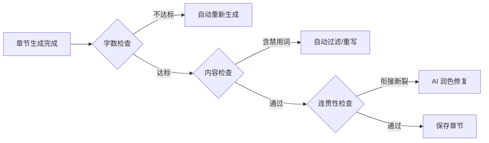

# AI网文小说生成系统 - 专业改善建议

基于我对需求文档和设计文档的深入分析，以下是我认为可以改善的关键领域。

---

## 一、架构层面改善

### 1.1 已简化：任务调度

> [!NOTE]
> 由于目标场景为 3-5 人使用，**不再需要** Redis + Celery 任务队列。

**当前方案**：使用简单的信号量限制并发

```python
import asyncio

# 最多同时 5 个 AI 生成任务
ai_semaphore = asyncio.Semaphore(5)

async def generate_chapter_with_limit(...):
    async with ai_semaphore:
        return await ai_service.generate_chapter(...)
```

**如果将来扩展到多用户**：再考虑引入 Redis + Celery。

---

### 1.2 缺失：API 网关与限流

**现状**：3-5 人场景下，成本控制主要靠智谱 GLM-4-Flash 的低价格。

**可选改进**（如果担心滥用）：

**建议改进**：

```python
# 新增限流配置
RATE_LIMITS = {
    "chapter_generate": "5/minute",      # 每分钟最多生成5章
    "batch_characters": "2/minute",      # 批量角色生成限制
    "world_building": "3/minute",        # 世界观生成限制
}

# 使用 slowapi 实现
from slowapi import Limiter
limiter = Limiter(key_func=get_user_id)

@app.post("/api/chapters/generate")
@limiter.limit("5/minute")
async def generate_chapter(...):
    ...
```

---

### 1.3 建议：增加缓存层

**AI 生成结果缓存策略**：

| 缓存对象 | 过期时间 | 用途 |
|----------|----------|------|
| 世界观模板 | 24小时 | 相同类型项目可复用 |
| Embedding 向量 | 永久 | 避免重复计算 |
| 章节草稿 | 1小时 | 用户编辑期间保留 |
| Prompt 模板 | 启动时加载 | 减少数据库查询 |

---

## 二、AI 生成质量改善

### 2.1 严重遗漏：Prompt 版本管理

> [!CAUTION]
> 当前设计没有 Prompt 版本控制，一旦修改 Prompt 模板，无法回滚或对比效果。

**建议新增 `prompt_versions` 表**：

```sql
CREATE TABLE prompt_versions (
    id UUID PRIMARY KEY,
    template_name VARCHAR(50) NOT NULL,
    version INTEGER NOT NULL,
    content TEXT NOT NULL,
    is_active BOOLEAN DEFAULT FALSE,
    performance_score FLOAT,          -- A/B 测试评分
    created_at TIMESTAMP,
    created_by UUID REFERENCES users(id),
    UNIQUE(template_name, version)
);
```

**Prompt 管理界面功能**：
- [ ] 版本历史回滚
- [ ] A/B 测试对比
- [ ] 效果评分统计

---

### 2.2 改进：更精细的生成参数控制

**现状问题**：文档中 `temperature` 固定为 0.7，但不同任务应该使用不同参数。

**建议的参数策略**：

| 任务类型 | Temperature | Top-P | 原因 |
|----------|-------------|-------|------|
| 世界观生成 | 0.8 | 0.9 | 需要创意性 |
| 角色性格 | 0.7 | 0.85 | 平衡创意与一致性 |
| 大纲规划 | 0.5 | 0.8 | 需要逻辑性 |
| 章节续写 | 0.6 | 0.85 | 保持风格一致 |
| 情节分析 | 0.3 | 0.7 | 需要准确分析 |

**配置化实现**：

```python
# config/ai_params.yaml
generation_params:
  world_building:
    temperature: 0.8
    top_p: 0.9
    frequency_penalty: 0.3
  
  chapter_generation:
    temperature: 0.6
    top_p: 0.85
    frequency_penalty: 0.5
    presence_penalty: 0.3
```

---

### 2.3 新增：生成质量自动评估

**现状问题**：章节生成后只有人工检查，没有自动质量把关。

**建议新增自动检查流程**：



**自动检查项**：

```python
class ChapterValidator:
    async def validate(self, chapter_content: str, context: ChapterContext) -> ValidationResult:
        errors = []
        warnings = []
        
        # 1. 字数检查
        word_count = len(chapter_content)
        if word_count < context.min_word_count:
            errors.append(f"字数不足: {word_count} < {context.min_word_count}")
        
        # 2. 禁用词检查（AI 腔调）
        ai_phrases = ["总之", "综上所述", "总而言之", "让我们", "一起来看"]
        for phrase in ai_phrases:
            if phrase in chapter_content:
                warnings.append(f"发现 AI 常见用语: {phrase}")
        
        # 3. 衔接检查
        if context.continuation_point:
            similarity = self._check_continuation(
                chapter_content[:200], 
                context.continuation_point
            )
            if similarity < 0.3:
                errors.append("与上一章衔接可能存在断裂")
        
        # 4. 角色名一致性
        mentioned_characters = self._extract_names(chapter_content)
        for char in mentioned_characters:
            if char not in context.all_character_names:
                warnings.append(f"出现未定义角色: {char}")
        
        return ValidationResult(errors=errors, warnings=warnings)
```

---

## 三、数据库设计改善

### 3.1 遗漏：审计日志表

> [!IMPORTANT]
> 用户的创作历史需要追踪，便于问题排查和版本回滚。

**建议新增**：

```sql
CREATE TABLE audit_logs (
    id UUID PRIMARY KEY,
    user_id UUID NOT NULL,
    entity_type VARCHAR(50) NOT NULL,  -- project/chapter/character
    entity_id UUID NOT NULL,
    action VARCHAR(20) NOT NULL,        -- create/update/delete/generate
    old_value JSONB,
    new_value JSONB,
    ai_model VARCHAR(50),               -- 使用的 AI 模型
    token_usage INTEGER,                -- Token 消耗
    created_at TIMESTAMP DEFAULT NOW()
);

CREATE INDEX idx_audit_user ON audit_logs(user_id);
CREATE INDEX idx_audit_entity ON audit_logs(entity_type, entity_id);
```

---

### 3.2 SQLite 优化建议

**现状**：已改用 SQLite，简化了部署。

**建议的优化**：

```python
# SQLite 性能优化配置
PRAGMA journal_mode = WAL;      # 写前日志模式，提升并发性能
PRAGMA synchronous = NORMAL;    # 平衡性能和数据安全
PRAGMA cache_size = -64000;     # 64MB 缓存
PRAGMA busy_timeout = 5000;     # 5秒超时
```

**内容预览字段**：

```sql
-- 添加内容摘要字段用于列表展示
ALTER TABLE chapters ADD COLUMN content_preview VARCHAR(500);
```

---

### 3.3 可选：用户配额表

**场景**：如果将来开放给更多用户，可以考虑添加配额控制。

**当前 3-5 人场景**：智谱 API 价格极低，暂时不需要配额系统。

---

## 四、前端体验改善

### 4.1 缺失：离线草稿保存

**现状问题**：如果网络断开，编辑中的内容会丢失。

**建议改进**：

```typescript
// 使用 IndexedDB 本地存储
import { openDB } from 'idb';

const db = await openDB('novel-drafts', 1, {
  upgrade(db) {
    db.createObjectStore('chapters', { keyPath: 'id' });
    db.createObjectStore('outlines', { keyPath: 'id' });
  },
});

// 自动保存草稿
const autoSaveDraft = debounce(async (content: string, chapterId: string) => {
  await db.put('chapters', {
    id: chapterId,
    content,
    savedAt: new Date(),
    synced: false,
  });
}, 3000);

// 网络恢复后同步
window.addEventListener('online', syncDraftsToServer);
```

---

### 4.2 新增：创作统计仪表盘

**用户需要了解自己的创作进度**：

```
┌─────────────────────────────────────────────────────────────────┐
│                     📊 创作统计面板                               │
├─────────────────────────────────────────────────────────────────┤
│  📚 总字数         │  📝 章节数    │  👥 角色数    │  ⏱️ 创作天数  │
│  125,000 字        │  42 章        │  23 个        │  15 天       │
├─────────────────────────────────────────────────────────────────┤
│  📈 每日创作趋势                                                  │
│  ▁▂▃▅▇█▆▅▃▂▁▂▃▄▅▆▇█▇▆▅▄▃▂▁                                      │
├─────────────────────────────────────────────────────────────────┤
│  🎯 目标进度: 30万字目标                                          │
│  [████████████░░░░░░░░░░░░░░░░░░] 41.7%                          │
└─────────────────────────────────────────────────────────────────┘
```

---

### 4.3 改进：生成过程可视化

**现状**：只有简单的进度条

**建议**：增加"创作助手"动画和实时预览

```tsx
// 创作过程可视化组件
const GenerationVisualizer: React.FC = ({ status }) => {
  return (
    <div className="generation-panel">
      {/* 阶段指示器 */}
      <Steps current={status.phase}>
        <Step title="理解大纲" icon={<BookOutlined />} />
        <Step title="构思情节" icon={<BulbOutlined />} />
        <Step title="创作正文" icon={<EditOutlined />} />
        <Step title="润色检查" icon={<CheckOutlined />} />
      </Steps>
      
      {/* 实时内容预览 */}
      <div className="live-preview">
        <TypeWriter text={status.generatedText} speed={50} />
      </div>
      
      {/* 统计信息 */}
      <div className="stats">
        <Statistic title="已生成字数" value={status.wordCount} />
        <Statistic title="预计剩余" value={status.eta} suffix="秒" />
      </div>
    </div>
  );
};
```

---

## 五、安全性改善

### 5.1 严重遗漏：API 密钥管理

> [!NOTE]
> 3-5 人场景下，API Key 可以统一配置在环境变量中，无需复杂的密钥管理。

**如果将来开放多用户**，建议添加加密存储：

```sql
-- 用户 API Key 加密存储
CREATE TABLE user_api_keys (
    id UUID PRIMARY KEY,
    user_id UUID NOT NULL REFERENCES users(id),
    provider VARCHAR(20) NOT NULL,      -- openai/anthropic/gemini
    encrypted_key TEXT NOT NULL,        -- AES-256 加密
    key_hint VARCHAR(10),               -- sk-...xxxx (仅显示后4位)
    is_valid BOOLEAN DEFAULT TRUE,
    last_used_at TIMESTAMP,
    created_at TIMESTAMP
);
```

**加密方案**：

```python
from cryptography.fernet import Fernet

class APIKeyManager:
    def __init__(self, master_key: str):
        self.cipher = Fernet(master_key.encode())
    
    def encrypt_key(self, api_key: str) -> str:
        return self.cipher.encrypt(api_key.encode()).decode()
    
    def decrypt_key(self, encrypted_key: str) -> str:
        return self.cipher.decrypt(encrypted_key.encode()).decode()
```

---

### 5.2 新增：内容安全审核

**AI 生成内容可能违规**：

```python
class ContentModerator:
    # 敏感词库
    BLOCKED_PATTERNS = [
        r'政治敏感词...',
        r'色情相关词...',
        r'暴力极端词...',
    ]
    
    async def check_content(self, content: str) -> ModerationResult:
        # 1. 本地正则匹配
        for pattern in self.BLOCKED_PATTERNS:
            if re.search(pattern, content):
                return ModerationResult(safe=False, reason="触发敏感词")
        
        # 2. 调用 AI 审核 API（可选）
        # OpenAI Moderation API 或自建模型
        
        return ModerationResult(safe=True)
```

---

## 六、可扩展性改善

### 6.1 新增：插件系统设计

**允许第三方扩展功能**：

```python
# 插件接口定义
class NovelPlugin(ABC):
    @property
    @abstractmethod
    def name(self) -> str:
        """插件名称"""
        pass
    
    @abstractmethod
    async def on_chapter_generated(self, chapter: Chapter) -> Chapter:
        """章节生成后的钩子"""
        pass
    
    @abstractmethod
    async def on_outline_created(self, outline: Outline) -> Outline:
        """大纲创建后的钩子"""
        pass

# 插件管理器
class PluginManager:
    def __init__(self):
        self.plugins: List[NovelPlugin] = []
    
    def register(self, plugin: NovelPlugin):
        self.plugins.append(plugin)
    
    async def trigger_chapter_generated(self, chapter: Chapter) -> Chapter:
        for plugin in self.plugins:
            chapter = await plugin.on_chapter_generated(chapter)
        return chapter
```

**示例插件**：
- 自动配图插件（调用 DALL-E 生成章节插图）
- TTS 有声书插件（文字转语音）
- 导出插件（导出为 EPUB/PDF）

---

### 6.2 新增：多语言支持准备

**当前只支持中文，建议预留国际化接口**：

```python
# i18n 配置
SUPPORTED_LANGUAGES = ["zh-CN", "zh-TW", "en", "ja", "ko"]

# Prompt 模板多语言
PROMPTS = {
    "zh-CN": {
        "world_building": "你是一位专业的网络小说作家...",
    },
    "en": {
        "world_building": "You are a professional web novel writer...",
    },
}

# Embedding 模型按语言选择
EMBEDDING_MODELS = {
    "zh-CN": "paraphrase-multilingual-MiniLM-L12-v2",
    "en": "all-MiniLM-L6-v2",
    "ja": "paraphrase-multilingual-MiniLM-L12-v2",
}
```

---

## 七、改善优先级排序（3-5人场景）

| 优先级 | 改善项 | 影响范围 | 工作量 |
|--------|--------|----------|--------|
| 🟡 P1 | 生成质量自动检查 | 用户体验 | 3-5天 |
| 🟡 P1 | Prompt 版本管理 | 迭代效率 | 2-3天 |
| 🟡 P1 | 离线草稿保存 | 用户体验 | 2-3天 |
| 🟡 P1 | 内容安全审核 | 合规性 | 2-3天 |
| 🟢 P2 | 创作统计仪表盘 | 用户粘性 | 3-5天 |
| 🟢 P2 | 审计日志 | 问题排查 | 1-2天 |
| 🟢 P2 | 插件系统 | 可扩展性 | 5-7天 |
| ⚪ P3 | 任务队列 (Celery) | 扩展时再加 | - |
| ⚪ P3 | 用户配额系统 | 扩展时再加 | - |

---

## 总结

经过简化后，这份设计文档已经非常适合 **3-5 人个人/小团队使用**。

主要优化点：
1. ✅ 移除了 Redis/Celery（用简单信号量替代）
2. ✅ SQLite 替代 PostgreSQL（部署简单）
3. ✅ 智谱 API 成本极低
4. ✅ 单容器 Docker 部署

建议先完成 MVP 核心功能，再根据使用体验逐步添加 **P1 优先级** 的改善项。
