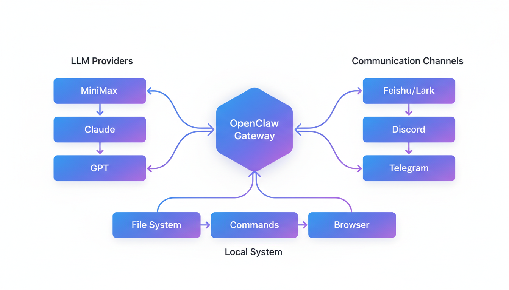
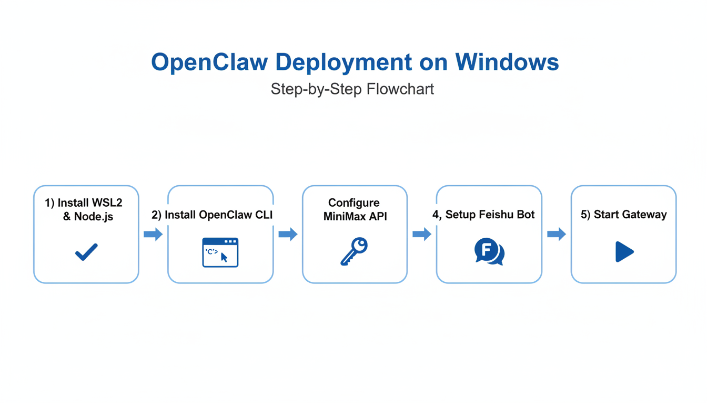
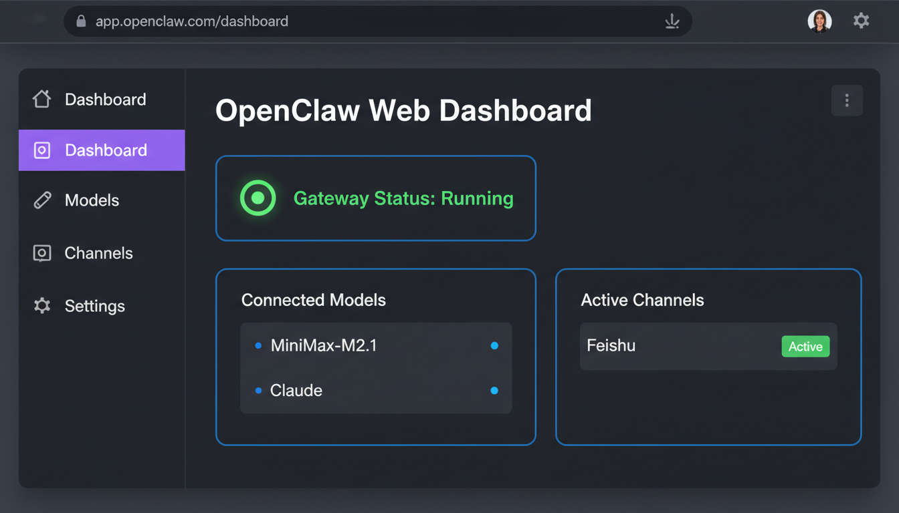
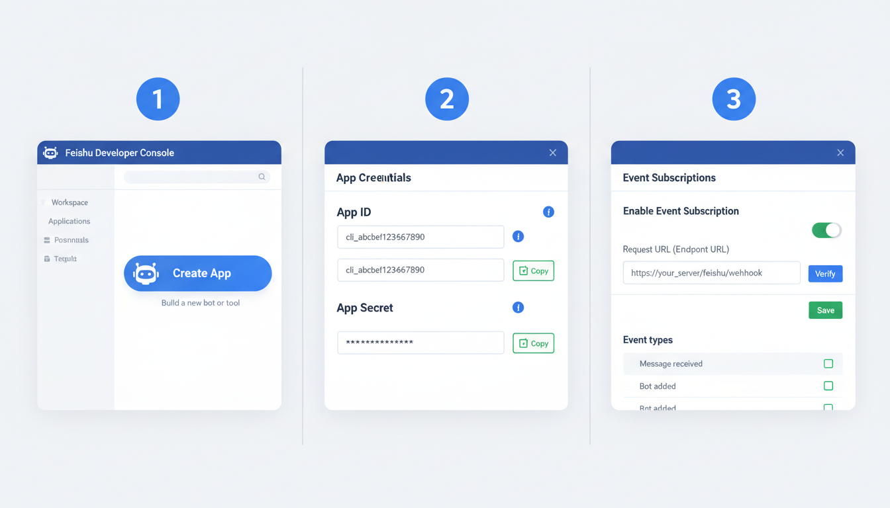
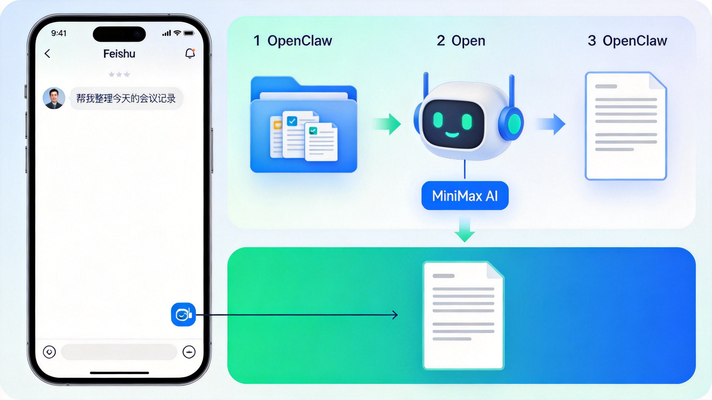
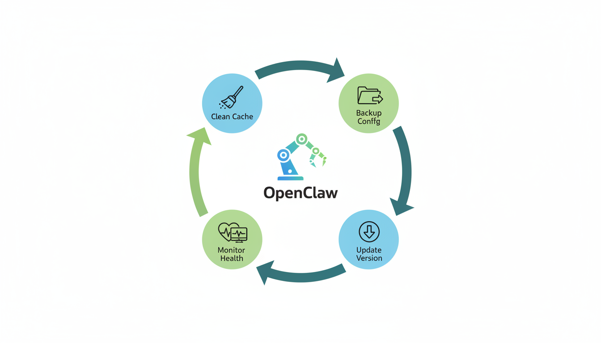

# OpenClaw 完全部署教程

> 🦀 打造你的私人 AI 助手 —— 从入门到精通

---



---

## 📋 目录

- [[#📖 教程简介|📖 教程简介]]
- [[#🎯 核心概念|🎯 核心概念]]
- [[#🖥️ Windows 环境部署|🖥️ Windows 环境部署]]
- [[#🔑 MiniMax Coding Plan 配置|🔑 MiniMax Coding Plan 配置]]
- [[#💬 飞书通信配置|💬 飞书通信配置]]
- [[#📊 实用实例|📊 实用实例]]
- [[#🔄 升级与维护|🔄 升级与维护]]
- [[#🗑️ 卸载与清理|🗑️ 卸载与清理]]
- [[#💾 备份与恢复|💾 备份与恢复]]
- [[#❓ 常见问题排查|❓ 常见问题排查]]
- [[#📚 扩展阅读|📚 扩展阅读]]

---

## 📖 教程简介

### 什么是 OpenClaw？

**OpenClaw**（原 Clawdbot/Moltbot）是 2026 年 GitHub 上增长最快的开源 AI 助手框架。它可以理解为你的**「私人贾维斯」**——一个 7×24 小时待命的智能助手。

### OpenClaw 能做什么？

| 能力类别 | 具体功能 |
|---------|---------|
| 🤖 **AI 对话** | 接入多种大模型（MiniMax、Claude、GPT 等） |
| 💬 **通信集成** | 飞书、Discord、Telegram、Slack 等 |
| 🖥️ **系统操作** | 执行命令、读写文件、浏览器自动化 |
| 📧 **办公集成** | Outlook 邮件、日历、待办事项 |
| 🔧 **开发辅助** | 代码审查、文档生成、自动化脚本 |

### 本教程特色

- ✅ **针对性强**：专为 Windows + MiniMax + 飞书组合优化
- ✅ **图文并茂**：每个关键步骤配有示意图
- ✅ **Obsidian 友好**：完整支持双向链接和嵌入式图片
- ✅ **维护指南**：包含升级、备份、卸载等完整生命周期管理

---

## 🎯 核心概念

在开始前，理解以下核心概念将帮助你更好地部署和使用 OpenClaw：

### 架构组件

```
┌─────────────────────────────────────────────────────────────┐
│                      OpenClaw 架构                           │
├─────────────────────────────────────────────────────────────┤
│                                                             │
│   ┌──────────┐      ┌──────────────┐      ┌──────────┐     │
│   │  LLM 模型 │◄────►│   Gateway    │◄────►│ 通信渠道  │     │
│   │ (MiniMax)│      │   (核心网关)  │      │ (飞书)   │     │
│   └──────────┘      └──────┬───────┘      └──────────┘     │
│                            │                                │
│                            ▼                                │
│                     ┌──────────────┐                        │
│                     │  Skill 系统   │                        │
│                     │ (功能插件)   │                        │
│                     └──────────────┘                        │
│                                                             │
└─────────────────────────────────────────────────────────────┘
```

### 关键术语

| 术语 | 说明 | 类比 |
|-----|------|------|
| **Gateway** | OpenClaw 核心服务，处理所有请求 | 像 HTTP 服务器 |
| **Channel** | 通信渠道，如飞书、Discord | 像微信/QQ 接口 |
| **Provider** | LLM 模型提供商 | 像 AI 服务商 |
| **Skill** | 功能插件，扩展 OpenClaw 能力 | 像浏览器插件 |
| **Agent** | 智能代理，执行具体任务 | 像虚拟助手 |

---

## 🖥️ Windows 环境部署

### 部署流程概览



### 方式一：WSL2 部署（推荐）

> 💡 **为什么推荐 WSL2？**
> - 官方原生支持，兼容性最佳
> - 避免 Windows 原生环境的依赖问题
> - 与 Linux 服务器部署方式一致，便于迁移

#### 步骤 1：启用 WSL2

**1.1 以管理员身份打开 PowerShell**

```powershell
# 右键点击开始菜单 → Windows PowerShell (管理员)
# 或按 Win+X，选择 "Windows PowerShell (管理员)"
```

**1.2 执行 WSL 安装命令**

```powershell
wsl --install
```

**1.3 重启电脑**

安装完成后，系统会提示重启。重启后 Ubuntu 会自动继续配置。

**1.4 设置 Ubuntu 用户名和密码**

重启后会弹出 Ubuntu 窗口，按提示设置：

```bash
Enter new UNIX username: yourname
New password: ********
Retype new password: ********
```

> ⚠️ **注意**：输入密码时不会显示字符，这是正常的。

**1.5 验证 WSL2 安装**

```powershell
wsl -l -v
```

预期输出：
```
  NAME      STATE       VERSION
* Ubuntu    Running     2
```

#### 步骤 2：安装 Node.js

在 **Ubuntu 终端** 中执行：

```bash
# 安装 nvm (Node Version Manager)
curl -o- https://raw.githubusercontent.com/nvm-sh/nvm/v0.40.3/install.sh | bash

# 加载 nvm
. "$HOME/.nvm/nvm.sh"

# 安装 Node.js 24 (推荐版本)
nvm install 24

# 验证安装
node -v  # 应显示 v24.x.x
npm -v   # 应显示 10.x.x
```

#### 步骤 3：安装 OpenClaw

**3.1 使用官方脚本安装（推荐）**

```bash
# 一键安装
curl -fsSL https://openclaw.ai/install.sh | bash

# 验证安装
openclaw --version
```

**3.2 如果官方脚本失败，使用 npm 安装**

```bash
# 全局安装
npm install -g openclaw@latest

# 验证
openclaw --version
```

#### 步骤 4：初始化配置

```bash
# 启动交互式配置向导
openclaw onboard --install-daemon
```

配置向导会引导你完成：
1. **身份认证** - 使用 GitHub 账号登录
2. **网关设置** - 配置 Gateway 服务
3. **守护进程** - 设置为开机自启

> 📌 **提示**：可以先跳过模型和渠道配置，后续在 Web 控制台中设置。

#### 步骤 5：访问 Web 控制台

```bash
# 启动 Dashboard
openclaw dashboard
```

或直接在浏览器访问：
```
http://127.0.0.1:18789
```



---

### 方式二：Docker 部署

如果你熟悉 Docker，这是更干净的选择——所有东西都在容器里，不污染宿主机。

#### 步骤 1：安装 Docker Desktop

1. 下载 [Docker Desktop for Windows](https://www.docker.com/products/docker-desktop)
2. 安装时勾选 **"Use WSL 2 instead of Hyper-V"**
3. 重启电脑

#### 步骤 2：创建 Docker Compose 配置

创建文件 `docker-compose.yml`：

```yaml
version: '3.8'

services:
  openclaw:
    image: justlikemaki/openclaw-docker-cn-im:latest
    container_name: openclaw
    ports:
      - "18789:18789"
    volumes:
      - ./openclaw-data:/root/.openclaw
    environment:
      - MINIMAX_API_KEY=${MINIMAX_API_KEY}
      - OPENCLAW_GATEWAY_TOKEN=${OPENCLAW_GATEWAY_TOKEN}
    restart: unless-stopped
```

#### 步骤 3：创建环境变量文件

创建文件 `.env`：

```env
MINIMAX_API_KEY=your_minimax_api_key_here
OPENCLAW_GATEWAY_TOKEN=your_secure_random_token_here
```

#### 步骤 4：启动容器

```powershell
# 在 docker-compose.yml 所在目录执行
docker-compose up -d

# 查看日志
docker-compose logs -f
```

---

### 方式三：Windows 原生部署（高级）

> ⚠️ **警告**：官方不推荐此方式，可能遇到依赖问题。仅适合有经验的用户。

#### 步骤 1：安装 Node.js

1. 访问 [nodejs.org](https://nodejs.org/zh-cn/download)
2. 下载 **Node.js 22.x LTS** 版本
3. 安装时勾选 **"Add to PATH"**

#### 步骤 2：安装 OpenClaw

**以管理员身份**打开 PowerShell：

```powershell
# 设置执行策略
Set-ExecutionPolicy -ExecutionPolicy RemoteSigned -Scope CurrentUser

# 安装 OpenClaw
iwr -useb https://openclaw.ai/install.ps1 | iex

# 验证
openclaw --version
```

#### 步骤 3：后续配置

与 WSL2 方式相同，运行 `openclaw onboard` 进行配置。

---

## 🔑 MiniMax Coding Plan 配置

### 为什么选择 MiniMax？

| 优势 | 说明 |
|-----|------|
| 💰 **性价比高** | Coding Plan 价格亲民，适合个人开发者 |
| 🚀 **速度快** | 国内节点，响应速度快 |
| 🌐 **中文友好** | 对中文理解和生成效果优秀 |
| 🔧 **编程专用** | Coding Plan 针对代码场景优化 |


### 步骤 1：注册 MiniMax 账号

1. 访问 [MiniMax 开放平台](https://platform.minimax.io)
2. 点击注册，使用邮箱或手机号注册账号
3. 完成实名认证（需要身份证）

### 步骤 2：订阅 Coding Plan

1. 登录后进入控制台
2. 找到 **"Coding Plan"** 或 **"编程计划"**
3. 点击订阅，选择适合的套餐

> 💡 **推荐链接**（9 折优惠）：
> ```
> https://platform.minimax.io/subscribe/coding-plan?code=DbXJTRClnb&source=link
> ```

### 步骤 3：获取 API Key

1. 进入 **"密钥管理"** 或 **"API Keys"**
2. 点击 **"创建 API Key"**
3. 复制生成的 Key（格式：`sk-...`）

> ⚠️ **重要**：API Key 只显示一次，请妥善保存！

### 步骤 4：配置 OpenClaw 使用 MiniMax

#### 方式 A：通过 Web 控制台配置（推荐新手）

1. 打开 OpenClaw Dashboard：`http://127.0.0.1:18789`
2. 导航到 **Settings** → **Models**
3. 点击 **Add Provider**
4. 选择 **MiniMax**
5. 填写 API Key
6. 点击 **Save & Test**

#### 方式 B：通过 CLI 配置

```bash
# 运行配置向导
openclaw configure

# 选择 Model/auth
# 选择 MiniMax M2.1
# 输入 API Key
```

#### 方式 C：手动编辑配置文件

编辑 `~/.openclaw/openclaw.json`：

```json
{
  "env": {
    "MINIMAX_API_KEY": "sk-your-api-key-here"
  },
  "models": {
    "mode": "merge",
    "providers": {
      "minimax": {
        "baseUrl": "https://api.minimaxi.com/anthropic",
        "apiKey": "${MINIMAX_API_KEY}",
        "api": "anthropic-messages",
        "models": [
          {
            "id": "MiniMax-M2.1",
            "name": "MiniMax M2.1",
            "reasoning": false,
            "input": ["text"],
            "cost": {
              "input": 15,
              "output": 60,
              "cacheRead": 2,
              "cacheWrite": 10
            },
            "contextWindow": 200000,
            "maxTokens": 8192
          }
        ]
      }
    }
  },
  "agents": {
    "defaults": {
      "model": {
        "primary": "minimax/MiniMax-M2.1"
      }
    }
  }
}
```

### 步骤 5：验证配置

```bash
# 查看模型列表
openclaw models list

# 设置默认模型
openclaw models set minimax/MiniMax-M2.1

# 测试对话
openclaw chat "你好，请介绍一下自己"
```

### 配置备用模型（可选）

为了高可用性，建议配置备用模型：

```json
{
  "agents": {
    "defaults": {
      "models": {
        "minimax/MiniMax-M2.1": { "alias": "primary" },
        "anthropic/claude-opus-4-6": { "alias": "backup" }
      },
      "model": {
        "primary": "minimax/MiniMax-M2.1",
        "fallbacks": ["anthropic/claude-opus-4-6"]
      }
    }
  }
}
```

---

## 💬 飞书通信配置



### 飞书机器人工作原理

```
用户消息 → 飞书服务器 → OpenClaw Gateway → MiniMax AI → 返回回复
                ↑                                    ↓
                └────────── 推送消息 ←───────────────┘
```

### 步骤 1：创建飞书应用

1. 访问 [飞书开放平台](https://open.feishu.cn)
2. 登录你的飞书账号
3. 点击 **"创建企业自建应用"**
4. 填写应用信息：
   - 应用名称：`OpenClaw助手`（或其他你喜欢的名字）
   - 应用描述：`AI 智能助手`
   - 应用图标：上传一个图标（可选）

### 步骤 2：获取凭证

1. 进入应用详情页
2. 点击左侧 **"凭证与基础信息"**
3. 复制以下信息：
   - **App ID**（格式：`cli_xxxxxxxx`）
   - **App Secret**（点击显示后复制）

> ⚠️ **安全提示**：App Secret 相当于密码，不要泄露！

### 步骤 3：配置权限

1. 点击左侧 **"权限管理"**
2. 添加以下权限：
   - `im:chat:readonly`（读取群组信息）
   - `im:message:send`（发送消息）
   - `im:message.group_msg`（接收群消息）
   - `im:message.p2p_msg`（接收单聊消息）

3. 点击 **"批量开通"**

### 步骤 4：配置事件订阅

1. 点击左侧 **"事件与回调"**
2. 开启 **"启用事件"**
3. 设置 **请求地址**：
   ```
   http://你的服务器IP:18789/v1/channels/feishu/events
   ```
   
   如果是本地测试，需要使用内网穿透工具（如 ngrok）：
   ```
   https://your-ngrok-url.ngrok.io/v1/channels/feishu/events
   ```

4. 添加订阅事件：
   - `im.message.receive_v1`（接收消息）

5. 点击 **"保存"**

### 步骤 5：发布应用

1. 点击左侧 **"版本管理与发布"**
2. 点击 **"创建版本"**
3. 填写版本信息
4. 点击 **"保存并申请发布"**
5. 等待审核通过（通常很快）

### 步骤 6：配置 OpenClaw

编辑 `~/.openclaw/openclaw.json`：

```json
{
  "channels": {
    "feishu": {
      "enabled": true,
      "dmPolicy": "pairing",
      "accounts": {
        "main": {
          "appId": "cli_你的AppID",
          "appSecret": "你的AppSecret",
          "botName": "OpenClaw助手"
        }
      }
    }
  }
}
```

### 步骤 7：重启 Gateway

```bash
# 重启 Gateway 使配置生效
openclaw gateway restart

# 或使用 Docker
docker-compose restart
```

### 步骤 8：配对机器人

1. 在飞书中搜索你的机器人名称
2. 发送任意消息（如"你好"）
3. 机器人会回复一个**配对码**
4. 在 OpenClaw 终端执行：
   ```bash
   openclaw pairing approve feishu <配对码>
   ```

### 步骤 9：测试对话

在飞书中发送消息测试：

```
你好，请介绍一下自己
```

如果配置正确，机器人会回复 AI 生成的消息。

---

## 📊 实用实例



### 实例 1：智能会议记录整理

**场景**：每天有大量会议记录需要整理

**实现步骤**：

1. **创建专用文件夹**
   ```bash
   mkdir -p ~/Documents/MeetingNotes
   ```

2. **在飞书中发送指令**
   ```
   帮我整理今天的会议记录
   ```

3. **OpenClaw 自动执行**：
   - 读取 `~/Documents/MeetingNotes` 下的文件
   - 使用 MiniMax AI 分析内容
   - 生成结构化摘要
   - 发送回飞书

**预期回复**：
```
📋 会议记录摘要

📅 日期：2026-02-25
📊 共整理 3 份会议记录

📝 关键决策：
1. 确定 Q2 产品路线图
2. 批准增加 2 名开发人员
3. 推迟发布日期至 3 月 15 日

✅ 待办事项：
- [ ] @张三 完成技术方案文档（截止：2/28）
- [ ] @李四 联系设计团队确认 UI 稿（截止：3/1）
```

### 实例 2：代码审查助手

**场景**：每天需要审查大量代码提交

**配置方法**：

1. **安装 Git Skill**
   ```bash
   openclaw skills install git
   ```

2. **配置 GitHub 集成**
   ```bash
   openclaw configure
   # 选择 GitHub integration
   ```

3. **在飞书中使用**
   ```
   审查昨天的代码提交
   ```

**预期回复**：
```
🔍 代码审查报告（2026-02-24）

📊 统计：
- 提交数：12
- 新增代码：+1,234 行
- 删除代码：-567 行

⚠️ 潜在问题：
1. commit abc1234 - 缺少单元测试
2. commit def5678 - 硬编码 API 密钥

💡 建议：
- 添加异常处理
- 补充文档注释
```

### 实例 3：日报自动生成

**场景**：每天需要写工作日报

**实现方法**：

1. **在飞书中发送**
   ```
   生成今天的日报
   ```

2. **OpenClaw 自动收集**：
   - 读取日历事件
   - 分析邮件往来
   - 查看任务完成情况
   - 生成日报内容

**预期回复**：
```
📅 工作日报 - 2026年2月25日

🎯 今日完成：
1. ✅ 完成 OpenClaw 部署文档编写
2. ✅ 修复 3 个生产环境 bug
3. ✅ 参加产品评审会议

📋 进行中：
- 性能优化方案设计（50%）

📅 明日计划：
1. 完成性能测试
2. 准备周会汇报材料

🚧 遇到的问题：
- 第三方 API 限流，需要调整调用策略
```

### 实例 4：文件批量处理

**场景**：需要批量重命名、移动或处理文件

**使用方法**：

在飞书中发送自然语言指令：

```
把 ~/Downloads 下所有的 .jpg 文件按日期整理到 ~/Pictures 文件夹
```

```
将 ~/Documents 下的所有 .md 文件合并成一个文档
```

```
把 ~/Projects 下超过 30 天未修改的日志文件删除
```

### 实例 5：浏览器自动化

**场景**：需要定期抓取网页数据

**配置方法**：

1. **安装 Browser Skill**
   ```bash
   openclaw skills install browser
   ```

2. **在飞书中使用**
   ```
   抓取 https://example.com 的价格信息
   ```

---

## 🔄 升级与维护



### 检查当前版本

```bash
# 查看 OpenClaw 版本
openclaw --version

# 查看详细版本信息
openclaw doctor
```

### 升级 OpenClaw

#### WSL2 / Linux 升级

```bash
# 方式 1：使用官方脚本
openclaw update

# 方式 2：使用 npm
npm update -g openclaw

# 方式 3：重新安装最新版
npm install -g openclaw@latest
```

#### Docker 升级

```bash
# 拉取最新镜像
docker-compose pull

# 重启容器
docker-compose up -d
```

### 升级后验证

```bash
# 检查版本
openclaw --version

# 检查配置
openclaw doctor

# 测试基本功能
openclaw gateway status
```

### 日常维护检查清单

| 检查项 | 命令 | 频率 |
|-------|------|------|
| Gateway 状态 | `openclaw gateway status` | 每日 |
| 日志检查 | `openclaw logs --follow` | 每周 |
| 磁盘空间 | `df -h` | 每周 |
| 配置备份 | 复制 `~/.openclaw/` | 每月 |
| 版本检查 | `openclaw --version` | 每月 |

### 性能监控

```bash
# 查看实时日志
openclaw logs --follow

# 查看 Gateway 统计
openclaw gateway stats

# 查看活跃连接
openclaw channels list
```

---

## 🗑️ 卸载与清理

### 卸载 OpenClaw

#### WSL2 / Linux 卸载

```bash
# 停止 Gateway
openclaw gateway stop

# 卸载全局包
npm uninstall -g openclaw

# 删除配置和数据（可选）
rm -rf ~/.openclaw

# 如果使用 systemd，删除服务
sudo systemctl stop openclaw
sudo systemctl disable openclaw
sudo rm /etc/systemd/system/openclaw.service
```

#### Docker 卸载

```bash
# 停止并删除容器
docker-compose down

# 删除镜像
docker rmi justlikemaki/openclaw-docker-cn-im:latest

# 删除数据卷（谨慎操作！）
rm -rf ./openclaw-data
```

#### Windows 原生卸载

```powershell
# 卸载 npm 包
npm uninstall -g openclaw

# 删除配置目录
Remove-Item -Recurse -Force "$env:USERPROFILE\.openclaw"

# 删除环境变量（如果手动添加过）
```

### 清理残留文件

```bash
# 查找并删除所有 OpenClaw 相关文件
find ~ -name "*openclaw*" -type f 2>/dev/null
find ~ -name "*openclaw*" -type d 2>/dev/null

# 清理 npm 缓存
npm cache clean --force
```

---

## 💾 备份与恢复

### 备份策略

#### 自动备份脚本

创建 `backup-openclaw.sh`：

```bash
#!/bin/bash

# 配置
BACKUP_DIR="$HOME/OpenClaw-Backups"
DATE=$(date +%Y%m%d_%H%M%S)
BACKUP_FILE="openclaw_backup_$DATE.tar.gz"

# 创建备份目录
mkdir -p "$BACKUP_DIR"

# 备份配置和数据
tar -czf "$BACKUP_DIR/$BACKUP_FILE" \
  ~/.openclaw \
  2>/dev/null

# 保留最近 10 个备份
ls -t "$BACKUP_DIR"/openclaw_backup_*.tar.gz | tail -n +11 | xargs rm -f

echo "备份完成: $BACKUP_FILE"
```

设置定时任务：

```bash
# 编辑 crontab
crontab -e

# 添加每日备份（凌晨 2 点执行）
0 2 * * * /path/to/backup-openclaw.sh
```

#### 手动备份

```bash
# 备份整个配置目录
cp -r ~/.openclaw ~/OpenClaw-Backup-$(date +%Y%m%d)

# 或者打包压缩
tar -czf openclaw-backup-$(date +%Y%m%d).tar.gz ~/.openclaw
```

### 需要备份的关键文件

| 文件/目录 | 说明 | 重要性 |
|----------|------|--------|
| `~/.openclaw/openclaw.json` | 主配置文件 | ⭐⭐⭐ |
| `~/.openclaw/skills/` | 已安装的 Skill | ⭐⭐⭐ |
| `~/.openclaw/logs/` | 日志文件 | ⭐⭐ |
| `~/.openclaw/tokens/` | 认证令牌 | ⭐⭐⭐ |

### 恢复配置

```bash
# 从备份恢复
tar -xzf openclaw-backup-20260225.tar.gz -C ~/

# 重启 Gateway
openclaw gateway restart
```

### 迁移到新设备

1. **在原设备备份**
   ```bash
   tar -czf openclaw-migration.tar.gz ~/.openclaw
   ```

2. **传输到新设备**
   ```bash
   scp openclaw-migration.tar.gz user@new-device:~/
   ```

3. **在新设备恢复**
   ```bash
   # 安装 OpenClaw
   curl -fsSL https://openclaw.ai/install.sh | bash
   
   # 恢复配置
   tar -xzf openclaw-migration.tar.gz -C ~/
   
   # 重启
   openclaw gateway restart
   ```

---

## ❓ 常见问题排查

### 问题 1：Gateway 无法启动

**症状**：
```
Error: Gateway failed to start
```

**排查步骤**：

1. **检查端口占用**
   ```bash
   # Linux/Mac
   lsof -i :18789
   
   # Windows
   netstat -ano | findstr :18789
   ```

2. **检查配置文件**
   ```bash
   openclaw doctor
   ```

3. **查看详细日志**
   ```bash
   openclaw logs --follow
   ```

**解决方案**：
```bash
# 更换端口启动
openclaw gateway --port 18790

# 或强制重启
openclaw gateway restart --force
```

### 问题 2：MiniMax 模型无法连接

**症状**：
```
Unknown model: minimax/MiniMax-M2.1
```

**排查步骤**：

1. **检查 API Key**
   ```bash
   echo $MINIMAX_API_KEY
   ```

2. **验证配置格式**
   ```bash
   cat ~/.openclaw/openclaw.json | jq '.models.providers.minimax'
   ```

3. **测试 API 连通性**
   ```bash
   curl -H "Authorization: Bearer $MINIMAX_API_KEY" \
        https://api.minimaxi.com/v1/models
   ```

**解决方案**：
```json
// 确保配置正确
{
  "models": {
    "providers": {
      "minimax": {
        "baseUrl": "https://api.minimaxi.com/anthropic",
        "api": "anthropic-messages",
        "apiKey": "${MINIMAX_API_KEY}"
      }
    }
  }
}
```

### 问题 3：飞书机器人无响应

**症状**：发送消息后机器人不回复

**排查步骤**：

1. **检查 Gateway 状态**
   ```bash
   openclaw gateway status
   ```

2. **检查飞书配置**
   - 确认 App ID 和 App Secret 正确
   - 确认事件订阅 URL 可访问
   - 确认权限已开通

3. **查看飞书事件日志**
   ```bash
   openclaw logs | grep feishu
   ```

**解决方案**：

```bash
# 重新配对
openclaw pairing approve feishu <配对码>

# 重启 Gateway
openclaw gateway restart
```

### 问题 4：Web 控制台显示 1004 错误

**症状**：访问 Dashboard 显示 "1004 Unauthorized"

**解决方案**：

```bash
# 获取 token
openclaw tokens list

# 在 URL 中添加 token
http://127.0.0.1:18789?token=your-token-here
```

### 问题 5：WSL2 中文件访问问题

**症状**：OpenClaw 无法访问 Windows 文件

**解决方案**：

```bash
# 在 WSL2 中访问 Windows 文件
# Windows C 盘挂载在 /mnt/c/
cd /mnt/c/Users/YourName/Documents

# 创建符号链接方便访问
ln -s /mnt/c/Users/YourName/Documents ~/win-docs
```

### 问题 6：国内网络安装失败

**症状**：安装脚本下载超时

**解决方案**：

```bash
# 使用国内镜像
npm config set registry https://registry.npmmirror.com

# 或使用 Gitee 源码
 git clone https://gitee.com/x55/openclaw
cd openclaw
npm install
npm run build
```

---

## 📚 扩展阅读

### 官方资源

| 资源 | 链接 |
|-----|------|
| 官方网站 | https://openclaw.ai |
| GitHub 仓库 | https://github.com/openclaw/openclaw |
| 官方文档 | https://docs.openclaw.ai |
| 插件市场 | https://marketplace.openclaw.ai |

### 社区资源

| 资源 | 说明 |
|-----|------|
| [OpenClaw 中文文档](https://openclaw-docs.dx3n.cn) | 社区翻译的中文文档 |
| [Discord 社区](https://discord.gg/openclaw) | 官方 Discord 服务器 |
| [GitHub Discussions](https://github.com/openclaw/openclaw/discussions) | 技术讨论区 |

### 相关工具

| 工具 | 用途 |
|-----|------|
| [ngrok](https://ngrok.com) | 内网穿透，用于本地测试飞书回调 |
| [jq](https://stedolan.github.io/jq/) | JSON 处理工具 |
| [pm2](https://pm2.keymetrics.io/) | Node.js 进程管理器 |

### 扩展配置

#### 添加更多 LLM 提供商

```json
{
  "models": {
    "providers": {
      "openai": {
        "baseUrl": "https://api.openai.com/v1",
        "apiKey": "${OPENAI_API_KEY}",
        "api": "openai-completions"
      },
      "anthropic": {
        "baseUrl": "https://api.anthropic.com",
        "apiKey": "${ANTHROPIC_API_KEY}",
        "api": "anthropic-messages"
      }
    }
  }
}
```

#### 添加更多通信渠道

```json
{
  "channels": {
    "discord": {
      "enabled": true,
      "token": "${DISCORD_BOT_TOKEN}"
    },
    "telegram": {
      "enabled": true,
      "token": "${TELEGRAM_BOT_TOKEN}"
    }
  }
}
```

---

## 🎉 总结

恭喜！你已经完成了 OpenClaw 的完整部署和配置。现在你可以：

- ✅ 通过飞书与 AI 助手对话
- ✅ 使用 MiniMax 进行智能推理
- ✅ 让 AI 帮你处理日常任务
- ✅ 随时升级和维护你的系统

### 下一步建议

1. **探索更多 Skill**：访问插件市场，安装适合你需求的技能
2. **自定义工作流**：根据你的工作场景，创建自动化流程
3. **加入社区**：参与 Discord 或 GitHub 讨论，分享使用经验
4. **关注更新**：定期查看官方文档，获取最新功能

---

> 📌 **文档信息**
> - 创建日期：2026-02-25
> - 适用版本：OpenClaw 2026.1.x
> - 作者：AI Assistant
> - 许可证：MIT

---

*本教程专为 Obsidian 优化，支持双向链接和嵌入式图片。建议将此文件放入 Obsidian 库中进行管理和备份。*
