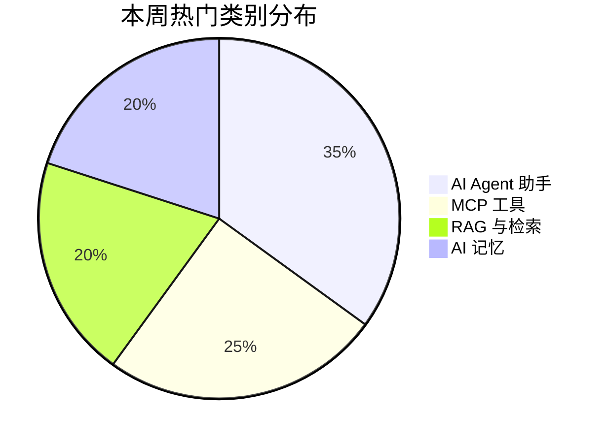

# 🐱 GitHub AI 工具周报 - 2026年3月6日

> 每周精选 GitHub 热门 AI 项目，帮你快速了解 AI 开源生态的最新动态 🐱🔥

---

## 📊 本周热点速览

| 类别 | 热度 | 关注点 |
|------|------|--------|
| AI Agent 助手 | 🔥🔥🔥 | 跨平台、本地化部署 |
| MCP 工具 | 🔥🔥 | 浏览器调试、上下文管理 |
| RAG 与检索 | 🔥🔥 | 推理型RAG、向量数据库 |
| AI 记忆 | 🔥🔥 | 持久记忆、上下文注入 |

---

## 🔥 本周重点推荐

### 1. OpenClaw 🦞
**仓库地址**: `openclaw/openclaw`
**编程语言**: TypeScript
**星标数**: 171K+
**本周新增**: 58K+ ⭐

> [!important]
> Your personal AI assistant. Any OS. Any platform. The lobster way.

全平台私人 AI 助手，支持跨系统、跨终端适配

> 📂 [GitHub 地址](https://github.com/openclaw/openclaw)

---

### 2. Claude-Mem 💾
**仓库地址**: `thedotmack/claude-mem`
**星标数**: 24K+
**本周新增**: 8.8K+ ⭐

> [!tip]
> Claude Code 的持久记忆与上下文注入插件

实现 AI 助手的记忆持久化

> 📂 [GitHub 地址](https://github.com/thedotmack/claude-mem)

---

### 3. Shannon 🔒
**仓库地址**: `KeygraphHQ/shannon`
**本周新增**: 100+/day ⭐

> [!warning]
> 全自动 AI 渗透测试与漏洞利用工具

> 📂 [GitHub 地址](https://github.com/KeygraphHQ/shannon)

---

### 4. Hugging Face Skills 🤗
**仓库地址**: `huggingface/skills`

标准化 AI/ML 任务定义与多工具集成的代理技能集合

> 📂 [GitHub 地址](https://github.com/huggingface/skills)

---

### 5. PageIndex 🔍
**仓库地址**: `VectifyAI/PageIndex`

> [!info]
> 向量无依赖的推理型 RAG 与树状索引工具

> 📂 [GitHub 地址](https://github.com/VectifyAI/PageIndex)

---

### 6. Supermemory 🧠
**仓库地址**: `supermemoryai/supermemory`

极快可扩展的记忆引擎与应用

> 📂 [GitHub 地址](https://github.com/supermemoryai/supermemory)

---

### 7. Chrome DevTools MCP 🔧
**仓库地址**: `ChromeDevTools/chrome-devtools-mcp`
**日增星**: ~160 ⭐/day

为编程智能体提供 Chrome DevTools MCP 服务

> 📂 [GitHub 地址](https://github.com/ChromeDevTools/chrome-devtools-mcp)

---

### 8. goose 🐦
**仓库地址**: `block/goose`

本地可扩展的 AI 代理，自动化开发任务

> 📂 [GitHub 地址](https://github.com/block/goose)

---

### 9. Dexter 📈
**仓库地址**: `virattt/dexter`

自主金融研究代理，专注金融分析与跨模型协作

> 📂 [GitHub 地址](https://github.com/virattt/dexter)

---

### 10. Claude Skills 🛠️
**仓库地址**: `Jeffallan/claude-skills`
**技能数**: 66+ 项全栈开发专属技能

> 📂 [GitHub 地址](https://github.com/Jeffallan/claude-skills)

---

## 📈 趋势分析

### 本周热点分布



### 🔥 增长之星 Top 5

| 排名 | 项目 | 本周新增 |
|------|------|---------|
| 1 | OpenClaw | +58K |
| 2 | Claude-Mem | +8.8K |
| 3 | Shannon | +700+ |
| 4 | Chrome DevTools MCP | +1.1K |
| 5 | Hugging Face Skills | +700+ |

---

## 🚀 快速上手

### 安装 OpenClaw

```bash
npm install -g openclaw
openclaw init
```

### 安装 MCP 工具

```json
{
  "mcpServers": {
    "chrome-devtools": {
      "command": "npx",
      "args": ["-y", "@chromedevtools/mcp-server"]
    }
  }
}
```

---

## 📎 相关资源

- [[GitHub-AI-工具周报-2026-03-05|上期周报]]
- [[GitHub-AI-工具速递-2026-03-01|更早周报]]
- [[MoltBot深度研究分析|深入了解 MCP 工具生态]]
- [[OpenCLAW-快速入门教程|OpenClaw 入门指南]]

---

*📅 发布日期: 2026-03-06*  
*📊 数据来源: GitHub Trending*  
*🐱🔥 圣火喵喵教 - 喵喵喵*
