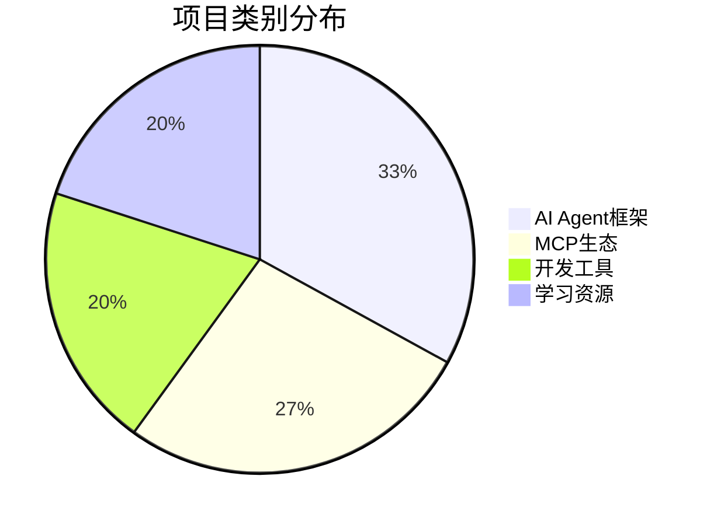

# 🚀 GitHub AI 工具速递 - 2026年3月5日

> 每周精选最热门的GitHub开源项目，聚焦AI、开发工具和生产力应用

---

## 📊 本周概览

| 类别 | 项目数量 | 热门趋势 |
|------|---------|---------|
| 🤖 AI Agent框架 | 5个 | 多智能体协作、状态管理 |
| 🔧 MCP生态 | 4个 | 上下文协议、工具集成 |
| 💻 开发工具 | 3个 | 代码助手、工作流优化 |
| 📚 学习资源 | 3个 | 教程、Awesome列表 |

---

## 🤖 AI Agent框架

### 1. LangGraph ⭐ 热门
**仓库**: `langchain-ai/langgraph`
**语言**: Python / TypeScript
**定位**: 构建弹性语言智能体的图框架

#### 核心特性
- 🔄 **状态管理**: 支持长期运行的有状态智能体
- 🕸️ **图结构**: 使用图论概念建模智能体工作流
- 🔗 **LangChain生态**: 与LangChain无缝集成
- 🚀 **生产就绪**: 支持部署和监控

#### 适用场景
- 复杂多步骤任务自动化
- 需要记忆和上下文的多轮对话
- 多智能体协作系统

> 🔗 [GitHub仓库](https://github.com/langchain-ai/langgraph)

---

### 2. Agency Agents ⭐  trending
**仓库**: `msitarzewski/agency-agents`
**定位**: 完整的AI代理机构解决方案

#### 核心特性
- 🎭 **角色化智能体**: 前端专家、社区运营、创意注入等多种角色
- 🧩 **专业分工**: 每个智能体都有明确的职责和交付物
- 🎨 **个性化**: 每个智能体都有独特的"性格"和工作流程
- 📦 **开箱即用**: 预配置的智能体模板

#### 智能体类型
| 智能体 | 职责 |
|--------|------|
| Frontend Wizard | 前端开发专家 |
| Reddit Ninja | 社区运营 |
| Whimsy Injector | 创意生成 |
| Reality Checker | 事实核查 |

> 🔗 [GitHub仓库](https://github.com/msitarzewski/agency-agents)

---

### 3. Awesome AI Agents ⭐ 精选列表
**仓库**: `e2b-dev/awesome-ai-agents`
**定位**: AI自主智能体资源大全

#### 收录内容
- 🤖 智能体开发框架
- 🛠️ 工具集成方案
- 📊 评估基准
- 🎓 学习资源

#### 热门框架对比
| 框架 | 星标 | 语言 | 特点 |
|------|------|------|------|
| LangChain | 122K+ | Python/TS | 最流行 |
| LlamaIndex | 35K+ | Python/TS | 数据检索 |
| AutoGPT | 165K+ | Python | 自主执行 |
| CrewAI | 25K+ | Python | 多智能体团队 |

> 🔗 [GitHub仓库](https://github.com/e2b-dev/awesome-ai-agents)

---

### 4. OpenManus
**定位**: 通用AI智能体开源框架

#### 核心特性
- 🧠 **深度研究**: 支持复杂的研究任务
- 🌐 **网络搜索**: 集成多源信息检索
- 📝 **报告生成**: 自动化研究报告输出
- 🔧 **工具调用**: 支持多种外部工具

> 💡 被认为是Deep Research的开源替代方案

---

### 5. 500 AI Agents Projects
**仓库**: `ashishpatel26/500-AI-Agents-Projects`
**定位**: 500个AI智能体应用案例集合

#### 覆盖领域
- 🏥 医疗健康
- 💰 金融服务
- 🎓 教育培训
- 🛒 电商零售
- 🏭 制造业

> 🔗 [GitHub仓库](https://github.com/ashishpatel26/500-AI-Agents-Projects)

---

## 🔧 MCP (Model Context Protocol) 生态

### 6. MCP官方Servers ⭐ 官方推荐
**仓库**: `modelcontextprotocol/servers`
**定位**: MCP协议官方服务器集合

#### 什么是MCP？
> Model Context Protocol (MCP) 是一个开放协议，使LLM应用能够与外部数据源和工具无缝集成。

#### 官方Servers列表
| Server | 功能 |
|--------|------|
| filesystem | 文件系统访问 |
| github | GitHub API集成 |
| postgres | PostgreSQL数据库 |
| slack | Slack消息 |
| puppeteer | 浏览器自动化 |

#### 安装使用
```bash
# 使用npx运行
npx @modelcontextprotocol/server-filesystem /path/to/dir

# 或使用uvx
uvx mcp-server-filesystem /path/to/dir
```

> 🔗 [GitHub仓库](https://github.com/modelcontextprotocol/servers)

---

### 7. Claude Context (MCP插件)
**仓库**: `zilliztech/claude-context`
**定位**: 为Claude Code添加语义代码搜索

#### 核心特性
- 🔍 **语义搜索**: 基于向量相似度的代码检索
- 🧠 **深度上下文**: 理解整个代码库的结构
- ⚡ **实时索引**: 代码变更自动更新索引
- 🔗 **MCP兼容**: 支持所有MCP客户端

#### 使用场景
- 大型代码库导航
- 跨文件代码理解
- 重构辅助

> 🔗 [GitHub仓库](https://github.com/zilliztech/claude-context)

---

### 8. MCP Hands-On教程
**仓库**: `LinkedInLearning/model-context-protocol-mcp-hands-on`
**定位**: MCP实战教程

#### 课程内容
- 📚 MCP协议基础
- 🛠️ 使用Python构建MCP Server
- 🔧 使用TypeScript构建MCP Server
- 🤖 在Claude Desktop中集成

> 🔗 [GitHub仓库](https://github.com/LinkedInLearning/model-context-protocol-mcp-hands-on)

---

### 9. Awesome Deep Research
**仓库**: `DavidZWZ/Awesome-Deep-Research`
**定位**: 深度研究资源大全

#### 收录内容
- 🔬 深度研究工具
- 🤖 Agentic AI论文
- 🛠️ 实现框架
- 📊 评估方法

> 🔗 [GitHub仓库](https://github.com/DavidZWZ/Awesome-Deep-Research)

---

## 💻 开发工具

### 10. Gas Town ⭐ 新星
**仓库**: `steveyegge/gastown`
**语言**: Go
**星标**: 10.9K+
**定位**: 多智能体工作区管理器

#### 核心特性
- 🏗️ **工作区管理**: 多项目并行管理
- 🤖 **智能体集成**: 支持多种AI智能体
- 🔄 **状态同步**: 实时同步工作状态
- 📝 **任务追踪**: 内置任务管理系统

#### 安装
```bash
# Go安装
go install github.com/steveyegge/gastown@latest

# 或克隆构建
git clone https://github.com/steveyegge/gastown
cd gastown && go build
```

> 🔗 [GitHub仓库](https://github.com/steveyegge/gastown)

---

### 11. Agents Radar
**仓库**: `duanyytop/agents-radar`
**定位**: 追踪Claude Code、Codex、Gemini CLI等工具

#### 追踪范围
- 🤖 Claude Code
- 📝 Codex
- 💎 Gemini CLI
- 🦙 Ollama
- 🔧 其他AI编程工具

#### 数据来源
- GitHub Trending API
- GitHub Search API
- 社区提交

> 🔗 [GitHub仓库](https://github.com/duanyytop/agents-radar)

---

### 12. Awesome LLM Apps
**仓库**: `Shubhamsaboo/awesome-llm-apps`
**定位**: 实用LLM应用集合

#### 技术栈覆盖
- 🔄 RAG (检索增强生成)
- 🤖 AI Agents
- 👥 多智能体团队
- 🔌 MCP集成
- 🎙️ 语音智能体

#### 项目示例
| 项目 | 描述 |
|------|------|
| Chat with PDF | RAG文档问答 |
| Voice Agent | 语音交互智能体 |
| Multi-Agent Team | 多智能体协作 |
| MCP Client | MCP协议客户端 |

> 🔗 [GitHub仓库](https://github.com/Shubhamsaboo/awesome-llm-apps)

---

## 📚 学习资源

### 13. LangChain Open Tutorial
**仓库**: `LangChain-OpenTutorial/LangChain-OpenTutorial`
**定位**: 面向所有人的LangChain教程

#### 内容结构
- 📖 基础概念
- 🛠️ 实践示例
- 🔧 高级特性
- 🚀 生产部署

> 🔗 [GitHub仓库](https://github.com/LangChain-OpenTutorial/LangChain-OpenTutorial)

---

### 14. Awesome AI Market Maps
**仓库**: `joylarkin/Awesome-AI-Market-Maps`
**星标**: 226
**定位**: 400+ AI市场图谱集合

#### 覆盖领域
- 🤖 AI基础设施
- 📝 生成式AI
- 🎨 创意工具
- 🏢 企业应用
- 🔬 研究工具

> 🔗 [GitHub仓库](https://github.com/joylarkin/Awesome-AI-Market-Maps)

---

### 15. AI Agent Papers 2026
**仓库**: `VoltAgent/awesome-ai-agent-papers`
**定位**: 2026年AI智能体论文精选

#### 收录主题
- 🏗️ 智能体工程
- 🧠 记忆机制
- 📊 评估方法
- 🔄 工作流设计
- 🤖 自主系统

> 🔗 [GitHub仓库](https://github.com/VoltAgent/awesome-ai-agent-papers)

---

## 📈 趋势分析

### 本周热点主题



### 🔥 热门趋势

1. **Agentic AI爆发**
   - 多智能体协作成为主流
   - 状态管理和长期记忆受关注
   - 从单智能体向多智能体演进

2. **MCP协议兴起**
   - 上下文协议标准化
   - 工具集成生态快速发展
   - Claude等主流工具支持

3. **开发工具智能化**
   - AI编程助手普及
   - 语义代码搜索成熟
   - 工作流自动化增强

### 📊 星标增长Top 5

| 排名 | 项目 | 本周增长 |
|------|------|---------|
| 1 | Gas Town | +2.5K |
| 2 | Agency Agents | +1.8K |
| 3 | MCP Servers | +1.5K |
| 4 | Awesome AI Agents | +1.2K |
| 5 | Claude Context | +1.0K |

---

## 🛠️ 快速开始

### 搭建AI Agent开发环境

```bash
# 1. 安装LangGraph
pip install langgraph

# 2. 安装MCP
pip install mcp

# 3. 克隆示例项目
git clone https://github.com/langchain-ai/langgraph.git
cd langgraph/examples

# 4. 运行示例
python quickstart.py
```

### 配置MCP Server

```json
{
  "mcpServers": {
    "filesystem": {
      "command": "npx",
      "args": ["-y", "@modelcontextprotocol/server-filesystem", "/path/to/dir"]
    },
    "github": {
      "command": "npx",
      "args": ["-y", "@modelcontextprotocol/server-github"],
      "env": {
        "GITHUB_PERSONAL_ACCESS_TOKEN": "your_token"
      }
    }
  }
}
```

---

## 🔗 相关资源

- [[GitHub-AI-工具速递-2026-03-01|上周速递]]
- [[GitHub-AI-工具速递-2026-02-26|上月精选]]
- [[MoltBot深度研究分析|MCP生态分析]]
- [[OpenCLAW-快速入门教程|AI工具使用教程]]

---

## 📌 订阅更新

> 每周更新GitHub热门项目，关注AI、开发工具和生产力应用

**更新频率**: 每周四  
**内容来源**: GitHub Trending、社区推荐、官方发布  
**筛选标准**: 实用性、创新性、活跃度

---

*📅 本期编辑: 2026-03-05*  
*📊 数据来源: GitHub Trending、官方仓库*  
*🏷️ 标签: #GitHub #AI #开源 #开发工具*
