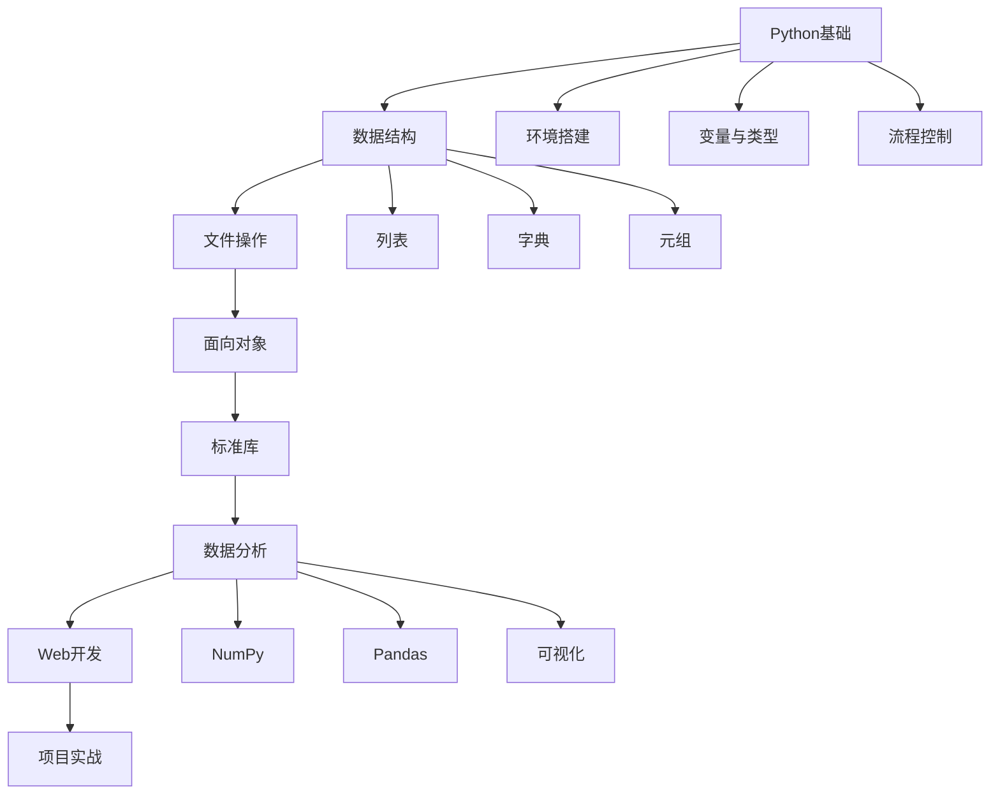

---
tags:
  - Python
  - 编程教程
  - 零基础
  - 2026新版
created: 2026-02-18
updated: 2026-02-18
version: "2026 Edition"
source: 综合整理
---

# 🐍 Python零基础教程 2026新版

> [!info] 教程说明
> 本教程基于 **Python 3.12/3.13** 最新版本编写，采用Obsidian友好格式，包含完整的代码示例和实践练习。适合完全没有编程经验的初学者。

---

## 📋 学习路线图



---

## 🌱 第一阶段：基础语法

### 第1章：Python环境搭建与第一个程序

#### 1.1 Python是什么？

> [!abstract] Python简介
> Python是一种**高级编程语言**，由Guido van Rossum于1991年创建。它以简洁、易读的语法著称，被广泛应用于：
> - 📊 数据分析与科学计算
> - 🌐 Web开发
> - 🤖 人工智能与机器学习
> - 🔄 自动化运维
> - 🎮 游戏开发

#### 1.2 安装Python 3.12/3.13

> [!warning] 版本选择
> 本教程基于 **Python 3.12+** 编写，建议使用最新稳定版本。

**Windows安装步骤：**

1. 访问 [[https://www.python.org/downloads/|Python官网]]
2. 下载 **Python 3.12.x** 或 **3.13.x**
3. 运行安装程序，**务必勾选 "Add Python to PATH"**
4. 选择 "Install Now" 完成安装

**验证安装：**

```bash
# 打开命令提示符，输入：
python --version
# 应显示：Python 3.12.x 或更高版本
```

#### 1.3 选择代码编辑器

| 编辑器 | 特点 | 推荐指数 |
|--------|------|----------|
| [[VS Code]] | 轻量、插件丰富、免费 | ⭐⭐⭐⭐⭐ |
| [[PyCharm]] | 专业Python IDE、功能强大 | ⭐⭐⭐⭐⭐ |
| [[Jupyter Notebook]] | 交互式编程、适合数据分析 | ⭐⭐⭐⭐ |

#### 1.4 第一个Python程序

```python
# hello.py - 你的第一个Python程序
print("Hello, Python世界！🎉")
print("欢迎开始编程学习之旅！")

# 计算简单的数学题
result = 3 + 5
print(f"3 + 5 = {result}")
```

**运行方法：**

```bash
# 在命令行中运行
python hello.py
```

> [!tip] 输出结果
> ```
> Hello, Python世界！🎉
> 欢迎开始编程学习之旅！
> 3 + 5 = 8
> ```

#### 1.5 Python交互式解释器

```bash
# 在命令行输入 python 进入交互模式
$ python
Python 3.12.0 (main, Oct  2 2023, 12:00:00)
Type "help", "copyright", "credits" or "license" for more information.
>>> print("Hello!")
Hello!
>>> 2 + 3
5
>>> exit()  # 退出交互模式
```

---

### 第2章：变量、数据类型与运算符

#### 2.1 变量：数据的"容器"

> [!note] 变量概念
> 变量就像贴有标签的储物盒，用来存储各种数据。在Python中，创建变量非常简单——只需要给变量起个名字，然后用等号 `=` 给它赋值。

```python
# 创建变量并赋值
name = "小明"          # 字符串（文本）
age = 18              # 整数
height = 1.75         # 浮点数（小数）
is_student = True     # 布尔值（真/假）

print(name)           # 输出：小明
print(age)            # 输出：18
```

#### 2.2 变量命名规则

> [!warning] 命名规范
> - ✅ 可以包含字母、数字和下划线
> - ✅ 不能以数字开头
> - ❌ 不能使用Python关键字（如 `print`、`if`、`for`）
> - ✅ 建议使用有意义的英文单词

```python
# ✅ 好的命名
user_name = "张三"
student_age = 20
max_score = 100

# ❌ 不好的命名
x = "张三"      # 太简短，含义不明
name2 = "李四"  # 数字结尾不够清晰
```

#### 2.3 基本数据类型

| 类型 | 英文 | 示例 | 说明 |
|------|------|------|------|
| 整数 | `int` | `42`, `-10`, `0` | 没有小数部分的数字 |
| 浮点数 | `float` | `3.14`, `-0.5` | 带小数点的数字 |
| 字符串 | `str` | `"Hello"`, `'Python'` | 文本数据 |
| 布尔值 | `bool` | `True`, `False` | 真或假 |

```python
# 查看数据类型
type(42)        # <class 'int'>
type(3.14)      # <class 'float'>
type("Hello")   # <class 'str'>
type(True)      # <class 'bool'>
```

#### 2.4 字符串操作

```python
# 字符串创建
message = "欢迎学习Python"
name = '李华'

# 字符串拼接
greeting = "你好，" + name + "！"
print(greeting)         # 输出：你好，李华！

# f-string格式化（Python 3.6+ 推荐方式）
age = 20
greeting2 = f"你好，{name}！你今年{age}岁。"
print(greeting2)        # 输出：你好，李华！你今年20岁。

# 字符串方法
print(len(message))           # 获取长度：7
print(message.upper())        # 转大写：欢迎学习PYTHON
print(message.replace("Python", "Java"))  # 替换：欢迎学习Java
```

#### 2.5 基础数学运算

```python
a = 10
b = 3

print(a + b)    # 加法：13
print(a - b)    # 减法：7
print(a * b)    # 乘法：30
print(a / b)    # 除法：3.333...
print(a // b)   # 整除：3（去掉小数部分）
print(a % b)    # 取余：1（10除以3余1）
print(a ** b)   # 幂运算：1000（10的3次方）
```

#### 2.6 数据类型转换

```python
# 字符串转数字
number_str = "123"
real_number = int(number_str)
print(real_number + 7)         # 输出：130

# 数字转字符串
age = 20
age_str = str(age)
print("我今年" + age_str + "岁")  # 输出：我今年20岁

# 浮点数转整数（会去掉小数部分）
pi = 3.14
int_pi = int(pi)
print(int_pi)                  # 输出：3
```

---

### 第3章：流程控制

#### 3.1 条件判断：if语句

> [!note] 条件判断
> 条件判断让程序能够根据不同情况执行不同的代码，就像生活中的"如果...那么..."逻辑。

```python
# 基本if语句
age = 18
if age >= 18:
    print("你已经成年了！")

# if-else结构
score = 85
if score >= 60:
    print("恭喜，考试及格！")
else:
    print("很遗憾，需要补考")

# if-elif-else：多条件判断
temperature = 25
if temperature > 30:
    print("天气炎热")
elif temperature > 20:
    print("天气舒适")
elif temperature > 10:
    print("天气凉爽")
else:
    print("天气寒冷")
```

#### 3.2 逻辑运算符

```python
age = 20
has_id = True

# and：两个条件都满足
if age >= 18 and has_id:
    print("可以进入酒吧")

# or：满足其中一个条件
score = 75
if score >= 90 or score < 60:
    print("成绩优秀或需要补考")

# not：取反
is_raining = False
if not is_raining:
    print("天气晴朗，适合外出")
```

#### 3.3 for循环

```python
# 遍历列表
fruits = ["苹果", "香蕉", "橙子"]
for fruit in fruits:
    print(f"我喜欢吃{fruit}")

# 使用range()生成数字序列
for i in range(5):  # 生成0,1,2,3,4
    print(f"这是第{i+1}次循环")

# 遍历字符串
message = "Hello"
for char in message:
    print(char)
```

#### 3.4 while循环

```python
# 基本while循环
count = 0
while count < 5:
    print(f"计数：{count}")
    count += 1  # 重要：更新计数器

# 用户输入验证
password = ""
while password != "123456":
    password = input("请输入密码：")
print("密码正确！")
```

#### 3.5 循环控制：break和continue

```python
# break：提前退出循环
for i in range(10):
    if i == 5:
        break  # 当i等于5时退出循环
    print(i)   # 输出：0, 1, 2, 3, 4

# continue：跳过当前迭代
for i in range(10):
    if i % 2 == 0:  # 如果是偶数
        continue    # 跳过这次循环
    print(i)        # 只打印奇数：1, 3, 5, 7, 9
```

#### 3.6 嵌套结构

```python
# 打印乘法表
for i in range(1, 4):
    for j in range(1, 4):
        print(f"{i} × {j} = {i*j}", end="\t")
    print()  # 换行
```

> [!tip] 输出结果
> ```
> 1 × 1 = 1	1 × 2 = 2	1 × 3 = 3	
> 2 × 1 = 2	2 × 2 = 4	2 × 3 = 6	
> 3 × 1 = 3	3 × 2 = 6	3 × 3 = 9	
> ```

---

## 💾 第二阶段：数据结构与文件操作

### 第4章：函数与模块化编程

#### 4.1 什么是函数？

> [!abstract] 函数概念
> 函数就像是一个"代码盒子"，你把一些指令放进去，给它起个名字，以后需要执行这些指令时，只需要喊它的名字就行了。

**为什么要用函数？**

- 避免重复：相同的代码不用写很多遍
- 方便维护：修改时只需改函数内部
- 提高可读性：给功能起个好名字

#### 4.2 定义函数

```python
# 定义一个简单的打招呼函数
def say_hello():
    """这是一个打招呼的函数"""
    print("你好！")
    print("欢迎学习Python函数！")

# 调用函数
say_hello()
```

#### 4.3 带参数的函数

```python
# 带参数的函数
def greet(name, time):
    """根据时间和姓名打招呼"""
    print(f"{time}好，{name}！")

# 调用时传入参数
greet("小明", "早上")
greet("小红", "下午")
```

#### 4.4 有返回值的函数

```python
# 计算两个数的和
def add_numbers(a, b):
    """计算两个数的和"""
    result = a + b
    return result  # 返回计算结果

# 调用函数并保存返回值
sum_result = add_numbers(5, 3)
print(f"5 + 3 = {sum_result}")

# 直接在表达式中使用
total = add_numbers(10, 20) + 5
print(f"10 + 20 + 5 = {total}")
```

#### 4.5 默认参数值

```python
def introduce(name, age=18, city="北京"):
    """自我介绍函数，年龄和城市有默认值"""
    print(f"我叫{name}，今年{age}岁，来自{city}")

# 多种调用方式
introduce("张三")                    # 只传必填参数
introduce("李四", 25)               # 传两个参数
introduce("王五", 30, "上海")        # 传所有参数
```

#### 4.6 模块化编程

```python
# grade_calculator.py - 成绩计算模块
def calculate_grade(score):
    """根据分数返回等级"""
    if score >= 90:
        return "优秀"
    elif score >= 80:
        return "良好"
    elif score >= 70:
        return "中等"
    elif score >= 60:
        return "及格"
    else:
        return "不及格"

def get_average(scores):
    """计算平均分"""
    return sum(scores) / len(scores)
```

```python
# main.py - 主程序
from grade_calculator import calculate_grade, get_average

# 使用导入的函数
scores = [85, 92, 78, 90]
average = get_average(scores)
print(f"平均分：{average:.2f}")

for score in scores:
    grade = calculate_grade(score)
    print(f"成绩{score}：{grade}")
```

---

### 第5章：列表、元组与字典

#### 5.1 列表（List）

> [!note] 列表特点
> - 用方括号 `[]` 表示
> - 可以存储任意类型的数据
> - **可变**：可以添加、删除、修改元素
> - **有序**：元素有固定的顺序

```python
# 创建列表
fruits = ["苹果", "香蕉", "橙子", "葡萄"]
numbers = [1, 2, 3, 4, 5]
mixed = [1, "hello", 3.14, True]  # 可以混合不同类型

# 访问元素（索引从0开始）
print(fruits[0])   # 输出：苹果
print(fruits[-1])  # 输出：葡萄（倒数第一个）

# 修改元素
fruits[1] = "芒果"
print(fruits)  # 输出：['苹果', '芒果', '橙子', '葡萄']

# 添加元素
fruits.append("西瓜")      # 在末尾添加
fruits.insert(1, "梨")     # 在指定位置插入

# 删除元素
fruits.remove("橙子")      # 删除指定元素
popped = fruits.pop()      # 删除并返回最后一个元素
```

**列表切片：**

```python
numbers = [0, 1, 2, 3, 4, 5, 6, 7, 8, 9]

print(numbers[2:5])    # [2, 3, 4]（索引2到4）
print(numbers[:3])     # [0, 1, 2]（从开始到索引2）
print(numbers[6:])     # [6, 7, 8, 9]（从索引6到最后）
print(numbers[::2])    # [0, 2, 4, 6, 8]（每隔一个取一个）
```

#### 5.2 元组（Tuple）

> [!note] 元组特点
> - 用圆括号 `()` 表示
> - **不可变**：一旦创建就不能修改
> - 适合存储不希望被改变的数据

```python
# 创建元组
colors = ("红色", "绿色", "蓝色")
coordinates = (30.5, 120.3)

print(colors[0])    # 输出：红色
print(len(colors))  # 输出：3

# 元组解包（很实用的特性）
name, age, city = ("张三", 25, "北京")
print(f"姓名：{name}，年龄：{age}，城市：{city}")

# 单个元素的元组（注意逗号）
single_tuple = (42,)  # 必须有逗号
```

#### 5.3 字典（Dictionary）

> [!note] 字典特点
> - 用花括号 `{}` 表示
> - 存储**键值对**（key-value pairs）
> - 通过键来快速查找值

```python
# 创建字典
student = {
    "姓名": "李四",
    "年龄": 20,
    "专业": "计算机科学",
    "成绩": 85.5
}

# 访问值
print(student["姓名"])        # 输出：李四
print(student.get("年龄"))    # 输出：20

# 添加/修改元素
student["班级"] = "二班"      # 添加新键值对
student["成绩"] = 88.0       # 修改已有值

# 删除元素
del student["专业"]
age = student.pop("年龄")

# 遍历字典
for key, value in student.items():
    print(f"{key}: {value}")
```

#### 5.4 三种数据结构对比

| 特性 | 列表（List） | 元组（Tuple） | 字典（Dictionary） |
|------|-------------|---------------|-------------------|
| 可变性 | ✅ 可变 | ❌ 不可变 | ✅ 可变 |
| 有序性 | ✅ 有序 | ✅ 有序 | ✅ 有序（Python 3.7+） |
| 语法 | `[元素1, 元素2]` | `(元素1, 元素2)` | `{键1: 值1, 键2: 值2}` |
| 适用场景 | 需要修改的数据 | 不希望修改的数据 | 键值对映射关系 |

---

### 第6章：文件读写与异常处理

#### 6.1 为什么需要文件操作？

> [!abstract] 文件操作的意义
> - **持久化保存**：将数据保存到硬盘，程序结束后数据不会消失
> - **数据交换**：与其他程序共享数据
> - **配置管理**：读取配置文件

#### 6.2 基础文件操作

```python
# 读取整个文件
with open("日记.txt", "r", encoding="utf-8") as f:
    content = f.read()
print(f"文件内容：{content}")

# 逐行读取
with open("日记.txt", "r", encoding="utf-8") as f:
    for line in f:
        print(f"行内容：{line.strip()}")

# 写入文件
with open("学习笔记.txt", "w", encoding="utf-8") as f:
    f.write("Python文件操作学习笔记\n")
    f.write("第一点：使用with语句安全操作文件\n")

# 追加写入
with open("学习笔记.txt", "a", encoding="utf-8") as f:
    f.write("追加内容：文件模式'a'表示追加\n")
```

#### 6.3 异常处理

```python
try:
    # 可能出错的代码
    with open("不存在的文件.txt", "r") as f:
        content = f.read()
        
except FileNotFoundError:
    print("错误：文件不存在！")
    
except PermissionError:
    print("错误：没有读取权限！")
    
except Exception as e:
    print(f"发生未知错误：{e}")
    
else:
    print("文件读取成功！")
    
finally:
    print("文件操作结束")
```

#### 6.4 JSON文件处理

```python
import json

# 字典转JSON
data = {
    "students": ["张三", "李四"],
    "scores": [85, 92]
}

with open("data.json", "w", encoding="utf-8") as f:
    json.dump(data, f, ensure_ascii=False, indent=2)

# 从JSON文件读取
with open("data.json", "r", encoding="utf-8") as f:
    loaded_data = json.load(f)
    
print(f"加载的数据：{loaded_data}")
```

---

## 🧱 第三阶段：面向对象与标准库

### 第7章：面向对象编程基础

#### 7.1 类与对象的概念

> [!abstract] 面向对象编程（OOP）
> 将相关的数据和功能封装在一起，模拟现实世界中的事物。

```python
# 定义一个学生类
class Student:
    # 初始化方法：创建对象时自动调用
    def __init__(self, name, score):
        self.name = name      # 属性：姓名
        self.score = score    # 属性：成绩
    
    # 方法：学生的行为
    def get_grade(self):
        if self.score >= 90:
            return "优秀"
        elif self.score >= 60:
            return "及格"
        else:
            return "不及格"
    
    def study(self, hours):
        self.score += hours * 0.5
        return f"{self.name}学习了{hours}小时，当前成绩：{self.score}"

# 创建对象
student1 = Student("张三", 85)
student2 = Student("李四", 92)

print(student1.name)          # 输出：张三
print(student2.get_grade())   # 输出：优秀
```

#### 7.2 封装、继承、多态

```python
# 继承示例
class Person:
    def __init__(self, name, age):
        self.name = name
        self.age = age
    
    def introduce(self):
        return f"我叫{self.name}，今年{self.age}岁"

class Student(Person):
    def __init__(self, name, age, student_id):
        super().__init__(name, age)
        self.student_id = student_id
    
    def study(self):
        return f"{self.name}正在学习"

# 使用继承
student = Student("小明", 18, "2023001")
print(student.introduce())  # 继承自Person的方法
print(student.study())      # Student特有的方法
```

---

### 第8章：常用标准库

#### 8.1 datetime - 日期时间处理

```python
from datetime import datetime, timedelta

# 获取当前时间
now = datetime.now()
print(f"当前时间：{now}")

# 格式化日期
formatted = now.strftime("%Y-%m-%d %H:%M:%S")
print(f"格式化时间：{formatted}")

# 计算时间差
future = now + timedelta(days=7)
print(f"7天后：{future}")
```

#### 8.2 random - 随机数生成

```python
import random

# 生成随机整数
lottery = random.randint(1, 100)
print(f"中奖号码：{lottery}")

# 从列表中随机选择
questions = ["Python是什么？", "列表和元组的区别？"]
selected = random.choice(questions)
print(f"随机问题：{selected}")

# 打乱顺序
cards = ["红桃A", "黑桃K", "方块Q"]
random.shuffle(cards)
print(f"洗牌后：{cards}")
```

#### 8.3 os - 操作系统交互

```python
import os

# 检查文件是否存在
if os.path.exists("students.csv"):
    print("文件存在")

# 获取当前目录
current_dir = os.getcwd()
print(f"当前目录：{current_dir}")

# 创建目录
if not os.path.exists("backup"):
    os.makedirs("backup")
```

---

### 第9章：虚拟环境与包管理

#### 9.1 为什么需要虚拟环境？

> [!note] 虚拟环境的作用
> 每个项目都有自己的独立环境，避免不同项目之间的依赖冲突。

#### 9.2 创建和使用虚拟环境

```bash
# 创建虚拟环境
python -m venv myenv

# 激活虚拟环境（Windows）
myenv\Scripts\activate

# 激活虚拟环境（Mac/Linux）
source myenv/bin/activate

# 退出虚拟环境
deactivate
```

#### 9.3 pip包管理

```bash
# 安装包
pip install requests
pip install pandas==2.0.3

# 查看已安装的包
pip list

# 生成requirements.txt
pip freeze > requirements.txt

# 从requirements.txt安装
pip install -r requirements.txt
```

---

## 📊 第四阶段：数据分析

### 第10章：NumPy数值计算

#### 10.1 NumPy简介

> [!abstract] NumPy
> Python科学计算的基础库，提供高性能的多维数组对象。

```python
import numpy as np

# 创建数组
arr1 = np.array([1, 2, 3, 4, 5])
zeros = np.zeros(5)
ones = np.ones((3, 3))
range_arr = np.arange(0, 10, 2)

print(f"数组：{arr1}")
print(f"全零数组：{zeros}")
```

#### 10.2 数组运算

```python
a = np.array([1, 2, 3, 4])
b = np.array([5, 6, 7, 8])

print(a + b)      # [ 6  8 10 12]
print(a * b)      # [ 5 12 21 32]
print(a * 2)      # [2 4 6 8]
print(a > 2)      # [False False  True  True]
```

#### 10.3 统计函数

```python
data = np.array([85, 92, 78, 96, 88, 91])

print(f"平均值：{np.mean(data)}")
print(f"中位数：{np.median(data)}")
print(f"标准差：{np.std(data)}")
print(f"最大值：{np.max(data)}")
print(f"最小值：{np.min(data)}")
```

---

### 第11章：Pandas数据处理

#### 11.1 Pandas简介

```python
import pandas as pd

# 创建DataFrame
data = {
    '姓名': ['张三', '李四', '王五'],
    '年龄': [25, 30, 35],
    '薪资': [8000, 12000, 15000]
}

df = pd.DataFrame(data)
print(df)
```

#### 11.2 数据选择与筛选

```python
# 选择列
ages = df['年龄']

# 选择多列
subset = df[['姓名', '薪资']]

# 条件筛选
high_salary = df[df['薪资'] > 10000]
beijing_employees = df[df['城市'] == '北京']
```

#### 11.3 文件读写

```python
# 保存为CSV
df.to_csv('员工数据.csv', index=False, encoding='utf-8-sig')

# 读取CSV
new_df = pd.read_csv('员工数据.csv')
```

---

### 第12章：数据可视化

#### 12.1 Matplotlib基础

```python
import matplotlib.pyplot as plt
import numpy as np

# 折线图
x = np.linspace(0, 10, 100)
y = np.sin(x)

plt.figure(figsize=(10, 6))
plt.plot(x, y, label='正弦曲线')
plt.title('正弦函数图像')
plt.xlabel('X轴')
plt.ylabel('Y轴')
plt.legend()
plt.grid(True)
plt.show()
```

#### 12.2 多种图表类型

```python
# 柱状图
cities = ['北京', '上海', '广州', '深圳']
salaries = [8000, 12000, 15000, 10000]

plt.bar(cities, salaries)
plt.title('各城市平均薪资')
plt.show()

# 散点图
plt.scatter(df['年龄'], df['薪资'])
plt.title('年龄与薪资关系')
plt.show()
```

---

## 🌐 第五阶段：Web开发与自动化

### 第13章：Flask Web开发入门

#### 13.1 第一个Flask应用

```python
from flask import Flask

app = Flask(__name__)

@app.route('/')
def hello_world():
    return '<h1>Hello, Flask World! 🎉</h1>'

@app.route('/user/<name>')
def show_user(name):
    return f'<h2>欢迎, {name}! 👋</h2>'

if __name__ == '__main__':
    app.run(debug=True)
```

#### 13.2 模板渲染

```python
from flask import render_template

@app.route('/dashboard')
def dashboard():
    data_items = [
        {'name': '用户数', 'value': 150},
        {'name': '订单数', 'value': 89}
    ]
    return render_template('index.html', data_items=data_items)
```

---

### 第14章：自动化脚本

#### 14.1 文件操作自动化

```python
import os
import shutil
from datetime import datetime

# 批量重命名
def batch_rename(folder_path, old_ext, new_ext):
    for filename in os.listdir(folder_path):
        if filename.endswith(old_ext):
            name_part = filename.rsplit('.', 1)[0]
            new_filename = f"{name_part}.{new_ext}"
            os.rename(
                os.path.join(folder_path, filename),
                os.path.join(folder_path, new_filename)
            )

# 自动备份
def auto_backup(source_dir, backup_dir):
    timestamp = datetime.now().strftime("%Y%m%d_%H%M%S")
    backup_path = os.path.join(backup_dir, f"backup_{timestamp}")
    shutil.copytree(source_dir, backup_path)
    print(f"备份成功：{backup_path}")
```

---

### 第15章：网络请求与爬虫

#### 15.1 requests库基础

```python
import requests

# GET请求
response = requests.get('https://api.github.com/users/octocat')
data = response.json()
print(f"用户名：{data['login']}")

# 带参数的GET请求
params = {'key1': 'value1'}
response = requests.get('https://httpbin.org/get', params=params)
```

#### 15.2 网页爬虫

```python
import requests
from bs4 import BeautifulSoup

url = 'https://example.com'
response = requests.get(url)
soup = BeautifulSoup(response.text, 'html.parser')

# 提取标题
title = soup.find('title')
print(f"页面标题：{title.text}")

# 提取所有段落
paragraphs = soup.find_all('p')
for p in paragraphs:
    print(p.text.strip())
```

---

## 🚀 第六阶段：项目实战与进阶

### 第16章：综合项目实战

#### 16.1 项目一：天气数据分析系统

```python
# 项目结构
# weather_analysis/
# ├── config.py
# ├── data_collector.py
# ├── data_analyzer.py
# ├── visualization.py
# └── main.py

# data_collector.py
import requests
import json

class WeatherCollector:
    def __init__(self, api_key):
        self.api_key = api_key
        self.base_url = "http://api.openweathermap.org/data/2.5/weather"
    
    def get_weather(self, city):
        params = {
            'q': city,
            'appid': self.api_key,
            'units': 'metric',
            'lang': 'zh_cn'
        }
        response = requests.get(self.base_url, params=params)
        return response.json()
```

#### 16.2 项目二：网站监控脚本

```python
import requests
import time
from datetime import datetime

class WebsiteMonitor:
    def __init__(self, urls):
        self.urls = urls
    
    def check_all(self):
        results = []
        for url in self.urls:
            try:
                start = time.time()
                response = requests.get(url, timeout=10)
                elapsed = time.time() - start
                results.append({
                    'url': url,
                    'status': response.status_code,
                    'time': f"{elapsed:.2f}s",
                    'timestamp': datetime.now().isoformat()
                })
            except Exception as e:
                results.append({
                    'url': url,
                    'status': 'Error',
                    'error': str(e)
                })
        return results
```

---

### 第17章：Python 3.12/3.13 新特性

#### 17.1 Python 3.12 新特性

> [!info] Python 3.12 亮点
> - **改进的错误消息**：更清晰的语法错误提示
> - **f-string优化**：支持更复杂的表达式
> - **性能提升**：整体性能提升约5-10%

```python
# Python 3.12 改进的错误提示
# 如果缩进错误，会提示具体的建议

# f-string支持更复杂的表达式
name = "Python"
version = 3.12
print(f"Welcome to {name} {version:.1f}!")

# 多行f-string
user = "Alice"
message = f"""
Hello, {user}!
Welcome to Python {version}.
Enjoy coding!
"""
```

#### 17.2 Python 3.13 新特性预览

```python
# 改进的REPL（交互式解释器）
# 支持颜色高亮和更好的自动补全

# 实验性JIT编译器（性能大幅提升）
# 需要在编译时启用

# 改进的异常处理
# 更清晰的异常链显示
```

---

### 第18章：进阶与扩展

#### 18.1 装饰器

```python
import time
from functools import wraps

def timer(func):
    @wraps(func)
    def wrapper(*args, **kwargs):
        start = time.time()
        result = func(*args, **kwargs)
        elapsed = time.time() - start
        print(f"{func.__name__} 执行时间: {elapsed:.2f}秒")
        return result
    return wrapper

@timer
def slow_function():
    time.sleep(1)
    return "Done"
```

#### 18.2 生成器

```python
# 生成器函数
def fibonacci(n):
    a, b = 0, 1
    for _ in range(n):
        yield a
        a, b = b, a + b

# 使用生成器
for num in fibonacci(10):
    print(num)
```

#### 18.3 异步编程

```python
import asyncio

async def say_hello():
    await asyncio.sleep(1)
    print("Hello!")

async def main():
    await asyncio.gather(
        say_hello(),
        say_hello(),
        say_hello()
    )

asyncio.run(main())
```

---

## 📚 附录

### A. 学习资源推荐

> [!tip] 推荐资源
> - **官方文档**：[[https://docs.python.org/zh-cn/3/|Python官方中文文档]]
> - **练习平台**：[[https://leetcode.cn/|LeetCode中国]]、[[https://www.kaggle.com/|Kaggle]]
> - **社区论坛**：[[https://stackoverflow.com/|Stack Overflow]]

### B. 常见错误速查

| 错误类型 | 原因 | 解决方案 |
|----------|------|----------|
| `SyntaxError` | 语法错误 | 检查冒号、缩进、括号 |
| `IndentationError` | 缩进错误 | 统一使用4个空格 |
| `NameError` | 变量未定义 | 检查变量名拼写 |
| `TypeError` | 类型错误 | 检查数据类型是否匹配 |
| `IndexError` | 索引越界 | 检查索引是否在有效范围 |
| `KeyError` | 字典键不存在 | 使用 `.get()` 方法 |
| `FileNotFoundError` | 文件不存在 | 检查文件路径 |

### C. Python关键字速查

```python
False      await      else       import     pass
None       break      except     in         raise
True       class      finally    is         return
and        continue   for        lambda     try
as         def        from       nonlocal   while
assert     del        global     not        with
async      elif       if         or         yield
```

---

> [!success] 恭喜你！
> 完成本教程后，你已经掌握了Python编程的核心技能。记住：
> - **多练习**：编程是实践的艺术
> - **不怕错**：每个错误都是学习机会
> - **持续学**：技术不断更新，保持好奇心

**下一步**：选择一个感兴趣的项目开始实践，在解决真实问题的过程中继续成长！🚀
