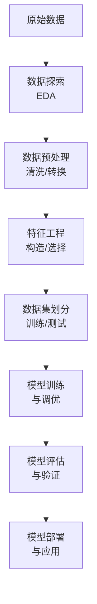

# Day 22：数据科学项目实战Ⅰ——数据预处理与特征工程

欢迎来到Python学习的第二十二天！今天我们将深入学习数据科学项目的核心环节——数据预处理与特征工程。数据预处理是机器学习项目的基石，而特征工程则是提升模型性能的关键。掌握这些技术将帮助你构建更高质量的AI模型。

## 📚 第一部分：核心理论讲解

### 1. 数据科学项目完整工作流

数据科学项目遵循一个标准化的流程，确保从原始数据到可靠模型的完整可追溯性。完整流程包含以下关键步骤：



### 2. 数据预处理：打造高质量数据基础

数据预处理是机器学习项目的基石，占比整个项目时间的60-80%。"垃圾进，垃圾出"（Garbage in, Garbage out）是数据科学界的金科玉律。

#### 2.1 数据清理（最高优先级）

**目标**：解决数据中的错误、缺失、重复、异常值问题，保证数据基础质量。

| 问题类型 | 处理方法 | Python代码示例 |
|---------|---------|---------------|
| **缺失值** | 删除或填充（均值、众数、插值） | `df = df.dropna(thresh=df.shape*0.5, axis=0)` |
| **重复值** | 去除完全相同的行 | `df = df.drop_duplicates()` |
| **异常值** | Z-Score、IQR法过滤或截断 | `df = df[(df['age'] > 0) & (df['age'] < 100)]` |

**最佳实践**：
- 缺失值超过60%的列可直接删除
- 重要特征的缺失值使用模型预测填充
- 异常值处理前先进行可视化分析

#### 2.2 数据转换（次优先级）

**目标**：将数据转换为模型可理解的格式，解决量纲、分布、类型问题。

**数值特征标准化**：
- **MinMaxScaler**：缩放到[0,1]区间，适合图像处理
- **StandardScaler**：均值为0，方差为1，适合SVM、逻辑回归
- **RobustScaler**：对异常值更鲁棒，使用中位数和四分位数

**类别特征编码**：
- **One-Hot编码**：适合无序类别（如颜色：红/蓝/绿）
- **Label Encoding**：适合有序类别（如学历：小学/中学/大学）
- **Target Encoding**：使用目标变量的统计信息，适合高基数类别

```python
# 数值标准化示例
from sklearn.preprocessing import StandardScaler
scaler = StandardScaler()
df[['age', 'income']] = scaler.fit_transform(df[['age', 'income']])

# 类别特征One-Hot编码示例
from sklearn.preprocessing import OneHotEncoder
encoder = OneHotEncoder(sparse_output=False, drop='first')
encoded_features = encoder.fit_transform(df[['city']])
```

#### 2.3 数据分割（最后一步）

**关键原则**：**先划分数据集，再进行预处理**，避免测试集信息污染。

```python
from sklearn.model_selection import train_test_split

# 先划分训练集和测试集
X_train, X_test, y_train, y_test = train_test_split(
    X, y, test_size=0.3, stratify=y, random_state=42
)

# 预处理只在训练集上计算参数
scaler.fit(X_train)  # 只在训练集上拟合
X_train_scaled = scaler.transform(X_train)
X_test_scaled = scaler.transform(X_test)  # 测试集使用相同的scaler
```

### 3. 特征工程：从数据中挖掘预测价值

特征工程是机器学习项目成败的关键，高质量特征能让模型性能提升10-50%。

#### 3.1 特征构造：基于业务逻辑创造新特征

**示例场景**：
- 电商数据：`客单价 = 订单总金额 / 购买次数`
- 金融风控：`负债收入比 = 总负债 / 年收入`
- 时间序列：`是否为周末 = 日期.dayofweek >= 5`

```python
# 特征构造示例
df['price_per_item'] = df['total_price'] / df['item_count']
df['income_age_ratio'] = df['income'] / df['age']
df['is_weekend'] = df['date'].dt.dayofweek.isin([5, 6]).astype(int)
```

#### 3.2 特征选择：去芜存菁，保留核心特征

**三种主要方法对比**：

| 方法类型 | 核心原理 | 适用场景 | 优缺点 |
|---------|---------|---------|--------|
| **过滤法** | 计算特征与目标的相关性 | 预处理阶段快速筛选 | 速度快，但未考虑特征交互 |
| **包裹法** | 基于模型性能选择特征 | 特征数适中时 | 效果好，但计算成本高 |
| **嵌入法** | 模型训练时自动选择特征 | 与具体模型绑定 | 平衡效果与效率 |

**实战代码示例**：
```python
# 过滤法：基于相关系数
corr_matrix = df.corr()
target_corr = corr_matrix['target'].abs().sort_values(ascending=False)
high_corr_features = target_corr[target_corr > 0.3].index.tolist()

# 包裹法：递归特征消除
from sklearn.feature_selection import RFE
from sklearn.ensemble import RandomForestClassifier
estimator = RandomForestClassifier(n_estimators=100, random_state=42)
selector = RFE(estimator, n_features_to_select=10)
X_selected = selector.fit_transform(X, y)

# 嵌入法：Lasso回归特征选择
from sklearn.linear_model import Lasso
lasso = Lasso(alpha=0.01)
lasso.fit(X_train, y_train)
selected_features = X.columns[lasso.coef_ != 0]
```

#### 3.3 降维处理：PCA主成分分析

当特征数量过多或存在多重共线性时，降维能显著提升模型效率和稳定性。

```python
from sklearn.decomposition import PCA
import matplotlib.pyplot as plt

# 应用PCA降维
pca = PCA(n_components=2)
X_pca = pca.fit_transform(X_scaled)

# 可视化主成分
plt.figure(figsize=(10, 6))
plt.scatter(X_pca[:, 0], X_pca[:, 1], c=y, cmap='viridis', alpha=0.7)
plt.xlabel(f'第一主成分（解释方差：{pca.explained_variance_ratio_[0]:.2%}）')
plt.ylabel(f'第二主成分（解释方差：{pca.explained_variance_ratio_[1]:.2%}）')
plt.title('PCA降维可视化')
plt.colorbar(label='目标变量')
plt.show()
```

## 📺 第二部分：视频资源推荐（2025-2026年最新）

### 1. 黑马程序员 - Python3机器学习快速入门
**链接**：https://m.py.cn/course/1093.html
**特点**：
- 49个章节，涵盖数据预处理完整流程
- 第2章专门讲解"数据集和数据处理"
- 包含数据预处理、标准化、归一化等核心内容
- 适合零基础学员，有大量实战案例

**核心章节**：
- 2.7 数据预处理-归一化
- 2.8 数据预处理-标准化
- 3.1-3.5 降维技术与特征选择

### 2. 莫烦Python - 有趣的机器学习系列
**链接**：https://mofanpy.com/tutorials/machine-learning/ML-intro/
**特点**：
- 系统讲解机器学习与特征工程
- 包含特征标准化、特征选择等技巧模块
- 理论与实践相结合，代码示例丰富
- 讲解生动易懂，适合零基础入门

**推荐模块**：
- 3.2 特征标准化（Feature Normalization）
- 3.3 选择好特征（Good Features）
- 2.9 神经网络梯度下降

### 3. B站优质数据科学教程
**搜索关键词**：
- "数据预处理实战 Python 2026"
- "特征工程完整教程 黑马程序员"
- "机器学习项目实战 零基础入门"

**推荐UP主**：
- 黑马程序员官方频道：系统化课程体系
- 莫烦Python：生动易懂的实战讲解
- 菜鸟教程官方：基础概念清晰

### 4. 实战项目资源
**Kaggle竞赛数据集**：
- Titanic：乘客生存预测（经典入门项目）
- House Prices：房价预测（回归问题）
- Iris：鸢尾花分类（小规模数据集）

**GitHub开源项目**：
- 数据预处理完整管道示例
- 特征工程自动化工具
- 机器学习项目模板

## 🧪 第三部分：动手练习题

### 练习1：数据清理实战

**题目描述**：
给定一个包含学生信息的DataFrame，数据存在以下问题：
1. 年龄列有缺失值
2. 成绩列有异常值（超过100分）
3. 存在完全重复的行

请完成以下任务：
1. 删除年龄缺失率超过30%的行
2. 将成绩超过100分的记录修正为100分
3. 删除完全重复的行

**代码框架**：
```python
import pandas as pd
import numpy as np

# 创建示例数据
data = {
    '学生ID': ['S001', 'S002', 'S003', 'S004', 'S005', 'S001'],
    '姓名': ['张三', '李四', '王五', '赵六', '孙七', '张三'],
    '年龄': [18, np.nan, 20, np.nan, 19, 18],
    '成绩': [85, 92, 105, 78, 88, 85],
    '班级': ['A', 'A', 'B', 'B', 'A', 'A']
}
df = pd.DataFrame(data)

# TODO：完成数据清理任务
# 1. 处理缺失值
# 2. 修正异常值
# 3. 删除重复行

print("清理后的数据形状：", df.shape)
print("数据预览：")
print(df)
```

**预期输出**：
```
清理后的数据形状： (4, 5)
清理后的数据应该包含4行，去除了一行缺失值和一行重复数据
```

### 练习2：特征编码实战

**题目描述**：
给定一个电商用户数据集，包含以下类别特征：
1. 用户等级：青铜、白银、黄金、钻石（有序）
2. 支付方式：支付宝、微信、银行卡（无序）
3. 商品类别：电子产品、服装、食品（无序）

请完成以下任务：
1. 对用户等级进行标签编码（Label Encoding）
2. 对支付方式进行独热编码（One-Hot Encoding）
3. 对商品类别进行频率编码（Frequency Encoding）

**代码框架**：
```python
import pandas as pd
from sklearn.preprocessing import LabelEncoder, OneHotEncoder

# 创建示例数据
data = {
    '用户ID': ['U001', 'U002', 'U003', 'U004', 'U005'],
    '用户等级': ['青铜', '白银', '黄金', '钻石', '白银'],
    '支付方式': ['支付宝', '微信', '银行卡', '支付宝', '微信'],
    '商品类别': ['电子产品', '服装', '食品', '电子产品', '服装'],
    '购买金额': [1500, 800, 300, 2000, 600]
}
df = pd.DataFrame(data)

# TODO：完成特征编码任务
# 1. 用户等级标签编码
# 2. 支付方式独热编码
# 3. 商品类别频率编码

print("编码后的特征：")
print(df.head())
```

### 练习3：数据标准化对比

**题目描述**：
比较三种不同标准化方法对同一数据集的影响：
1. StandardScaler（Z-score标准化）
2. MinMaxScaler（最小-最大归一化）
3. RobustScaler（鲁棒标准化）

分析任务：
1. 分别应用三种标准化方法
2. 对比标准化前后数据的统计特征（均值、标准差、最小值、最大值）
3. 可视化标准化效果

**代码框架**：
```python
import pandas as pd
import numpy as np
import matplotlib.pyplot as plt
from sklearn.preprocessing import StandardScaler, MinMaxScaler, RobustScaler

# 创建包含异常值的示例数据
np.random.seed(42)
normal_data = np.random.normal(100, 20, 90)  # 90个正常值
outliers = np.array([250, 300, 350, 400])    # 4个异常值
data = np.concatenate([normal_data, outliers])
df = pd.DataFrame({'原始数据': data})

# TODO：应用三种标准化方法并对比
# 1. StandardScaler
# 2. MinMaxScaler  
# 3. RobustScaler

# 可视化对比
fig, axes = plt.subplots(2, 2, figsize=(12, 8))
# 绘制四种数据的分布对比
plt.tight_layout()
plt.show()
```

### 练习4：特征构造实战

**题目描述**：
给定一个零售交易数据集，包含以下字段：
- 交易日期、客户ID、商品ID、单价、数量、总价

请构造以下新特征：
1. 客户购买频率（总交易次数/活跃天数）
2. 客户平均客单价
3. 商品热门程度（购买次数）
4. 时间特征：是否为周末、是否为促销季（Q4）
5. 价格敏感度：单价/行业平均单价

**代码框架**：
```python
import pandas as pd
import numpy as np

# 创建示例零售数据
dates = pd.date_range('2025-01-01', '2025-12-31', freq='D')
n_transactions = 1000
np.random.seed(42)

data = {
    '交易ID': [f'T{i:04d}' for i in range(n_transactions)],
    '客户ID': np.random.choice([f'C{i:03d}' for i in range(50)], n_transactions),
    '商品ID': np.random.choice([f'P{i:03d}' for i in range(100)], n_transactions),
    '交易日期': np.random.choice(dates, n_transactions),
    '单价': np.random.uniform(10, 500, n_transactions).round(2),
    '数量': np.random.randint(1, 10, n_transactions),
    '总价': None  # 需要通过计算得到
}

df = pd.DataFrame(data)
df['总价'] = df['单价'] * df['数量']

# TODO：构造5种新特征
# 1. 客户购买频率
# 2. 客户平均客单价
# 3. 商品热门程度
# 4. 时间特征
# 5. 价格敏感度

print("特征构造完成，新增特征示例：")
print(df.head())
```

### 练习5：特征选择综合实战

**题目描述**：
使用Titanic数据集，综合应用三种特征选择方法：
1. **过滤法**：基于相关系数和卡方检验
2. **包裹法**：递归特征消除（RFE）
3. **嵌入法**：随机森林特征重要性

任务要求：
1. 加载Titanic数据集并进行基本预处理
2. 分别应用三种特征选择方法
3. 对比不同方法选出的特征集合
4. 评估不同特征子集对模型性能的影响

**代码框架**：
```python
import pandas as pd
import numpy as np
from sklearn.model_selection import train_test_split
from sklearn.preprocessing import LabelEncoder
from sklearn.feature_selection import SelectKBest, chi2, RFE
from sklearn.ensemble import RandomForestClassifier
from sklearn.metrics import accuracy_score

# 加载Titanic数据集（使用本地副本或在线加载）
# 假设已经将titanic.csv放在当前目录
df = pd.read_csv('titanic.csv')

# 基本预处理
# TODO：处理缺失值、编码类别特征

# 划分数据集
X = df.drop('Survived', axis=1)
y = df['Survived']
X_train, X_test, y_train, y_test = train_test_split(X, y, test_size=0.3, random_state=42)

# TODO：应用三种特征选择方法
# 1. 过滤法：SelectKBest + chi2
# 2. 包裹法：RFE + 逻辑回归
# 3. 嵌入法：随机森林特征重要性

# 对比不同特征子集的模型性能
print("特征选择方法对比：")
print("方法 | 特征数 | 准确率")
print("-" * 30)
# 输出三种方法的结果对比
```

## ❓ 第四部分：常见问题解答

### Q1：数据预处理为什么要先划分数据集？

**答**：这是为了避免**数据泄露**（Data Leakage）。如果我们在整个数据集上进行标准化、填充等操作，测试集的信息就会"污染"训练过程。正确做法是：
1. 先划分训练集和测试集
2. 在训练集上计算预处理参数（如均值、标准差）
3. 用训练集计算的参数转换测试集
4. 确保测试集完全独立于训练过程

### Q2：One-Hot编码和Label Encoding如何选择？

**答**：主要考虑特征的有序性和类别数量：

| 特征类型 | 编码方法 | 原因 |
|---------|---------|------|
| **无序类别**（颜色、城市） | One-Hot编码 | 避免引入虚假的顺序关系 |
| **有序类别**（学历、评级） | Label Encoding | 保留顺序信息，减少维度 |
| **高基数类别**（邮政编码） | 频率编码或目标编码 | 避免维度爆炸，捕捉统计信息 |

### Q3：如何处理类别数量特别多的特征？

**答**：高基数类别特征（如用户ID、商品ID）需要特殊处理：
1. **频率编码**：用类别出现的频率代替原始值
2. **目标编码**：用目标变量的均值（或其它统计量）编码
3. **分桶处理**：将不常见的类别合并为"其他"
4. **嵌入学习**：使用神经网络学习低维表示（高级技巧）

### Q4：特征工程真的那么重要吗？

**答**：是的，特征工程的重要性体现在：
1. **决定模型上限**：再好的算法也无法从低质量特征中学习到有用模式
2. **提升模型性能**：好特征能让模型准确率提升10-50%
3. **降低计算成本**：减少冗余特征能显著提升训练和推理速度
4. **增强模型可解释性**：有业务意义的特征更容易理解和信任

### Q5：如何避免过拟合？

**答**：在数据预处理和特征工程阶段可以：
1. **特征选择**：去除不相关或冗余特征
2. **正则化**：在模型中加入L1/L2正则项
3. **交叉验证**：使用交叉验证评估特征重要性
4. **早停法**：监控验证集性能，防止过拟合
5. **数据增强**：通过合理方式增加训练数据多样性

## 🚀 第五部分：扩展学习建议

### 1. 进阶学习路径

**第一阶段：工具熟练**
- 掌握Pandas高级数据操作（groupby、pivot_table、merge）
- 学习Scikit-learn完整管道（Pipeline、ColumnTransformer）
- 实践特征工程库（FeatureTools、TSFresh）

**第二阶段：算法深入**
- 研究集成学习（XGBoost、LightGBM、CatBoost）
- 学习深度学习特征提取（CNN、RNN、Transformer）
- 探索无监督特征学习（自编码器、生成模型）

**第三阶段：系统实战**
- 参与Kaggle完整竞赛项目
- 构建端到端数据科学系统
- 学习特征存储和特征服务（Feature Store）

### 2. 推荐书籍

**入门级**：
- 《Python数据科学手册》 - Jake VanderPlas
- 《利用Python进行数据分析》 - Wes McKinney

**进阶级**：
- 《特征工程入门与实践》 - Sinan Ozdemir
- 《精通特征工程》 - Alice Zheng & Amanda Casari

**专家级**：
- 《机器学习实战：特征工程与模型优化》 - 多作者
- 《深度学习中的特征学习》 - Yoshua Bengio等

### 3. 实践项目推荐

**初学者项目**：
1. **泰坦尼克生存预测**：经典分类问题，练习完整数据处理流程
2. **房价预测**：回归问题，学习数值特征处理和特征构造
3. **鸢尾花分类**：小规模数据集，快速验证特征工程效果

**中级项目**：
1. **信用卡欺诈检测**：处理不平衡数据，学习采样技术和特征选择
2. **用户购买预测**：时间序列特征，实践滚动统计特征构造
3. **文本情感分析**：自然语言处理，练习文本特征提取

**高级项目**：
1. **推荐系统构建**：协同过滤与深度学习结合
2. **图像分类系统**：卷积神经网络特征提取
3. **时间序列预测**：复杂特征工程与模型集成

### 4. 在线学习平台

**系统性课程**：
- Coursera：机器学习专项课程（吴恩达）
- edX：数据科学与机器学习微硕士
- Udacity：数据科学家纳米学位

**实战平台**：
- Kaggle：数据科学竞赛与学习社区
- DataCamp：交互式数据科学学习
- Alteryx：数据科学自动化平台

### 5. 持续学习建议

**每周学习计划**：
- **周一**：学习一个新特征工程技术
- **周三**：实践一个开源数据科学项目
- **周五**：阅读一篇特征工程相关论文或博客
- **周末**：参与Kaggle竞赛或开源项目贡献

**技能矩阵建设**：
1. **基础技能**：数据清洗、特征编码、标准化
2. **进阶技能**：特征构造、特征选择、降维技术
3. **高级技能**：自动化特征工程、深度学习特征学习
4. **专家技能**：特征存储系统、实时特征计算

---

## 📋 学习总结

今天的学习内容涵盖了数据科学项目实战的核心环节——**数据预处理与特征工程**。你已经掌握了：

1. **数据预处理完整流程**：从数据清理到数据分割的标准工作流
2. **特征工程核心技术**：特征构造、特征选择、降维处理
3. **实战工具与方法**：使用Pandas和Scikit-learn进行数据处理
4. **最佳实践原则**：避免数据泄露、选择合适编码方法

**关键收获**：
- 理解了"先划分数据集，再进行预处理"的重要性
- 掌握了三种标准化方法的适用场景
- 学会了处理高基数类别特征的有效方法
- 了解了特征选择对模型性能的影响机制

**下一步学习**：
明天将进入[[Day23_数据科学项目实战Ⅱ_模型训练与调优|Day 23：数据科学项目实战Ⅱ——模型训练与调优]]，学习如何将处理好的特征输入到不同机器学习模型中，进行模型选择、超参数优化和性能评估。

**今日学习时间建议**：2-3小时
1. 理论学习：1小时
2. 视频学习：30分钟
3. 练习实践：1-1.5小时

有任何问题或困惑，随时记录下来，我们将在后续学习中逐步解决。