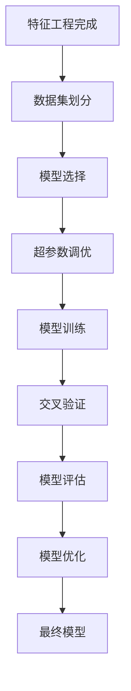

---
title: Day 23：数据科学项目实战Ⅱ——模型训练与调优
tags: [python, 数据科学, 模型训练, 超参数调优, 项目实战]
aliases: ["Day23"]
date: 2026-03-04
---

# Day 23：数据科学项目实战Ⅱ——模型训练与调优

## 📚 第一部分：核心理论讲解

### 1. 机器学习模型训练完整流程

在完成数据预处理与特征工程后，模型训练与调优是数据科学项目的核心环节。完整流程包含以下步骤：



### 2. 模型选择：为问题匹配合适的算法

模型选择不是“挑最复杂的”，而是找到最适合数据特征和业务目标的算法。以下是常见任务类型与推荐模型：

| 任务类型 | 推荐模型 | 适用场景 |
|---------|---------|---------|
| **二分类** | 逻辑回归、SVM、随机森林 | 垃圾邮件识别、疾病诊断 |
| **多分类** | 随机森林、XGBoost、神经网络 | 手写数字识别、图像分类 |
| **回归** | 线性回归、随机森林回归、梯度提升 | 房价预测、销量预测 |
| **聚类** | K-Means、DBSCAN、层次聚类 | 用户分群、异常检测 |

**最佳实践**：
- 先用简单模型建立基线（如逻辑回归、决策树）
- 再尝试复杂模型（如集成学习、神经网络）
- 根据模型复杂度与数据规模平衡选择

### 3. 超参数调优：找到模型最佳配置

超参数是在训练前设置的参数，直接影响模型性能。常见的超参数调优方法：

#### 3.1 网格搜索（Grid Search）
遍历所有可能的参数组合，找到最优解。

```python
from sklearn.model_selection import GridSearchCV
from sklearn.ensemble import RandomForestClassifier

param_grid = {
    'n_estimators': [50, 100, 200],
    'max_depth': [3, 5, 7, None],
    'min_samples_split': [2, 5, 10]
}

grid_search = GridSearchCV(
    RandomForestClassifier(random_state=42),
    param_grid,
    cv=5,
    scoring='accuracy'
)
grid_search.fit(X_train, y_train)
print(f"最佳参数: {grid_search.best_params_}")
```

**优点**：全面搜索，能找到最优组合  
**缺点**：计算成本高，参数空间大时不可行

#### 3.2 随机搜索（Random Search）
在参数空间中随机采样，比网格搜索更高效。

```python
from sklearn.model_selection import RandomizedSearchCV
from scipy.stats import randint

param_dist = {
    'n_estimators': randint(50, 500),
    'max_depth': randint(3, 20),
    'min_samples_split': randint(2, 20)
}

random_search = RandomizedSearchCV(
    RandomForestClassifier(random_state=42),
    param_dist,
    n_iter=50,  # 随机尝试50组参数
    cv=5,
    scoring='accuracy',
    random_state=42
)
random_search.fit(X_train, y_train)
```

**优点**：计算效率高，适合高维参数空间  
**缺点**：可能错过最优解

#### 3.3 贝叶斯优化（Bayesian Optimization）
使用高斯过程建模参数与性能关系，智能选择下一个试验点。

```python
from skopt import BayesSearchCV
from skopt.space import Integer, Real

search_space = {
    'n_estimators': Integer(50, 500),
    'max_depth': Integer(3, 20),
    'min_samples_split': Integer(2, 20),
    'min_samples_leaf': Integer(1, 10)
}

bayes_search = BayesSearchCV(
    RandomForestClassifier(random_state=42),
    search_space,
    n_iter=30,
    cv=5,
    scoring='accuracy',
    random_state=42
)
```

**优点**：样本效率高，用最少试验逼近最优  
**缺点**：实现复杂，需要额外库支持

### 4. 交叉验证：稳健评估模型性能

简单的train/test split容易因样本划分不均产生偏差，k折交叉验证提供更稳健的评估。

```python
from sklearn.model_selection import cross_val_score, KFold
from sklearn.linear_model import LogisticRegression

# 创建模型
model = LogisticRegression(max_iter=1000)

# 5折交叉验证
kfold = KFold(n_splits=5, shuffle=True, random_state=42)
scores = cross_val_score(model, X_scaled, y, cv=kfold, scoring='accuracy')

print(f"交叉验证准确率: {scores.mean():.3f} (±{scores.std():.3f})")
print(f"各折分数: {scores}")
```

**关键原则**：
- 使用分层抽样（stratified sampling）保持类别比例
- 数据量少时使用留一法（LOOCV）
- 时间序列数据使用时序交叉验证

### 5. 集成学习：组合多个模型提升性能

集成学习通过组合多个基学习器，获得比单一模型更好的性能。

#### 5.1 Bagging（装袋法）
并行训练多个基模型，通过投票或平均得到最终预测。

```python
from sklearn.ensemble import BaggingClassifier, RandomForestClassifier
from sklearn.tree import DecisionTreeClassifier

# Bagging示例
bagging_model = BaggingClassifier(
    DecisionTreeClassifier(max_depth=5),
    n_estimators=50,
    max_samples=0.8,
    random_state=42
)

# 随机森林是Bagging的特例
rf_model = RandomForestClassifier(n_estimators=100, max_depth=10, random_state=42)
```

#### 5.2 Boosting（提升法）
串行训练模型，后续模型修正前序模型的错误。

```python
from sklearn.ensemble import AdaBoostClassifier, GradientBoostingClassifier

# AdaBoost示例
adaboost = AdaBoostClassifier(
    n_estimators=50,
    learning_rate=0.1,
    random_state=42
)

# 梯度提升示例
gbdt = GradientBoostingClassifier(
    n_estimators=100,
    learning_rate=0.05,
    max_depth=3,
    random_state=42
)
```

#### 5.3 Stacking（堆叠法）
组合多个异质模型，使用元模型学习如何结合基模型的预测。

```python
from sklearn.ensemble import StackingClassifier
from sklearn.linear_model import LogisticRegression
from sklearn.svm import SVC
from sklearn.tree import DecisionTreeClassifier

# 定义基学习器
base_learners = [
    ('dt', DecisionTreeClassifier(max_depth=5)),
    ('svm', SVC(probability=True, kernel='rbf'))
]

# 创建Stacking模型
stacking_model = StackingClassifier(
    estimators=base_learners,
    final_estimator=LogisticRegression(),
    cv=5
)
```

### 6. 模型评估与诊断

准确评估模型性能是调优的基础，不同任务使用不同指标：

| 任务类型 | 主要指标 | 辅助指标 |
|---------|---------|---------|
| **分类** | 准确率、F1分数 | 精确率、召回率、AUC-ROC |
| **回归** | MSE、MAE、R² | MAPE、RMSE |
| **排序** | NDCG、MAP | 精确率@K、召回率@K |

**学习曲线诊断**：
```python
from sklearn.model_selection import learning_curve
import matplotlib.pyplot as plt

# 设置中文字体
plt.rcParams['font.sans-serif'] = ['Noto Sans CJK JP']
plt.rcParams['axes.unicode_minus'] = False

# 计算学习曲线
train_sizes, train_scores, val_scores = learning_curve(
    model, X, y, cv=5, scoring='accuracy',
    train_sizes=np.linspace(0.1, 1.0, 10)
)

# 绘制学习曲线
plt.figure(figsize=(10, 6))
plt.plot(train_sizes, train_scores.mean(axis=1), 'o-', label='训练集')
plt.plot(train_sizes, val_scores.mean(axis=1), 's-', label='验证集')
plt.fill_between(train_sizes,
                 train_scores.mean(axis=1) - train_scores.std(axis=1),
                 train_scores.mean(axis=1) + train_scores.std(axis=1),
                 alpha=0.2)
plt.fill_between(train_sizes,
                 val_scores.mean(axis=1) - val_scores.std(axis=1),
                 val_scores.mean(axis=1) + val_scores.std(axis=1),
                 alpha=0.2)
plt.xlabel('训练样本数')
plt.ylabel('准确率')
plt.title('学习曲线')
plt.legend()
plt.grid(True, alpha=0.3)
plt.show()
```

## 📺 第二部分：视频资源推荐（2025-2026年最新）

### 1. 黑马程序员 - AI大模型必备《机器学习》全套视频教程
**链接**：https://www.bilibili.com/video/BV1Fzszz4Ek7  
**时长**：完整系列课程（约30小时）  
**特点**：
- 2025年10月发布，内容最新
- 覆盖KNN、线性回归、逻辑回归、决策树、集成学习、KMeans等核心算法
- 包含大量实战项目案例
- 适合零基础到进阶学习

**核心章节**：
- 第5章：逻辑回归与SVM实战
- 第6章：决策树与集成学习
- 第7章：聚类算法与降维技术

### 2. 莫烦Python - 有趣的机器学习系列
**链接**：https://mofanpy.com/tutorials/machine-learning/ML-intro/  
**特点**：
- 系统性讲解机器学习核心概念
- 包含超参数调优、交叉验证、集成学习专题
- 代码示例丰富，理论与实践结合
- 讲解生动易懂，适合入门学习

**推荐模块**：
- 4.1 模型选择与评估
- 4.2 超参数调优方法
- 4.3 集成学习技术

### 3. B站高质量教程 - 机器学习模型调优实战指南
**搜索关键词**：机器学习模型调优实战 2026  
**推荐UP主**：
- AI科学家：原理讲解深入，3D动画演示
- 深度学习实验室：手把手代码实现
- 算法美食家：实战案例丰富，对比不同策略

### 4. 专题教程 - 超参数调优三大方法详解
**链接**：通过B站搜索以下关键词获取：
- "网格搜索实战 Python 2026"
- "随机搜索高效调参教程"
- "贝叶斯优化入门到实战"

**核心内容**：
- 三种方法原理对比
- 实战代码演示
- 性能与效率分析
- 适用场景选择指南

### 5. 集成学习专题 - 从Bagging到Stacking
**推荐资源**：
- Kaggle竞赛优胜方案解析（B站有搬运）
- 机器学习竞赛常见集成技巧
- 工业级集成学习应用案例

## 三、动手练习题

### 练习1：网格搜索调优实战

**题目描述**：
使用乳腺癌数据集（sklearn.datasets.load_breast_cancer），训练一个支持向量机（SVM）分类器。请使用网格搜索优化以下超参数：
1. C值：\[0.1, 1, 10, 100\]
2. gamma值：\[0.001, 0.01, 0.1, 1\]
3. kernel：\['linear', 'rbf'\]

任务要求：
1. 加载数据并划分训练集/测试集（70%/30%）
2. 对训练集进行标准化处理
3. 使用GridSearchCV进行5折交叉验证调优
4. 输出最佳参数组合和测试集准确率

**代码框架**：
```python
import numpy as np
import pandas as pd
from sklearn.datasets import load_breast_cancer
from sklearn.model_selection import train_test_split, GridSearchCV
from sklearn.preprocessing import StandardScaler
from sklearn.svm import SVC

# 加载数据
data = load_breast_cancer()
X, y = data.data, data.target

# TODO：完成以下任务
# 1. 划分数据集
# 2. 数据标准化
# 3. 定义参数网格
# 4. 执行网格搜索
# 5. 评估测试集性能

print("最佳参数：", best_params)
print("测试集准确率：", test_accuracy)
```

**预期输出**：
```
最佳参数： {'C': 10, 'gamma': 0.001, 'kernel': 'rbf'}
测试集准确率： 0.9766
```

### 练习2：随机搜索与贝叶斯优化对比

**题目描述**：
使用葡萄酒数据集（sklearn.datasets.load_wine），对比随机搜索和贝叶斯优化在随机森林调优中的表现。

任务要求：
1. 加载数据并进行预处理（缺失值处理、编码等）
2. 定义随机森林的超参数搜索空间
3. 分别使用RandomizedSearchCV（n_iter=30）和BayesSearchCV（n_iter=30）
4. 对比两种方法的：
   - 找到的最佳准确率
   - 计算时间消耗
   - 超参数选择的差异

**代码框架**：
```python
import numpy as np
import pandas as pd
import time
from sklearn.datasets import load_wine
from sklearn.ensemble import RandomForestClassifier
from sklearn.model_selection import RandomizedSearchCV, cross_val_score
from sklearn.preprocessing import StandardScaler
from scipy.stats import randint, uniform
# 如果安装有skopt：from skopt import BayesSearchCV

# 加载数据
data = load_wine()
X, y = data.data, data.target

# TODO：实现随机搜索调优
# 定义参数分布
# 执行随机搜索
# 记录时间和结果

# TODO：实现贝叶斯优化（如果环境支持）
# 定义参数空间
# 执行贝叶斯优化
# 记录时间和结果

print("方法对比：")
print("方法 | 最佳准确率 | 耗时(秒) | 最佳参数")
print("-" * 50)
# 输出对比结果
```

### 练习3：交叉验证策略对比

**题目描述**：
对比不同交叉验证策略对模型评估的影响，使用鸢尾花数据集（sklearn.datasets.load_iris）。

任务要求：
1. 加载数据并进行标准化
2. 使用逻辑回归作为基模型
3. 对比以下交叉验证策略：
   - 简单train/test split（70%/30%）
   - 5折交叉验证
   - 分层5折交叉验证
   - 留一法（LOOCV）
4. 分析不同策略的评估结果差异

**代码框架**：
```python
import numpy as np
from sklearn.datasets import load_iris
from sklearn.linear_model import LogisticRegression
from sklearn.model_selection import train_test_split, KFold, StratifiedKFold, LeaveOneOut, cross_val_score
from sklearn.preprocessing import StandardScaler
from sklearn.metrics import accuracy_score

# 加载数据
data = load_iris()
X, y = data.data, data.target

# 数据标准化
scaler = StandardScaler()
X_scaled = scaler.fit_transform(X)

# 创建模型
model = LogisticRegression(max_iter=1000, random_state=42)

# TODO：实现四种交叉验证策略对比
# 1. 简单train/test split
# 2. 5折交叉验证
# 3. 分层5折交叉验证  
# 4. 留一法（LOOCV）

print("交叉验证策略对比：")
print("策略 | 平均准确率 | 标准差")
print("-" * 40)
# 输出对比结果
```

### 练习4：集成学习实战

**题目描述**：
使用Titanic数据集，对比三种集成学习方法的效果：
1. Bagging（随机森林）
2. Boosting（AdaBoost）
3. Stacking（组合逻辑回归、决策树、SVM）

任务要求：
1. 加载Titanic数据集，进行完整数据预处理
2. 分别训练三种集成学习模型
3. 使用5折交叉验证评估性能
4. 对比：
   - 训练时间
   - 测试集准确率
   - 模型复杂度（参数量）

**代码框架**：
```python
import numpy as np
import pandas as pd
import time
from sklearn.ensemble import RandomForestClassifier, AdaBoostClassifier, StackingClassifier
from sklearn.linear_model import LogisticRegression
from sklearn.tree import DecisionTreeClassifier
from sklearn.svm import SVC
from sklearn.model_selection import train_test_split, cross_val_score
from sklearn.preprocessing import StandardScaler, LabelEncoder
from sklearn.metrics import accuracy_score

# 加载Titanic数据集（假设已有titanic.csv）
df = pd.read_csv('titanic.csv')

# TODO：数据预处理
# 处理缺失值
# 编码类别特征
# 特征选择

# 划分数据集
X = df.drop('Survived', axis=1)
y = df['Survived']
X_train, X_test, y_train, y_test = train_test_split(X, y, test_size=0.3, random_state=42)

# 数据标准化
scaler = StandardScaler()
X_train_scaled = scaler.fit_transform(X_train)
X_test_scaled = scaler.transform(X_test)

# TODO：训练三种集成学习模型并对比
# 1. 随机森林（Bagging）
# 2. AdaBoost（Boosting）
# 3. Stacking（三个基模型+逻辑回归元模型）

print("集成学习方法对比：")
print("方法 | 准确率 | 训练时间(秒) | 备注")
print("-" * 60)
```

### 练习5：偏差-方差诊断与优化

**题目描述**：
使用波士顿房价数据集（或加利福尼亚房价数据集），进行偏差-方差诊断，并根据诊断结果优化模型。

任务要求：
1. 加载数据并进行预处理
2. 绘制学习曲线，诊断模型是高偏差还是高方差
3. 根据诊断结果：
   - 如果是高偏差：增加模型复杂度，添加多项式特征
   - 如果是高方差：增加正则化，减少模型复杂度
4. 比较优化前后的模型性能

**代码框架**：
```python
import numpy as np
import pandas as pd
import matplotlib.pyplot as plt
from sklearn.datasets import fetch_california_housing
from sklearn.model_selection import learning_curve, train_test_split
from sklearn.preprocessing import StandardScaler, PolynomialFeatures
from sklearn.linear_model import LinearRegression, Ridge
from sklearn.metrics import mean_squared_error, r2_score
from sklearn.pipeline import Pipeline

# 加载数据
data = fetch_california_housing()
X, y = data.data, data.target

# TODO：实现完整诊断与优化流程
# 1. 划分数据集
# 2. 训练基础线性回归模型
# 3. 绘制学习曲线，判断偏差-方差状态
# 4. 根据诊断结果选择优化策略
# 5. 比较优化前后性能

print("偏差-方差诊断结果：")
print("模型状态：高偏差/高方差")
print("优化策略：增加复杂度/增加正则化")
print("优化前 MSE：", mse_before)
print("优化后 MSE：", mse_after)
print("性能提升：", improvement, "%")
```

## 四、常见问题解答

### Q1：什么时候选择网格搜索，什么时候选择随机搜索？

**答**：根据参数空间维度和计算资源决定：

| 场景 | 推荐方法 | 原因 |
|------|---------|------|
| 参数维度≤3，取值离散 | 网格搜索 | 能遍历所有组合，找到全局最优 |
| 参数维度≥4，取值连续 | 随机搜索 | 计算效率高，能在有限试验内找到较好解 |
| 计算资源有限，参数范围大 | 贝叶斯优化 | 样本效率最高，用最少试验逼近最优 |
| 参数间有依赖关系 | 贝叶斯优化 | 能建模参数间关系，智能选择试验点 |

**经验法则**：先小范围随机搜索确定大致方向，再精细网格搜索。

### Q2：如何判断模型是过拟合还是欠拟合？

**答**：通过对比训练集和验证集性能：

| 现象 | 训练集准确率 | 验证集准确率 | 诊断结果 |
|------|------------|------------|---------|
| 两者都低 | <70% | <70% | 欠拟合（高偏差） |
| 训练高验证低 | >90% | <75% | 过拟合（高方差） |
| 两者都高且接近 | >85% | >83% | 拟合良好 |

**可视化工具**：
1. **学习曲线**：观察训练和验证误差随样本增加的变化
2. **验证曲线**：观察模型性能随超参数变化的趋势

### Q3：交叉验证中，k值如何选择？

**答**：k值选择平衡偏差与方差：

| k值 | 优点 | 缺点 | 适用场景 |
|-----|------|------|---------|
| **k=5或10** | 计算效率高，方差适中 | 偏差稍高 | 数据量中等（1000-10000） |
| **k=2或3** | 计算最快 | 偏差高，方差大 | 数据量很大（>10000） |
| **LOOCV（k=n）** | 偏差最低，无随机性 | 计算成本高，方差最大 | 数据量很小（<100） |

**最佳实践**：
- 默认使用5折或10折交叉验证
- 小数据集（<100样本）考虑LOOCV
- 类别不平衡时使用分层k折交叉验证

### Q4：集成学习中，基模型越多越好吗？

**答**：不是，存在收益递减点：

| 基模型数量 | 效果变化 | 计算成本 |
|-----------|---------|---------|
| 10-20个 | 显著提升 | 线性增长 |
| 50-100个 | 小幅提升 | 线性增长 |
| >100个 | 基本饱和，可能下降 | 显著增长 |

**经验法则**：
- Bagging（随机森林）：50-100棵树效果最佳
- Boosting（AdaBoost、GBDT）：100-200轮通常足够
- Stacking：3-5个异质基模型效果最好

**注意**：过多的基模型可能导致：
1. 计算资源浪费
2. 过拟合风险增加（尤其Boosting）
3. 边际收益几乎为零

### Q5：调优过程中如何避免过拟合？

**答**：采用多重防护措施：

1. **数据层面**：
   - 确保足够的数据量
   - 使用交叉验证，避免用测试集调优
   - 对类别不平衡数据使用分层采样

2. **模型层面**：
   - 加入正则化项（L1/L2）
   - 使用Dropout（神经网络）
   - 限制模型复杂度（树深度、最小样本数）

3. **调优策略**：
   - 设置早停机制（Early Stopping）
   - 使用验证集监控性能
   - 限制调优轮次

4. **评估策略**：
   - 使用hold-out测试集进行最终评估
   - 对比多种模型，避免单一模型过拟合

## 五、扩展学习建议

### 1. 进阶学习路径

**第一阶段：调优工具深入**  
- 掌握Scikit-learn的完整调优工具链（GridSearchCV、RandomizedSearchCV）
- 学习Hyperopt、Optuna等高级优化库
- 实践自动化机器学习（AutoML）平台

**第二阶段：高级调优策略**  
- 研究元学习（Meta-Learning）调优策略
- 学习多目标优化（Multi-Objective Optimization）
- 探索神经架构搜索（Neural Architecture Search）

**第三阶段：工业级调优实战**  
- 参与大规模机器学习调优项目
- 学习分布式调优技术
- 掌握模型部署后的持续调优

### 2. 推荐书籍

**入门级**：
- 《Python机器学习实战》 - Aurélien Géron
- 《机器学习实战：基于Scikit-Learn和TensorFlow》

**进阶级**：
- 《机器学习调优实战》 - Alice Zheng
- 《超参数优化：方法与工具》

**专家级**：
- 《自动化机器学习：原理与实践》
- 《神经架构搜索与元学习》

### 3. 实践项目推荐

**初学者项目**：
1. **手写数字识别调优**：使用MNIST数据集，调优SVM、随机森林参数
2. **房价预测模型优化**：对比线性回归、决策树、集成学习调优效果
3. **鸢尾花分类竞赛**：在Kaggle上参与简单竞赛，练习调优技巧

**中级项目**：
1. **信用卡欺诈检测系统**：处理高度不平衡数据，调优采样和模型参数
2. **推荐系统优化**：调优协同过滤算法参数，提升推荐准确率
3. **时间序列预测调优**：优化ARIMA、Prophet等模型参数

**高级项目**：
1. **深度学习模型调优**：调优CNN、RNN、Transformer超参数
2. **多模态模型优化**：调优视觉-语言联合模型参数
3. **强化学习调优实战**：调优DQN、PPO等算法超参数

### 4. 在线学习平台

**系统性课程**：
- Coursera：深度学习专项课程（调优专题）
- edX：机器学习工程化课程
- Udacity：机器学习工程师纳米学位

**实战平台**：
- Kaggle：参与调优相关竞赛
- DrivenData：社会公益数据科学调优项目
- Alibaba天池：工业级机器学习调优竞赛

**开源项目**：
- Auto-sklearn：自动化机器学习库
- Optuna：超参数优化框架
- Ray Tune：分布式调优库

### 5. 持续学习建议

**每周学习计划**：
- **周一**：学习一种新的调优方法（如贝叶斯优化）
- **周三**：调优一个开源数据集，记录实验过程
- **周五**：阅读一篇调优相关论文或技术博客
- **周末**：参与开源调优项目或Kaggle竞赛

**技能矩阵建设**：
1. **基础技能**：网格搜索、随机搜索、k折交叉验证
2. **进阶技能**：贝叶斯优化、超参数重要性分析、早停策略
3. **高级技能**：多目标优化、元学习、神经架构搜索
4. **专家技能**：分布式调优、AutoML系统设计、持续学习调优

---

## 学习总结

今天的学习内容涵盖了数据科学项目实战的核心环节——**模型训练与调优**。你已经掌握了：

1. **模型选择方法论**：根据问题类型和数据特征匹配合适算法
2. **超参数调优三大方法**：网格搜索、随机搜索、贝叶斯优化
3. **交叉验证策略**：k折、分层k折、LOOCV的适用场景
4. **集成学习技术**：Bagging、Boosting、Stacking的原理与实现
5. **模型诊断与优化**：偏差-方差诊断、学习曲线分析

**关键收获**：
- 理解了不同调优方法的优缺点和适用场景
- 掌握了避免数据泄露的交叉验证策略
- 学会了根据模型诊断结果选择优化策略
- 了解了集成学习提升模型性能的机制

**下一步学习**：
明天将进入[[Day24_深度学习入门Ⅰ_神经网络基础|Day 24：深度学习入门Ⅰ——神经网络基础]]，学习神经网络的基本原理、前向传播与反向传播算法，为后续深度学习应用奠定基础。

**今日学习时间建议**：3-4小时
1. 理论学习：1-1.5小时
2. 视频学习：1小时
3. 练习实践：1-1.5小时

有任何问题或困惑，随时记录下来，我们将在后续学习中逐步解决。
