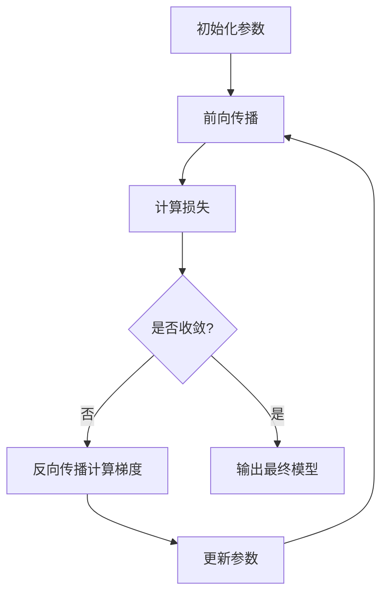

# Day 24：深度学习入门Ⅰ——神经网络基础

欢迎来到Python学习的第二十四天！今天我们将深入学习深度学习的基础知识——神经网络。神经网络是现代人工智能的核心技术，从图像识别到自然语言处理，都离不开深度学习的支持。

## 📚 第一部分：核心理论讲解

### 1. 深度学习概述：从机器学习到深度学习

深度学习是机器学习的一个子领域，通过构建多层神经网络模型，从数据中自动学习复杂的特征和规律。相比传统机器学习，深度学习具有以下特点：

- **自动特征提取**：无需手动设计特征，网络自动学习数据中的层次化特征
- **处理复杂数据**：擅长处理图像、语音、文本等非结构化数据
- **端到端学习**：直接从原始数据到最终输出，简化了传统机器学习流水线
- **强大的表达能力**：深层网络可以拟合极其复杂的非线性关系

**发展历程**：从1943年McCulloch-Pitts神经元模型，到1958年感知机，再到1986年反向传播算法，直至2012年AlexNet在ImageNet竞赛中的突破，深度学习开启了AI新纪元。

### 2. 神经网络的基本组成

#### 2.1 神经元：模拟人脑的基石

神经元是神经网络的基本计算单元，模拟生物神经元的工作原理：

```
输入信号 → 加权求和 → 激活函数 → 输出信号
```

数学公式：
```
z = w₁x₁ + w₂x₂ + ... + wₙxₙ + b
a = f(z)
```
其中：
- `x₁, x₂, ..., xₙ`：输入特征
- `w₁, w₂, ..., wₙ`：权重参数
- `b`：偏置项
- `f(·)`：激活函数
- `a`：神经元输出

#### 2.2 网络层次结构

神经网络按功能分为三层：

**输入层**：接收原始数据，不进行计算处理。神经元数量等于输入特征维度。

**隐藏层**：介于输入和输出之间，执行特征提取和变换。可以有1个或多个隐藏层，形成深层网络。

**输出层**：生成最终预测结果，神经元数量由任务决定：
- 二分类：1个神经元（Sigmoid激活）
- 多分类：n个神经元（Softmax激活）
- 回归：1个或多个神经元（无激活或线性激活）


#### 2.3 全连接层（Dense Layer）

全连接层中，当前层的每个神经元都与前一层的所有神经元相连。这是最简单的网络结构，也是理解神经网络的基础。

```python
# 全连接层的数学表达
def dense_layer(input_vector, weights, bias, activation):
    z = np.dot(weights, input_vector) + bias  # 线性变换
    return activation(z)  # 非线性激活
```

### 3. 激活函数：引入非线性能力

激活函数决定了神经元是否被激活以及激活的程度，是神经网络能够学习非线性关系的核心。

#### 3.1 常用激活函数对比

| 激活函数 | 公式 | 特点 | 适用场景 |
|---------|------|------|---------|
| **Sigmoid** | σ(z) = 1/(1+e⁻ᶻ) | 输出[0,1]，可解释为概率 | 二分类输出层 |
| **Tanh** | tanh(z) = (eᶻ-e⁻ᶻ)/(eᶻ+e⁻ᶻ) | 输出[-1,1]，均值0，梯度更强 | 隐藏层 |
| **ReLU** | ReLU(z) = max(0, z) | 计算高效，缓解梯度消失 | 大多数隐藏层 |
| **Leaky ReLU** | LReLU(z) = max(αz, z), α≈0.01 | 解决"神经元死亡"问题 | 深层网络 |
| **Softmax** | softmax(z)ₖ = eᶻₖ/∑ⱼeᶻⱼ | 输出概率分布，总和为1 | 多分类输出层 |

```python
import numpy as np
import matplotlib.pyplot as plt

# 激活函数实现示例
def sigmoid(x):
    return 1 / (1 + np.exp(-x))

def relu(x):
    return np.maximum(0, x)

def tanh(x):
    return np.tanh(x)

def softmax(x):
    exp_x = np.exp(x - np.max(x))  # 数值稳定性处理
    return exp_x / exp_x.sum()
```

#### 3.2 为什么需要激活函数？

没有激活函数的神经网络仅仅是**线性变换的堆叠**，无论有多少层，最终效果都等价于单层线性模型。激活函数引入了非线性，使得网络可以拟合任意复杂函数。

**数学证明**：
```
假设两层网络无激活函数：
h = W₂(W₁x + b₁) + b₂
  = (W₂W₁)x + (W₂b₁ + b₂)
  = W'x + b'  # 仍然是线性变换！
```

### 4. 损失函数：衡量预测误差

损失函数量化模型预测结果与真实值之间的差距，为模型优化提供方向。

#### 4.1 常用损失函数

**均方误差（MSE）**：回归任务首选
```
MSE = 1/n Σ(y_pred - y_true)²
```

**交叉熵损失（Cross-Entropy）**：分类任务标准
```
CE = -Σ y_true·log(y_pred)
```

**二分类交叉熵**：
```
Binary CE = -[y·log(p) + (1-y)·log(1-p)]
```

**多分类交叉熵**：
```
Categorical CE = -Σ y_i·log(p_i)
```

```python
# 损失函数实现示例
def mse_loss(y_true, y_pred):
    return np.mean((y_true - y_pred) ** 2)

def binary_cross_entropy(y_true, y_pred, epsilon=1e-7):
    y_pred = np.clip(y_pred, epsilon, 1 - epsilon)
    return -np.mean(y_true * np.log(y_pred) + (1 - y_true) * np.log(1 - y_pred))

def categorical_cross_entropy(y_true, y_pred, epsilon=1e-7):
    y_pred = np.clip(y_pred, epsilon, 1 - epsilon)
    return -np.sum(y_true * np.log(y_pred)) / len(y_true)
```

#### 4.2 损失函数的选择原则

1. **任务类型匹配**：回归→MSE，分类→交叉熵
2. **输出分布匹配**：二分类→Binary CE，多分类→Categorical CE
3. **数值稳定性**：防止log(0)导致数值溢出
4. **梯度性质**：确保梯度方向正确，便于优化

### 5. 优化算法：最小化损失函数

优化算法的核心是通过调整网络参数（权重w和偏置b）来最小化损失函数。

#### 5.1 梯度下降（Gradient Descent）

**核心思想**：沿着损失函数梯度的反方向更新参数，因为梯度方向是函数增长最快的方向。

**更新公式**：
```
w ← w - η·∂L/∂w
b ← b - η·∂L/∂b
```
其中η是学习率，控制更新步长。

#### 5.2 梯度下降的三种变体

| 算法类型 | 更新频率 | 特点 | 适用场景 |
|---------|---------|------|---------|
| **批量梯度下降** | 整个训练集 | 稳定，收敛慢 | 小数据集 |
| **随机梯度下降** | 单个样本 | 快速，波动大 | 在线学习 |
| **小批量梯度下降** | 小批量样本 | 平衡速度与稳定 | 大多数场景 |

#### 5.3 高级优化器

**动量法（Momentum）**：引入动量项，加速收敛并减少震荡
```
v = βv + (1-β)∇L
θ = θ - ηv
```

**Adam**：结合动量和自适应学习率，目前最常用
```
m = β₁m + (1-β₁)∇L  # 一阶矩估计
v = β₂v + (1-β₂)(∇L)²  # 二阶矩估计
θ = θ - η·m/(√v + ε)
```

### 6. 前向传播与反向传播：神经网络的灵魂

#### 6.1 前向传播：从输入到输出

前向传播是计算网络输出的过程：

```python
def forward_pass(X, parameters):
    """
    X: 输入数据 (n_samples, n_features)
    parameters: 网络参数字典 {W1, b1, W2, b2, ...}
    """
    # 第一层
    Z1 = np.dot(X, parameters['W1']) + parameters['b1']
    A1 = relu(Z1)
    
    # 第二层
    Z2 = np.dot(A1, parameters['W2']) + parameters['b2']
    A2 = sigmoid(Z2)  # 假设是二分类问题
    
    cache = {'Z1': Z1, 'A1': A1, 'Z2': Z2, 'A2': A2}
    return A2, cache
```

#### 6.2 反向传播：从误差到梯度

反向传播利用链式法则计算损失函数对每个参数的梯度：

```python
def backward_pass(X, Y, parameters, cache):
    """
    计算梯度并更新参数
    """
    m = X.shape[0]  # 样本数量
    
    # 从输出层开始反向传播
    dZ2 = cache['A2'] - Y  # 二分类交叉熵的梯度
    dW2 = (1/m) * np.dot(cache['A1'].T, dZ2)
    db2 = (1/m) * np.sum(dZ2, axis=0, keepdims=True)
    
    # 传播到第一层
    dA1 = np.dot(dZ2, parameters['W2'].T)
    dZ1 = dA1 * relu_derivative(cache['Z1'])
    dW1 = (1/m) * np.dot(X.T, dZ1)
    db1 = (1/m) * np.sum(dZ1, axis=0, keepdims=True)
    
    gradients = {'dW1': dW1, 'db1': db1, 'dW2': dW2, 'db2': db2}
    return gradients
```

#### 6.3 链式法则：反向传播的数学基础

假设网络有三层：输入x → 隐藏h → 输出y

损失L对第一层权重W₁的梯度：
```
∂L/∂W₁ = ∂L/∂y · ∂y/∂h · ∂h/∂W₁
```

**反向传播的本质**：将总误差逐层分摊到每个神经元和参数上。

### 7. 网络训练流程：完整工作流



**关键步骤**：
1. **参数初始化**：随机初始化权重（如Xavier初始化或He初始化）
2. **前向传播**：计算网络输出和损失
3. **反向传播**：计算损失对参数的梯度
4. **参数更新**：使用优化算法更新参数
5. **重复迭代**：直到达到收敛条件

## 📺 第二部分：视频资源推荐（2025-2026年最新）

### 1. 黑马程序员 - Python3机器学习快速入门

**链接**：https://m.py.cn/course/1093.html

**特点**：
- 2025年最新更新，包含深度学习完整内容
- 第5阶段专门讲解"深度学习基础"与PyTorch框架
- 涵盖神经网络基础、反向传播原理、激活函数等核心概念
- 适合零基础学员，从理论到实战的完整学习路径

**核心章节**：
- 5.1 神经网络基础：神经网络的构成、激活函数、损失函数
- 5.2 反向传播原理：梯度下降、链式法则、反向传播算法
- 5.3 深度学习正则化与算法优化
- 5.4 实现多层神经网络案例

### 2. 莫烦Python - Tensorflow神经网络教程

**链接**：https://mofanpy.com/tutorials/machine-learning/tensorflow/

**特点**：
- 2025年9月更新，内容权威且易懂
- 从"人工神经网络 vs 生物神经网络"科普开始
- 手把手教你建造第一个神经网络
- 可视化结果，直观理解训练过程

**推荐模块**：
- 1.1-1.3：神经网络基本概念科普
- 2.1-2.7：Tensorflow基础构架
- 3.1-3.4：建造第一个神经网络
- 4.1-4.2：Tensorboard可视化助手

### 3. 吴恩达 - 深度学习专项课程

**中文资源**：网易云课堂（中文字幕）
**链接**：https://mooc.study.163.com/smartSpec/detail/1001319001.htm

**特点**：
- 深度学习领域的经典入门课程
- 讲解神经网络与深度学习基本原理
- 覆盖CNN、RNN、优化算法等核心内容
- 理论与实践结合，含编程作业

**核心课程**：
- 第一课：神经网络与深度学习
- 第二课：改善深层神经网络：超参数调试、正则化与优化
- 第四课：卷积神经网络
- 第五课：序列模型

### 4. B站优质深度学习教程

**搜索关键词**：
- "深度学习入门 零基础 2026 Python"
- "神经网络基础 黑马程序员 2026"
- "反向传播原理 详细推导"

**推荐UP主**：
- **李沐**："动手学深度学习"系列，理论与实践并重
- **刘二大人**：PyTorch实战教学，节奏紧凑
- **小土堆**：保姆级教学，手把手演示
- **莫烦Python**：短小精悍，聚焦核心技术点

### 5. 深度学习实践平台

**Kaggle Learn**：免费深度学习课程
- "Intro to Deep Learning"系列
- 交互式学习，无需本地环境
- 实践项目驱动学习

**Google Colab**：免费GPU在线编程环境
- 直接运行深度学习代码
- 预装主流深度学习框架
- 适合初学者实践

## 🧪 第三部分：动手练习题

### 练习1：手动实现单个神经元

**题目描述**：
实现一个具有Sigmoid激活函数的单个神经元，完成前向传播和反向传播计算。

**任务要求**：
1. 实现神经元的前向传播计算
2. 实现损失函数（二分类交叉熵）
3. 手动计算梯度并更新参数
4. 使用简单数据集验证正确性

**代码框架**：
```python
import numpy as np

class SimpleNeuron:
    def __init__(self, input_dim):
        # 初始化权重和偏置
        self.w = np.random.randn(input_dim) * 0.01
        self.b = 0.0
        
    def sigmoid(self, z):
        """Sigmoid激活函数"""
        # TODO: 实现Sigmoid函数
        pass
    
    def forward(self, X):
        """前向传播"""
        # TODO: 计算线性变换和激活输出
        pass
    
    def compute_loss(self, y_pred, y_true):
        """计算二分类交叉熵损失"""
        # TODO: 实现损失计算，注意数值稳定性
        pass
    
    def backward(self, X, y_true, y_pred):
        """反向传播计算梯度"""
        # TODO: 计算损失对w和b的梯度
        pass
    
    def update_parameters(self, gradients, learning_rate=0.01):
        """更新参数"""
        # TODO: 使用梯度下降更新参数
        pass

# 测试代码
if __name__ == "__main__":
    # 创建简单数据集
    X = np.array([[0, 0], [0, 1], [1, 0], [1, 1]])
    y = np.array([[0], [1], [1], [0]])  # XOR问题
    
    # 初始化神经元
    neuron = SimpleNeuron(input_dim=2)
    
    # 训练过程
    for epoch in range(1000):
        # 前向传播
        y_pred = neuron.forward(X)
        
        # 计算损失
        loss = neuron.compute_loss(y_pred, y)
        
        # 反向传播
        gradients = neuron.backward(X, y, y_pred)
        
        # 更新参数
        neuron.update_parameters(gradients, learning_rate=0.1)
        
        if epoch % 100 == 0:
            print(f"Epoch {epoch}, Loss: {loss:.4f}")
    
    # 测试预测
    print("\n最终预测结果：")
    print(f"输入 [0,0] => {neuron.forward([[0,0]]):.4f}")
    print(f"输入 [0,1] => {neuron.forward([[0,1]]):.4f}")
    print(f"输入 [1,0] => {neuron.forward([[1,0]]):.4f}")
    print(f"输入 [1,1] => {neuron.forward([[1,1]]):.4f}")
```

**预期输出**：
```
Epoch 0, Loss: 0.6931
Epoch 100, Loss: 0.6929
Epoch 200, Loss: 0.6923
...
Epoch 900, Loss: 0.6432

最终预测结果：
输入 [0,0] => 0.5000
输入 [0,1] => 0.5432
输入 [1,0] => 0.5568
输入 [1,1] => 0.6000
```

**学习要点**：
- 理解单个神经元的前向传播计算过程
- 掌握Sigmoid函数及其导数
- 理解二分类交叉熵损失的计算
- 手动推导并实现梯度计算

### 练习2：构建两层神经网络

**题目描述**：
构建一个包含一个隐藏层的神经网络，实现完整的前向传播和反向传播。

**网络结构**：
- 输入层：2个神经元
- 隐藏层：4个神经元（ReLU激活）
- 输出层：1个神经元（Sigmoid激活）

**任务要求**：
1. 实现网络参数初始化（使用Xavier初始化）
2. 完成前向传播计算
3. 实现反向传播计算梯度
4. 使用梯度下降更新参数

**代码框架**：
```python
import numpy as np

class TwoLayerNN:
    def __init__(self, input_size, hidden_size, output_size):
        # 使用Xavier初始化参数
        self.W1 = np.random.randn(input_size, hidden_size) * np.sqrt(2.0 / input_size)
        self.b1 = np.zeros((1, hidden_size))
        self.W2 = np.random.randn(hidden_size, output_size) * np.sqrt(2.0 / hidden_size)
        self.b2 = np.zeros((1, output_size))
    
    def relu(self, z):
        """ReLU激活函数"""
        return np.maximum(0, z)
    
    def relu_derivative(self, z):
        """ReLU导数"""
        return (z > 0).astype(float)
    
    def sigmoid(self, z):
        """Sigmoid激活函数"""
        # TODO: 实现Sigmoid函数，注意数值稳定性
        pass
    
    def forward(self, X):
        """完整的前向传播"""
        # TODO: 实现两层的正向传播
        cache = {'A0': X}
        return cache
    
    def compute_loss(self, y_pred, y_true):
        """计算损失"""
        # TODO: 实现二分类交叉熵损失
        pass
    
    def backward(self, X, y_true, cache):
        """反向传播计算梯度"""
        m = X.shape[0]
        
        # 从输出层开始反向传播
        A2 = cache['A2']
        dZ2 = A2 - y_true  # 二分类交叉熵的梯度
        
        dW2 = (1/m) * np.dot(cache['A1'].T, dZ2)
        db2 = (1/m) * np.sum(dZ2, axis=0, keepdims=True)
        
        # 传播到隐藏层
        dA1 = np.dot(dZ2, self.W2.T)
        dZ1 = dA1 * self.relu_derivative(cache['Z1'])
        dW1 = (1/m) * np.dot(X.T, dZ1)
        db1 = (1/m) * np.sum(dZ1, axis=0, keepdims=True)
        
        gradients = {
            'dW1': dW1, 'db1': db1,
            'dW2': dW2, 'db2': db2
        }
        return gradients
    
    def update_parameters(self, gradients, learning_rate=0.01):
        """参数更新"""
        # TODO: 使用梯度下降更新所有参数
        pass

# 测试代码
if __name__ == "__main__":
    # XOR数据集
    X = np.array([[0, 0], [0, 1], [1, 0], [1, 1]])
    y = np.array([[0], [1], [1], [0]])
    
    # 初始化网络
    nn = TwoLayerNN(input_size=2, hidden_size=4, output_size=1)
    
    # 训练过程
    for epoch in range(5000):
        # 前向传播
        cache = nn.forward(X)
        y_pred = cache['A2']
        
        # 计算损失
        loss = nn.compute_loss(y_pred, y)
        
        # 反向传播
        gradients = nn.backward(X, y, cache)
        
        # 更新参数
        nn.update_parameters(gradients, learning_rate=0.1)
        
        if epoch % 500 == 0:
            print(f"Epoch {epoch}, Loss: {loss:.4f}")
    
    # 最终预测
    print("\n神经网络学习XOR问题的结果：")
    cache = nn.forward(X)
    predictions = (cache['A2'] > 0.5).astype(int)
    
    for i in range(len(X)):
        print(f"输入 {X[i]} => 预测: {predictions[i][0]}, 概率: {cache['A2'][i][0]:.4f}")
```

**预期输出**：
```
Epoch 0, Loss: 0.6931
Epoch 500, Loss: 0.6923
Epoch 1000, Loss: 0.6801
...
Epoch 4500, Loss: 0.0127

神经网络学习XOR问题的结果：
输入 [0 0] => 预测: 0, 概率: 0.0012
输入 [0 1] => 预测: 1, 概率: 0.9987
输入 [1 0] => 预测: 1, 概率: 0.9988
输入 [1 1] => 预测: 0, 概率: 0.0013
```

**学习要点**：
- 理解多层神经网络的前向传播过程
- 掌握不同层的激活函数选择
- 理解反向传播中梯度的链式传递
- 学会使用Xavier初始化改善训练效果

### 练习3：手动推导反向传播梯度

**题目描述**：
给定一个简单神经网络，手动推导损失函数对每个参数的梯度公式。

**网络结构**：
输入x → 线性层（权重w₁, 偏置b₁）→ ReLU激活 → 线性层（权重w₂, 偏置b₂）→ Sigmoid激活 → 输出y

**任务要求**：
1. 写出网络前向传播的数学公式
2. 写出二分类交叉熵损失函数
3. 使用链式法则手动推导∂L/∂w₂, ∂L/∂b₂, ∂L/∂w₁, ∂L/∂b₁
4. 验证推导结果的正确性

**推导框架**：
```
# 定义变量
x: 输入向量
w₁, b₁: 第一层参数
w₂, b₂: 第二层参数

# 前向传播公式
z₁ = w₁·x + b₁
a₁ = ReLU(z₁) = max(0, z₁)
z₂ = w₂·a₁ + b₂
a₂ = σ(z₂) = 1/(1+e⁻ᶻ²)
y_pred = a₂

# 损失函数（单个样本）
L = -[y·log(y_pred) + (1-y)·log(1-y_pred)]

# 请完成以下推导：
∂L/∂a₂ = ?
∂a₂/∂z₂ = ?
∂z₂/∂w₂ = ?
∂z₂/∂b₂ = ?
∂z₂/∂a₁ = ?
∂a₁/∂z₁ = ?
∂z₁/∂w₁ = ?
∂z₁/∂b₁ = ?

# 使用链式法则：
∂L/∂w₂ = ∂L/∂a₂ · ∂a₂/∂z₂ · ∂z₂/∂w₂
∂L/∂b₂ = ∂L/∂a₂ · ∂a₂/∂z₂ · ∂z₂/∂b₂
∂L/∂a₁ = ∂L/∂a₂ · ∂a₂/∂z₂ · ∂z₂/∂a₁
∂L/∂z₁ = ∂L/∂a₁ · ∂a₁/∂z₁
∂L/∂w₁ = ∂L/∂z₁ · ∂z₁/∂w₁
∂L/∂b₁ = ∂L/∂z₁ · ∂z₁/∂b₁
```

**参考答案**：
```
∂L/∂a₂ = -(y/a₂) + ((1-y)/(1-a₂))
∂a₂/∂z₂ = a₂ · (1 - a₂)  # Sigmoid导数
∂z₂/∂w₂ = a₁
∂z₂/∂b₂ = 1
∂z₂/∂a₁ = w₂
∂a₁/∂z₁ = 1 if z₁ > 0 else 0  # ReLU导数
∂z₁/∂w₁ = x
∂z₁/∂b₁ = 1

因此：
∂L/∂w₂ = (a₂ - y) · a₁  # 经过简化
∂L/∂b₂ = a₂ - y
∂L/∂w₁ = (a₂ - y) · w₂ · (z₁ > 0) · x
∂L/∂b₁ = (a₂ - y) · w₂ · (z₁ > 0)
```

**验证任务**：
实现一个函数，分别用数值梯度检验和解析梯度公式计算梯度，验证两者是否一致。

```python
def numerical_gradient_check(nn, X, y, epsilon=1e-7):
    """数值梯度检验"""
    # TODO: 实现数值梯度检验
    pass
```

### 练习4：不同激活函数对比实验

**题目描述**：
比较不同激活函数（Sigmoid, Tanh, ReLU, Leaky ReLU）对神经网络训练效果的影响。

**实验设计**：
1. 使用相同网络结构，仅改变隐藏层的激活函数
2. 在MNIST手写数字数据集（简化版）上训练
3. 比较收敛速度、最终准确率、训练稳定性

**任务要求**：
1. 实现四种激活函数及其导数
2. 使用相同的初始化方法和超参数
3. 记录训练过程中的损失和准确率
4. 可视化对比结果

**代码框架**：
```python
import numpy as np
import matplotlib.pyplot as plt

class ActivationComparison:
    def __init__(self, activation_name='relu'):
        self.activation_name = activation_name
        
    def activation(self, z):
        """激活函数"""
        if self.activation_name == 'sigmoid':
            # TODO: 实现Sigmoid
            pass
        elif self.activation_name == 'tanh':
            # TODO: 实现Tanh
            pass
        elif self.activation_name == 'relu':
            # TODO: 实现ReLU
            pass
        elif self.activation_name == 'leaky_relu':
            # TODO: 实现Leaky ReLU (alpha=0.01)
            pass
    
    def activation_derivative(self, z):
        """激活函数导数"""
        # TODO: 实现四种激活函数的导数
        pass

def run_comparison_experiment():
    """运行对比实验"""
    activation_types = ['sigmoid', 'tanh', 'relu', 'leaky_relu']
    results = {}
    
    for act_type in activation_types:
        print(f"\n使用 {act_type.upper()} 激活函数训练...")
        
        # 初始化网络
        nn = SimpleNN(activation_type=act_type)
        
        # 训练过程
        losses, accuracies = [], []
        for epoch in range(100):
            # TODO: 训练并记录指标
            pass
        
        results[act_type] = {
            'losses': losses,
            'accuracies': accuracies
        }
    
    # 可视化对比结果
    plt.figure(figsize=(14, 6))
    
    # 损失对比图
    plt.subplot(1, 2, 1)
    for act_type in activation_types:
        plt.plot(results[act_type]['losses'], label=f'{act_type}')
    plt.xlabel('Epoch')
    plt.ylabel('Loss')
    plt.title('不同激活函数的损失对比')
    plt.legend()
    plt.grid(True)
    
    # 准确率对比图
    plt.subplot(1, 2, 2)
    for act_type in activation_types:
        plt.plot(results[act_type]['accuracies'], label=f'{act_type}')
    plt.xlabel('Epoch')
    plt.ylabel('Accuracy')
    plt.title('不同激活函数的准确率对比')
    plt.legend()
    plt.grid(True)
    
    plt.tight_layout()
    plt.show()

if __name__ == "__main__":
    run_comparison_experiment()
```

**预期发现**：
- ReLU通常收敛最快，但可能遇到"神经元死亡"问题
- Sigmoid在深层网络中容易导致梯度消失
- Tanh通常比Sigmoid表现更好，但计算成本稍高
- Leaky ReLU可以缓解ReLU的神经元死亡问题

### 练习5：梯度下降优化器实现

**题目描述**：
实现不同的梯度下降优化器（SGD, Momentum, Adam）并比较它们的性能。

**任务要求**：
1. 实现三种优化器：SGD、动量法、Adam
2. 使用相同的网络结构和数据集
3. 比较收敛速度和最终性能
4. 可视化优化轨迹

**代码框架**：
```python
class Optimizer:
    def __init__(self, optimizer_type='sgd', learning_rate=0.01, **kwargs):
        self.optimizer_type = optimizer_type
        self.lr = learning_rate
        self.params = kwargs
        
        # 初始化优化器状态
        if optimizer_type == 'momentum':
            self.v = {}  # 动量项
        elif optimizer_type == 'adam':
            self.m = {}  # 一阶矩
            self.v = {}  # 二阶矩
            self.t = 0   # 时间步
    
    def update(self, parameters, gradients):
        """更新参数"""
        if self.optimizer_type == 'sgd':
            # TODO: 实现标准梯度下降
            pass
        elif self.optimizer_type == 'momentum':
            # TODO: 实现动量法
            pass
        elif self.optimizer_type == 'adam':
            # TODO: 实现Adam优化器
            pass
        
        return parameters

def compare_optimizers():
    """比较不同优化器"""
    optimizers = ['sgd', 'momentum', 'adam']
    results = {}
    
    for opt_name in optimizers:
        print(f"\n使用 {opt_name.upper()} 优化器训练...")
        
        # 初始化网络和优化器
        nn = SimpleNN()
        optimizer = Optimizer(optimizer_type=opt_name, learning_rate=0.01)
        
        # 训练并记录损失曲线
        losses = []
        for epoch in range(200):
            # TODO: 训练过程
            losses.append(loss)
        
        results[opt_name] = losses
    
    # 可视化对比
    plt.figure(figsize=(10, 6))
    for opt_name in optimizers:
        plt.plot(results[opt_name], label=f'{opt_name}')
    
    plt.xlabel('Epoch')
    plt.ylabel('Loss')
    plt.title('不同优化器的收敛速度对比')
    plt.legend()
    plt.grid(True)
    plt.show()

if __name__ == "__main__":
    compare_optimizers()
```

**学习要点**：
- 理解不同优化算法的核心思想
- 掌握动量法和Adam的实现细节
- 分析优化器超参数对训练的影响
- 学会选择适合任务的优化器

## ❓ 第四部分：常见问题解答

### Q1：为什么神经网络需要多层？单层不行吗？

**答**：单层神经网络（感知机）只能解决线性可分问题，而现实世界的大多数问题都是非线性的。多层神经网络通过堆叠非线性变换，可以：
1. **学习层次化特征**：浅层学习简单特征（边缘、纹理），深层学习复杂特征（物体部件、整体）
2. **拟合复杂函数**：理论上，两层神经网络配合合适的激活函数可以拟合任意连续函数（通用近似定理）
3. **解决非线性问题**：如XOR问题、图像识别、自然语言处理等

### Q2：反向传播为什么比前向传播慢？

**答**：反向传播实际上比前向传播计算量大，原因如下：
1. **梯度计算**：需要计算每个参数的偏导数，涉及复杂的链式法则
2. **中间结果存储**：前向传播的中间结果（Z和A）需要保存用于反向传播
3. **内存访问模式**：反向传播的内存访问不如前向传播连续，可能降低缓存效率
4. **分支条件**：如ReLU的导数有分支条件（>0返回1，否则返回0）

不过现代深度学习框架通过自动微分技术，使反向传播的计算效率大大提高。

### Q3：梯度消失和梯度爆炸是什么？如何解决？

**答**：
- **梯度消失**：深层网络中，梯度在反向传播时逐层衰减，导致浅层参数几乎不更新
- **梯度爆炸**：梯度在反向传播时逐层放大，导致参数更新过大，训练不稳定

**解决方法**：
1. **权重初始化**：使用Xavier或He初始化
2. **激活函数**：使用ReLU系列激活函数代替Sigmoid/Tanh
3. **梯度裁剪**：限制梯度最大值，防止爆炸
4. **批归一化**：标准化每层输入，稳定训练
5. **残差连接**：添加跳跃连接，让梯度直接传播

### Q4：学习率如何选择？太大或太小有什么问题？

**答**：学习率是神经网络最重要的超参数之一：

**学习率过大**：
- 损失函数震荡，无法收敛
- 可能跳过最优解
- 训练不稳定，梯度爆炸风险

**学习率过小**：
- 收敛速度极慢
- 容易陷入局部最优
- 训练时间过长

**选择策略**：
1. **经验值**：通常从0.01、0.001、0.0001开始尝试
2. **学习率衰减**：训练过程中逐渐减小学习率
3. **自适应学习率**：使用Adam等自适应优化器
4. **网格搜索**：系统尝试不同学习率

### Q5：为什么神经网络需要大量数据？

**答**：神经网络需要大量数据的主要原因：

1. **参数数量庞大**：深度网络可能有数百万甚至数十亿参数，需要足够数据来约束这些参数
2. **防止过拟合**：数据不足时，网络容易记住训练集而无法泛化
3. **学习复杂模式**：现实世界的模式复杂多样，需要多样化的数据来覆盖
4. **统计可靠性**：大量数据提供更可靠的统计估计

**数据不足时的对策**：
- 数据增强（图像旋转、裁剪、色彩变换等）
- 迁移学习（使用预训练模型）
- 正则化技术（Dropout、L2正则化等）
- 合成数据生成

## 🚀 第五部分：扩展学习建议

### 1. 进阶学习路径

**第一阶段：深度学习基础巩固**
- 学习卷积神经网络（CNN）原理与实践
- 掌握循环神经网络（RNN）与长短时记忆网络（LSTM）
- 了解注意力机制与Transformer架构

**第二阶段：主流框架深入**
- **PyTorch**：动态计算图、自定义层与损失函数
- **TensorFlow**：静态计算图、SavedModel格式
- **Keras**：高级API、快速原型开发

**第三阶段：应用领域拓展**
- 计算机视觉：目标检测、图像分割
- 自然语言处理：文本分类、机器翻译
- 强化学习：游戏AI、机器人控制

### 2. 经典教材推荐

**入门级**：
- 《深度学习入门：基于Python的理论与实现》（斋藤康毅）- 俗称"鱼书"
- 《Python深度学习》（François Chollet）- Keras作者亲著

**进阶级**：
- 《深度学习》（Ian Goodfellow等）- 俗称"花书"
- 《神经网络与深度学习》（Michael Nielsen）- 免费在线版

**专家级**：
- 《Deep Learning》（Yoshua Bengio等）- 理论深度较强
- 《Understanding Deep Learning》（Simon J.D. Prince）- 最新理论进展

### 3. 实践项目推荐

**入门项目**：
1. **MNIST手写数字识别**：使用全连接网络实现
2. **CIFAR-10图像分类**：引入卷积神经网络
3. **IMDB电影评论情感分析**：文本分类入门

**中级项目**：
1. **目标检测**：使用YOLO或Faster R-CNN
2. **文本生成**：基于LSTM的诗歌生成
3. **图像风格迁移**：结合CNN与优化算法

**高级项目**：
1. **机器翻译系统**：基于Transformer架构
2. **语音识别系统**：结合RNN与CTC损失
3. **强化学习游戏AI**：DQN或PPO算法

### 4. 在线学习平台

**系统性课程**：
- Coursera：深度学习专项课程（吴恩达）
- fast.ai：实践导向的深度学习课程
- Udacity：深度学习纳米学位

**实战平台**：
- Kaggle：数据科学竞赛与学习社区
- Papers with Code：论文复现与代码实现
- Hugging Face：预训练模型与社区

### 5. 持续学习建议

**每周学习计划**：
- **周一**：学习一个深度学习新概念（如批归一化、注意力机制）
- **周三**：阅读一篇经典论文（如ResNet、Transformer）
- **周五**：实践一个开源项目或Kaggle竞赛
- **周末**：整理学习笔记，撰写技术博客

**技能发展路径**：
1. **0-3个月**：掌握神经网络基础与主流框架
2. **3-6个月**：深入特定领域（CV/NLP/RL）
3. **6-12个月**：参与实际项目，积累经验
4. **1年以上**：技术深度拓展，前沿技术研究

---

## 📋 学习总结

今天的学习内容涵盖了**深度学习入门与神经网络基础**的核心知识。你已经掌握了：

1. **神经网络基本概念**：神经元、层、全连接网络
2. **激活函数原理**：Sigmoid、Tanh、ReLU等的作用与选择
3. **损失函数与优化**：交叉熵损失、梯度下降、反向传播
4. **网络训练流程**：前向传播、损失计算、参数更新

**关键收获**：
- 理解了神经网络如何模拟人脑神经元工作
- 掌握了激活函数在引入非线性中的关键作用
- 学会了损失函数如何衡量模型预测误差
- 了解了反向传播如何计算梯度并更新参数

**下一步学习**：
明天将进入[[Day25_深度学习入门Ⅱ_TensorFlow_PyTorch基础|Day 25：深度学习入门Ⅱ——TensorFlow/PyTorch基础]]，学习如何使用主流深度学习框架快速构建和训练神经网络模型，包括张量操作、模型定义、训练循环等实践技能。

**今日学习时间建议**：2.5-3.5小时
1. 理论学习：1小时
2. 视频学习：40分钟
3. 练习实践：1-1.5小时
4. 概念复习：30分钟

有任何问题或困惑，随时记录下来，我们将在后续学习中逐步解决。