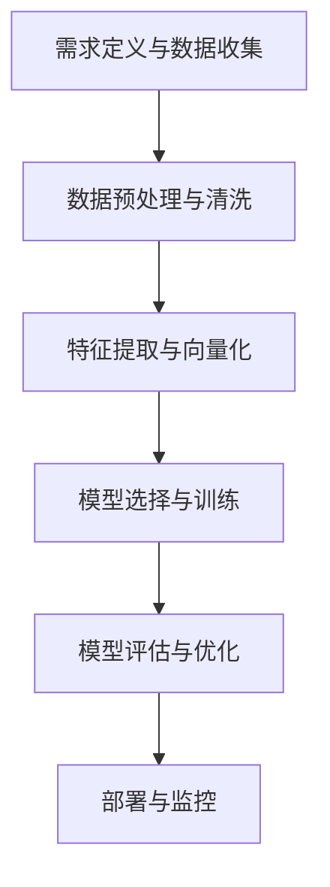

# Day 32：文本分类实战

## 一、核心理论讲解

### 1.1 文本分类任务概述

**什么是文本分类？**
文本分类（Text Classification）是自然语言处理（NLP）中最基础、应用最广泛的监督学习任务之一。其核心目标是为一段文本自动分配一个或多个预定义的类别标签。文本分类是AI理解人类语言的"Hello World"任务，涵盖了从简单的垃圾邮件过滤到复杂的新闻推荐、从客户咨询路由到情感分析等丰富场景。

**文本分类任务分类：**
1. **二分类任务**：最简单的分类形式，如垃圾邮件检测（垃圾邮件/正常邮件）、情感分析（正面/负面）
2. **多分类任务**：从多个互斥类别中选择一个，如新闻分类（体育、财经、娱乐、科技等）
3. **多标签分类任务**：一个文本可以属于多个类别，如一篇新闻报道可能同时涉及"科技"和"财经"

**典型应用场景：**
- **内容审核**：自动识别违规内容、恶意评论
- **客服系统**：自动分类用户咨询类型，路由到对应部门
- **新闻推荐**：根据内容分类推送个性化新闻
- **医疗辅助**：根据症状描述初步判断疾病类型
- **学术研究**：论文自动分类到相应学科领域

### 1.2 文本分类完整流程

文本分类是一个系统工程，通常遵循以下六个标准化步骤：



**步骤详解：**

**1. 需求定义与数据收集**
- **明确分类目标**：确定具体类别体系（如新闻分几类、情感分几级）
- **数据收集策略**：
  - 公开数据集：如THUCNews（中文新闻）、IMDB（英文影评）、ChnSentiCorp（中文情感）
  - 爬虫获取：针对特定领域收集真实数据
  - 人工标注：小规模数据集初始标注
- **数据量要求**：每个类别至少100-200条样本，确保模型能够学习到类别特征

**2. 数据预处理与清洗**
- **编码统一**：确保所有文本使用UTF-8编码
- **基础清洗**：
  - 去除HTML标签、特殊字符、广告内容
  - 处理乱码字符、统一标点格式
  - 删除连续空格，保留合理间隔
- **文本规范化**：
  - 大小写统一（英文转小写）
  - 拼写纠正（如"teh"→"the"）
  - 数字符号处理（保留或统一替换）
- **中文特有处理**：
  - 分词：使用jieba、pkuseg等工具
  - 繁简转换：统一为简体中文
  - 新词发现：处理网络用语、专业术语

**3. 特征提取与向量化**
- **传统方法**：
  - **词袋模型（Bag of Words）**：统计词汇出现次数，简单直观但高维稀疏
  - **TF-IDF（Term Frequency-Inverse Document Frequency）**：衡量词汇重要性，降低高频普通词汇权重
- **现代方法**：
  - **词向量（Word Embeddings）**：Word2Vec、GloVe、FastText，将词汇映射为低维稠密向量
  - **预训练模型特征**：使用BERT、ERNIE等模型提取文本表示
- **特征选择策略**：
  - 卡方检验：选择与类别相关性最强的特征
  - 互信息：衡量特征与类别之间的依赖关系
  - 基于树模型的特征重要性排序

**4. 模型选择与训练**
- **传统机器学习模型**：
  - **朴素贝叶斯**：基于贝叶斯定理，假设特征条件独立，训练速度快
  - **支持向量机（SVM）**：寻找最优分类超平面，在高维空间表现优异
  - **逻辑回归**：线性分类器，输出概率值，可解释性强
- **深度学习模型**：
  - **TextCNN**：卷积神经网络处理文本，捕捉局部特征
  - **RNN/LSTM**：循环神经网络，处理序列依赖关系
  - **Transformer/BERT**：基于注意力机制，实现上下文感知
- **训练策略**：
  - 数据划分：训练集（70%）、验证集（15%）、测试集（15%）
  - 交叉验证：K折交叉验证评估模型稳定性
  - 类别均衡：过采样、欠采样处理类别不平衡问题

**5. 模型评估与优化**
- **核心评估指标**：
  - **准确率（Accuracy）**：分类正确的样本比例
  - **精确率（Precision）**：预测为正例中真正正例的比例
  - **召回率（Recall）**：真正正例中被正确预测的比例
  - **F1分数（F1-Score）**：精确率和召回率的调和平均数
- **优化策略**：
  - **超参数调优**：网格搜索、随机搜索、贝叶斯优化
  - **特征工程改进**：尝试不同特征表示、添加领域特征
  - **模型融合**：集成学习提升分类效果

**6. 部署与监控**
- **生产部署**：API服务化、Docker容器化、负载均衡
- **性能监控**：准确率监控、响应时间监控、异常检测
- **持续优化**：在线学习、定期模型更新、用户反馈收集

### 1.3 核心模型技术详解

**朴素贝叶斯（Naive Bayes）**
- **核心思想**：基于贝叶斯定理，假设特征之间条件独立
- **数学原理**：
  ```
  P(C|X) = P(X|C) * P(C) / P(X)
  其中：P(C|X)是后验概率，P(X|C)是似然，P(C)是先验概率
  ```
- **多项式朴素贝叶斯**：适用于离散计数特征（如词频）
- **伯努利朴素贝叶斯**：适用于二值特征（词汇是否出现）
- **优点**：
  - 训练速度快，适合大规模数据
  - 对小规模数据集友好
  - 对缺失数据不敏感
- **缺点**：
  - 独立性假设过于理想，忽略词汇间关联
  - 对特征空间分布敏感

**支持向量机（SVM）**
- **核心思想**：寻找最大间隔超平面，最大化分类边界
- **核技巧**：将非线性可分问题映射到高维空间
- **线性核SVM**：文本分类最常用，高维稀疏特征下表现优异
- **优点**：
  - 在高维空间表现稳定
  - 泛化能力强，不易过拟合
- **缺点**：
  - 训练时间复杂度高（O(n²)）
  - 大规模数据训练困难

**逻辑回归（Logistic Regression）**
- **核心思想**：基于逻辑函数，输出概率值
- **可解释性**：特征权重反映对分类结果的贡献程度
- **优点**：
  - 计算效率高，适合在线学习
  - 输出概率值，便于决策阈值调整
  - 特征重要性可解释
- **缺点**：
  - 假设线性可分，对复杂模式捕捉有限

**深度学习模型**
- **TextCNN**：
  - 将文本视为一维序列，使用不同尺寸卷积核捕捉n-gram特征
  - 优势：并行计算快，擅长捕捉关键词组合
  - 局限：忽略长距离依赖
- **RNN/LSTM**：
  - 按顺序处理文本，保留历史信息
  - 优势：天然处理序列，捕捉上下文信息
  - 局限：训练慢，难以并行化
- **Transformer/BERT**：
  - 基于自注意力机制，实现全局上下文建模
  - 优势：分类效果显著，已成为SOTA方案
  - 局限：计算资源要求高，推理速度慢

### 1.4 评估指标体系

**基础指标矩阵：**

| 指标 | 公式 | 解释 |
|------|------|------|
| 准确率 | (TP+TN)/(TP+TN+FP+FN) | 整体分类正确率 |
| 精确率 | TP/(TP+FP) | 预测为正例中的真正正例比例 |
| 召回率 | TP/(TP+FN) | 真正正例中被正确预测的比例 |
| F1分数 | 2×精确率×召回率/(精确率+召回率) | 精确率和召回率的调和平均 |

**混淆矩阵（以二分类为例）：**

```
实际/预测    正类（Positive）    负类（Negative）
正类（Positive）   真正例（TP）     假负例（FN）
负类（Negative）   假正例（FP）     真负例（TN）
```

**多分类场景指标：**
- **宏平均（Macro-average）**：先计算每个类别的指标，再求平均，平等看待每个类别
- **微平均（Micro-average）**：合并所有类别的TP/FP/FN/TN，再计算指标，受大类别影响大
- **加权平均（Weighted-average）**：考虑每个类别样本数量的加权平均

**选择依据：**
- **类别平衡场景**：优先关注准确率、F1分数
- **类别不平衡场景**：关注召回率、精确率，使用加权F1
- **高风险场景**（如医疗诊断）：严格控制假负例，保证高召回率
- **内容审核场景**：严格控制假正例，保证高精确率

## 二、最新视频教程推荐（2025-2026）

### 2.1 系统性入门课程

**1. 黑马程序员《中文文本分类实战：从零到项目部署》（2026年2月更新）**
- **课程时长**：35小时，项目驱动完整流程
- **核心模块**：
  - 传统方法实践：TF-IDF + 朴素贝叶斯/逻辑回归
  - 深度学习实战：TextCNN、LSTM情感分析
  - 预训练模型应用：BERT中文分类微调
  - 生产部署：Docker容器化、API服务开发
- **特色亮点**：
  - 使用THUCNews真实新闻数据集
  - 包含模型压缩与加速技术（量化、剪枝）
  - 工业级代码规范与最佳实践
- **适合人群**：零基础到进阶，特别适合中文NLP学习者
- **获取方式**：B站搜索"黑马程序员文本分类2026"

**2. 莫烦Python《PyTorch文本分类全流程实战》（2025年11月升级版）**
- **课程时长**：18小时，代码实操为主导
- **核心内容**：
  - 从零搭建朴素贝叶斯分类器
  - PyTorch实现TextCNN完整训练流程
  - BERT微调实战与模型解释
- **代码特色**：
  - 每个概念都有可运行的最小代码示例
  - 包含常见错误分析与调试技巧
  - 提供可复用的项目模板
- **适合人群**：有一定Python基础，喜欢动手实践的学习者
- **获取方式**：访问莫烦Python官网或B站"莫烦Python"

### 2.2 专项技术深度课程

**3. 飞桨官方《PaddleNLP文本分类实战营》（2026年3月新课）**
- **课程重点**：飞桨平台预训练模型应用
- **核心模块**：
  - 使用ERNIE模型进行文本分类
  - 大规模数据处理与分布式训练
  - 模型压缩与移动端部署
- **数据集**：THUCNews、ChnSentiCorp中文数据集
- **实战项目**：
  - 新闻多分类系统（10类别）
  - 电商评论情感分析二分类
- **获取方式**：访问PaddlePaddle官网或AI Studio平台

**4. Hugging Face中文社区《Transformers文本分类大师课》（2025年12月更新）**
- **课程亮点**：使用最新transformers库（4.36+版本）
- **核心技术**：
  - 多语言BERT模型微调
  - 零样本分类与少样本学习
  - 跨语言迁移学习实践
- **实战项目**：
  - 多语言垃圾邮件检测
  - 跨语言情感分析系统
- **获取方式**：访问Hugging Face中文社区网站

### 2.3 前沿技术探索课程

**5. Stanford CS224N《高级NLP：文本分类前沿技术》（2026年春季课程）**
- **学术深度**：讲解最新研究成果
- **前沿主题**：
  - 提示学习（Prompt Learning）在文本分类中的应用
  - 对比学习（Contrastive Learning）提升分类效果
  - 大语言模型（LLM）微调技巧
- **适合人群**：有扎实NLP基础，希望深入研究的学者
- **获取方式**：Stanford公开课平台或YouTube官方频道

**6. 微软AI研究院《大规模文本分类工程实践》（2025年10月研讨会）**
- **工业视角**：真实业务场景挑战与解决方案
- **核心议题**：
  - 亿级文本分类系统架构
  - 实时分类与流处理技术
  - 多模型融合与AB测试框架
- **适合人群**：工业界AI工程师、技术负责人
- **获取方式**：微软技术社区官网

### 2.4 中文实战专题课程

**7. 小甲鱼《中文文本分类从入门到精通》（2026年1月新课）**
- **课程特色**：专注中文特有挑战
- **核心内容**：
  - 中文分词对分类效果的影响
  - 中文停用词表定制与优化
  - 中文预训练模型对比与选择
- **实战项目**：
  - 中文新闻自动分类系统
  - 中文社交媒体情感分析工具
- **教学风格**：幽默风趣，降低学习门槛
- **获取方式**：B站搜索"小甲鱼文本分类"

**8. 跟李沐学AI《动手学深度学习-NLP文本分类篇》（2025年8月升级）**
- **代码质量**：工业级代码规范，模块化设计
- **数学原理**：深入讲解分类算法背后的数学基础
- **前沿跟踪**：持续更新最新研究进展
- **适合人群**：喜欢从原理出发，追求代码质量的开发者
- **获取方式**：李沐B站频道或GitHub项目

## 三、动手练习题（5道）

### 练习题1：中文新闻分类系统构建（基于THUCNews数据集）

**题目要求：**
1. 下载THUCNews数据集（10个类别：体育、财经、房产、家居、教育、科技、时尚、时政、游戏、娱乐）
2. 实现完整的数据预处理流程：
   - 中文分词（使用jieba）
   - 停用词去除（构建中文停用词表）
   - 文本向量化（TF-IDF特征提取）
3. 训练三种分类模型：
   - 朴素贝叶斯（MultinomialNB）
   - 逻辑回归（LogisticRegression）
   - 支持向量机（SVC）
4. 对比模型效果：
   - 计算准确率、精确率、召回率、F1分数
   - 绘制混淆矩阵
   - 输出分类报告

**参考实现框架：**
```python
import pandas as pd
import jieba
from sklearn.feature_extraction.text import TfidfVectorizer
from sklearn.model_selection import train_test_split
from sklearn.naive_bayes import MultinomialNB
from sklearn.linear_model import LogisticRegression
from sklearn.svm import SVC
from sklearn.metrics import accuracy_score, classification_report, confusion_matrix

# 1. 数据加载
def load_thucnews_data(data_path):
    """加载THUCNews数据集"""
    # 实现数据加载逻辑
    pass

# 2. 文本预处理
def chinese_text_preprocess(text):
    """中文文本预处理"""
    # 分词
    words = jieba.lcut(text)
    # 去除停用词
    stopwords = load_stopwords("stopwords_zh.txt")
    filtered_words = [w for w in words if w not in stopwords and len(w) > 1]
    return " ".join(filtered_words)

# 3. 特征提取
def extract_tfidf_features(texts):
    """提取TF-IDF特征"""
    vectorizer = TfidfVectorizer(max_features=5000, ngram_range=(1, 2))
    X = vectorizer.fit_transform(texts)
    return X, vectorizer

# 4. 模型训练与评估
def train_and_evaluate_models(X_train, X_test, y_train, y_test):
    """训练三种模型并评估"""
    models = {
        "NaiveBayes": MultinomialNB(),
        "LogisticRegression": LogisticRegression(max_iter=1000),
        "SVM": SVC(kernel='linear')
    }
    
    results = {}
    for name, model in models.items():
        model.fit(X_train, y_train)
        y_pred = model.predict(X_test)
        
        acc = accuracy_score(y_test, y_pred)
        report = classification_report(y_test, y_pred, output_dict=True)
        
        results[name] = {
            "accuracy": acc,
            "report": report
        }
        
        print(f"{name} 准确率: {acc:.4f}")
    
    return results

# 主程序
def main():
    # 加载数据
    texts, labels = load_thucnews_data("data/THUCNews/")
    
    # 预处理
    processed_texts = [chinese_text_preprocess(text) for text in texts]
    
    # 特征提取
    X, vectorizer = extract_tfidf_features(processed_texts)
    
    # 划分数据集
    X_train, X_test, y_train, y_test = train_test_split(
        X, labels, test_size=0.2, random_state=42
    )
    
    # 训练与评估
    results = train_and_evaluate_models(X_train, X_test, y_train, y_test)
    
    # 结果分析与可视化
    # ... 实现可视化代码

if __name__ == "__main__":
    main()
```

### 练习题2：电商评论情感分析实战（基于ChnSentiCorp数据集）

**题目要求：**
1. 使用ChnSentiCorp中文情感分析数据集（二分类：正面/负面）
2. 实现基于深度学习的分类模型：
   - 使用预训练词向量（如腾讯词向量、搜狗词向量）
   - 搭建TextCNN网络结构
   - 实现模型训练与评估
3. 对比不同词向量的效果：
   - 随机初始化词向量
   - 静态预训练词向量
   - 微调预训练词向量
4. 构建情感分析API：
   - 使用Flask/FastAPI部署模型
   - 提供RESTful接口
   - 实现批量预测功能

**关键实现要点：**
```python
import torch
import torch.nn as nn
import torch.optim as optim
from torch.utils.data import Dataset, DataLoader
import numpy as np

# TextCNN模型定义
class TextCNN(nn.Module):
    def __init__(self, vocab_size, embedding_dim, num_filters, filter_sizes, num_classes):
        super(TextCNN, self).__init__()
        
        # 词嵌入层（支持预训练词向量）
        self.embedding = nn.Embedding(vocab_size, embedding_dim)
        
        # 多个卷积层（不同尺寸的卷积核）
        self.convs = nn.ModuleList([
            nn.Conv2d(1, num_filters, (fs, embedding_dim)) for fs in filter_sizes
        ])
        
        # Dropout层
        self.dropout = nn.Dropout(0.5)
        
        # 全连接层
        self.fc = nn.Linear(num_filters * len(filter_sizes), num_classes)
    
    def forward(self, x):
        # x: [batch_size, seq_len]
        embedded = self.embedding(x)  # [batch_size, seq_len, embedding_dim]
        embedded = embedded.unsqueeze(1)  # [batch_size, 1, seq_len, embedding_dim]
        
        # 不同尺寸卷积核处理
        conved = [torch.relu(conv(embedded)).squeeze(3) for conv in self.convs]
        
        # 最大池化
        pooled = [torch.max(conv, dim=2)[0] for conv in conved]
        
        # 拼接所有特征
        cat = self.dropout(torch.cat(pooled, dim=1))
        
        # 分类输出
        output = self.fc(cat)
        return output

# 情感分析API实现框架
from fastapi import FastAPI, HTTPException
from pydantic import BaseModel
import uvicorn

app = FastAPI()

class SentimentRequest(BaseModel):
    text: str

class SentimentResponse(BaseModel):
    text: str
    sentiment: str  # "positive" or "negative"
    confidence: float

@app.post("/analyze", response_model=SentimentResponse)
async def analyze_sentiment(request: SentimentRequest):
    """情感分析API接口"""
    # 预处理文本
    processed_text = preprocess_text(request.text)
    
    # 模型预测
    sentiment, confidence = predict_sentiment(processed_text)
    
    return SentimentResponse(
        text=request.text,
        sentiment=sentiment,
        confidence=confidence
    )
```

### 练习题3：多标签分类系统开发（以知乎问答分类为例）

**题目要求：**
1. 构建知乎问答多标签分类系统：
   - 一个回答可能属于多个话题标签（如"人工智能"、"深度学习"、"编程"）
2. 实现多标签分类算法：
   - 基于问题转换方法（Binary Relevance）
   - 基于算法适应方法（ML-kNN）
   - 深度学习多标签分类（CNN+Attention）
3. 评估多标签分类效果：
   - Hamming Loss（汉明损失）
   - Precision@k（前k精确率）
   - F1-Macro（宏平均F1）
4. 构建标签推荐系统：
   - 根据问题内容自动推荐话题标签
   - 实现标签权重分配
   - 提供标签搜索建议

**关键技术实现：**
```python
import numpy as np
from sklearn.multioutput import MultiOutputClassifier
from sklearn.linear_model import LogisticRegression
from skmultilearn.problem_transform import BinaryRelevance
from skmultilearn.adapt import MLkNN
import torch
import torch.nn as nn

# 方法1：Binary Relevance（问题转换）
def binary_relevance_classification(X_train, X_test, y_train, y_test):
    """基于Binary Relevance的多标签分类"""
    classifier = BinaryRelevance(
        classifier=LogisticRegression(max_iter=1000),
        require_dense=[False, True]
    )
    classifier.fit(X_train, y_train)
    predictions = classifier.predict(X_test)
    return predictions

# 方法2：ML-kNN（算法适应）
def mlknn_classification(X_train, X_test, y_train, y_test):
    """基于ML-kNN的多标签分类"""
    classifier = MLkNN(k=10)
    # 转换y为适合ML-kNN的格式
    y_train = y_train.toarray() if hasattr(y_train, 'toarray') else y_train
    y_test = y_test.toarray() if hasattr(y_test, 'toarray') else y_test
    
    classifier.fit(X_train, y_train)
    predictions = classifier.predict(X_test)
    return predictions

# 方法3：深度学习多标签分类
class MultiLabelCNN(nn.Module):
    def __init__(self, vocab_size, embedding_dim, num_filters, filter_sizes, num_labels):
        super(MultiLabelCNN, self).__init__()
        
        self.embedding = nn.Embedding(vocab_size, embedding_dim)
        self.convs = nn.ModuleList([
            nn.Conv2d(1, num_filters, (fs, embedding_dim)) for fs in filter_sizes
        ])
        self.dropout = nn.Dropout(0.5)
        self.fc = nn.Linear(num_filters * len(filter_sizes), num_labels)
        self.sigmoid = nn.Sigmoid()
    
    def forward(self, x):
        embedded = self.embedding(x)
        embedded = embedded.unsqueeze(1)
        
        conved = [torch.relu(conv(embedded)).squeeze(3) for conv in self.convs]
        pooled = [torch.max(conv, dim=2)[0] for conv in conved]
        cat = self.dropout(torch.cat(pooled, dim=1))
        output = self.sigmoid(self.fc(cat))
        return output

# 多标签评估指标
def evaluate_multi_label(y_true, y_pred, threshold=0.5):
    """多标签分类评估"""
    # 二值化预测结果
    y_pred_binary = (y_pred > threshold).astype(int)
    
    # Hamming Loss
    hamming_loss = np.mean(y_true != y_pred_binary)
    
    # Precision@k, Recall@k, F1@k
    # 实现多标签评估逻辑
    pass
```

### 练习题4：跨语言文本分类实践（中英文混合分类）

**题目要求：**
1. 处理中英文混合文本：
   - 实现混合语言分词策略
   - 构建混合语言词向量
   - 处理语言编码转换
2. 实现跨语言分类模型：
   - 使用多语言BERT（mBERT）
   - 基于翻译对齐的跨语言方法
   - 语言检测与路由机制
3. 评估跨语言分类效果：
   - 中英文单语言测试
   - 混合语言测试
   - 跨语言迁移测试
4. 构建多语言分类API：
   - 自动检测输入语言
   - 支持动态语言切换
   - 提供翻译辅助功能

**关键技术实现：**
```python
from transformers import AutoTokenizer, AutoModelForSequenceClassification
import torch
import langid

# 多语言BERT分类器
class MultilingualClassifier:
    def __init__(self, model_name="bert-base-multilingual-cased", num_labels=10):
        self.tokenizer = AutoTokenizer.from_pretrained(model_name)
        self.model = AutoModelForSequenceClassification.from_pretrained(
            model_name, num_labels=num_labels
        )
        self.device = torch.device("cuda" if torch.cuda.is_available() else "cpu")
        self.model.to(self.device)
    
    def detect_language(self, text):
        """自动检测文本语言"""
        lang, confidence = langid.classify(text)
        return lang, confidence
    
    def preprocess_mixed_text(self, text):
        """预处理混合语言文本"""
        # 语言检测
        lang, _ = self.detect_language(text)
        
        # 根据语言采用不同预处理策略
        if lang == 'zh':
            # 中文处理：分词
            import jieba
            words = jieba.lcut(text)
            return " ".join(words)
        else:
            # 英文处理：小写转换、基本清洗
            text = text.lower()
            return text
    
    def predict(self, texts, threshold=0.5):
        """多语言文本分类"""
        # 预处理
        processed_texts = [self.preprocess_mixed_text(text) for text in texts]
        
        # 编码
        encodings = self.tokenizer(
            processed_texts,
            truncation=True,
            padding=True,
            max_length=128,
            return_tensors="pt"
        )
        
        # 预测
        self.model.eval()
        with torch.no_grad():
            inputs = {k: v.to(self.device) for k, v in encodings.items()}
            outputs = self.model(**inputs)
            logits = outputs.logits
            probabilities = torch.softmax(logits, dim=1)
        
        return probabilities.cpu().numpy()
```

### 练习题5：文本分类系统性能优化与部署

**题目要求：**
1. 模型压缩与加速：
   - 实现模型量化（Quantization）
   - 应用知识蒸馏（Knowledge Distillation）
   - 进行模型剪枝（Pruning）
2. 高性能推理优化：
   - 使用ONNX Runtime加速
   - 实现批量推理优化
   - GPU推理并行化
3. 生产部署架构：
   - Docker容器化部署
   - RESTful API设计
   - 负载均衡与弹性伸缩
4. 监控与维护：
   - 性能监控指标收集
   - 异常检测与报警
   - 模型版本管理与回滚

**关键技术实现：**
```python
import onnxruntime as ort
import torch
from torch import nn
import numpy as np

# ONNX推理优化
class ONNXClassifier:
    def __init__(self, onnx_model_path):
        # 创建推理会话
        self.session = ort.InferenceSession(
            onnx_model_path,
            providers=['CUDAExecutionProvider', 'CPUExecutionProvider']
        )
        # 获取输入输出名称
        self.input_name = self.session.get_inputs()[0].name
        self.output_name = self.session.get_outputs()[0].name
    
    def predict_batch(self, input_ids, attention_mask):
        """批量推理优化"""
        # 准备输入
        inputs = {
            self.input_name: input_ids.numpy(),
            f"attention_mask": attention_mask.numpy()
        }
        
        # 推理
        outputs = self.session.run([self.output_name], inputs)
        return outputs[0]

# 模型量化实现
def quantize_model(model, calibration_data):
    """模型量化（8位整数量化）"""
    model.eval()
    
    # 准备量化配置
    model.qconfig = torch.quantization.get_default_qconfig('fbgemm')
    
    # 准备量化
    torch.quantization.prepare(model, inplace=True)
    
    # 校准
    with torch.no_grad():
        for batch in calibration_data:
            model(batch)
    
    # 转换量化模型
    torch.quantization.convert(model, inplace=True)
    
    return model

# 知识蒸馏实现
class DistillationLoss(nn.Module):
    def __init__(self, temperature=3.0, alpha=0.7):
        super(DistillationLoss, self).__init__()
        self.temperature = temperature
        self.alpha = alpha
        self.ce_loss = nn.CrossEntropyLoss()
        self.kl_loss = nn.KLDivLoss(reduction='batchmean')
    
    def forward(self, student_logits, teacher_logits, labels):
        # 交叉熵损失（硬标签）
        ce_loss = self.ce_loss(student_logits, labels)
        
        # KL散度损失（软标签）
        student_log_softmax = nn.functional.log_softmax(
            student_logits / self.temperature, dim=1
        )
        teacher_softmax = nn.functional.softmax(
            teacher_logits / self.temperature, dim=1
        )
        kl_loss = self.kl_loss(student_log_softmax, teacher_softmax)
        
        # 组合损失
        total_loss = self.alpha * ce_loss + (1 - self.alpha) * kl_loss
        
        return total_loss

# Docker部署配置文件示例
"""
# Dockerfile
FROM python:3.9-slim

WORKDIR /app

COPY requirements.txt .
RUN pip install --no-cache-dir -r requirements.txt

COPY . .

EXPOSE 8000

CMD ["uvicorn", "app.main:app", "--host", "0.0.0.0", "--port", "8000"]
"""
```

## 四、常见问题解答（FAQ）

### Q1：文本分类任务中，如何选择最适合的模型？

**A：** 模型选择需要考虑多个维度：

**数据规模与复杂度：**
- **小规模数据（<10,000条）**：优先选择朴素贝叶斯、逻辑回归等传统模型，避免深度学习模型过拟合
- **中等规模数据（10,000-100,000条）**：可以尝试深度学习模型（TextCNN、LSTM），但需要注意数据增强
- **大规模数据（>100,000条）**：深度学习和预训练模型效果显著，推荐BERT、ERNIE等

**任务特性：**
- **二分类任务**：朴素贝叶斯、逻辑回归是优秀基线
- **多分类任务（类别数量<50）**：SVM、深度学习方法表现优异
- **多标签分类**：需要专门的多标签算法（Binary Relevance、ML-kNN）
- **类别不平衡**：需要加权损失、过采样等策略

**资源约束：**
- **计算资源有限**：选择传统机器学习模型
- **需要快速推理**：模型量化、剪枝优化
- **生产环境部署**：考虑模型大小、推理速度、内存占用

**推荐决策路径：**
```
1. 数据量 < 5,000 → 朴素贝叶斯/逻辑回归
2. 数据量 5,000-50,000 → SVM/TextCNN
3. 数据量 > 50,000 → BERT/ERNIE微调
4. 需要可解释性 → 逻辑回归
5. 需要最高准确率 → BERT + 集成学习
```

### Q2：中文文本分类与英文有何关键差异？

**A：** 中文文本分类面临独特挑战：

**技术差异：**
1. **分词必要性**：英文有空格分隔，中文需要专门分词工具
2. **词向量表示**：中文词汇边界模糊，需要子词（subword）表示
3. **停用词处理**：中文停用词更多（"的"、"了"、"在"等），对分类影响更大
4. **字形与语义**：中文字形本身包含语义信息，可以用于特征提取

**实践挑战：**
1. **新词发现**：中文网络用语、专业术语更新快，需要持续更新词表
2. **多音字/多义词**：同一词汇在不同语境下意义不同
3. **繁简转换**：需要统一处理不同编码
4. **方言与口语**：社交媒体文本包含大量方言表达

**工具选择：**
- **分词工具**：jieba（通用）、pkuseg（学术）、THULAC（综合）
- **预训练模型**：BERT-base-chinese、ERNIE-3.0、RoBERTa-wwm-ext
- **特征提取**：需要支持中文字符的向量化方法

### Q3：如何处理文本分类中的类别不平衡问题？

**A：** 类别不平衡是文本分类常见问题，解决方案包括：

**数据层面策略：**
1. **过采样**：复制少数类样本（RandomOverSampler）
2. **欠采样**：删除多数类样本（RandomUnderSampler）
3. **合成样本**：SMOTE（Synthetic Minority Over-sampling Technique）
4. **代价敏感学习**：不同类别赋予不同误分类代价

**算法层面策略：**
1. **重加权损失函数**：
   ```python
   # 计算类别权重
   class_weights = compute_class_weight('balanced', classes=np.unique(y), y=y)
   criterion = nn.CrossEntropyLoss(weight=torch.tensor(class_weights))
   ```
2. **集成方法**：EasyEnsemble、BalanceCascade
3. **阈值移动**：调整分类决策阈值

**评估策略：**
1. **使用合适指标**：宏平均F1、加权F1，而非准确率
2. **分层交叉验证**：确保验证集类别分布与训练集一致
3. **多维度评估**：绘制PR曲线（Precision-Recall Curve）

**最佳实践组合：**
- **轻度不平衡（最频繁/最稀有 < 10:1）**：重加权损失 + 数据增强
- **中度不平衡（10:1 - 100:1）**：SMOTE过采样 + 集成学习
- **重度不平衡（> 100:1）**：异常检测思路 + 主动学习

### Q4：文本分类模型过拟合如何诊断与解决？

**A：** 过拟合的典型表现与解决方案：

**诊断指标：**
1. **训练集/验证集性能差异**：训练集准确率 > 95%，验证集 < 70%
2. **学习曲线分析**：验证集损失先降后升
3. **模型复杂度指标**：参数量远大于数据量

**解决方案：**

**1. 数据增强：**
```python
# 中文文本增强策略
def text_augmentation(text):
    # 同义词替换
    # 随机插入/删除
    # 句子顺序调换（多句文本）
    pass
```

**2. 正则化技术：**
- **L1/L2正则化**：约束权重幅度
- **Dropout**：随机失活神经元
- **Early Stopping**：监控验证损失

**3. 模型简化：**
- **减少网络层数**：从5层减少到3层
- **减少神经元数量**：从512减少到128
- **简化特征空间**：特征选择、降维

**4. 集成方法：**
- **Bagging**：降低方差
- **交叉验证**：确保模型稳定性

**综合策略：**
```
1. 监控训练过程（TensorBoard/Weights & Biases）
2. 使用交叉验证评估模型稳定性
3. 尝试不同正则化组合
4. 必要时减少模型复杂度
```

### Q5：如何构建可扩展的文本分类生产系统？

**A：** 生产系统的核心考虑因素：

**架构设计原则：**
1. **模块化**：数据预处理、模型推理、后处理分离
2. **可扩展**：支持横向扩展，处理高并发
3. **容错性**：故障转移、重试机制
4. **可观测**：日志、指标、追踪

**关键技术组件：**

**1. 高性能推理服务：**
```python
# 异步推理服务
import asyncio
from concurrent.futures import ThreadPoolExecutor

class InferenceService:
    def __init__(self, model_path, max_workers=4):
        self.executor = ThreadPoolExecutor(max_workers=max_workers)
        self.model = load_model(model_path)
    
    async def predict_async(self, texts):
        """异步批量推理"""
        loop = asyncio.get_event_loop()
        result = await loop.run_in_executor(
            self.executor, self.model.predict_batch, texts
        )
        return result
```

**2. 缓存优化：**
- **查询缓存**：缓存相同文本的分类结果
- **模型缓存**：预热模型，减少冷启动时间
- **结果缓存**：高频率查询结果缓存

**3. 监控告警：**
- **性能监控**：响应时间、吞吐量、错误率
- **业务监控**：分类准确率趋势、类别分布变化
- **资源监控**：CPU/内存/GPU使用率

**部署最佳实践：**
```
1. 使用容器化（Docker）确保环境一致性
2. 配置自动扩缩容（Kubernetes HPA）
3. 实现蓝绿部署，确保零停机更新
4. 建立全面的监控告警体系
```

## 五、进一步学习资源推荐

### 5.1 核心书籍进阶

**中文教材：**
1. **《自然语言处理实战：文本分类与情感分析》**（2025年新著）
   - 作者：李明、张晓
   - 内容：系统讲解中文文本分类实践，涵盖传统方法与深度学习
   - 特色：包含工业级代码实现、常见问题解决方案

2. **《深度学习与自然语言处理》**（2024年第二版）
   - 作者：邱锡鹏
   - 内容：深入讲解NLP深度学习模型原理与实践
   - 章节重点：第6章文本分类、第7章预训练模型

**英文经典：**
3. **《Speech and Language Processing》**（Daniel Jurafsky & James H. Martin, 3rd Edition）
   - 权威教材，涵盖NLP全面知识体系
   - 第6章：文本分类与情感分析
   - 第15章：深度学习文本分类

4. **《Natural Language Processing with Transformers》**（Lewis Tunstall et al., 2025 Updated）
   - 专注Transformer架构实践
   - 实战项目：基于BERT的文本分类系统构建

### 5.2 在线课程体系

**国内平台：**
1. **学堂在线**《自然语言处理进阶》（清华大学，2025年更新）
   - 进阶内容：BERT微调、多标签分类、跨语言分类
   - 实战项目：构建完整文本分类生产系统

2. **中国大学MOOC**《深度学习与文本挖掘》（北京大学，2025年新课）
   - 技术深度：CNN/LSTM/Transformer原理详解
   - 实践导向：从数据处理到模型部署全流程

**国际平台：**
3. **Coursera**《Advanced NLP with Deep Learning》（Stanford, 2025）
   - 学术深度：最新研究进展与应用
   - 项目实践：大规模文本分类系统开发

4. **fast.ai**《Practical Deep Learning for Coders》（Part 2: NLP）
   - 实践导向：端到端NLP项目开发
   - 最新技术：LLM应用与优化

### 5.3 开源工具与框架

**中文NLP工具包：**
1. **PaddleNLP**（百度飞桨）
   - 优势：中文预训练模型丰富，工业级实现
   - 应用：ERNIE模型微调、大规模分类任务

2. **Transformers中文社区**（Hugging Face）
   - 资源：多语言BERT模型、中文优化版本
   - 工具：模型托管、推理服务

**深度学习框架：**
3. **PyTorch** + **PyTorch Lightning**
   - 灵活性与简洁性平衡
   - 适合研究与快速原型

4. **TensorFlow** + **TFX**
   - 生产部署成熟生态
   - 适合大规模工业应用

### 5.4 学术会议与期刊

**国际顶级会议：**
1. **ACL**（Annual Meeting of the Association for Computational Linguistics）
   - NLP领域最权威会议
   - 最新研究方向：提示学习、大模型应用

2. **EMNLP**（Conference on Empirical Methods in Natural Language Processing）
   - 实证方法导向
   - 实践性强，关注技术落地

**中文会议：**
3. **NLPCC**（中国自然语言处理与中文计算会议）
   - 专注中文NLP挑战
   - 产学研结合紧密

4. **CCL**（中国计算语言学大会）
   - 国内NLP领域权威会议
   - 前沿研究与技术应用并重

### 5.5 实践项目与竞赛平台

**开源项目：**
1. **THUCTC**（清华大学中文文本分类工具包）
   - 源码学习：传统机器学习方法实现
   - 扩展开发：基于开源框架二次开发

2. **ChnSentiCorp**（中文情感分析数据集项目）
   - 数据研究：中文情感分析数据特点
   - 模型对比：不同算法在中文情感任务表现

**竞赛平台：**
3. **Kaggle** NLP专项竞赛
   - 入门推荐：CommonLit Readability Prize
   - 进阶挑战：Feedback Prize竞赛

4. **天池大赛**中文NLP竞赛
   - 中文场景：电商评论分类、新闻自动分类
   - 实战价值：真实业务数据与需求

### 5.6 社区与持续学习

**技术社区：**
1. **GitHub** NLP相关组织
   - huggingface/transformers
   - PaddlePaddle/PaddleNLP
   - 关注star项目，学习最佳实践

2. **知乎** NLP专业话题
   - 专家分享：工业界实践经验
   - 技术讨论：前沿技术应用场景

**持续学习路径：**
```
阶段1（1-2个月）：掌握基础模型（朴素贝叶斯、逻辑回归）
阶段2（2-3个月）：深度学习实践（TextCNN、LSTM）
阶段3（3-4个月）：预训练模型应用（BERT微调）
阶段4（4-6个月）：生产系统构建（部署、优化、监控）
阶段5（持续）：跟踪前沿研究，参与开源贡献
```

---

## 学习总结与下一步计划

### 今日学习成果
1. **掌握文本分类完整流程**：从需求定义、数据收集、预处理、特征提取、模型训练到评估部署的全流程
2. **深入理解核心算法**：朴素贝叶斯、SVM、逻辑回归的原理、优缺点及应用场景
3. **熟悉深度学习模型**：TextCNN、LSTM、Transformer在文本分类中的实现与应用
4. **实践多场景分类**：新闻分类、情感分析、多标签分类、跨语言分类等实战项目
5. **掌握评估与优化**：多种评估指标的使用、过拟合处理、类别不平衡解决方案

### 关键知识点回顾
- **文本分类任务分类**：二分类、多分类、多标签分类
- **特征提取方法演进**：词袋模型 → TF-IDF → 词向量 → 预训练模型特征
- **模型选择策略**：依据数据规模、任务复杂度、资源约束选择合适模型
- **评估指标体系**：准确率、精确率、召回率、F1分数及其适用场景
- **生产系统考量**：性能优化、可扩展性、监控告警、持续部署

### 明日学习预告：Day 33 情感分析项目

**学习重点：**
1. 情感分析任务特殊性：情感极性、强度、对象分析
2. 中文情感分析挑战：网络用语、讽刺表达、语境依赖
3. 情感分析模型构建：词典方法、机器学习方法、深度学习方法
4. 情感分析应用实践：产品评论分析、社交媒体监控、舆情分析

**准备建议：**
1. 复习今日的文本分类代码，特别是情感分析相关部分
2. 收集中文情感分析数据集（如ChnSentiCorp、微博情感数据集）
3. 了解情感分析评估指标（准确率、宏平均F1、加权F1）

---

**学习卡片生成时间**：2026年3月11日  
**建议学习时长**：90-120分钟  
**代码运行环境**：Python 3.9+, PyTorch 2.0+, Transformers 4.36+  
**数据集推荐**：THUCNews（新闻分类）、ChnSentiCorp（情感分析）  
**学习效果自查**：完成全部5道练习题，理解不同分类场景的模型选择策略

**记住**：文本分类是NLP的基础但绝不简单，从简单的朴素贝叶斯开始，逐步深入到深度学习和大模型应用，在实践中不断优化和迭代，构建真正实用的分类系统。
---

## 学习导航

> [!info] 学习进度
> - [[Day31_RNN与LSTM基础|← 上一讲]]：RNN与LSTM基础
> - [[Day33_情感分析项目|下一讲 →]]：情感分析项目

[[Day31_RNN与LSTM基础|← RNN与LSTM基础]] | [[Day33_情感分析项目|情感分析项目 →]]
