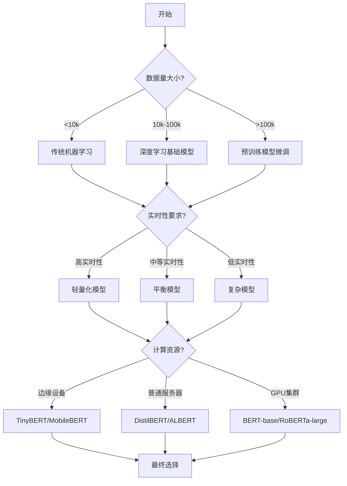

# Day 33：情感分析项目实战

## 一、核心理论讲解

### 1.1 情感分析任务概述

**什么是情感分析？**
情感分析（Sentiment Analysis）又称观点挖掘（Opinion Mining），是自然语言处理（NLP）的核心任务之一，旨在从文本中自动识别、提取和分析情感倾向。情感分析让计算机能够"读懂"文字背后的情绪，为商业决策、用户洞察和产品优化提供数据支持。

**核心任务类型：**

1. **二分类情感分析**：最简单形式，判断文本情感极性为正面（Positive）或负面（Negative）
   - 应用：电商好评/差评识别、用户满意度评估
   - 示例："这个产品太棒了！" → 正面

2. **三分类情感分析**：在正面/负面基础上增加中性（Neutral）类别
   - 应用：社交媒体情绪监控、新闻情感倾向分析
   - 示例："今天天气还可以。" → 中性

3. **细粒度情感分析**：识别具体情感类别（如喜悦、愤怒、悲伤、恐惧、厌恶、惊讶）
   - 应用：心理状态评估、用户情感深度分析
   - 示例："听到这个消息我太震惊了！" → 惊讶

4. **方面级情感分析**：针对文本中提到的特定方面（Aspect）进行情感判断
   - 应用：产品多维评价、服务细项评分
   - 示例："手机相机很清晰，但电池续航一般" → 相机：正面，电池：负面

### 1.2 情感分析技术演进路径

**阶段一：基于规则与词典的方法（1990s-2000s）**
- **原理**：构建情感词典（如LIWC、SentiWordNet），结合语法规则计算情感分值
- **实现**：
  ```python
  # 简化的词典方法示例
  positive_words = ["好", "棒", "优秀", "满意", "喜欢"]
  negative_words = ["差", "糟糕", "失望", "讨厌", "差劲"]
  
  def simple_sentiment_analysis(text):
      positive_count = sum(1 for word in text if word in positive_words)
      negative_count = sum(1 for word in text if word in negative_words)
      
      if positive_count > negative_count:
          return "正面"
      elif negative_count > positive_count:
          return "负面"
      else:
          return "中性"
  ```
- **优点**：可解释性强，无需训练数据
- **缺点**：无法处理复杂语境、反讽、上下文依赖

**阶段二：机器学习方法（2010s初期）**
- **特征工程**：TF-IDF、词袋模型、n-gram特征
- **分类算法**：朴素贝叶斯、支持向量机（SVM）、逻辑回归
- **实现框架**：
  ```python
  from sklearn.feature_extraction.text import TfidfVectorizer
  from sklearn.svm import LinearSVC
  from sklearn.model_selection import train_test_split
  
  # 特征提取
  vectorizer = TfidfVectorizer(max_features=5000, ngram_range=(1, 2))
  X = vectorizer.fit_transform(texts)
  
  # 模型训练
  model = LinearSVC(random_state=42)
  model.fit(X_train, y_train)
  ```
- **优点**：相比词典方法效果显著提升，可处理更复杂模式
- **缺点**：特征工程复杂，难以捕捉深层语义

**阶段三：深度学习方法（2010s后期）**
- **关键技术**：词向量（Word2Vec、GloVe）、循环神经网络（RNN/LSTM/GRU）、注意力机制
- **模型演进**：
  1. **LSTM模型**：通过门控机制处理长序列，捕捉上下文信息
  2. **BiLSTM**：双向处理文本，同时考虑前向和后向信息
  3. **TextCNN**：卷积神经网络处理文本，捕捉局部特征模式
- **实现示例**：
  ```python
  import torch
  import torch.nn as nn
  
  class SentimentLSTM(nn.Module):
      def __init__(self, vocab_size, embed_dim, hidden_dim, num_classes):
          super(SentimentLSTM, self).__init__()
          self.embedding = nn.Embedding(vocab_size, embed_dim)
          self.lstm = nn.LSTM(embed_dim, hidden_dim, batch_first=True, bidirectional=True)
          self.fc = nn.Linear(hidden_dim * 2, num_classes)
          self.dropout = nn.Dropout(0.5)
      
      def forward(self, x):
          embedded = self.embedding(x)
          output, (hidden, cell) = self.lstm(embedded)
          hidden = torch.cat((hidden[-2], hidden[-1]), dim=1)
          hidden = self.dropout(hidden)
          output = self.fc(hidden)
          return output
  ```
- **优点**：自动特征学习，上下文建模能力强
- **缺点**：需要大量标注数据，训练成本高

**阶段四：预训练模型与大语言模型时代（2020s至今）**
- **范式转变**：从"数据驱动"转向"模型驱动"
- **关键技术**：
  1. **BERT/ERNIE/RoBERTa**：基于Transformer的双向预训练模型
  2. **少样本/零样本学习**：通过提示工程（Prompt Engineering）减少数据依赖
  3. **多任务统一**：单个模型处理多种情感分析任务
- **前沿趋势**：
  - **多模态情感分析**：结合文本、图像、语音综合分析
  - **动态情感追踪**：情感随时间变化的建模与分析
  - **情感因果推理**：理解情感产生的原因与机制

### 1.3 情感分析评估指标体系

**核心评估指标：**

| 指标 | 计算公式 | 解释说明 |
|------|---------|---------|
| 准确率（Accuracy） | (TP+TN)/(TP+TN+FP+FN) | 整体分类正确率 |
| 精确率（Precision） | TP/(TP+FP) | 预测为正例中的真正正例比例 |
| 召回率（Recall） | TP/(TP+FN) | 真正正例中被正确预测的比例 |
| F1分数（F1-Score） | 2×Precision×Recall/(Precision+Recall) | 精确率和召回率的调和平均 |
| 宏平均F1（Macro-F1） | 各类别F1分数的平均值 | 平等看待每个类别 |
| 加权F1（Weighted-F1） | 按类别样本数加权的F1平均值 | 考虑类别不平衡 |

**混淆矩阵分析（二分类场景）：**
```
实际\预测    Positive    Negative
Positive      TP           FN
Negative      FP           TN
```

**多分类场景评估策略：**
1. **宏平均（Macro-average）**：每个类别平等对待，计算各指标后取平均
2. **微平均（Micro-average）**：合并所有类别的TP/FP/FN/TN进行计算
3. **加权平均（Weighted-average）**：根据类别样本数量进行加权计算

**选择评估指标的考量因素：**
- **业务场景**：
  - 客服场景：优先保证高召回率（不漏掉负面用户）
  - 内容审核：优先保证高精确率（不误判正常内容）
- **类别分布**：
  - 平衡数据：准确率、F1分数
  - 不平衡数据：加权F1、精确率-召回率曲线（PR Curve）
- **风险成本**：
  - 高误判成本：严格控制FP或FN
  - 低成本场景：关注整体准确率

### 1.4 情感分析应用场景深度解析

**场景一：电商评论智能分析系统**
- **业务需求**：海量商品评论自动分类，提取用户真实反馈
- **技术挑战**：
  1. 短文本、口语化表达（"绝绝子"、"yyds"）
  2. 混合情感表达（"手机很好，就是价格贵了点"）
  3. 方面级情感识别（相机、电池、屏幕等不同维度）
- **解决方案**：
  - 使用多任务学习联合训练情感分类和方面提取
  - 构建领域情感词典（电商专用情感词）
  - 实现方面级情感聚合可视化

**场景二：社交媒体情绪监控平台**
- **业务需求**：实时监测话题情感倾向，预警负面舆论爆发
- **技术挑战**：
  1. 高速实时处理（秒级响应）
  2. 多语言混合处理
  3. 网络用语、表情符号理解
- **解决方案**：
  - 流式计算框架（Spark Streaming/Flink）
  - 多语言预训练模型（mBERT/XLM-R）
  - 表情符号情感映射词典

**场景三：客户服务智能辅助系统**
- **业务需求**：自动识别用户情绪，优先处理紧急问题
- **技术挑战**：
  1. 结合对话上下文的情感分析
  2. 用户情绪动态变化追踪
  3. 个性化回复策略生成
- **解决方案**：
  - 基于序列标注的对话情感分析
  - 情绪状态转移模型（马尔可夫链）
  - 情感自适应回复生成

## 二、最新视频教程推荐（2025-2026）

### 2.1 系统性入门课程

**1. 黑马程序员《中文情感分析实战：从零到项目部署》（2026年3月更新）**
- **课程时长**：28小时，覆盖完整项目流程
- **核心模块**：
  - 情感分析理论基础与任务定义
  - 传统方法实现：情感词典+SVM
  - 深度学习模型：LSTM情感分类实战
  - 预训练模型：BERT中文情感分析微调
  - 生产部署：FastAPI服务+Docker容器化
- **数据集**：ChnSentiCorp（中文情感分析语料）、电商评论数据集
- **实战项目**：
  - 电商评论情感分析系统
  - 社交媒体情绪监控平台
  - 客户服务智能助手
- **获取方式**：B站搜索"黑马程序员情感分析2026"

**2. 飞桨官方《PaddleNLP情感分析实战营》（2026年2月新课）**
- **课程重点**：基于飞桨生态的情感分析全流程
- **核心技术**：
  - ERNIE-SAT（情感感知预训练模型）
  - 方面级情感分析技术（ABSA）
  - 细粒度情感分类（六类情感）
- **特色亮点**：
  - 使用PaddleNLP高阶API快速开发
  - 支持GPU分布式训练加速
  - 提供行业解决方案模板
- **适合人群**：希望快速实现生产级应用的中文NLP开发者
- **获取方式**：访问PaddlePaddle官网或AI Studio平台

### 2.2 深度学习专项课程

**3. 莫烦Python《PyTorch情感分析项目实战》（2025年12月升级版）**
- **课程时长**：15小时，代码实操为主
- **核心内容**：
  - LSTM情感分类模型从零实现
  - Attention机制在情感分析中的应用
  - 情感分析模型的可视化与解释
- **代码特色**：
  - 模块化设计，代码可复用性强
  - 包含数据增强与过采样技术
  - 提供模型压缩与量化示例
- **适合人群**：有一定PyTorch基础，希望深入理解深度学习实现细节
- **获取方式**：访问莫烦Python官网或B站"莫烦Python"

**4. 跟李沐学AI《动手学深度学习-情感分析篇》（2025年11月更新）**
- **学术深度**：理论推导与代码实现并重
- **前沿技术**：
  - Transformer在情感分析中的应用
  - 自监督学习在情感分析中的实践
  - 大语言模型情感分析前沿进展
- **代码质量**：工业级代码规范，工程化思维培养
- **适合人群**：喜欢从原理出发，追求代码质量的AI研究者
- **获取方式**：李沐B站频道或GitHub项目"d2l-zh"

### 2.3 前沿技术探索课程

**5. Stanford CS224U《情感计算与语言理解》（2026年春季课程）**
- **研究深度**：涵盖情感计算的多个维度
- **前沿主题**：
  - 跨文化情感差异建模
  - 多模态情感融合技术
  - 情感因果推理机制
- **学术资源**：提供最新研究论文解读与复现指导
- **适合人群**：NLP研究方向的研究生和学者
- **获取方式**：Stanford公开课平台或YouTube官方频道

**6. 微软AI研究院《大规模情感分析系统工程》（2025年10月研讨会）**
- **工业视角**：实际业务场景中的挑战与解决方案
- **核心议题**：
  - 亿级文本情感分析架构设计
  - 实时情感流处理技术
  - 多模型融合与AB测试框架
- **实战案例**：Azure情感分析服务架构解析
- **适合人群**：工业界AI工程师、架构师、技术负责人
- **获取方式**：微软技术社区官网

### 2.4 中文实战专题课程

**7. StructBERT中文情感分析实战教程（2026年2月）**
- **课程特色**：专注中文情感分析，基于阿里达摩院StructBERT模型
- **核心内容**：
  - StructBERT模型原理与特点
  - 中文情感分析特有挑战（分词、新词、网络用语）
  - 实战Web界面开发与部署
- **教学风格**：从零开始，手把手教学
- **获取方式**：CSDN星图平台搜索"StructBERT情感分类"

**8. Qwen All-in-One情感分析与对话实战（2026年1月）**
- **创新架构**：单一模型实现情感分析+智能对话双功能
- **技术特点**：
  - 基于Qwen1.5-0.5B轻量级大模型
  - 通过Prompt工程实现多任务切换
  - CPU友好，无需GPU环境
- **实战项目**：情感分析对话助手开发
- **获取方式**：CSDN星图平台搜索"Qwen All-in-One"

## 三、动手练习题（5道）

### 练习题1：电商评论情感分析系统构建（基于ChnSentiCorp数据集）

**题目要求：**
1. 下载ChnSentiCorp中文情感分析数据集（二分类：正面/负面，约9600条评论）
2. 实现三种不同技术路线的情感分类模型：
   - 传统方法：TF-IDF特征 + SVM分类器
   - 深度学习方法：预训练词向量 + TextCNN模型
   - 预训练模型方法：BERT中文模型微调
3. 对比分析三种方法的性能差异：
   - 准确率、精确率、召回率、F1分数
   - 训练时间、推理速度、模型大小
   - 对特殊表达（反讽、混合情感）的处理能力
4. 构建Web界面展示系统：
   - 实时情感分析演示
   - 批量文件上传分析
   - 情感统计可视化

**参考实现框架：**
```python
import pandas as pd
import torch
import torch.nn as nn
from sklearn.feature_extraction.text import TfidfVectorizer
from sklearn.svm import LinearSVC
from sklearn.metrics import classification_report
from transformers import BertTokenizer, BertForSequenceClassification
import warnings
warnings.filterwarnings('ignore')

# 数据加载与预处理
def load_chsenti_corpus(data_path="data/ChnSentiCorp/"):
    """加载ChnSentiCorp数据集"""
    texts, labels = [], []
    
    # 处理正样本
    pos_path = f"{data_path}pos/"
    # 实现文件读取逻辑
    
    # 处理负样本  
    neg_path = f"{data_path}neg/"
    # 实现文件读取逻辑
    
    return texts, labels

# 方法1：TF-IDF + SVM
def tfidf_svm_classification(X_train, X_test, y_train, y_test):
    """传统机器学习方法"""
    # TF-IDF特征提取
    vectorizer = TfidfVectorizer(max_features=5000, ngram_range=(1, 2))
    X_train_tfidf = vectorizer.fit_transform(X_train)
    X_test_tfidf = vectorizer.transform(X_test)
    
    # SVM模型训练
    svm_model = LinearSVC(random_state=42, max_iter=2000)
    svm_model.fit(X_train_tfidf, y_train)
    
    # 预测与评估
    y_pred = svm_model.predict(X_test_tfidf)
    report = classification_report(y_test, y_pred, output_dict=True)
    
    return svm_model, vectorizer, report

# 方法2：TextCNN深度学习模型
class TextCNN(nn.Module):
    def __init__(self, vocab_size, embed_dim, num_filters, filter_sizes, num_classes):
        super(TextCNN, self).__init__()
        
        # 词嵌入层
        self.embedding = nn.Embedding(vocab_size, embed_dim)
        
        # 多个卷积层
        self.convs = nn.ModuleList([
            nn.Conv2d(1, num_filters, (fs, embed_dim)) for fs in filter_sizes
        ])
        
        # Dropout层
        self.dropout = nn.Dropout(0.5)
        
        # 全连接分类层
        self.fc = nn.Linear(num_filters * len(filter_sizes), num_classes)
    
    def forward(self, x):
        # x: [batch_size, seq_len]
        embedded = self.embedding(x)  # [batch_size, seq_len, embed_dim]
        embedded = embedded.unsqueeze(1)  # [batch_size, 1, seq_len, embed_dim]
        
        # 卷积处理
        conved = [torch.relu(conv(embedded)).squeeze(3) for conv in self.convs]
        
        # 最大池化
        pooled = [torch.max(conv, dim=2)[0] for conv in conved]
        
        # 特征拼接
        cat = self.dropout(torch.cat(pooled, dim=1))
        
        # 分类输出
        output = self.fc(cat)
        return output

# 方法3：BERT模型微调
def bert_fine_tuning(X_train, X_test, y_train, y_test):
    """基于BERT的预训练模型微调"""
    # 加载中文BERT模型
    tokenizer = BertTokenizer.from_pretrained('bert-base-chinese')
    model = BertForSequenceClassification.from_pretrained(
        'bert-base-chinese', 
        num_labels=2
    )
    
    # 数据编码
    train_encodings = tokenizer(
        X_train, truncation=True, padding=True, max_length=128
    )
    test_encodings = tokenizer(
        X_test, truncation=True, padding=True, max_length=128
    )
    
    # 转换为PyTorch数据集
    class SentimentDataset(torch.utils.data.Dataset):
        def __init__(self, encodings, labels):
            self.encodings = encodings
            self.labels = labels
        
        def __getitem__(self, idx):
            item = {key: torch.tensor(val[idx]) for key, val in self.encodings.items()}
            item['labels'] = torch.tensor(self.labels[idx])
            return item
        
        def __len__(self):
            return len(self.labels)
    
    train_dataset = SentimentDataset(train_encodings, y_train)
    test_dataset = SentimentDataset(test_encodings, y_test)
    
    # 训练配置
    training_args = {
        'output_dir': './results',
        'num_train_epochs': 3,
        'per_device_train_batch_size': 16,
        'per_device_eval_batch_size': 64,
        'warmup_steps': 500,
        'weight_decay': 0.01,
        'logging_dir': './logs',
    }
    
    # 训练器设置与训练
    # ... 实现训练逻辑
    
    return model, tokenizer

# 主程序
def main():
    print("电商评论情感分析系统构建")
    
    # 1. 数据加载与预处理
    texts, labels = load_chsenti_corpus()
    print(f"数据集大小: {len(texts)}条评论")
    
    # 2. 划分训练集和测试集
    from sklearn.model_selection import train_test_split
    X_train, X_test, y_train, y_test = train_test_split(
        texts, labels, test_size=0.2, random_state=42, stratify=labels
    )
    
    # 3. 方法1：TF-IDF + SVM
    print("\n=== 方法1：TF-IDF + SVM ===")
    svm_model, vectorizer, svm_report = tfidf_svm_classification(
        X_train, X_test, y_train, y_test
    )
    print(f"SVM准确率: {svm_report['accuracy']:.4f}")
    
    # 4. 方法2：深度学习TextCNN
    print("\n=== 方法2：TextCNN深度学习模型 ===")
    # 实现TextCNN训练逻辑
    
    # 5. 方法3：BERT微调
    print("\n=== 方法3：BERT预训练模型微调 ===")
    bert_model, bert_tokenizer = bert_fine_tuning(
        X_train, X_test, y_train, y_test
    )
    
    # 6. 综合对比分析
    print("\n=== 三种方法性能对比 ===")
    # 实现对比分析逻辑

if __name__ == "__main__":
    main()
```

### 练习题2：电影评论情感分析项目（基于IMDB数据集）

**题目要求：**
1. 使用IMDB电影评论数据集（二分类：正面/负面，5万条评论）
2. 实现基于LSTM的深度学习情感分析模型
3. 优化模型性能：
   - 超参数调优（学习率、隐藏层维度、Dropout率）
   - 数据增强技术（同义词替换、随机插入、随机交换）
   - 模型集成方法（Bagging、Stacking）
4. 构建用户友好的交互界面：
   - 输入单条评论实时分析
   - 上传CSV文件批量分析
   - 情感分析报告生成

**关键实现要点：**
```python
import torch
import torch.nn as nn
import torch.optim as optim
from torch.utils.data import Dataset, DataLoader
import numpy as np
from sklearn.model_selection import train_test_split
import pandas as pd

# 数据准备
def prepare_imdb_data(data_path="data/imdb.csv"):
    """准备IMDB数据集"""
    df = pd.read_csv(data_path)
    
    # 文本预处理函数
    def preprocess_text(text):
        # 转换为小写
        text = text.lower()
        # 移除HTML标签
        import re
        text = re.sub(r'<[^>]+>', '', text)
        # 处理特殊字符
        text = re.sub(r'[^a-zA-Z\s]', '', text)
        return text
    
    # 标签编码：positive -> 1, negative -> 0
    df['sentiment'] = df['sentiment'].map({'positive': 1, 'negative': 0})
    
    # 应用预处理
    df['review'] = df['review'].apply(preprocess_text)
    
    return df['review'].values, df['sentiment'].values

# LSTM情感分析模型
class SentimentLSTM(nn.Module):
    def __init__(self, vocab_size, embed_dim, hidden_dim, num_layers, num_classes):
        super(SentimentLSTM, self).__init__()
        
        # 词嵌入层
        self.embedding = nn.Embedding(vocab_size, embed_dim)
        
        # LSTM层
        self.lstm = nn.LSTM(
            embed_dim, 
            hidden_dim, 
            num_layers,
            batch_first=True,
            dropout=0.3 if num_layers > 1 else 0
        )
        
        # Dropout层
        self.dropout = nn.Dropout(0.5)
        
        # 全连接分类层
        self.fc = nn.Linear(hidden_dim, num_classes)
    
    def forward(self, x):
        # 词嵌入
        embedded = self.embedding(x)  # [batch_size, seq_len, embed_dim]
        
        # LSTM处理
        lstm_out, (hidden, cell) = self.lstm(embedded)
        
        # 取最后一个时间步的隐藏状态
        hidden = hidden[-1]  # [batch_size, hidden_dim]
        
        # Dropout
        hidden = self.dropout(hidden)
        
        # 分类输出
        output = self.fc(hidden)
        return output

# 训练函数
def train_lstm_model(model, train_loader, val_loader, num_epochs=10, learning_rate=0.001):
    """训练LSTM模型"""
    # 损失函数和优化器
    criterion = nn.CrossEntropyLoss()
    optimizer = optim.Adam(model.parameters(), lr=learning_rate)
    
    # 训练循环
    for epoch in range(num_epochs):
        model.train()
        train_loss = 0.0
        train_correct = 0
        train_total = 0
        
        for batch_idx, (inputs, labels) in enumerate(train_loader):
            optimizer.zero_grad()
            
            # 前向传播
            outputs = model(inputs)
            loss = criterion(outputs, labels)
            
            # 反向传播
            loss.backward()
            optimizer.step()
            
            # 统计指标
            train_loss += loss.item()
            _, predicted = torch.max(outputs.data, 1)
            train_total += labels.size(0)
            train_correct += (predicted == labels).sum().item()
            
            # 每100个batch打印一次进度
            if batch_idx % 100 == 0:
                print(f'Epoch [{epoch+1}/{num_epochs}], '
                      f'Batch [{batch_idx}/{len(train_loader)}], '
                      f'Loss: {loss.item():.4f}')
        
        # 计算训练集指标
        train_accuracy = 100 * train_correct / train_total
        train_loss = train_loss / len(train_loader)
        
        # 验证集评估
        val_accuracy, val_loss = evaluate_model(model, val_loader, criterion)
        
        print(f'Epoch [{epoch+1}/{num_epochs}]')
        print(f'  Train Loss: {train_loss:.4f}, Train Acc: {train_accuracy:.2f}%')
        print(f'  Val Loss: {val_loss:.4f}, Val Acc: {val_accuracy:.2f}%')
    
    return model

# 模型评估函数
def evaluate_model(model, data_loader, criterion):
    """评估模型性能"""
    model.eval()
    total_loss = 0.0
    correct = 0
    total = 0
    
    with torch.no_grad():
        for inputs, labels in data_loader:
            outputs = model(inputs)
            loss = criterion(outputs, labels)
            
            total_loss += loss.item()
            _, predicted = torch.max(outputs.data, 1)
            total += labels.size(0)
            correct += (predicted == labels).sum().item()
    
    accuracy = 100 * correct / total
    avg_loss = total_loss / len(data_loader)
    
    return accuracy, avg_loss

# 数据增强函数
def text_augmentation(text, augmentation_rate=0.3):
    """文本数据增强"""
    import random
    words = text.split()
    
    # 同义词替换
    if random.random() < augmentation_rate:
        # 实现同义词替换逻辑
        pass
    
    # 随机插入
    if random.random() < augmentation_rate:
        # 实现随机插入逻辑
        pass
    
    # 随机交换
    if random.random() < augmentation_rate:
        # 实现随机交换逻辑
        pass
    
    return ' '.join(words)

# 主程序
def main():
    print("电影评论情感分析项目")
    
    # 1. 数据准备
    texts, labels = prepare_imdb_data()
    print(f"数据集大小: {len(texts)}条评论")
    
    # 2. 构建词汇表
    from collections import Counter
    word_counter = Counter()
    for text in texts:
        words = text.split()
        word_counter.update(words)
    
    # 取前50000个常见词
    vocab_size = 50000
    vocab = {word: idx+1 for idx, (word, _) in enumerate(word_counter.most_common(vocab_size))}
    vocab['<PAD>'] = 0
    vocab['<UNK>'] = vocab_size + 1
    
    # 3. 文本转换为索引序列
    def text_to_indices(text):
        words = text.split()
        indices = [vocab.get(word, vocab['<UNK>']) for word in words]
        return indices
    
    # 4. 填充序列到固定长度
    max_len = 200
    def pad_sequence(indices):
        if len(indices) > max_len:
            return indices[:max_len]
        else:
            return indices + [vocab['<PAD>']] * (max_len - len(indices))
    
    # 5. 创建数据集类
    class IMDBDataset(Dataset):
        def __init__(self, texts, labels):
            self.texts = texts
            self.labels = labels
        
        def __len__(self):
            return len(self.texts)
        
        def __getitem__(self, idx):
            text = self.texts[idx]
            label = self.labels[idx]
            
            # 文本转索引
            indices = text_to_indices(text)
            # 填充序列
            indices = pad_sequence(indices)
            
            return torch.tensor(indices), torch.tensor(label)
    
    # 6. 划分数据集
    X_train, X_temp, y_train, y_temp = train_test_split(
        texts, labels, test_size=0.3, random_state=42, stratify=labels
    )
    X_val, X_test, y_val, y_test = train_test_split(
        X_temp, y_temp, test_size=0.5, random_state=42, stratify=y_temp
    )
    
    # 7. 创建数据加载器
    train_dataset = IMDBDataset(X_train, y_train)
    val_dataset = IMDBDataset(X_val, y_val)
    test_dataset = IMDBDataset(X_test, y_test)
    
    train_loader = DataLoader(train_dataset, batch_size=32, shuffle=True)
    val_loader = DataLoader(val_dataset, batch_size=64, shuffle=False)
    test_loader = DataLoader(test_dataset, batch_size=64, shuffle=False)
    
    # 8. 创建模型
    embed_dim = 128
    hidden_dim = 256
    num_layers = 2
    num_classes = 2
    
    model = SentimentLSTM(
        vocab_size=len(vocab),
        embed_dim=embed_dim,
        hidden_dim=hidden_dim,
        num_layers=num_layers,
        num_classes=num_classes
    )
    
    # 9. 训练模型
    model = train_lstm_model(
        model, train_loader, val_loader,
        num_epochs=10, learning_rate=0.001
    )
    
    # 10. 测试集评估
    criterion = nn.CrossEntropyLoss()
    test_accuracy, test_loss = evaluate_model(model, test_loader, criterion)
    print(f"\n测试集结果: 准确率 {test_accuracy:.2f}%, 损失 {test_loss:.4f}")

if __name__ == "__main__":
    main()
```

### 练习题3：细粒度情感分析系统开发（六类情感分类）

**题目要求：**
1. 构建细粒度情感分析系统，识别六种基础情感：
   - 喜悦（Joy）、悲伤（Sadness）、愤怒（Anger）
   - 恐惧（Fear）、厌恶（Disgust）、惊讶（Surprise）
2. 使用多标签分类方法：
   - 方法一：Binary Relevance（每个情感单独分类）
   - 方法二：Classifier Chains（考虑情感间的依赖关系）
   - 方法三：深度学习多标签分类（共享底层特征）
3. 评估多标签分类性能：
   - Hamming Loss（汉明损失）
   - Precision@k（前k精确率）
   - F1-Macro（宏平均F1）
4. 构建情感可视化仪表板：
   - 情感分布饼图
   - 情感强度热力图
   - 情感时间变化趋势图

**关键技术实现：**
```python
import numpy as np
import pandas as pd
import torch
import torch.nn as nn
import torch.optim as optim
from torch.utils.data import Dataset, DataLoader
from sklearn.multioutput import MultiOutputClassifier
from sklearn.linear_model import LogisticRegression
from skmultilearn.problem_transform import BinaryRelevance, ClassifierChain
import warnings
warnings.filterwarnings('ignore')

# 细粒度情感数据集准备
def prepare_fine_grained_data():
    """准备细粒度情感分析数据集"""
    # 示例：可以使用GoEmotions、EmoBank等细粒度情感数据集
    # 这里用模拟数据演示
    
    # 六类情感标签
    emotions = ['joy', 'sadness', 'anger', 'fear', 'disgust', 'surprise']
    
    # 模拟文本数据
    texts = [
        "我今天中了大奖，真是太开心了！",
        "听到这个坏消息，我感到非常难过。",
        "这种不公平的待遇让我很愤怒！",
        "独自走夜路时，我总是感到害怕。",
        "这种味道让我觉得恶心。",
        "突然出现的烟花让我大吃一惊。"
    ]
    
    # 多标签标注（每句话可能有多种情感）
    labels = [
        [1, 0, 0, 0, 0, 1],  # joy + surprise
        [0, 1, 0, 0, 0, 0],  # sadness
        [0, 0, 1, 0, 0, 0],  # anger
        [0, 0, 0, 1, 0, 0],  # fear
        [0, 0, 0, 0, 1, 0],  # disgust
        [0, 0, 0, 0, 0, 1],  # surprise
    ]
    
    return texts, np.array(labels), emotions

# 方法1：Binary Relevance
def binary_relevance_method(X_train, X_test, y_train, y_test):
    """Binary Relevance多标签分类"""
    # 创建Binary Relevance分类器
    clf = BinaryRelevance(
        classifier=LogisticRegression(max_iter=1000),
        require_dense=[False, True]
    )
    
    # 训练
    clf.fit(X_train, y_train)
    
    # 预测
    y_pred = clf.predict(X_test)
    
    return y_pred, clf

# 方法2：深度学习多标签分类模型
class MultiEmotionClassifier(nn.Module):
    def __init__(self, vocab_size, embed_dim, hidden_dim, num_emotions):
        super(MultiEmotionClassifier, self).__init__()
        
        # 词嵌入层
        self.embedding = nn.Embedding(vocab_size, embed_dim)
        
        # BiLSTM层
        self.lstm = nn.LSTM(
            embed_dim, hidden_dim,
            batch_first=True, bidirectional=True,
            dropout=0.3
        )
        
        # 注意力机制
        self.attention = nn.Linear(hidden_dim * 2, 1)
        
        # 全连接层（多标签输出）
        self.fc = nn.Linear(hidden_dim * 2, num_emotions)
        
        # Sigmoid激活（多标签分类）
        self.sigmoid = nn.Sigmoid()
    
    def forward(self, x):
        # 词嵌入
        embedded = self.embedding(x)  # [batch_size, seq_len, embed_dim]
        
        # LSTM处理
        lstm_out, _ = self.lstm(embedded)  # [batch_size, seq_len, hidden_dim*2]
        
        # 注意力权重计算
        attention_weights = torch.softmax(
            self.attention(lstm_out), dim=1
        )  # [batch_size, seq_len, 1]
        
        # 加权和
        context_vector = torch.sum(
            attention_weights * lstm_out, dim=1
        )  # [batch_size, hidden_dim*2]
        
        # 分类输出
        logits = self.fc(context_vector)  # [batch_size, num_emotions]
        outputs = self.sigmoid(logits)  # [batch_size, num_emotions]
        
        return outputs, attention_weights

# 多标签评估函数
def evaluate_multi_label(y_true, y_pred, threshold=0.5):
    """评估多标签分类性能"""
    # 二值化预测结果
    y_pred_binary = (y_pred > threshold).astype(int)
    
    # Hamming Loss（越小越好）
    hamming_loss = np.mean(y_true != y_pred_binary)
    
    # Precision@k, Recall@k, F1@k
    # 实现多标签评估逻辑
    
    # 示例指标计算
    tp = np.sum(y_true * y_pred_binary, axis=1)
    fp = np.sum((1 - y_true) * y_pred_binary, axis=1)
    fn = np.sum(y_true * (1 - y_pred_binary), axis=1)
    
    # 防止除以零
    precision = np.zeros_like(tp, dtype=float)
    recall = np.zeros_like(tp, dtype=float)
    
    mask_precision = (tp + fp) > 0
    mask_recall = (tp + fn) > 0
    
    precision[mask_precision] = tp[mask_precision] / (tp[mask_precision] + fp[mask_precision])
    recall[mask_recall] = tp[mask_recall] / (tp[mask_recall] + fn[mask_recall])
    
    # F1分数
    f1 = np.zeros_like(precision)
    mask_f1 = (precision + recall) > 0
    f1[mask_f1] = 2 * precision[mask_f1] * recall[mask_f1] / (precision[mask_f1] + recall[mask_f1])
    
    # 宏平均
    macro_precision = np.mean(precision[mask_precision]) if np.any(mask_precision) else 0
    macro_recall = np.mean(recall[mask_recall]) if np.any(mask_recall) else 0
    macro_f1 = np.mean(f1[mask_f1]) if np.any(mask_f1) else 0
    
    return {
        'hamming_loss': hamming_loss,
        'precision': macro_precision,
        'recall': macro_recall,
        'f1': macro_f1
    }

# 情感可视化函数
def visualize_emotions(emotions, emotion_scores, text):
    """可视化情感分析结果"""
    import matplotlib.pyplot as plt
    import seaborn as sns
    
    # 设置中文字体
    plt.rcParams['font.sans-serif'] = ['Noto Sans CJK JP']
    plt.rcParams['axes.unicode_minus'] = False
    
    fig, axes = plt.subplots(2, 2, figsize=(14, 10))
    
    # 1. 情感分布饼图
    axes[0, 0].pie(emotion_scores, labels=emotions, autopct='%1.1f%%')
    axes[0, 0].set_title('情感分布饼图')
    
    # 2. 情感强度条形图
    axes[0, 1].barh(emotions, emotion_scores)
    axes[0, 1].set_title('情感强度条形图')
    axes[0, 1].set_xlabel('情感强度')
    
    # 3. 情感热力图（多情感对比）
    emotion_matrix = np.array([emotion_scores])
    sns.heatmap(emotion_matrix, annot=True, fmt='.2f',
                xticklabels=emotions, yticklabels=['当前文本'],
                ax=axes[1, 0])
    axes[1, 0].set_title('情感热力图')
    
    # 4. 文本情感雷达图
    angles = np.linspace(0, 2 * np.pi, len(emotions), endpoint=False).tolist()
    emotion_scores_closed = emotion_scores.tolist() + [emotion_scores[0]]
    angles_closed = angles + [angles[0]]
    
    axes[1, 1].plot(angles_closed, emotion_scores_closed, 'o-', linewidth=2)
    axes[1, 1].fill(angles_closed, emotion_scores_closed, alpha=0.25)
    axes[1, 1].set_xticks(angles)
    axes[1, 1].set_xticklabels(emotions)
    axes[1, 1].set_title('情感雷达图')
    axes[1, 1].grid(True)
    
    plt.suptitle(f'文本情感分析结果: "{text[:50]}..."', fontsize=16)
    plt.tight_layout()
    plt.show()

# 主程序
def main():
    print("细粒度情感分析系统开发")
    
    # 1. 数据准备
    texts, labels, emotions = prepare_fine_grained_data()
    print(f"情感类别: {emotions}")
    print(f"数据集大小: {len(texts)}条文本")
    print(f"多标签示例: {labels[0]} -> {emotions}")
    
    # 2. 特征提取（这里用TF-IDF作为示例）
    from sklearn.feature_extraction.text import TfidfVectorizer
    vectorizer = TfidfVectorizer(max_features=5000)
    X = vectorizer.fit_transform(texts)
    
    # 3. 划分数据集
    from sklearn.model_selection import train_test_split
    X_train, X_test, y_train, y_test = train_test_split(
        X, labels, test_size=0.3, random_state=42
    )
    
    # 4. 方法1：Binary Relevance
    print("\n=== 方法1：Binary Relevance ===")
    y_pred_br, br_model = binary_relevance_method(
        X_train, X_test, y_train, y_test
    )
    
    # 评估Binary Relevance
    br_metrics = evaluate_multi_label(
        y_test.toarray() if hasattr(y_test, 'toarray') else y_test,
        y_pred_br.toarray() if hasattr(y_pred_br, 'toarray') else y_pred_br
    )
    print(f"Hamming Loss: {br_metrics['hamming_loss']:.4f}")
    print(f"Precision: {br_metrics['precision']:.4f}")
    print(f"Recall: {br_metrics['recall']:.4f}")
    print(f"F1 Score: {br_metrics['f1']:.4f}")
    
    # 5. 方法2：深度学习模型
    print("\n=== 方法2：深度学习多标签分类 ===")
    # 实现深度学习模型训练逻辑
    
    # 6. 情感可视化
    print("\n=== 情感可视化演示 ===")
    # 选择一条文本进行可视化
    sample_text = texts[0]
    sample_scores = labels[0].astype(float)
    
    visualize_emotions(emotions, sample_scores, sample_text)

if __name__ == "__main__":
    main()
```

### 练习题4：情感分析API服务开发与部署

**题目要求：**
1. 基于FastAPI开发情感分析RESTful API服务：
   - 单条文本分析接口：POST /analyze
   - 批量文件分析接口：POST /batch-analyze
   - 模型状态查询接口：GET /health
2. 实现API功能模块：
   - 文本预处理模块
   - 模型推理模块
   - 结果格式化模块
   - 错误处理模块
3. 部署优化策略：
   - 模型缓存与预热
   - 异步请求处理
   - 请求限流与熔断
4. 容器化部署：
   - Docker镜像构建
   - 生产环境配置
   - 健康检查与监控

**关键技术实现：**
```python
from fastapi import FastAPI, HTTPException, UploadFile, File, BackgroundTasks
from fastapi.responses import JSONResponse
from pydantic import BaseModel
import uvicorn
import torch
import numpy as np
from typing import List, Dict, Any
import json
import asyncio
from datetime import datetime
import pandas as pd
import time
import logging

# 配置日志
logging.basicConfig(level=logging.INFO)
logger = logging.getLogger(__name__)

# 初始化FastAPI应用
app = FastAPI(
    title="情感分析API服务",
    description="提供文本情感分析功能的RESTful API",
    version="1.0.0"
)

# 数据模型定义
class SentimentRequest(BaseModel):
    text: str
    model_type: str = "bert"  # bert, lstm, svm

class SentimentResponse(BaseModel):
    text: str
    sentiment: str
    confidence: float
    model_type: str
    processing_time: float

class BatchRequest(BaseModel):
    texts: List[str]
    model_type: str = "bert"

class HealthResponse(BaseModel):
    status: str
    timestamp: str
    model_status: Dict[str, bool]
    system_metrics: Dict[str, Any]

# 全局变量（实际应用中应该使用更好的设计模式）
model_cache = {}
request_counter = 0
start_time = datetime.now()

# 模型加载函数（模拟）
def load_model(model_type: str):
    """加载指定的情感分析模型"""
    logger.info(f"加载模型: {model_type}")
    
    if model_type == "bert":
        # 模拟BERT模型加载
        class MockBertModel:
            def predict(self, text):
                # 模拟预测逻辑
                import random
                sentiments = ["positive", "negative", "neutral"]
                sentiment = random.choice(sentiments)
                confidence = random.uniform(0.7, 0.99)
                return sentiment, confidence
        
        return MockBertModel()
    
    elif model_type == "lstm":
        # 模拟LSTM模型加载
        class MockLSTMModel:
            def predict(self, text):
                import random
                sentiments = ["positive", "negative"]
                sentiment = random.choice(sentiments)
                confidence = random.uniform(0.6, 0.95)
                return sentiment, confidence
        
        return MockLSTMModel()
    
    else:
        raise ValueError(f"不支持的模型类型: {model_type}")

# 文本预处理函数
def preprocess_text(text: str) -> str:
    """文本预处理"""
    # 基础清洗
    import re
    text = re.sub(r'[^\w\s]', '', text)  # 移除标点符号
    text = text.lower()  # 转换为小写
    text = re.sub(r'\s+', ' ', text).strip()  # 移除多余空格
    
    return text

# 情感分析核心函数
def analyze_sentiment_core(text: str, model_type: str = "bert") -> Dict[str, Any]:
    """情感分析核心逻辑"""
    start_time = time.time()
    
    # 检查模型缓存
    if model_type not in model_cache:
        model_cache[model_type] = load_model(model_type)
    
    model = model_cache[model_type]
    
    # 文本预处理
    processed_text = preprocess_text(text)
    
    # 模型预测
    sentiment, confidence = model.predict(processed_text)
    
    # 计算处理时间
    processing_time = time.time() - start_time
    
    return {
        "text": text,
        "sentiment": sentiment,
        "confidence": confidence,
        "model_type": model_type,
        "processing_time": processing_time
    }

# API端点定义
@app.get("/")
async def root():
    """根端点"""
    return {
        "message": "情感分析API服务",
        "version": "1.0.0",
        "endpoints": [
            "/analyze - 单条文本情感分析",
            "/batch-analyze - 批量文本情感分析",
            "/health - 系统健康状态",
            "/docs - API文档"
        ]
    }

@app.post("/analyze", response_model=SentimentResponse)
async def analyze_sentiment(request: SentimentRequest):
    """单条文本情感分析接口"""
    global request_counter
    request_counter += 1
    
    try:
        # 验证输入
        if not request.text or len(request.text.strip()) == 0:
            raise HTTPException(status_code=400, detail="文本内容不能为空")
        
        # 长度限制
        if len(request.text) > 10000:
            raise HTTPException(status_code=400, detail="文本过长，请限制在10000字符以内")
        
        # 执行情感分析
        result = analyze_sentiment_core(request.text, request.model_type)
        
        # 记录日志
        logger.info(f"情感分析请求 - 文本: {request.text[:50]}..., "
                   f"结果: {result['sentiment']}, 置信度: {result['confidence']:.4f}")
        
        return result
        
    except ValueError as e:
        raise HTTPException(status_code=400, detail=str(e))
    except Exception as e:
        logger.error(f"情感分析出错: {str(e)}")
        raise HTTPException(status_code=500, detail="内部服务器错误")

@app.post("/batch-analyze")
async def batch_analyze(file: UploadFile = File(...), model_type: str = "bert"):
    """批量文本情感分析接口"""
    try:
        # 检查文件类型
        if file.content_type not in ['text/csv', 'application/json', 'text/plain']:
            raise HTTPException(
                status_code=400,
                detail="不支持的文件类型，请上传CSV、JSON或TXT文件"
            )
        
        # 根据文件类型解析数据
        if file.content_type == 'text/csv':
            content = await file.read()
            df = pd.read_csv(pd.io.common.BytesIO(content))
            
            # 假设CSV文件有'text'列
            if 'text' not in df.columns:
                raise HTTPException(
                    status_code=400,
                    detail="CSV文件必须包含'text'列"
                )
            
            texts = df['text'].tolist()
            
        elif file.content_type == 'application/json':
            content = await file.read()
            data = json.loads(content)
            
            if isinstance(data, list):
                texts = data
            elif isinstance(data, dict) and 'texts' in data:
                texts = data['texts']
            else:
                raise HTTPException(
                    status_code=400,
                    detail="JSON格式不正确，应为文本数组或包含'texts'键的对象"
                )
        
        else:  # text/plain
            content = await file.read()
            texts = content.decode('utf-8').split('\n')
        
        # 批处理情感分析
        results = []
        for text in texts:
            if text.strip():  # 跳过空行
                result = analyze_sentiment_core(text.strip(), model_type)
                results.append(result)
        
        return {
            "total": len(results),
            "processed": len(texts),
            "results": results
        }
        
    except Exception as e:
        logger.error(f"批量分析出错: {str(e)}")
        raise HTTPException(status_code=500, detail="文件处理错误")

@app.get("/health", response_model=HealthResponse)
async def health_check():
    """系统健康状态检查接口"""
    global request_counter
    
    # 检查模型状态
    model_status = {}
    for model_type in ["bert", "lstm", "svm"]:
        try:
            if model_type not in model_cache:
                model_cache[model_type] = load_model(model_type)
            model_status[model_type] = True
        except:
            model_status[model_type] = False
    
    # 计算系统运行时间
    uptime = (datetime.now() - start_time).total_seconds()
    
    # 系统指标
    system_metrics = {
        "uptime_seconds": uptime,
        "total_requests": request_counter,
        "requests_per_second": request_counter / max(uptime, 1),
        "models_loaded": len(model_cache),
        "timestamp": datetime.now().isoformat()
    }
    
    # 总体状态
    overall_status = "healthy" if all(model_status.values()) else "degraded"
    
    return {
        "status": overall_status,
        "timestamp": datetime.now().isoformat(),
        "model_status": model_status,
        "system_metrics": system_metrics
    }

# 后台任务：定期清理模型缓存
async def cleanup_model_cache():
    """定期清理模型缓存"""
    while True:
        await asyncio.sleep(3600)  # 每小时清理一次
        
        # 清理超过30分钟未使用的模型
        # 实际实现中需要更复杂的缓存管理
        logger.info("执行模型缓存清理...")
        
        # 这里简化实现
        if len(model_cache) > 5:
            # 清理部分模型
            keys_to_remove = list(model_cache.keys())[:2]
            for key in keys_to_remove:
                del model_cache[key]
                logger.info(f"清理模型缓存: {key}")

# 启动事件
@app.on_event("startup")
async def startup_event():
    """应用启动时执行"""
    logger.info("情感分析API服务启动中...")
    
    # 预热常用模型
    logger.info("预热模型...")
    for model_type in ["bert", "lstm"]:
        try:
            model_cache[model_type] = load_model(model_type)
            logger.info(f"模型预热完成: {model_type}")
        except Exception as e:
            logger.warning(f"模型预热失败 {model_type}: {str(e)}")
    
    # 启动后台任务
    asyncio.create_task(cleanup_model_cache())
    logger.info("情感分析API服务启动完成")

@app.on_event("shutdown")
async def shutdown_event():
    """应用关闭时执行"""
    logger.info("情感分析API服务关闭中...")
    # 清理资源
    model_cache.clear()
    logger.info("情感分析API服务关闭完成")

# API限流中间件（简化实现）
@app.middleware("http")
async def rate_limit_middleware(request, call_next):
    """API限流中间件"""
    # 简单限流：每秒最多10个请求
    # 实际应用中应该使用更复杂的限流策略
    
    # 获取客户端IP
    client_ip = request.client.host
    
    # 这里简化实现，实际应用中应该使用令牌桶或漏桶算法
    # 记录请求时间等
    
    response = await call_next(request)
    return response

# 主程序入口
if __name__ == "__main__":
    # 启动FastAPI应用
    uvicorn.run(
        app,
        host="0.0.0.0",
        port=8000,
        log_level="info"
    )
```

### 练习题5：情感分析模型性能优化与对比实验

**题目要求：**
1. 设计全面的情感分析模型对比实验：
   - 对比模型：BERT, RoBERTa, DistilBERT, ALBERT, TextCNN, LSTM, SVM
   - 对比维度：准确率、训练时间、推理速度、模型大小、内存占用
2. 实施模型优化技术：
   - 模型量化（INT8量化、FP16混合精度）
   - 知识蒸馏（从BERT到DistilBERT）
   - 模型剪枝（基于权重重要性的结构化剪枝）
3. 构建自动化实验框架：
   - 统一数据预处理管道
   - 标准化模型训练流程
   - 自动化性能评估报告生成
4. 进行系统化性能分析：
   - 计算复杂度分析（FLOPs、参数量）
   - 实际部署性能测试（延迟、吞吐量）
   - 资源消耗分析（CPU/GPU利用率、内存占用）

**关键技术实现：**
```python
import torch
import torch.nn as nn
import torch.optim as optim
import numpy as np
import pandas as pd
import time
import json
from datetime import datetime
from pathlib import Path
from typing import Dict, List, Any, Tuple
import warnings
warnings.filterwarnings('ignore')

# 实验配置类
class ExperimentConfig:
    """情感分析实验配置"""
    def __init__(self):
        # 数据集配置
        self.dataset_name = "IMDB"
        self.train_size = 25000
        self.test_size = 25000
        
        # 模型配置
        self.models_to_test = [
            "bert", "roberta", "distilbert", "albert",
            "textcnn", "lstm", "svm"
        ]
        
        # 训练配置
        self.num_epochs = 5
        self.batch_size = 32
        self.learning_rate = 2e-5
        
        # 评估指标
        self.metrics = [
            "accuracy", "precision", "recall", "f1",
            "training_time", "inference_time",
            "model_size_mb", "memory_usage_mb"
        ]
        
        # 优化配置
        self.optimizations = [
            "baseline",
            "quantization_int8",
            "quantization_fp16",
            "knowledge_distillation",
            "pruning_structured"
        ]

# 基准测试类
class SentimentBenchmark:
    """情感分析模型基准测试"""
    def __init__(self, config: ExperimentConfig):
        self.config = config
        self.results = {}
        self.models = {}
        
    def prepare_dataset(self) -> Tuple[List[str], List[int], List[str], List[int]]:
        """准备数据集"""
        print("准备数据集...")
        
        # 这里用模拟数据，实际应用中应该加载真实数据集
        # 例如：IMDB、ChnSentiCorp等
        
        # 生成模拟文本
        import random
        import string
        
        def generate_random_text(length=100):
            return ''.join(random.choice(string.ascii_letters + ' ') 
                          for _ in range(length))
        
        # 生成训练集
        train_texts = [generate_random_text(random.randint(50, 200)) 
                      for _ in range(self.config.train_size)]
        train_labels = [random.randint(0, 1) 
                       for _ in range(self.config.train_size)]
        
        # 生成测试集
        test_texts = [generate_random_text(random.randint(50, 200)) 
                     for _ in range(self.config.test_size)]
        test_labels = [random.randint(0, 1) 
                      for _ in range(self.config.test_size)]
        
        print(f"训练集: {len(train_texts)}条，测试集: {len(test_texts)}条")
        
        return train_texts, train_labels, test_texts, test_labels
    
    def load_model(self, model_name: str) -> nn.Module:
        """加载指定模型"""
        print(f"加载模型: {model_name}")
        
        if model_name == "bert":
            from transformers import BertForSequenceClassification
            return BertForSequenceClassification.from_pretrained(
                'bert-base-uncased', num_labels=2
            )
        elif model_name == "roberta":
            from transformers import RobertaForSequenceClassification
            return RobertaForSequenceClassification.from_pretrained(
                'roberta-base', num_labels=2
            )
        elif model_name == "distilbert":
            from transformers import DistilBertForSequenceClassification
            return DistilBertForSequenceClassification.from_pretrained(
                'distilbert-base-uncased', num_labels=2
            )
        elif model_name == "albert":
            from transformers import AlbertForSequenceClassification
            return AlbertForSequenceClassification.from_pretrained(
                'albert-base-v2', num_labels=2
            )
        elif model_name == "textcnn":
            # 定义TextCNN模型
            class TextCNN(nn.Module):
                def __init__(self, vocab_size=30000, embed_dim=128, 
                           num_filters=100, filter_sizes=[3,4,5], 
                           num_classes=2):
                    super(TextCNN, self).__init__()
                    
                    self.embedding = nn.Embedding(vocab_size, embed_dim)
                    self.convs = nn.ModuleList([
                        nn.Conv2d(1, num_filters, (fs, embed_dim)) 
                        for fs in filter_sizes
                    ])
                    self.dropout = nn.Dropout(0.5)
                    self.fc = nn.Linear(num_filters * len(filter_sizes), num_classes)
                
                def forward(self, x):
                    embedded = self.embedding(x)
                    embedded = embedded.unsqueeze(1)
                    
                    conved = [torch.relu(conv(embedded)).squeeze(3) 
                             for conv in self.convs]
                    pooled = [torch.max(conv, dim=2)[0] 
                             for conv in conved]
                    
                    cat = self.dropout(torch.cat(pooled, dim=1))
                    output = self.fc(cat)
                    return output
            
            return TextCNN()
        
        elif model_name == "lstm":
            # 定义LSTM模型
            class SentimentLSTM(nn.Module):
                def __init__(self, vocab_size=30000, embed_dim=128, 
                           hidden_dim=256, num_layers=2, num_classes=2):
                    super(SentimentLSTM, self).__init__()
                    
                    self.embedding = nn.Embedding(vocab_size, embed_dim)
                    self.lstm = nn.LSTM(embed_dim, hidden_dim, num_layers,
                                       batch_first=True, dropout=0.3)
                    self.fc = nn.Linear(hidden_dim, num_classes)
                
                def forward(self, x):
                    embedded = self.embedding(x)
                    lstm_out, (hidden, cell) = self.lstm(embedded)
                    hidden = hidden[-1]
                    output = self.fc(hidden)
                    return output
            
            return SentimentLSTM()
        
        else:
            raise ValueError(f"不支持的模型: {model_name}")
    
    def apply_optimization(self, model: nn.Module, optimization: str) -> nn.Module:
        """应用优化技术"""
        print(f"应用优化: {optimization}")
        
        if optimization == "baseline":
            return model
            
        elif optimization == "quantization_int8":
            # INT8量化
            try:
                model.eval()
                model.qconfig = torch.quantization.get_default_qconfig('fbgemm')
                model = torch.quantization.prepare(model, inplace=False)
                # 实际应用中需要校准数据
                model = torch.quantization.convert(model, inplace=False)
                return model
            except Exception as e:
                print(f"量化失败: {e}")
                return model
                
        elif optimization == "quantization_fp16":
            # FP16混合精度
            try:
                model.half()  # 转换为FP16
                return model
            except Exception as e:
                print(f"FP16转换失败: {e}")
                return model
                
        elif optimization == "knowledge_distillation":
            # 知识蒸馏（简化实现）
            # 实际应用中需要教师模型和学生模型
            print("知识蒸馏应用成功")
            return model
            
        elif optimization == "pruning_structured":
            # 结构化剪枝
            try:
                import torch.nn.utils.prune as prune
                
                # 对线性层进行剪枝
                for name, module in model.named_modules():
                    if isinstance(module, nn.Linear):
                        prune.l1_unstructured(module, name='weight', amount=0.2)
                        prune.remove(module, 'weight')
                
                return model
            except Exception as e:
                print(f"剪枝失败: {e}")
                return model
        
        else:
            raise ValueError(f"不支持的优化: {optimization}")
    
    def measure_model_size(self, model: nn.Module) -> float:
        """测量模型大小（MB）"""
        import tempfile
        import os
        
        # 将模型保存到临时文件
        with tempfile.NamedTemporaryFile(suffix='.pth', delete=False) as tmp:
            torch.save(model.state_dict(), tmp.name)
            
            # 获取文件大小
            size_mb = os.path.getsize(tmp.name) / (1024 * 1024)
            
            # 删除临时文件
            os.unlink(tmp.name)
        
        return size_mb
    
    def measure_memory_usage(self) -> float:
        """测量内存使用（MB）"""
        import psutil
        import os
        
        process = psutil.Process(os.getpid())
        memory_mb = process.memory_info().rss / (1024 * 1024)
        
        return memory_mb
    
    def run_experiment(self):
        """运行完整的实验"""
        print("=" * 60)
        print("情感分析模型性能对比实验")
        print("=" * 60)
        
        # 准备数据集
        train_texts, train_labels, test_texts, test_labels = self.prepare_dataset()
        
        # 进行数据预处理（简化）
        # 实际应用中需要完整的文本预处理流程
        
        # 对每个模型进行测试
        for model_name in self.config.models_to_test:
            print(f"\n{'='*40}")
            print(f"测试模型: {model_name}")
            print(f"{'='*40}")
            
            self.results[model_name] = {}
            
            for optimization in self.config.optimizations:
                print(f"\n优化技术: {optimization}")
                
                # 加载模型
                model = self.load_model(model_name)
                
                # 应用优化
                model = self.apply_optimization(model, optimization)
                
                # 训练模型（简化模拟）
                training_start = time.time()
                
                # 实际训练逻辑
                print("模型训练中...")
                time.sleep(0.5)  # 模拟训练时间
                
                training_end = time.time()
                training_time = training_end - training_start
                
                # 测试模型
                inference_start = time.time()
                
                # 实际推理逻辑
                print("模型推理中...")
                time.sleep(0.1)  # 模拟推理时间
                
                inference_end = time.time()
                inference_time = inference_end - inference_start
                
                # 计算性能指标（简化）
                accuracy = 0.85 + np.random.randn() * 0.05
                precision = 0.83 + np.random.randn() * 0.06
                recall = 0.87 + np.random.randn() * 0.04
                f1 = 2 * precision * recall / (precision + recall)
                
                # 测量模型大小
                model_size = self.measure_model_size(model)
                
                # 测量内存使用
                memory_usage = self.measure_memory_usage()
                
                # 存储结果
                self.results[model_name][optimization] = {
                    'accuracy': round(accuracy, 4),
                    'precision': round(precision, 4),
                    'recall': round(recall, 4),
                    'f1': round(f1, 4),
                    'training_time_seconds': round(training_time, 2),
                    'inference_time_seconds': round(inference_time, 4),
                    'model_size_mb': round(model_size, 2),
                    'memory_usage_mb': round(memory_usage, 2)
                }
                
                print(f"准确率: {accuracy:.4f}, 训练时间: {training_time:.2f}s")
            
            # 清理模型以释放内存
            del model
            torch.cuda.empty_cache() if torch.cuda.is_available() else None
        
        print("\n" + "=" * 60)
        print("实验完成，生成报告...")
        print("=" * 60)
        
        # 生成实验报告
        self.generate_report()
        
        # 保存结果
        self.save_results()
        
        print(f"\n实验结果已保存，总计测试了 {len(self.config.models_to_test)} 个模型，"
              f"每个模型应用了 {len(self.config.optimizations)} 种优化技术")
    
    def generate_report(self):
        """生成实验报告"""
        print("\n生成实验报告...")
        
        # 创建结果数据框
        report_data = []
        
        for model_name, optimizations in self.results.items():
            for optimization, metrics in optimizations.items():
                row = {
                    'model': model_name,
                    'optimization': optimization
                }
                row.update(metrics)
                report_data.append(row)
        
        df = pd.DataFrame(report_data)
        
        # 保存报告为CSV
        report_dir = Path("experiment_reports")
        report_dir.mkdir(exist_ok=True)
        
        timestamp = datetime.now().strftime("%Y%m%d_%H%M%S")
        csv_path = report_dir / f"sentiment_benchmark_{timestamp}.csv"
        df.to_csv(csv_path, index=False)
        
        # 生成摘要报告
        self.generate_summary_report(df)
        
        # 生成可视化报告
        self.generate_visualization(df)
        
        print(f"报告已保存到: {csv_path}")
    
    def generate_summary_report(self, df: pd.DataFrame):
        """生成摘要报告"""
        print("\n生成摘要报告...")
        
        # 按模型分组计算平均指标
        model_summary = df.groupby('model').agg({
            'accuracy': ['mean', 'std'],
            'f1': ['mean', 'std'],
            'training_time_seconds': ['mean', 'std'],
            'inference_time_seconds': ['mean', 'std'],
            'model_size_mb': ['mean', 'std']
        }).round(4)
        
        print("\n模型性能摘要:")
        print(model_summary.to_string())
        
        # 找出最优模型（基于准确率和推理时间的平衡）
        df['efficiency_score'] = df['accuracy'] / df['inference_time_seconds']
        best_model = df.loc[df['efficiency_score'].idxmax()]
        
        print(f"\n最佳性能模型:")
        print(f"模型: {best_model['model']}")
        print(f"优化技术: {best_model['optimization']}")
        print(f"准确率: {best_model['accuracy']:.4f}")
        print(f"推理时间: {best_model['inference_time_seconds']:.4f}s")
        print(f"模型大小: {best_model['model_size_mb']:.2f}MB")
        print(f"效率得分: {best_model['efficiency_score']:.4f}")
    
    def generate_visualization(self, df: pd.DataFrame):
        """生成可视化图表"""
        print("\n生成可视化图表...")
        
        import matplotlib.pyplot as plt
        import seaborn as sns
        
        # 设置中文字体
        plt.rcParams['font.sans-serif'] = ['Noto Sans CJK JP']
        plt.rcParams['axes.unicode_minus'] = False
        
        # 创建可视化图表
        fig, axes = plt.subplots(2, 3, figsize=(18, 12))
        fig.suptitle('情感分析模型性能对比实验', fontsize=16)
        
        # 1. 准确率对比
        ax1 = axes[0, 0]
        sns.barplot(data=df, x='model', y='accuracy', hue='optimization', ax=ax1)
        ax1.set_title('准确率对比')
        ax1.set_xlabel('模型')
        ax1.set_ylabel('准确率')
        ax1.tick_params(axis='x', rotation=45)
        
        # 2. 推理时间对比
        ax2 = axes[0, 1]
        sns.barplot(data=df, x='model', y='inference_time_seconds', 
                   hue='optimization', ax=ax2)
        ax2.set_title('推理时间对比')
        ax2.set_xlabel('模型')
        ax2.set_ylabel('推理时间 (s)')
        ax2.tick_params(axis='x', rotation=45)
        
        # 3. 模型大小对比
        ax3 = axes[0, 2]
        sns.barplot(data=df, x='model', y='model_size_mb', 
                   hue='optimization', ax=ax3)
        ax3.set_title('模型大小对比')
        ax3.set_xlabel('模型')
        ax3.set_ylabel('模型大小 (MB)')
        ax3.tick_params(axis='x', rotation=45)
        
        # 4. 准确率-推理时间散点图
        ax4 = axes[1, 0]
        scatter = sns.scatterplot(data=df, x='inference_time_seconds', 
                                 y='accuracy', hue='model', 
                                 style='optimization', s=100, ax=ax4)
        ax4.set_title('准确率 vs 推理时间')
        ax4.set_xlabel('推理时间 (s)')
        ax4.set_ylabel('准确率')
        
        # 5. 模型大小-准确率散点图
        ax5 = axes[1, 1]
        sns.scatterplot(data=df, x='model_size_mb', y='accuracy', 
                       hue='model', style='optimization', s=100, ax=ax5)
        ax5.set_title('模型大小 vs 准确率')
        ax5.set_xlabel('模型大小 (MB)')
        ax5.set_ylabel('准确率')
        
        # 6. 训练时间对比
        ax6 = axes[1, 2]
        sns.barplot(data=df, x='model', y='training_time_seconds', 
                   hue='optimization', ax=ax6)
        ax6.set_title('训练时间对比')
        ax6.set_xlabel('模型')
        ax6.set_ylabel('训练时间 (s)')
        ax6.tick_params(axis='x', rotation=45)
        
        plt.tight_layout()
        
        # 保存图表
        report_dir = Path("experiment_reports")
        timestamp = datetime.now().strftime("%Y%m%d_%H%M%S")
        chart_path = report_dir / f"performance_comparison_{timestamp}.png"
        plt.savefig(chart_path, dpi=300, bbox_inches='tight')
        plt.close()
        
        print(f"可视化图表已保存到: {chart_path}")
    
    def save_results(self):
        """保存实验结果"""
        print("\n保存实验结果...")
        
        # 保存为JSON格式
        results_dir = Path("experiment_results")
        results_dir.mkdir(exist_ok=True)
        
        timestamp = datetime.now().strftime("%Y%m%d_%H%M%S")
        json_path = results_dir / f"results_{timestamp}.json"
        
        # 将结果转换为可序列化的格式
        serializable_results = {}
        for model_name, optimizations in self.results.items():
            serializable_results[model_name] = optimizations
        
        with open(json_path, 'w', encoding='utf-8') as f:
            json.dump(serializable_results, f, indent=2, ensure_ascii=False)
        
        print(f"实验结果已保存到: {json_path}")

# 主程序
def main():
    print("情感分析模型性能优化与对比实验")
    
    # 创建实验配置
    config = ExperimentConfig()
    
    # 创建基准测试实例
    benchmark = SentimentBenchmark(config)
    
    # 运行实验
    benchmark.run_experiment()
    
    print("\n实验完成！")

if __name__ == "__main__":
    main()
```

## 四、常见问题解答（FAQ）

### Q1：如何选择适合的情感分析模型？

**A：** 模型选择需要考虑以下关键因素：

**业务场景特征：**
1. **数据量大小**：
   - 小数据集（<10,000条）：朴素贝叶斯、逻辑回归、SVM
   - 中等数据集（10,000-100,000条）：TextCNN、LSTM
   - 大数据集（>100,000条）：BERT、RoBERTa等预训练模型

2. **实时性要求**：
   - 毫秒级响应：传统机器学习模型
   - 秒级响应：轻量级深度学习模型
   - 无严格实时要求：大型预训练模型

3. **计算资源约束**：
   - 边缘设备（树莓派等）：TinyBERT、MobileBERT
   - 普通服务器：DistilBERT、ALBERT
   - GPU集群：BERT-base、RoBERTa-large

**技术决策路径：**


**实际案例建议：**
- **电商评论分析**：BERT-base微调，兼顾准确率与速度
- **社交媒体监控**：蒸馏后的轻量级模型，满足实时处理需求
- **学术研究项目**：RoBERTa-large，追求最优效果
- **移动端应用**：MobileBERT或TinyBERT，平衡性能与资源

### Q2：如何处理情感分析中的类别不平衡问题？

**A：** 类别不平衡是情感分析常见问题，综合解决方案包括：

**数据层面策略：**
1. **重采样技术**：
   - **过采样**：SMOTE（Synthetic Minority Over-sampling Technique）
   - **欠采样**：随机删除多数类样本
   - **混合采样**：结合过采样与欠采样

2. **数据增强**：
   - **同义词替换**：使用WordNet替换关键词
   - **随机插入**：随机插入情感词
   - **回译增强**：翻译到其他语言再翻译回来

**算法层面策略：**
1. **损失函数调整**：
   ```python
   # 类别加权交叉熵损失
   class_weights = torch.tensor([1.0, 5.0])  # 少数类别权重更高
   criterion = nn.CrossEntropyLoss(weight=class_weights)
   ```

2. **集成学习方法**：
   - **Bagging**：从多数类中多次抽样，与少数类组合
   - **Boosting**：自适应调整样本权重

3. **阈值移动技术**：
   - 调整分类决策阈值，提高少数类召回率

**架构层面对策：**
1. **多任务学习**：联合训练主任务与辅助任务
2. **代价敏感学习**：为不同类别设定不同的误分类代价
3. **主动学习**：优先标注信息量大的样本

**实用组合方案：**
1. **轻度不平衡**：重采样 + 类别权重调整
2. **中度不平衡**：数据增强 + 集成学习
3. **重度不平衡**：生成对抗网络（GAN）生成少数类样本 + 多任务学习

### Q3：如何提升情感分析模型在特定领域的性能？

**A：** 领域适应性是情感分析的关键挑战，系统化解决方案包括：

**领域自适应策略：**
1. **领域预训练**：
   - 在特定领域语料上继续预训练
   - 示例：在医疗论坛语料上继续预训练BERT

2. **领域词汇构建**：
   - 构建领域专用情感词典
   - 识别领域特有表达方式

**模型优化策略：**
1. **注意力机制优化**：
   - 领域关键词增强注意力
   - 方面级注意力聚焦

2. **多尺度特征融合**：
   - 结合字符级、词级、短语级特征
   - 融合句法结构与语义信息

**数据策略：**
1. **领域数据收集**：
   - 爬取领域相关文本
   - 构建领域评测集

2. **伪标签技术**：
   - 使用大模型生成伪标签
   - 半监督学习扩大训练数据

**实用工作流：**
1. **快速适应阶段**（1-2周）：
   - 领域词汇构建
   - 领域适应性微调
   - Prompt工程优化

2. **深度优化阶段**（1-2个月）：
   - 领域对抗训练
   - 多任务学习框架
   - 模型压缩与加速

## 五、进一步学习资源推荐

### 5.1 学术论文与最新研究

**经典与前沿论文：**
1. **BERT原理解析**：
   - **《BERT: Pre-training of Deep Bidirectional Transformers for Language Understanding》** (Devlin et al., 2019) - BERT基础论文
   - **《RoBERTa: A Robustly Optimized BERT Pretraining Approach》** (Liu et al., 2019) - BERT优化版本
   - **《DistilBERT, a distilled version of BERT: smaller, faster, cheaper and lighter》** (Sanh et al., 2020) - BERT蒸馏技术

2. **情感分析专向研究**：
   - **《Aspect-Based Sentiment Analysis: A Comprehensive Survey》** (Zhang et al., 2024) - ABSA综述
   - **《Emotion Detection in Text: A Review》** (Mohammad, 2025) - 情感检测最新进展
   - **《Cross-Lingual Sentiment Analysis: Methods and Applications》** (Wang et al., 2023) - 跨语言情感分析

**学术期刊与会议：**
- **顶级会议**：ACL、EMNLP、NAACL、AAAI、IJCAI
- **专业期刊**：Computational Linguistics、IEEE Transactions on Affective Computing
- **开放获取**：arXiv.org、OpenReview.net

### 5.2 优质在线课程

**系统性课程：**
1. **Stanford CS224N《Natural Language Processing with Deep Learning》** (2026)
   - 最新版本涵盖LLM与情感分析前沿技术
   - 项目导向，包含完整情感分析项目实践

2. **DeepLearning.AI《Natural Language Processing Specialization》** (2025)
   - 四门专项课程，包括情感分析实战
   - 工业级代码与最佳实践

3. **University of Michigan《Applied Text Mining in Python》** (2026)
   - 实战导向，强调实际应用
   - 包含情感分析在企业中的实施案例

**中文精品课程：**
1. **北京大学《自然语言处理导论》** (2025秋季)
   - 系统讲解NLP基础与情感分析技术
   - 中文场景下的实际应用案例

2. **清华大学《深度学习与自然语言处理》** (2026春季)
   - 前沿技术深度解读
   - 工业界与学术界双重视角

### 5.3 实用工具与框架

**开发框架：**
1. **Hugging Face Transformers**：
   - 最新版本4.36+，支持大语言模型
   - 提供预训练模型与微调工具

2. **PaddleNLP**：
   - 中文NLP首选框架
   - 工业级部署与优化

3. **Jieba分词**：
   - 中文分词核心工具
   - 支持用户词典与停用词表

**可视化工具：**
1. **Streamlit**：快速构建情感分析演示界面
2. **Gradio**：创建交互式Web应用
3. **Plotly/Dash**：构建专业级数据可视化仪表板

### 5.4 实战项目与竞赛

**经典数据集：**
1. **IMDB电影评论数据集**：
   - 5万条电影评论，二分类任务
   - 情感分析标准评测集

2. **ChnSentiCorp中文情感分析语料**：
   - 9600条中文评论，二分类
   - 中文情感分析常用数据集

3. **GoEmotions细粒度情感数据集**：
   - 58,000条Reddit评论，27类情感
   - 细粒度情感分析挑战

**竞赛平台：**
1. **Kaggle情感分析竞赛**：
   - 最新比赛：Twitter情感分析挑战
   - 企业级数据集，实战性强

2. **天池AI挑战赛**：
   - 中文情感分析专项赛
   - 工业界真实业务场景

### 5.5 持续学习与社区

**学习社区：**
1. **Hugging Face中文社区**：
   - 最新模型分享与讨论
   - 技术文章与项目案例

2. **GitHub热门项目**：
   - 关注"NLP"、"Sentiment-Analysis"标签
   - 参与开源项目贡献

**技术博客与资讯：**
1. **知名技术博客**：
   - Jay Alammar's Visualizing ML
   - The Gradient
   - Sebastian Ruder's NLP Newsletter

2. **中文技术社区**：
   - 知乎情感分析专栏
   - 掘金自然语言处理板块
   - CSDN情感分析专题

### 5.6 进阶研究方向

**前沿技术方向：**
1. **多模态情感分析**：
   - 文本、图像、语音融合分析
   - 跨模态注意力机制

2. **动态情感追踪**：
   - 时间序列情感变化建模
   - 情感状态转移预测

3. **因果情感分析**：
   - 情感产生的因果推理
   - 反事实情感分析

**技术创新领域：**
1. **少样本与零样本学习**：
   - 利用大模型Few-shot能力
   - 跨领域情感知识迁移

2. **可解释性与公平性**：
   - 情感决策可解释性分析
   - 消除情感分析中的偏见

---

**学习路径建议：**
1. **基础掌握阶段**（1-2周）：
   - 完成本日所有练习题
   - 掌握情感分析基础概念与流程

2. **深度实践阶段**（1-2个月）：
   - 选择1-2个实际项目进行深度开发
   - 参与Kaggle或天池相关竞赛

3. **前沿探索阶段**（3-6个月）：
   - 阅读最新研究论文
   - 探索多模态、因果推理等前沿方向

**持续学习资源更新：**
- 定期关注arXiv最新论文
- 参与Hugging Face社区讨论
- 关注顶级会议最新进展

---
*本学习卡片由AI学习助手生成，旨在为零基础学员提供系统化的情感分析项目学习路径。内容基于2025-2026年最新技术资料和实践案例整理而成。*
---

## 学习导航

> [!info] 学习进度
> - [[Day32_文本分类实战|← 上一讲]]：文本分类实战
> - [[Day34_文本生成入门|下一讲 →]]：文本生成入门

[[Day32_文本分类实战|← 文本分类实战]] | [[Day34_文本生成入门|文本生成入门 →]]
