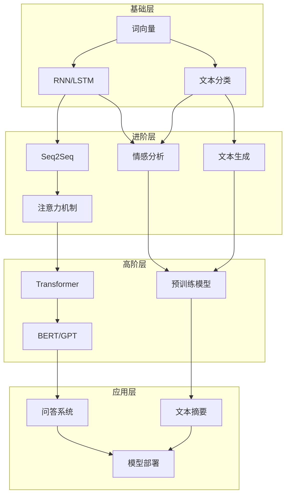

# 自然语言处理（NLP）学习路径

> [!info] 学习路径概览
> 本学习路径涵盖 Day30-Day41，共12天内容，系统讲解自然语言处理从基础到实战的全套技能。

## 学习路径图

## 阶段一：基础理论（Day30-Day31）

| 日期 | 文档 | 核心内容 | 标签 |
|:----:|------|----------|------|
| Day30 | [[Day30_词向量与Word2Vec]] | 词向量原理、Word2Vec（CBOW/Skip-gram）、负采样、GloVe、FastText | `#词向量` `#Word2Vec` |
| Day31 | [[Day31_RNN与LSTM基础]] | RNN原理、梯度消失问题、LSTM门机制、双向RNN | `#RNN` `#LSTM` `#序列模型` |

## 阶段二：实战应用（Day32-Day34）

| 日期 | 文档 | 核心内容 | 标签 |
|:----:|------|----------|------|
| Day32 | [[Day32_文本分类实战]] | 文本分类流程、特征提取、经典模型、TextCNN、实战项目 | `#文本分类` `#实战` |
| Day33 | [[Day33_情感分析项目]] | 情感分析任务、情感词典、BERT应用、实战项目 | `#情感分析` `#实战` |
| Day34 | [[Day34_文本生成入门]] | 文本生成原理、GPT模型、生成策略（贪婪/集束/采样） | `#文本生成` `#GPT` |

## 阶段三：复习巩固（Day35）

| 日期 | 文档 | 核心内容 | 标签 |
|:----:|------|----------|------|
| Day35 | [[Day35_Week5周度复盘与测验]] | 周度知识梳理、知识点回顾、练习测验 | `#周度复盘` `#学习总结` |

## 阶段四：进阶架构（Day36-Day38）

| 日期 | 文档 | 核心内容 | 标签 |
|:----:|------|----------|------|
| Day36 | [[Day36_Seq2Seq与注意力机制]] | Seq2Seq模型、注意力机制、QKV模型、机器翻译 | `#Seq2Seq` `#注意力机制` |
| Day37 | [[Day37_Transformer深度解析]] | Transformer架构、自注意力机制、位置编码、编码器-解码器 | `#Transformer` `#自注意力` |
| Day38 | [[Day38_BERT等预训练模型微调]] | BERT原理、预训练-微调范式、LoRA/QLoRA高效微调 | `#BERT` `#预训练` `#微调` |

## 阶段五：综合实战（Day39-Day41）

| 日期 | 文档 | 核心内容 | 标签 |
|:----:|------|----------|------|
| Day39 | [[Day39_文本摘要实战]] | 抽取式摘要、生成式摘要、Pointer-Generator、实战项目 | `#文本摘要` `#实战` |
| Day40 | [[Day40_问答系统构建]] | 检索式问答、生成式问答、RAG系统、实战项目 | `#问答系统` `#RAG` |
| Day41 | [[Day41_模型压缩与部署]] | 模型量化、剪枝、知识蒸馏、模型部署实战 | `#模型压缩` `#部署` |

---

## 知识点关联图

---

## 快速导航

### 按主题查找

- **词向量与嵌入**：[[Day30_词向量与Word2Vec]]
- **序列模型**：
  - [[Day31_RNN与LSTM基础]] - 基础序列模型
  - [[Day36_Seq2Seq与注意力机制]] - 进阶序列模型
- **注意力机制**：
  - [[Day36_Seq2Seq与注意力机制]] - 注意力基础
  - [[Day37_Transformer深度解析]] - 自注意力机制
- **预训练模型**：
  - [[Day37_Transformer深度解析]] - Transformer架构
  - [[Day38_BERT等预训练模型微调]] - BERT与微调技术
- **实战项目**：
  - [[Day32_文本分类实战]] - 文本分类
  - [[Day33_情感分析项目]] - 情感分析
  - [[Day34_文本生成入门]] - 文本生成
  - [[Day39_文本摘要实战]] - 文本摘要
  - [[Day40_问答系统构建]] - 问答系统
- **工程化**：
  - [[Day41_模型压缩与部署]] - 模型压缩与部署

### 按学习阶段

| 阶段 | 建议文档 | 预计时长 |
|------|----------|----------|
| 第一天 | [[Day30_词向量与Word2Vec]] | 90-120分钟 |
| 第二天 | [[Day31_RNN与LSTM基础]] | 90-120分钟 |
| 第三天 | [[Day32_文本分类实战]] | 90-120分钟 |
| 第四天 | [[Day33_情感分析项目]] | 90-120分钟 |
| 第五天 | [[Day34_文本生成入门]] | 90-120分钟 |
| 第六天 | [[Day35_Week5周度复盘与测验]] | 60-90分钟 |
| 第七天 | [[Day36_Seq2Seq与注意力机制]] | 90-120分钟 |
| 第八天 | [[Day37_Transformer深度解析]] | 90-120分钟 |
| 第九天 | [[Day38_BERT等预训练模型微调]] | 90-120分钟 |
| 第十天 | [[Day39_文本摘要实战]] | 90-120分钟 |
| 第十一天 | [[Day40_问答系统构建]] | 90-120分钟 |
| 第十二天 | [[Day41_模型压缩与部署]] | 90-120分钟 |

---

## 核心技术栈

| 技术类别 | 相关文档 | 关键知识点 |
|----------|----------|------------|
| **词向量** | [[Day30_词向量与Word2Vec]] | Word2Vec, GloVe, FastText, 负采样 |
| **序列模型** | [[Day31_RNN与LSTM基础]] | RNN, LSTM, 梯度消失, 门机制 |
| **注意力** | [[Day36_Seq2Seq与注意力机制]], [[Day37_Transformer深度解析]] | QKV, Self-Attention, Multi-Head |
| **预训练** | [[Day38_BERT等预训练模型微调]] | BERT, GPT, LoRA, 全量微调 |
| **实战技能** | [[Day32_文本分类实战]] - [[Day40_问答系统构建]] | PyTorch, Transformers, RAG |

---

## 相关资源

### 工具与框架

- **PyTorch**：深度学习框架
- **Transformers**：Hugging Face NLP库
- **Gensim**：Word2Vec训练
- **jieba**：中文分词

### 推荐阅读

- 《Efficient Estimation of Word Representations in Vector Space》- Word2Vec原论文
- 《Attention Is All You Need》- Transformer原论文
- 《BERT: Pre-training of Deep Bidirectional Transformers》- BERT原论文

---

> [!tip] 学习建议
> 1. **循序渐进**：按照 Day30-Day41 的顺序学习，每个知识点都是后续内容的基础
> 2. **理论+实践**：每篇文档都配有动手练习题，建议先理解原理再动手实现
> 3. **及时复盘**：Day35 是周度复盘，建议在继续学习前回顾前面的内容
> 4. **构建项目**：学习完实战内容后，尝试独立完成一个小项目

---

**更新时间**：2026-03-20
**学习总时长**：约18-24小时（每天90-120分钟）
