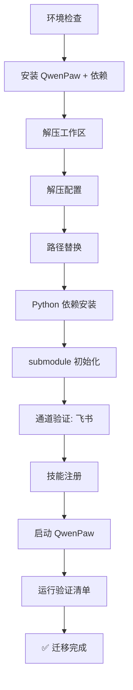

# QwenPaw 环境迁移方案

> 目标：通过 Claude Code 将 QwenPaw（小黑）从当前 Windows 环境完整迁移到新环境，立等可用。
> 
> 适用读者：Claude Code Agent（非人类操作手册，不含解释性文字）

---

## 0. 前置约束

```yaml
# Claude Code Agent 读取本方案时遵循：
assumptions:
  源环境: Windows 11, Python 3.12.11, D:\Qwenclaw\s-black\
  目标环境: 任意 OS（Windows/Linux/macOS）
  迁移工具: Claude Code + git
  网络要求: 需要 GitHub 访问（push/pull），可能需要代理
  qwenpaw_版本: 1.1.5.post2

paths_to_replace:
  - "D:\\Qwenclaw\\s-black\\" → $WORKSPACE
  - "D:\\Qwenclaw\\qwenpaw-venv" → $VENV
  - "C:\\Users\\wxb\\.qwenpaw\\" → $QWENPAW_CONFIG
  - "C:\\Users\\wxb\\Desktop\\v2rayN.exe.lnk" → $V2RAY_LNK
```

---

## 1. 当前环境备份

> [!warning] 在源机器上执行，迁移前完成

### 1.1 打包工作区

```bash
# 在源机器执行
cd D:\Qwenclaw

# 创建干净打包（排除可重建/垃圾文件）
tar -czf s-black-backup.tar.gz \
  --exclude='s-black/browser' \
  --exclude='s-black/tool_results' \
  --exclude='s-black/__pycache__' \
  --exclude='s-black/**/__pycache__' \
  --exclude='s-black/**/*.pyc' \
  --exclude='s-black/node_modules' \
  --exclude='s-black/.git' \
  --exclude='s-black/bitwarden-cli/node_modules' \
  --exclude='s-black/sessions' \
  --exclude='s-black/dialog' \
  --exclude='s-black/logs' \
  --exclude='s-black/backups' \
  --exclude='s-black/GitHub-projects' \
  --exclude='s-black/novel-workspace/future-code' \
  --exclude='s-black/novel-workspace/nine-turns-star' \
  s-black/
```

### 1.2 打包 QwenPaw 配置

```bash
tar -czf qwenpaw-config-backup.tar.gz \
  --exclude='workspaces/*/browser' \
  --exclude='workspaces/*/sessions' \
  --exclude='workspaces/*/dialog' \
  --exclude='workspaces/*/tool_results' \
  --exclude='workspaces/*/__pycache__' \
  --exclude='browser' \
  -C "$USERPROFILE" .qwenpaw/
```

### 1.3 导出 Python 依赖清单

```bash
# 从源 venv 导出
uv pip freeze --python D:\Qwenclaw\qwenpaw-venv\Scripts\python.exe | grep -v "^-e " > D:\Qwenclaw\s-black\tools\requirements.txt
```

### 1.4 备份 Git 项目（如有需要）

```bash
# 以下项目有独立远程仓库，推最新即可，无需打包
# - D:\Qwenclaw\s-black\GitHub-projects\lottery-predictor
# - C:\Users\wxb\.claude\skills\china-stock-analyst

# 确认已 push 所有本地提交
cd D:\Qwenclaw\s-black\GitHub-projects\lottery-predictor
git status && git push

cd C:\Users\wxb\.claude\skills\china-stock-analyst
git status && git push
```

### 1.5 备份清单汇总

| 产物 | 大小估算 | 包含 |
|:--|:--|:--|
| `s-black-backup.tar.gz` | ~5-20MB | workspace（不含browser/GitHub-projects/novel） |
| `qwenpaw-config-backup.tar.gz` | ~1-5MB | config.json, skill.json, jobs.json, settings.json |
| `requirements.txt` | ~3KB | 200+ Python 包清单 |

> [!tip] 如网络条件好，直接把两个 tar.gz 上传到 GitHub release 或个人服务器，方便新环境 wget/curl 下载。

---

## 2. 需要迁移的资产清单

### 2.1 核心（必须迁移）

```
📁 $WORKSPACE/                       # 小黑工作区根目录
  ├── .env                           # 🔐 API 密钥（MX_APIKEY, DS_KEY, BW_*, 飞书等）
  ├── .bw-auth.json                  # 🔐 Bitwarden OAuth 缓存
  ├── .bw-session.json               # 🔐 Bitwarden 会话缓存
  ├── agent.json                     # QwenPaw Agent 配置
  ├── skill.json                     # 技能注册清单
  ├── jobs.json                      # 定时任务（13个cron）
  ├── AGENTS.md                      # Agent 行为规则
  ├── SOUL.md                        # 人格定义
  ├── PROFILE.md                     # 用户资料
  ├── MEMORY.md                      # 长期记忆
  ├── HEARTBEAT.md                   # 心跳清单
  ├── TOOLS.md                       # 工具索引（自动生成）
  ├── .gitignore                     # 敏感文件排除
  ├── tools/                         # 17 个工具脚本
  │   ├── cleanup_shared.py          # 🛡️ 安全围栏共享模块
  │   ├── cleanup-daily.py
  │   ├── cleanup-weekly.py
  │   ├── cleanup-deep.py
  │   ├── bw-api.py                  # Bitwarden REST API
  │   ├── mm-search.py               # MiniMax 搜索
  │   ├── ds-quota.py                # DeepSeek 余额
  │   ├── amap-weather.py            # 高德天气
  │   ├── openwond-draw.py           # OpenWond 生图
  │   ├── tavily-usage.py            # Tavily 用量
  │   ├── close_v2ray.bat            # 关代理
  │   ├── _build-tools-md.py         # TOOLS.md 生成器
  │   └── ...
  ├── skills/                        # 78 个技能
  │   ├── china-stock-analyst/
  │   ├── mx-{data,search,xuangu,zixuan,moni}/
  │   ├── amap-lbs-skill/
  │   ├── minimax-search/
  │   ├── obsidian-skills/           # git submodule
  │   ├── superpowers/               # git submodule
  │   └── README.md
  └── memory/                        # 每日笔记 + 蒸馏

📁 $QWENPAW_CONFIG/                  # QwenPaw 全局配置
  ├── config.json                    # 通道 + MCP + 通用设置
  ├── settings.json                  # 运行时设置
  ├── skill_pool/skill.json          # 全局技能池
  └── token_usage.json               # Token 统计（可选）
```

### 2.2 可选（按需迁移）

```
📁 以下项目独立维护，按需在新环境 git clone：
  GitHub-projects/lottery-predictor  # 双色球预测
  GitHub-projects/huashu-design      # 设计参考
  GitHub-projects/open-design        # 设计参考
  GitHub-projects/hermes-agent       # 架构参考
  GitHub-projects/openclaw           # 架构参考
  GitHub-projects/mattpocock-skills  # 方法论参考
  GitHub-projects/jcode              # 参考
  
📁 C:\Users\wxb\.claude\skills\     # Claude Code 技能（独立仓库）
  china-stock-analyst/               # → github.com/wjt0321/china-stock-analyst

🔌 外部依赖（需在新环境单独安装）：
  - V2Ray / v2rayN（代理工具，Windows 专属）
  - Node.js 22+（npx, larksuite CLI）
  - Playwright 浏览器（chromium）
  - Chrome（桌面浏览器，已登录账号）
  - Obsidian（笔记软件）
```

---

## 3. 新环境部署（Claude Code Agent 执行步骤）

### Phase 1: 环境检查与依赖安装

```bash
# === 1.1 确认环境 ===
python3 --version          # 需要 ≥3.12
node --version             # 需要 ≥22
git --version
which uv || pip install uv # uv 是首选包管理器

# === 1.2 安装 QwenPaw ===
# 创建独立 venv（路径按 OS 调整）
# Windows:
python -m venv D:\Qwenclaw\qwenpaw-venv
# Linux/macOS:
python3 -m venv ~/qwenpaw-venv

source $VENV/bin/activate  # Linux/macOS
# 或 $VENV\Scripts\activate  # Windows

pip install qwenpaw==1.1.5.post2

# === 1.3 安装 Node.js 全局包 ===
npm install -g @larksuite/cli  # 飞书 CLI
npx playwright install chromium  # Playwright 浏览器
```

### Phase 2: 部署工作区

```bash
# === 2.1 创建工作区目录 ===
# 从备份解压（如通过网络传输）
tar -xzf s-black-backup.tar.gz -C $WORKSPACE_PARENT/

# 或从 Git 获取（如果有远程仓库）
git clone <workspace-remote> $WORKSPACE

# === 2.2 安装 Python 依赖 ===
source $VENV/bin/activate
pip install -r $WORKSPACE/tools/requirements.txt

# === 2.3 初始化 git submodule ===
cd $WORKSPACE
git submodule update --init --recursive
# 如有需要，手动 git clone submodule 仓库
# git clone https://github.com/kepano/obsidian-skills skills/obsidian-skills
# git clone https://github.com/obra/superpowers skills/superpowers
```

### Phase 3: 部署 QwenPaw 配置

```bash
# === 3.1 部署全局配置 ===
tar -xzf qwenpaw-config-backup.tar.gz -C ~/

# === 3.2 路径替换（关键步骤） ===
# 如果新旧环境路径不同，必须修改以下文件：
# - config.json 中的 media_dir, workspace_dir
# - agent.json 中的 workspace_dir
# - skill.json 中的路径引用
# - jobs.json 中的 cwd 字段
# - tools/ 中脚本的硬编码路径

# 用 Claude Code 批量替换：
# 将所有 "D:\\Qwenclaw\\s-black" 替换为 $WORKSPACE
# 将所有 "D:\\Qwenclaw\\qwenpaw-venv" 替换为 $VENV
# 将所有 "C:\\Users\\wxb" 替换为 $HOME
```

### Phase 4: 适配与验证

```bash
# === 4.1 适配 Bitwarden ===
# bw-api.py 走 REST API + OAuth2，不需要 bw CLI
# .bw-auth.json 和 .bw-session.json 已包含缓存
# .env 中 BW_* 变量无需修改（API 端点是域名不变的）
cd $WORKSPACE && python tools/bw-api.py test

# === 4.2 适配飞书 ===
# agent.json 中 feishu 段配置已包含 app_id/app_secret，无需修改
# 如飞书后台绑定了新 IP，可能需要更新

# === 4.3 适配天气 ===
# amap-weather.py 需要高德 API Key（已在 .env）
# 城市代码可能需要修改：编辑 tools/amap-weather.py 中的 city_code

# === 4.4 适配生图 ===
# openwond-draw.py 使用 OpenWond 中转站，域名不变
# Pillow 字体路径可能需要修改（Windows → Linux: C:\Windows\Fonts → /usr/share/fonts）

# === 4.5 清理不需要的工具 ===
# close_v2ray.bat — Windows 专属，Linux/macOS 不需要
# 如不用 V2Ray，相关 cron 任务需调整
```

### Phase 5: 注册技能

```bash
# === 5.1 注册 workspace 级技能 ===
# skill.json 已在备份中，确认路径正确后生效

# === 5.2 如有全局技能池 ===
# 检查 $QWENPAW_CONFIG/skill_pool/skill.json
# 确保路径指向正确位置

# === 5.3 扫描验证 ===
# QwenPaw 启动后会自动扫描 skills/ 目录
# 检查日志确认所有技能加载成功
```

### Phase 6: 启动与验证

```bash
# === 6.1 启动 QwenPaw ===
qwenpaw start

# === 6.2 验证清单 ===
# □ 飞书通道连通（发送测试消息）
# □ 定时任务可触发（cron 列表完整）
# □ MiniMax 搜索可用（mm-search.py "测试"）
# □ DeepSeek 余额可查（ds-quota.py）
# □ BW 密码库可读（bw-api.py test）
# □ 天气可查（amap-weather.py）
# □ 清理脚本可跑（cleanup-daily.py 无报错）
# □ AGENTS.md 规则生效
# □ MEMORY.md 记忆完整
# □ 78 个技能全部注册
# □ 13 个 cron 任务正常

# === 6.3 首次运行日报 ===
# 等待 22:30 日报任务执行，确认完整性
```

---

## 4. 路径替换速查表

> Claude Code Agent 在新环境执行路径替换时使用此表

```yaml
# 需要批量替换的文件列表
path_replacement:
  "D:\\Qwenclaw\\s-black":
    files:
      - agent.json          # workspace_dir
      - jobs.json           # 所有 cwd 字段
      - SOUL.md             # 工作目录引用
      - AGENTS.md           # @Working directory
      - PROFILE.md          # 路径引用
      - cleanup-daily.py    # shebang/import 路径
      - cleanup-weekly.py
      - cleanup-deep.py
      - cleanup_shared.py   # WORKSPACE_DIR 变量
      - bw-api.py           # CACHE 路径
      - mm-search.py        # .env 加载路径
      - ds-quota.py
      - amap-weather.py
      - openwond-draw.py
      - tavily-usage.py
      - _build-tools-md.py
      - distill-memory.py
      - cleanup-qwenpaw-logs.py

  "D:\\Qwenclaw\\qwenpaw-venv":
    files:
      - agent.json          # 如有 Python 路径引用

  "C:\\Users\\wxb":
    files:
      - agent.json          # chrome 路径
      - AGENTS.md           # 桌面 Chrome 路径
      - PROFILE.md          # paths
      - SOUL.md
      - tools/*.py          # 如有硬编码用户路径
```

---

## 5. 时序总览



---

## 6. 常见问题

> [!question] Windows → Linux 字体路径
> `openwond-draw.py` 和 `bw-api.py` 中的 Pillow 字体路径需要调整：
> - Windows: `C:\Windows\Fonts\simhei.ttf`
> - Linux: `/usr/share/fonts/truetype/` 或安装 `fonts-noto-cjk`

> [!question] V2Ray 不可用
> 新环境如不需要翻墙（如海外 VPS），忽略 V2Ray 相关配置。
> 如需要，Linux 用 v2ray-core + systemd，macOS 用 V2RayX。

> [!question] Chrome / Playwright 路径
> `agent.json` 中的 `executable_path` 字段需要改为新环境下的 Chrome/Chromium 路径。
> Linux: `/usr/bin/google-chrome` 或 `chromium-browser`
> macOS: `/Applications/Google Chrome.app/Contents/MacOS/Google Chrome`

> [!question] 定时任务在新环境的时间
> `jobs.json` 中的 cron 时间使用 UTC 或 local tz。检查 `set_user_timezone` 设置。

> [!question] Bitwarden 认证过期
> `.bw-session.json` 有 2h 过期。迁移后首次调用 `bw-api.py` 会自动重新认证。

---

## 相关笔记

- [[小黑工作记忆]] — MEMORY.md 长期记忆
- [[小黑工具清单]] — TOOLS.md
- [[清理安全体系]] — cleanup_shared.py 设计
- [[妙想金融技能]] — mx-* 五技能
