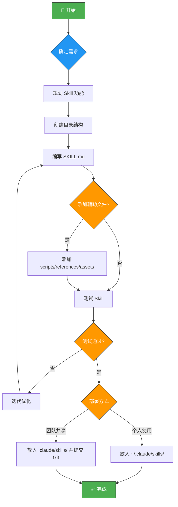
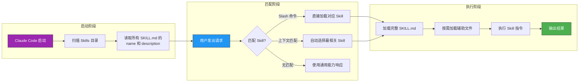

# Claude Code Skills 完整教程

## 一、什么是 Claude Code Skills？

**Claude Skills** 是 Anthropic 为 Claude Code 提供的扩展机制，允许用户通过定义特定的文件和目录结构来教授 Claude 如何执行特定任务。Skills 将 Claude 从通用助手转变为针对特定需求定制的**专业代理**。

### 核心特点
- 🎯 **模块化**：每个 Skill 是独立的功能包
- 🔄 **可复用**：一次编写，持续使用
- 🤖 **自动检测**：Claude 根据上下文自动加载相关 Skill
- 📂 **渐进式加载**：仅在需要时加载，节省 Token
- 👥 **可共享**：通过 Git 与团队共享

---

## 二、Skills 目录结构

### 存储位置

| 类型 | 路径 | 说明 |
|------|------|------|
| 个人 Skills | `~/.claude/skills/` | 跨所有项目可用 |
| 项目 Skills | `.claude/skills/` | 仅项目内可用，可通过 Git 共享 |

### 标准目录结构

```
~/.claude/skills/
└── my-skill/                  # 技能目录（名称即技能标识）
    ├── SKILL.md               # 核心文件（必需）
    ├── scripts/               # 可执行脚本（可选）
    │   ├── deploy.sh
    │   └── validate.py
    ├── references/            # 参考文档（可选）
    │   ├── api-docs.md
    │   └── conventions.md
    └── assets/                # 资源文件（可选）
        ├── templates/
        └── boilerplate/
```

---

## 三、SKILL.md 文件详解

`SKILL.md` 是每个 Skill 的核心文件，包含两部分：

### 1. YAML Frontmatter（元数据配置）

```yaml
---
name: review-pr          # Skill 名称，同时也是 /slash-command
description: |           # 描述（用于自动检测和加载）
  Reviews pull requests for code quality,
  security issues, and best practices.
  Use when reviewing PRs or code changes.
disable-model-invocation: false   # true = 仅用户可调用
user-invocable: true              # false = 仅 Claude 自动调用
allowed-tools:                    # 允许使用的工具
  - Bash
  - Read
  - Grep
  - Write
---
```

### 2. Markdown 内容（指令和工作流）

```markdown
# PR Review Skill

## 目的
审查代码变更，确保代码质量和安全性。

## 工作流程
1. 获取 PR 的变更文件列表
2. 逐文件分析代码变更
3. 检查以下方面：
   - 代码风格一致性
   - 潜在的安全问题
   - 性能问题
   - 测试覆盖率
4. 生成审查报告

## 输出格式
使用以下模板输出审查结果：
- ✅ 通过项
- ⚠️ 建议改进项
- ❌ 必须修复项
```

### YAML 配置字段说明

| 字段 | 类型 | 默认值 | 说明 |
|------|------|--------|------|
| `name` | string | 目录名 | 技能名称，用作 `/slash-command` |
| `description` | string | 必填 | 描述技能功能和使用场景 |
| `disable-model-invocation` | bool | false | 禁止 Claude 自动调用（仅用户调用） |
| `user-invocable` | bool | true | 允许用户通过命令调用 |
| `allowed-tools` | list | 全部 | 限制可用工具列表 |

---

## 四、Skill 类型

### 1. 参考型（Reference Skills）
提供知识和规范，Claude 在工作时自动参考。

```yaml
---
name: coding-standards
description: Project coding standards and conventions
user-invocable: false
---
```

**适用场景**：编码规范、API 文档、领域知识

### 2. 任务型（Task Skills）
提供具体的操作步骤和工作流。

```yaml
---
name: deploy
description: Deploy application to production environment
disable-model-invocation: true
---
```

**适用场景**：部署流程、代码生成、提交规范

### 3. 混合型（Hybrid Skills）
结合知识参考和任务执行。

**适用场景**：代码审查、重构指导

---

## 五、创建 Skill 的完整流程

### 步骤 1：规划 Skill
- 确定目标任务
- 定义输入/输出
- 设计工作流程

### 步骤 2：创建目录结构
```bash
mkdir -p ~/.claude/skills/my-new-skill
mkdir -p ~/.claude/skills/my-new-skill/scripts
mkdir -p ~/.claude/skills/my-new-skill/references
mkdir -p ~/.claude/skills/my-new-skill/assets
```

### 步骤 3：编写 SKILL.md
创建 `~/.claude/skills/my-new-skill/SKILL.md`：

```yaml
---
name: my-new-skill
description: |
  A brief description of what this skill does.
  Mention when it should be used.
---
```

然后添加详细的 Markdown 指令。

### 步骤 4：添加辅助文件
- `scripts/` → 放置自动化脚本
- `references/` → 放置参考文档
- `assets/` → 放置模板和资源

### 步骤 5：测试和验证
- 在 Claude Code 中调用 `/my-new-skill`
- 检查输出是否符合预期
- 迭代优化指令

---

## 六、最佳实践

| 实践 | 说明 |
|------|------|
| 🔤 **简洁明了** | SKILL.md 控制在 500 行以内 |
| 📝 **清晰描述** | description 字段包含功能和使用场景 |
| 📂 **渐进式加载** | 详细内容放在 references/ 子目录 |
| 🎯 **具体指令** | 提供明确的步骤和输出格式 |
| 🧪 **充分测试** | 手动和脚本测试确保正确性 |
| 🚫 **避免冗余** | 不要解释 Claude 已经知道的内容 |

---

## 七、实用示例

### 示例 1：Git 提交规范 Skill

```yaml
---
name: commit
description: |
  Create standardized git commits following
  conventional commit format. Use when committing code.
disable-model-invocation: true
---

# Git Commit Skill

## 提交格式
```
<type>(<scope>): <subject>

<body>

<footer>
```

## Type 类型
- feat: 新功能
- fix: Bug 修复
- docs: 文档更新
- style: 代码格式
- refactor: 重构
- test: 测试
- chore: 杂项
```

### 示例 2：代码审查 Skill

```yaml
---
name: review
description: |
  Comprehensive code review skill that checks
  code quality, security, and best practices.
---

# Code Review Skill

## 审查清单
1. **安全性** - 检查注入、XSS、敏感数据泄露
2. **性能** - N+1 查询、内存泄漏、不必要的计算
3. **可读性** - 命名规范、注释、代码结构
4. **测试** - 测试覆盖率、边界情况
5. **架构** - 设计模式、SOLID 原则
```

---

## 八、Skills 工作流程图



---

## 九、Skills 运行机制流程图



---

## 十、常用命令速查

| 命令 | 功能 |
|------|------|
| `/skill-name` | 调用指定 Skill |
| `/reload-skills` | 重新加载所有 Skills |
| `/init` | 初始化项目配置 |
| `CLAUDE.md` | 项目级全局配置文件 |
| `@filename` | 引用特定文件到上下文 |

---

> 💡 **提示**：Skills 是 Claude Code 最强大的定制特性之一。通过合理设计 Skills，你可以将日常重复性工作自动化，显著提升开发效率。
