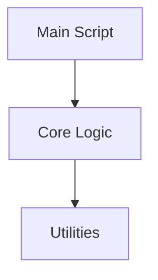

# 代码地图模板 (Code Map Template)

此文档旨在解决“跨文件理解力受限”问题，提供项目核心文件的导航与职责说明。

## 1. 核心入口 (Entry Points)
*   **[path/to/main.py]**: 
    *   **职责**: [描述该文件的主程序职责]
    *   **流程**: [步骤1] -> [步骤2] -> [步骤3]

## 2. 核心逻辑层 (Core Logic)

### 2.1 模块 A (Module A)
*   **[path/to/module_a.py]**:
    *   **职责**: ...
    *   **关键类**: `ClassName`

### 2.2 模块 B (Module B)
*   **[path/to/module_b.py]**:
    *   **职责**: ...

## 3. 辅助工具 (Tools)
*   **[path/to/tools.py]**:
    *   **职责**: ...

## 4. 文件依赖关系 (Dependency Graph)

