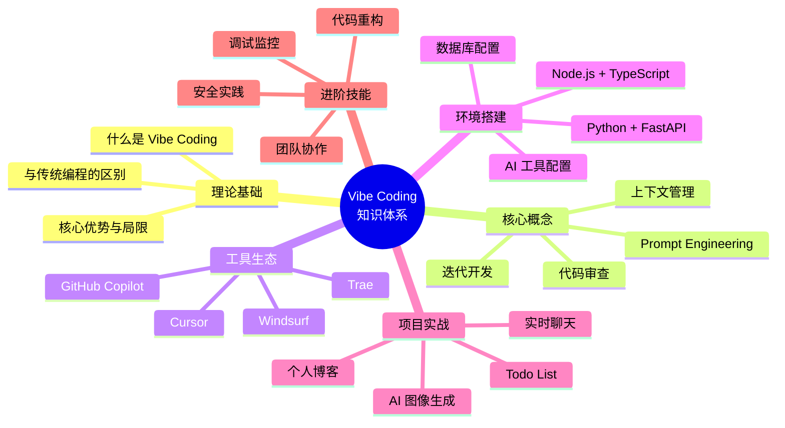

# 🚀 第十章：总结与未来展望

> "未来已来，只是分布不均。"
> —— 威廉·吉布森

## 📋 本章学习目标

- [ ] 回顾 Vibe Coding 的核心知识体系
- [ ] 了解 AI 编程的最新发展趋势
- [ ] 掌握持续学习和自我提升的方法
- [ ] 规划个人 Vibe Coding 成长路径
- [ ] 加入 Vibe Coding 社区和生态

---

## 10.1 学习之旅回顾 🎓

### 10.1.1 知识体系总览

让我们一起回顾这十章的学习内容：



### 10.1.2 关键技能清单

**✅ 你应该已经掌握：**

| 技能类别 | 具体能力 | 熟练度 |
|---------|---------|--------|
| Prompt 工程 | 编写清晰、结构化的 AI 提示词 | ⭐⭐⭐⭐⭐ |
| 上下文管理 | 有效组织代码上下文和文件结构 | ⭐⭐⭐⭐ |
| 工具使用 | 熟练使用 Cursor/Copilot 等工具 | ⭐⭐⭐⭐⭐ |
| 前端开发 | React + TypeScript 项目开发 | ⭐⭐⭐⭐ |
| 后端开发 | Node.js/Python API 开发 | ⭐⭐⭐⭐ |
| 数据库设计 | 关系型/文档型数据库使用 | ⭐⭐⭐ |
| AI 集成 | 调用第三方 AI API | ⭐⭐⭐⭐ |
| 代码质量 | 重构、测试、安全实践 | ⭐⭐⭐ |

---

## 10.2 AI 编程的未来趋势 🔮

### 10.2.1 技术发展趋势

**1. 多模态 AI 编程助手**

```typescript
// 未来的 AI 助手将支持更多模态
interface FutureAIAssistant {
  // 文本代码生成（当前）
  generateCode(prompt: string): Promise<Code>;
  
  // 图像理解（即将到来）
  analyzeUI(mockup: Image): Promise<ComponentCode>;
  
  // 语音交互（即将到来）
  voiceToCode(speech: Audio): Promise<Code>;
  
  // 视频理解（未来）
  learnFromVideo(tutorial: Video): Promise<ProjectTemplate>;
}
```

**2. 自主代理（Autonomous Agents）**

```typescript
// AI 代理将能够独立完成复杂任务
class CodingAgent {
  async completeTask(requirement: string): Promise<Project> {
    // 1. 分析需求
    const analysis = await this.analyzeRequirement(requirement);
    
    // 2. 设计架构
    const architecture = await this.designArchitecture(analysis);
    
    // 3. 生成代码
    const code = await this.generateCode(architecture);
    
    // 4. 自动测试
    const testResults = await this.runTests(code);
    
    // 5. 修复问题
    if (!testResults.passed) {
      code = await this.fixIssues(code, testResults.errors);
    }
    
    // 6. 部署上线
    return await this.deploy(code);
  }
}
```

**3. 个性化 AI 编程伙伴**

未来的 AI 助手将学习你的编码风格：

```typescript
// 个性化配置
interface PersonalizationConfig {
  // 编码风格偏好
  style: {
    namingConvention: 'camelCase' | 'snake_case' | 'PascalCase';
    quotePreference: 'single' | 'double';
    semicolons: boolean;
    maxLineLength: number;
  };
  
  // 常用技术栈
  techStack: {
    frontend: 'React' | 'Vue' | 'Svelte' | 'Angular';
    backend: 'Node.js' | 'Python' | 'Go' | 'Rust';
    database: 'PostgreSQL' | 'MongoDB' | 'MySQL';
  };
  
  // 学习历史
  learningHistory: {
    masteredConcepts: string[];
    strugglingAreas: string[];
    preferredExamples: string[];
  };
}
```

### 10.2.2 行业应用前景

| 领域 | Vibe Coding 应用 | 预期发展 |
|-----|-----------------|---------|
| 🌐 Web 开发 | 全栈应用快速原型 | 90% 的 CRUD 应用将由 AI 辅助完成 |
| 📱 移动开发 | 跨平台应用开发 | AI 将自动生成适配多端的代码 |
| 🤖 AI/ML | 模型训练管道构建 | 低代码 ML 平台普及 |
| 🎮 游戏开发 | 游戏逻辑和脚本 | AI 辅助生成游戏资产和逻辑 |
| 🔒 安全领域 | 漏洞检测与修复 | 自动化安全审计成为标配 |
| 🏥 医疗健康 | 医疗数据分析应用 | 合规性检查自动化 |

---

## 10.3 持续学习路径 📚

### 10.3.1 进阶学习路线图

```
Level 1: 初学者 (0-3 个月)
├── 掌握基础 Prompt 工程
├── 熟练使用一种 AI 编程工具
├── 完成 3-5 个小型项目
└── 学习基础前端/后端技术

Level 2: 进阶者 (3-6 个月)
├── 深入理解上下文管理
├── 掌握代码重构技巧
├── 学习系统架构设计
├── 参与开源项目贡献
└── 建立个人项目作品集

Level 3: 熟练者 (6-12 个月)
├── 掌握多种 AI 工具组合使用
├── 能够处理复杂项目
├── 理解安全最佳实践
├── 具备团队协作能力
└── 开始技术分享和写作

Level 4: 专家 (1-2 年)
├── 引领团队 Vibe Coding 实践
├── 开发自定义 AI 工具/插件
├── 深入特定领域（AI/安全/架构）
├── 参与技术社区建设
└── 成为 Vibe Coding 布道者
```

### 10.3.2 推荐学习资源

**📖 必读书籍：**

| 书名 | 作者 | 适合阶段 | 推荐理由 |
|-----|-----|---------|---------|
| 《Prompt Engineering Guide》 | DAIR.AI | 初级 | Prompt 工程权威指南 |
| 《Clean Code》 | Robert Martin | 中级 | 代码质量经典 |
| 《Designing Data-Intensive Applications》 | Martin Kleppmann | 高级 | 系统设计必读 |
| 《The Pragmatic Programmer》 | Andrew Hunt | 全阶段 | 程序员修炼之道 |

**🎓 在线课程：**

- **Coursera**: "AI For Everyone" by Andrew Ng
- **Udemy**: "Complete React Developer"
- **Frontend Masters**: "Full Stack for Frontend Engineers"
- **Scrimba**: "Learn AI Assisted Coding"

**📺 YouTube 频道：**

- Fireship - 快速技术概览
- Traversy Media - 实战项目教程
- The Coding Train - 创意编程
- AI Explained - AI 技术解析

**🎧 播客：**

- Syntax.fm - Web 开发
- Lex Fridman Podcast - AI 深度访谈
- Software Engineering Daily - 软件工程
- The Changelog - 开源技术

### 10.3.3 实践项目建议

**月度挑战计划：**

```typescript
const monthlyChallenges = [
  {
    month: 1,
    theme: '基础巩固',
    projects: [
      '用 Vibe Coding 重做 Todo List',
      '实现一个天气查询应用',
      '构建个人书签管理器'
    ]
  },
  {
    month: 2,
    theme: '全栈开发',
    projects: [
      '开发一个在线投票系统',
      '构建团队任务管理工具',
      '实现一个简单的电商平台'
    ]
  },
  {
    month: 3,
    theme: 'AI 集成',
    projects: [
      '开发智能写作助手',
      '构建代码审查工具',
      '实现自动化测试生成器'
    ]
  },
  {
    month: 4,
    theme: '性能优化',
    projects: [
      '优化现有项目的加载速度',
      '实现虚拟列表处理大数据',
      '构建实时数据可视化大屏'
    ]
  },
  {
    month: 5,
    theme: '安全实践',
    projects: [
      '为项目添加完整认证系统',
      '实现 API 安全防护',
      '进行安全漏洞扫描和修复'
    ]
  },
  {
    month: 6,
    theme: '开源贡献',
    projects: [
      '为喜欢的开源项目提交 PR',
      '创建自己的开源工具库',
      '撰写技术博客分享经验'
    ]
  }
];
```

---

## 10.4 社区与生态 🤝

### 10.4.1 加入 Vibe Coding 社区

**国内社区：**

| 平台 | 社区名称 | 特点 |
|-----|---------|-----|
| 知乎 | Vibe Coding 话题 | 深度讨论和经验分享 |
| 掘金 | AI 编程专栏 | 技术文章和教程 |
| B站 | AI 编程 UP 主 | 视频教程和直播 |
| 微信 | Vibe Coding 交流群 | 实时交流和答疑 |
| Discord | Cursor/Windsurf 中文社区 | 工具使用交流 |

**国际社区：**

- **Reddit**: r/cursor, r/GitHubCopilot
- **Discord**: Cursor Official, Vibe Coding Community
- **Twitter/X**: #VibeCoding, #AIProgramming
- **GitHub**: Awesome Vibe Coding 项目集合

### 10.4.2 贡献与分享

**如何为社区做贡献：**

```markdown
1. **分享经验**
   - 撰写博客文章
   - 录制教学视频
   - 在社群里回答问题

2. **开源贡献**
   - 提交 Bug 修复
   - 添加新功能
   - 完善文档

3. **创建工具**
   - 开发 VS Code 插件
   - 创建 Prompt 模板库
   - 构建脚手架工具

4. **组织活动**
   - 举办线上分享会
   - 组织编程马拉松
   - 开展代码审查活动
```

---

## 10.5 给学习者的建议 💡

### 10.5.1 心态调整

**🎯 正确的学习心态：**

1. **AI 是助手，不是替代者**
   - AI 可以帮你写代码，但不能替代你的思考
   - 理解原理比复制代码更重要
   - 保持批判性思维

2. **拥抱变化，持续学习**
   - 技术更新迭代很快
   - 保持好奇心和学习热情
   - 不要害怕尝试新工具

3. **实践出真知**
   - 看十遍不如做一遍
   - 从简单项目开始
   - 勇于犯错和调试

4. **分享和协作**
   - 教是最好的学
   - 参与社区讨论
   - 寻找学习伙伴

### 10.5.2 常见误区与避免方法

| 误区 | 危害 | 正确做法 |
|-----|-----|---------|
| 过度依赖 AI | 失去独立思考能力 | 先自己思考，再用 AI 验证 |
| 忽视基础 | 遇到复杂问题束手无策 | 扎实学习计算机基础 |
| 不读生成的代码 | 引入 Bug 和安全漏洞 | 始终审查 AI 生成的代码 |
| 追求最新工具 | 频繁切换，无法深入 | 选择适合的工具，深入使用 |
| 闭门造车 | 错过社区资源和最佳实践 | 积极参与社区交流 |

---

## 10.6 最后的寄语 🌟

### 10.6.1 Vibe Coding 的核心理念

```typescript
// Vibe Coding 不是关于工具
// 而是关于思维方式

interface VibeCodingMindset {
  // 人机协作
  humanAICollaboration: {
    human: '提供创意、判断、价值观';
    ai: '提供效率、广度、速度';
    synergy: '1 + 1 > 2';
  };
  
  // 持续迭代
  iterativeImprovement: {
    start: '从简单开始';
    evolve: '逐步完善';
    polish: '精益求精';
  };
  
  // 保持好奇
  curiosity: {
    explore: '探索新技术';
    experiment: '勇于实验';
    learn: '终身学习';
  };
}
```

### 10.6.2 开启你的 Vibe Coding 之旅

现在，你已经完成了 Vibe Coding 从零开始的完整学习。但这只是开始，真正的旅程才刚刚启程。

**记住：**

> 🎵 **Vibe Coding 是一种状态**
> 当你进入心流，与 AI 默契配合，代码如音乐般流淌，那就是 Vibe Coding 的境界。

> 🚀 **未来属于会利用 AI 的人**
> AI 不会取代程序员，但会利用 AI 的程序员将取代不会利用 AI 的程序员。

> 💪 **行动胜于完美**
> 不要等待完美的时机，现在就开始你的下一个项目。在实践中学习，在错误中成长。

---

## 10.7 快速参考卡片 📇

### Prompt 模板速查

```markdown
【功能实现】
请帮我实现 [功能描述]，要求：
1. 使用 [技术栈]
2. 支持 [功能点1]、[功能点2]
3. 包含错误处理
4. 添加类型定义

【代码审查】
请审查以下代码：
```
[代码]
```
关注：安全性、性能、可读性

【调试帮助】
遇到错误：[错误信息]
代码：
```
[相关代码]
```
已尝试：[尝试过的解决方案]
```

### 工具快捷键

| 工具 | 功能 | 快捷键 |
|-----|-----|-------|
| Cursor | 打开 AI 聊天 | `Ctrl/Cmd + L` |
| Cursor | 内联编辑 | `Ctrl/Cmd + K` |
| Copilot | 接受建议 | `Tab` |
| Copilot | 下一条建议 | `Alt + ]` |
| Copilot | 上一条建议 | `Alt + [` |

---

## 10.8 课程反馈与改进 📮

### 如何反馈

你的反馈将帮助我们改进教程：

1. **GitHub Issues**: 提交问题或建议
2. **邮件反馈**: feedback@vibecoding.dev
3. **社区讨论**: 在 Discord/微信群分享你的想法

### 后续更新计划

- [ ] 添加更多实战项目案例
- [ ] 更新最新 AI 工具使用指南
- [ ] 制作配套视频教程
- [ ] 推出进阶专题课程
- [ ] 建立认证体系

---

## 🔗 相关链接

- [[chapter-09-best-practices|上一章：最佳实践与高级技巧]]
- [[chapter-01-introduction|回顾：第一章]]
- [[README|返回首页]]

---

## 🎓 祝贺你完成学习！

你已经完成了《Vibe Coding 从零开始》的全部十章内容。从基础概念到项目实战，从工具使用到最佳实践，你已经具备了使用 Vibe Coding 方法开发完整应用的能力。

**现在，去创造吧！** 🚀

用你学到的知识，去解决实际问题，去构建你心中的产品，去享受编程的乐趣。

记得：
- 保持学习，技术永无止境
- 乐于分享，帮助他人成长
- 勇于创新，创造独特价值

**Vibe on!** 🎵

---

*最后更新：2026-02-15*
*版本：v1.0*
*作者：Vibe Coding 教程团队*

---

## 📚 附录：完整资源索引

### 所有章节

1. [[chapter-01-introduction|第一章：Vibe Coding 简介]]
2. [[chapter-02-core-concepts|第二章：核心概念与原理]]
3. [[chapter-03-tools|第三章：工具生态]]
4. [[chapter-04-environment|第四章：环境搭建]]
5. [[chapter-05-todo-list|第五章：Todo List 应用]]
6. [[chapter-06-blog|第六章：个人博客系统]]
7. [[chapter-07-chat|第七章：实时聊天应用]]
8. [[chapter-08-ai-image|第八章：AI 图像生成器]]
9. [[chapter-09-best-practices|第九章：最佳实践与高级技巧]]
10. [[chapter-10-future|第十章：总结与未来展望]] ⬅️ 当前位置

### 项目源码

- [Todo List 完整源码](https://github.com/example/todo-list)
- [博客系统完整源码](https://github.com/example/blog-system)
- [聊天应用完整源码](https://github.com/example/chat-app)
- [AI 图像生成器源码](https://github.com/example/ai-image-gen)

### 外部资源

- [官方文档](https://docs.vibecoding.dev)
- [视频教程](https://youtube.com/vibecoding)
- [在线社区](https://community.vibecoding.dev)
- [工具下载](https://tools.vibecoding.dev)

---

*感谢你的学习，期待在 Vibe Coding 的旅程中再次相遇！* 🌟
