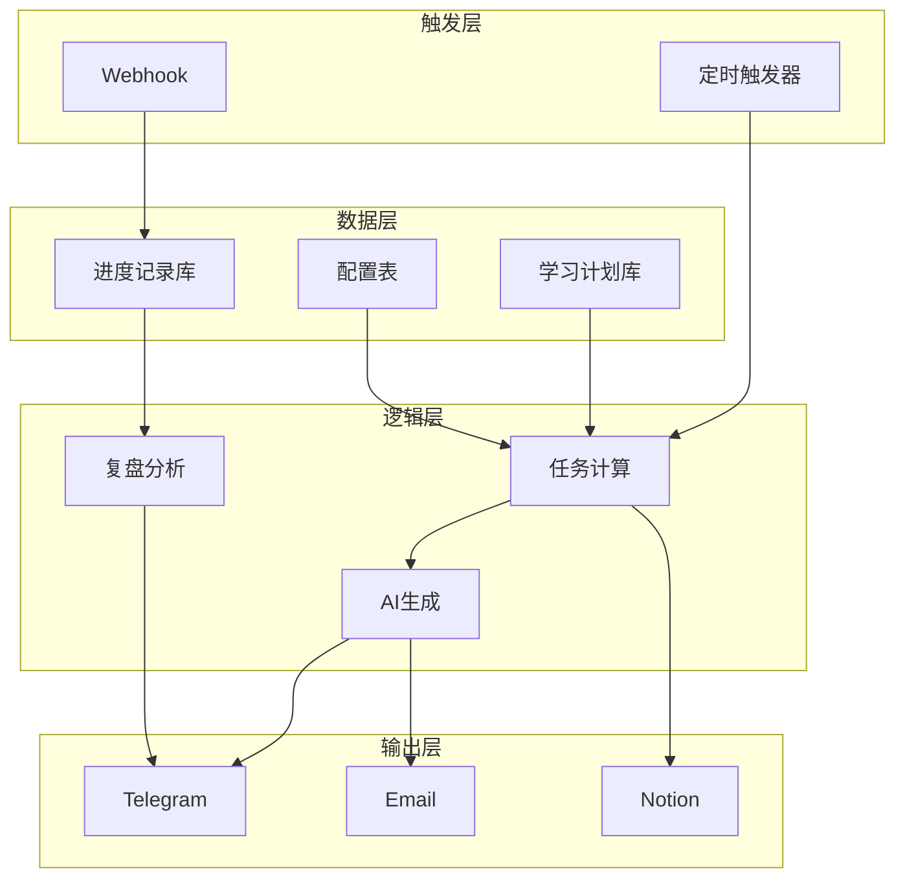
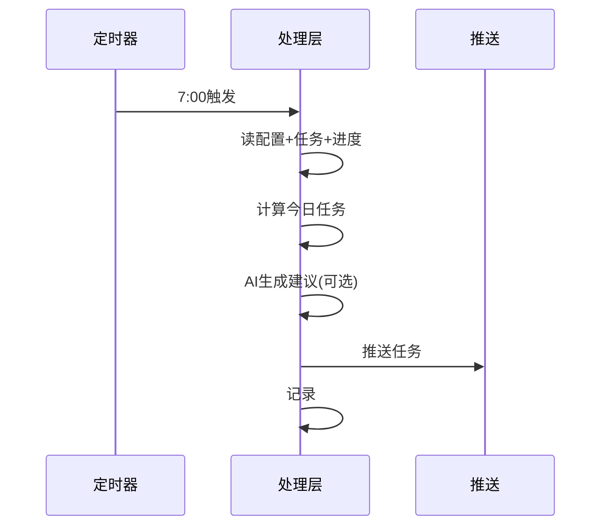
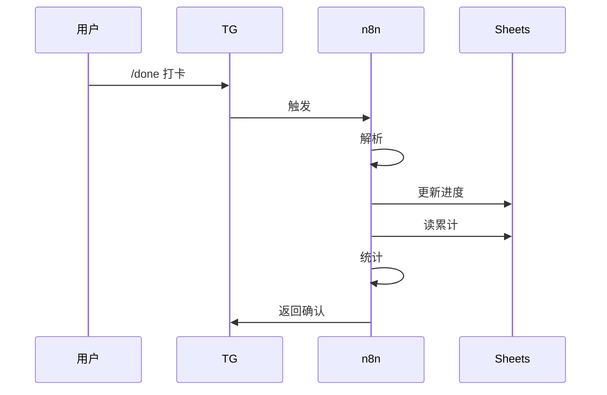
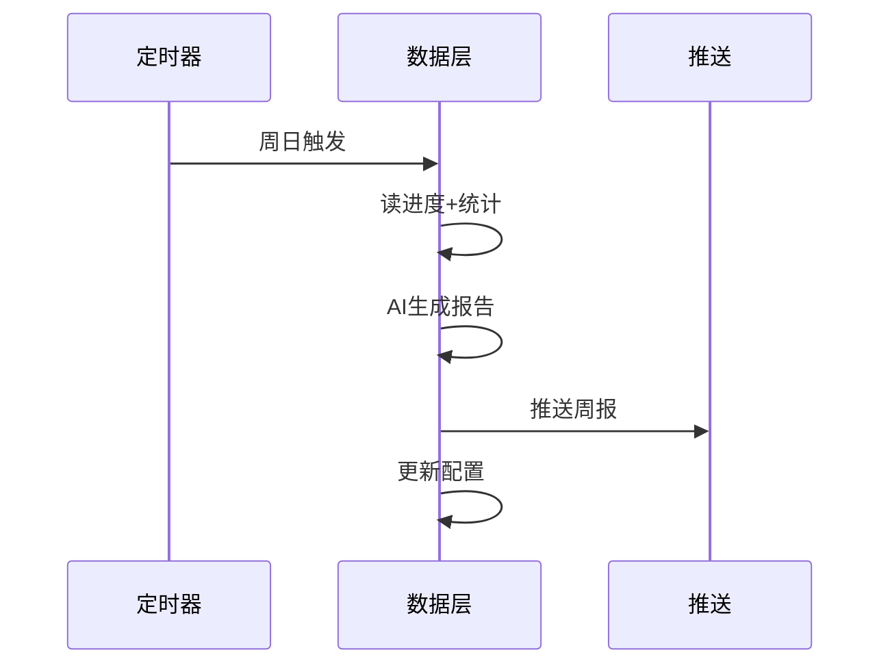
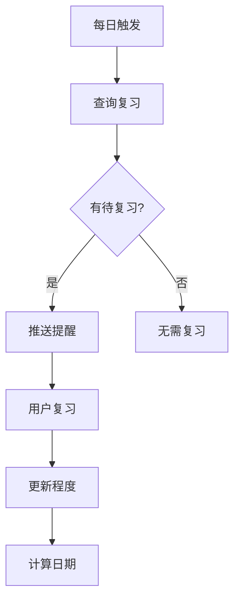

---
tags:
  - n8n
  - 工作流
  - 学习计划
  - 自动化
title: n8n学习计划工作流设计文档
created: 2025-12-22
---

# n8n 外语学习计划自动推送与学习记录工作流

> 基于「英语日语双修年度计划」的自动化学习管理系统

## 📋 文档概览

本文档详细描述如何使用 **n8n 工作流自动化平台**，构建一个完整的每日学习计划自动推送与学习进度记录系统。该系统将根据您的年度学习框架（英语 CET-4→B2，日语零基础→N3），自动生成个性化的每日学习任务，并持续跟踪学习进度。

---

## 一、系统需求分析

### 🎯 核心目标

1. **每日自动推送**：根据学习计划，每天定时推送当日的英语和日语学习任务
2. **进度记录**：记录每日学习完成情况，形成可追溯的学习日志
3. **动态调整**：基于完成情况自动调整学习内容的难度和进度
4. **周期复盘**：自动生成周度/月度学习总结报告

### 🛠️ 所需资源和服务

#### 必需组件

| 组件类别       | 推荐方案                           | 用途说明                 |
| -------------- | ---------------------------------- | ------------------------ |
| **n8n 实例**   | n8n Cloud 或 Self-hosted           | 工作流核心引擎           |
| **数据存储**   | Google Sheets / Notion / Airtable  | 存储学习计划、进度数据   |
| **消息推送**   | Telegram / 微信（企业微信）/ Email | 推送每日任务和提醒       |
| **定时触发器** | n8n 内置 Cron 节点                 | 定时执行工作流           |

#### 可选增强

| 组件类别     | 推荐方案               | 用途说明           |
| ------------ | ---------------------- | ------------------ |
| **AI 服务**  | OpenAI API / Claude API | 生成个性化学习建议 |
| **日历集成** | Google Calendar API    | 同步学习任务到日历 |
| **语音合成** | Azure TTS / Google TTS | 生成听力练习音频   |

---

## 二、工作流架构设计

### 🏗️ 整体架构图



### 📁 数据表结构设计

#### 表1：学习计划主表 (Learning_Plan)

| 字段名           | 类型   | 说明             | 示例              |
| ---------------- | ------ | ---------------- | ----------------- |
| `id`             | 自增ID | 主键             | 1                 |
| `week_day`       | 数字   | 星期几 (1-7)     | 1 (周一)          |
| `language`       | 文本   | 语言类型         | 英语 / 日语       |
| `duration_min`   | 数字   | 学习时长(分钟)   | 45                |
| `module`         | 文本   | 学习模块         | 语法+阅读+词汇    |
| `phase`          | 文本   | 学习阶段         | B1→B1+            |
| `specific_tasks` | 长文本 | 具体任务描述     | 精读VOA新闻1篇... |

#### 表2：每日进度记录表 (Daily_Progress)

| 字段名             | 类型   | 说明           | 示例                 |
| ------------------ | ------ | -------------- | -------------------- |
| `id`               | 自增ID | 主键           | 1                    |
| `date`             | 日期   | 学习日期       | 2025-12-22           |
| `language`         | 文本   | 语言           | 英语                 |
| `planned_duration` | 数字   | 计划时长       | 45                   |
| `actual_duration`  | 数字   | 实际时长       | 40                   |
| `completed_tasks`  | 长文本 | 完成的任务     | 背单词20个, 语法1个  |
| `difficulty_score` | 数字   | 难度评分 (1-5) | 3                    |
| `notes`            | 长文本 | 学习笔记       | 虚拟语气有点难...    |
| `completion_rate`  | 百分比 | 完成率         | 85%                  |

#### 表3：词汇/语法积累表 (Vocabulary_Grammar)

| 字段名          | 类型   | 说明           | 示例             |
| --------------- | ------ | -------------- | ---------------- |
| `id`            | 自增ID | 主键           | 1                |
| `date_added`    | 日期   | 添加日期       | 2025-12-22       |
| `language`      | 文本   | 语言           | 日语             |
| `type`          | 文本   | 类型           | 词汇 / 语法 / 汉字 |
| `content`       | 文本   | 内容           | おはよう          |
| `meaning`       | 文本   | 含义           | 早上好           |
| `example`       | 长文本 | 例句           | おはようございます |
| `mastery_level` | 数字   | 掌握程度 (1-5) | 3                |
| `next_review`   | 日期   | 下次复习日期   | 2025-12-25       |

#### 表4：阶段配置表 (Phase_Config)

| 字段名                   | 类型 | 说明         | 示例       |
| ------------------------ | ---- | ------------ | ---------- |
| `language`               | 文本 | 语言         | 英语       |
| `current_phase`          | 文本 | 当前阶段     | B1→B1+     |
| `start_date`             | 日期 | 阶段开始     | 2025-01-01 |
| `target_end_date`        | 日期 | 目标结束     | 2025-03-15 |
| `vocab_target_monthly`   | 数字 | 月度词汇目标 | 300        |
| `grammar_target_monthly` | 数字 | 月度语法目标 | 5          |

---

## 三、核心工作流详解

### 工作流1：每日学习任务推送



#### n8n 节点配置示例

```yaml
# 工作流: 每日学习任务推送
# 节点列表:

1. Schedule Trigger (定时触发):
   - 触发时间: 每天 07:00
   - 时区: Asia/Shanghai

2. Google Sheets (读取阶段配置):
   - 操作: Read Rows
   - 表格ID: [你的表格ID]
   - 工作表: Phase_Config
   
3. DateTime (获取当前日期):
   - 计算: 获取星期几 (1-7)
   
4. Google Sheets (读取今日任务模板):
   - 操作: Read Rows
   - 工作表: Learning_Plan
   - 筛选: week_day = 当前星期
   
5. Google Sheets (读取昨日进度):
   - 操作: Read Rows
   - 工作表: Daily_Progress
   - 筛选: date = 昨日日期
   
6. Code (JavaScript - 任务计算逻辑):
   - 根据完成情况调整任务
   - 生成今日任务详情
   
7. OpenAI (可选 - 生成个性化建议):
   - Model: gpt-4o-mini
   - Prompt: 根据学习进度生成鼓励和建议
   
8. Telegram (推送消息):
   - Chat ID: [你的Chat ID]
   - 消息格式: Markdown
```

#### 推送消息模板示例

> [!example] 每日推送示例
> 🌅 **早安！今日学习计划已生成**
> 
> 📅 日期: 2025年12月22日 (周日)
> 📊 当前阶段: 英语 B1→B1+｜日语 N5→N4
> 
> ━━━━━━━━━━━━━━━━
> 
> 🇬🇧 **英语学习 (30分钟)**
> 
> 📖 **今日模块**: 复习 + 场景模拟
> - ✅ 回顾本周语法难点 (10分钟)
> - ✅ 完成1套听力小练习 (10分钟)  
> - ✅ 英日双语场景对话模拟 (10分钟)
> 
> 📚 **资源推荐**: BBC 6 Minute English 本周精选
> 
> ━━━━━━━━━━━━━━━━
> 
> 🇯🇵 **日语学习 (30分钟)**
> 
> 📖 **今日模块**: 周复习 + 输出练习
> - ✅ 五十音快速复习 (5分钟)
> - ✅ 本周词汇测试 (10分钟)
> - ✅ 用假名写1句每日总结 (15分钟)
> 
> 📚 **资源推荐**: MOJi五十音 复习模式
> 
> ━━━━━━━━━━━━━━━━
> 
> 💡 **今日建议**: 周日是复盘日，重点检视本周的难点，为下周学习做好准备！
> 
> 📝 完成后请回复 `/done 英语 30 日语 25` 记录进度

---

### 工作流2：学习打卡与进度记录



#### 打卡命令格式

```
/done [语言] [时长] [语言] [时长] [备注]

示例:
/done 英语 45 日语 30
/done 英语 60 -- 今天多学了点
/done 日语 30 -- 五十音还需加强
```

#### 打卡反馈消息模板

> [!success] 打卡反馈示例
> ✅ **打卡成功！**
> 
> 📅 2025年12月22日 学习记录
> 
> | 语言      | 计划   | 实际   | 完成率    |
> | --------- | ------ | ------ | --------- |
> | 🇬🇧 英语 | 30分钟 | 45分钟 | 150% ⬆️   |
> | 🇯🇵 日语 | 30分钟 | 30分钟 | 100% ✅   |
> 
> ━━━━━━━━━━━━━━━━
> 
> 📊 **本周进度 (第51周)**
> - 英语累计: 4.5h / 目标 7h (64%)
> - 日语累计: 3.2h / 目标 4.5h (71%)
> 
> 🔥 **连续打卡**: 15天
> 
> 💪 继续保持！明天见~

---

### 工作流3：周度/月度复盘报告



#### 周报模板示例

> [!info] 周报示例
> 📊 **第51周学习周报**
> (2025.12.16 - 2025.12.22)
> 
> ━━━━━━━━━━━━━━━━
> 
> **🇬🇧 英语学习总结**
> 
> | 指标     | 本周  | 上周  | 变化     |
> | -------- | ----- | ----- | -------- |
> | 学习时长 | 6.5h  | 5.8h  | ⬆️ +12%  |
> | 新词汇量 | 85个  | 70个  | ⬆️ +21%  |
> | 语法点   | 3个   | 2个   | ⬆️       |
> | 完成率   | 93%   | 85%   | ⬆️       |
> 
> **本周亮点**: 
> - ✅ 虚拟语气用法基本掌握
> - ✅ 听力理解速度有提升
> 
> **本周难点**:
> - ⚠️ 被动语态在写作中应用还需加强
> 
> ━━━━━━━━━━━━━━━━
> 
> **🇯🇵 日语学习总结**
> 
> | 指标     | 本周  | 上周  | 变化     |
> | -------- | ----- | ----- | -------- |
> | 学习时长 | 4.2h  | 4.0h  | ⬆️ +5%   |
> | 新词汇量 | 45个  | 50个  | ⬇️ -10%  |
> | 汉字     | 12个  | 10个  | ⬆️       |
> | 完成率   | 85%   | 88%   | ⬇️       |
> 
> **本周亮点**: ✅ 平假名书写更流畅了
> 
> **本周难点**: ⚠️ 片假名长音符号容易混淆
> 
> ━━━━━━━━━━━━━━━━
> 
> **📈 月度进度追踪 (12月)**
> 
> `英语: ████████░░ 78% (目标: B1+)`
> `日语: ██████░░░░ 62% (目标: N5)`
> 
> ━━━━━━━━━━━━━━━━
> 
> **💡 AI 建议**
> 1. **英语**: 建议本周增加15分钟被动语态专项练习
> 2. **日语**: 片假名可以通过关联英语外来语加深记忆
> 3. **时间调整**: 目前进度良好，可保持当前节奏
> 
> 📅 下周重点预告: 英语条件句 | 日语ます形变位

---

### 工作流4：间隔复习提醒 (基于遗忘曲线)



#### 复习间隔算法

```javascript
// 基于SM-2算法简化版
function calculateNextReview(masteryLevel, lastInterval) {
  const intervals = {
    1: 1,    // 完全不会：明天复习
    2: 3,    // 模糊记忆：3天后
    3: 7,    // 基本掌握：1周后  
    4: 14,   // 熟练掌握：2周后
    5: 30    // 完全掌握：1个月后
  };
  return intervals[masteryLevel] || 1;
}
```

#### 复习提醒消息

> [!warning] 复习提醒示例
> 🔔 **今日复习提醒**
> 
> ━━━━ 🇬🇧 英语 ━━━━
> 
> 📝 **词汇复习** (12个)
> - consequence (结果)
> - implement (实施)  
> - sustainable (可持续的)
> - ...点击展开全部
> 
> 📚 **语法复习** (1个)
> - 现在完成进行时
> 
> ━━━━ 🇯🇵 日语 ━━━━
> 
> 📝 **词汇复习** (8个)
> - おいしい (好吃)
> - たのしい (开心)
> - ...
> 
> 📝 **汉字复习** (5个)
> - 日、月、水、木、金
> 
> ---
> 回复 `/review done` 标记完成
> 回复 `/review skip` 跳过今日

---

## 四、工作流能达到的效果

### ✅ 核心功能清单

| 功能模块           | 描述                               | 自动化程度          |
| ------------------ | ---------------------------------- | ------------------- |
| **每日任务推送**   | 根据星期和阶段自动生成当日学习任务 | 🟢 全自动           |
| **进度打卡记录**   | 通过命令快速记录学习时长和内容     | 🟡 半自动           |
| **周/月报告生成**  | 自动汇总数据并生成可视化报告       | 🟢 全自动           |
| **复习提醒系统**   | 基于遗忘曲线智能安排复习           | 🟢 全自动           |
| **进度动态调整**   | 根据完成率自动调整学习节奏         | 🟡 半自动           |
| **AI 个性化建议**  | 基于数据分析提供学习建议           | 🟢 全自动 (需API)   |

### 📈 预期效果

#### 1. 学习习惯养成
- **每日提醒**确保不会遗忘学习
- **打卡机制**提供正向激励
- **连续记录**培养习惯惯性

#### 2. 进度可视化
- 清晰看到每日/周/月的学习投入
- 对比计划与实际的差距
- 词汇量、语法点等指标量化追踪

#### 3. 科学复习
- 基于遗忘曲线安排复习
- 避免无效重复或遗忘
- 优化记忆效率

#### 4. 动态调整
- 落后时自动增加练习建议
- 超前时适当加速进度
- 根据难点自动调整任务内容

### 🎯 与学习计划的对应关系

| 学习计划内容                                             | 工作流支持                              |
| -------------------------------------------------------- | --------------------------------------- |
| **周度时间分配框架** (周一三五英语为主，周二四六日语为主) | ✅ 自动根据星期推送对应侧重任务         |
| **分时段学习策略** (晨间/核心/睡前)                      | ✅ 可设置多时段推送提醒                 |
| **防干扰策略** (颜色隔离)                                | ⚪ 消息中使用 🇬🇧🇯🇵 图标区分            |
| **月度评估指标** (词汇量、听力等)                        | ✅ 自动统计并在周报中呈现               |
| **动态调整触发条件**                                     | ✅ 根据完成率自动提示调整建议           |

---

## 五、完整部署步骤清单

> [!warning] 部署指南
> 以下为部署指南，供您参考执行

### 阶段一：基础设施准备 (预计30分钟)

- [ ] 1. 注册/部署 n8n 实例
  - [ ] 选项A: 使用 [n8n Cloud](https://n8n.io) (付费，简单)
  - [ ] 选项B: Self-hosted (免费，需服务器)
  
- [ ] 2. 准备 Google Sheets
  - [ ] 创建新的 Google 表格
  - [ ] 按照本文档「数据表结构设计」创建4个工作表
  - [ ] 导入初始学习计划数据
  
- [ ] 3. 配置消息推送渠道
  - [ ] 选项A: Telegram Bot (推荐，已有教程)
  - [ ] 选项B: 企业微信机器人
  - [ ] 选项C: 邮件 (Gmail/SMTP)

### 阶段二：工作流创建 (预计1-2小时)

- [ ] 4. 导入/创建「每日任务推送」工作流
- [ ] 5. 导入/创建「学习打卡记录」工作流
- [ ] 6. 导入/创建「周度报告」工作流
- [ ] 7. (可选) 配置 AI 服务集成

### 阶段三：测试与优化 (预计30分钟)

- [ ] 8. 手动触发各工作流测试
- [ ] 9. 验证消息推送正常
- [ ] 10. 检查数据写入正确
- [ ] 11. 调整消息模板和内容

---

## 六、扩展功能建议

### 🚀 进阶功能

1. **语音任务推送**: 集成 TTS 服务，早晨推送语音版任务
2. **学习资源自动推荐**: 根据进度自动推送适合的 VOA/NHK 文章
3. **社群学习**: 与学习伙伴共享进度，互相激励
4. **番茄钟集成**: 自动开始计时，结束后记录到进度表

### 🔧 技术优化

1. **数据库升级**: 从 Google Sheets 迁移到 PostgreSQL/MongoDB
2. **Web Dashboard**: 创建专属学习数据看板
3. **移动端 App**: 使用 n8n + 低代码平台构建专属 App

---

## 七、成本估算

| 项目               | 免费方案               | 付费方案         |
| ------------------ | ---------------------- | ---------------- |
| **n8n**            | Self-hosted (需服务器) | Cloud $20/月起   |
| **Google Sheets**  | 完全免费               | -                |
| **Telegram**       | 完全免费               | -                |
| **OpenAI API**     | -                      | 约 $5-10/月      |
| **服务器** (自托管) | -                      | $5-10/月 (VPS)   |

**最低成本方案**: n8n Self-hosted + Google Sheets + Telegram = **$5-10/月** (仅服务器费用)

**推荐方案**: n8n Cloud + Google Sheets + Telegram + OpenAI = **$30-40/月**

---

## 八、常见问题 FAQ

### Q1: 我没有编程经验，能用吗？

A: n8n 提供可视化拖拽界面，大部分配置不需要编程。只有少量自定义逻辑需要简单的 JavaScript。

### Q2: 如果某天没学习怎么办？

A: 系统会记录为0，周报中会体现。可设置晚间提醒督促完成。

### Q3: 可以同时用微信和 Telegram 吗？

A: 可以，n8n 支持多渠道输出，可同时推送到多个平台。

### Q4: 学习计划改变了怎么调整？

A: 直接修改 Google Sheets 中的学习计划表，下次推送会自动应用新计划。

---

## 📎 附录

### A. 推荐的 n8n 节点

| 节点名称         | 用途                    |
| ---------------- | ----------------------- |
| Schedule Trigger | 定时触发                |
| Webhook          | 接收打卡命令            |
| Google Sheets    | 数据读写                |
| Telegram         | 消息推送                |
| OpenAI           | AI 生成内容             |
| Code             | 自定义 JavaScript 逻辑  |
| IF               | 条件判断                |
| Merge            | 数据合并                |

### B. 参考资源

- [n8n 官方文档](https://docs.n8n.io/)
- [Telegram Bot 创建教程](https://core.telegram.org/bots)
- [Google Sheets API 使用指南](https://developers.google.com/sheets/api)

---

> 📝 本文档版本: v1.0  
> 📅 创建日期: 2025-12-22  
> 🔄 最后更新: 2025-12-22
