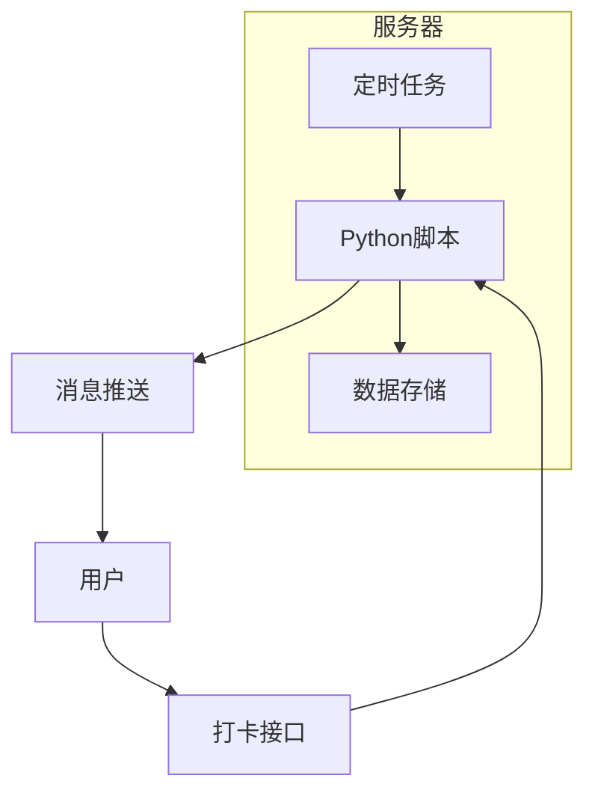
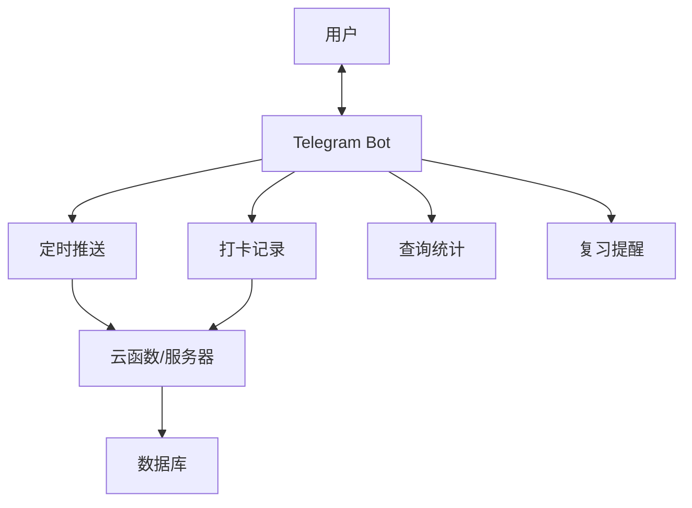
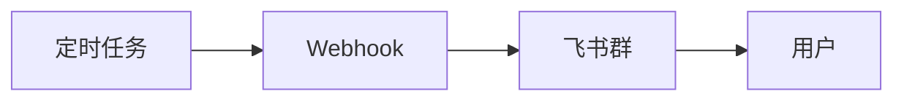
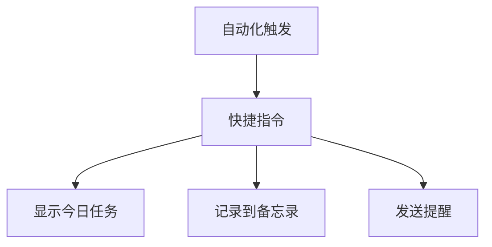
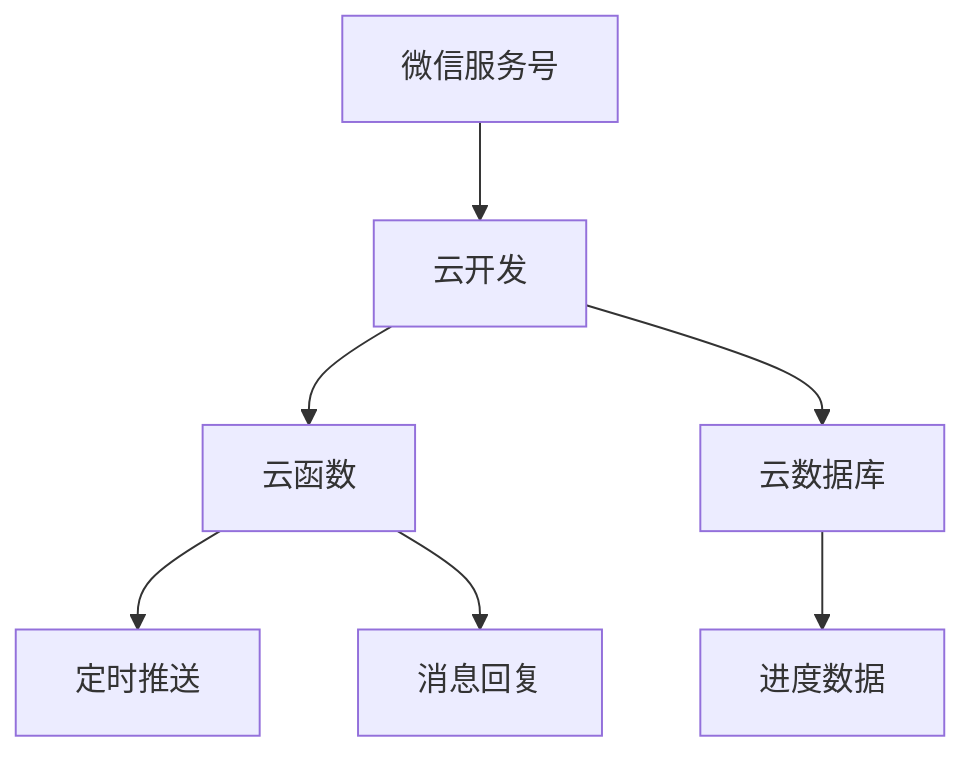

---
tags:
  - 自动化
  - 学习计划
  - Python
  - 机器人
title: 外语学习计划自动化方案（无n8n版）
created: 2025-12-22
---

# 外语学习计划自动化方案（无 n8n 版）

> 不依赖 n8n，使用其他技术栈实现学习计划自动推送与记录

## 📋 文档概览

本文档介绍在**不使用 n8n** 的情况下，如何实现相同的学习计划自动化功能。将从多个技术方案进行对比，帮助你根据自身技术水平和需求选择最适合的实现方式。

---

## 一、方案对比总览

### 🎯 可选方案一览

| 方案 | 技术难度 | 月成本 | 灵活性 | 适合人群 |
| ---- | -------- | ------ | ------ | -------- |
| **方案A: Python脚本** | ⭐⭐⭐ | $0-5 | 极高 | 有编程基础 |
| **方案B: Telegram Bot** | ⭐⭐ | $0-5 | 高 | 懂基础代码 |
| **方案C: 飞书/钉钉机器人** | ⭐⭐ | 免费 | 中 | 企业用户 |
| **方案D: iOS快捷指令** | ⭐ | 免费 | 低 | 苹果用户 |
| **方案E: Notion模板+提醒** | ⭐ | 免费 | 中 | 零代码用户 |
| **方案F: 微信公众号** | ⭐⭐⭐ | 免费 | 高 | 有开发能力 |

---

## 二、方案A：Python 脚本 + 定时任务

> 最灵活、最可定制的方案，适合有编程基础的用户

### 🏗️ 架构设计



### 📁 项目结构

```
learning-tracker/
├── config.yaml          # 配置文件
├── main.py              # 主程序入口
├── scheduler.py         # 定时任务调度
├── tasks/
│   ├── daily_push.py    # 每日推送
│   ├── weekly_report.py # 周报生成
│   └── review_remind.py # 复习提醒
├── storage/
│   ├── json_storage.py  # JSON文件存储
│   └── sqlite_db.py     # SQLite数据库
├── notifiers/
│   ├── telegram.py      # Telegram推送
│   ├── email.py         # 邮件推送
│   └── wechat.py        # 企业微信推送
└── data/
    ├── plan.json        # 学习计划
    └── progress.db      # 进度数据库
```

### 💻 核心代码示例

#### 配置文件 (config.yaml)

```yaml
# 学习计划配置
schedule:
  push_time: "07:00"
  review_time: "20:00"
  timezone: "Asia/Shanghai"

# 每日学习计划
weekly_plan:
  monday:
    english: { duration: 45, focus: "语法+阅读" }
    japanese: { duration: 30, focus: "词汇+语法" }
  tuesday:
    english: { duration: 30, focus: "听力+口语" }
    japanese: { duration: 45, focus: "汉字+听力" }
  # ... 其他日期

# 推送配置
notification:
  type: "telegram"  # telegram / email / wechat
  telegram:
    bot_token: "YOUR_BOT_TOKEN"
    chat_id: "YOUR_CHAT_ID"

# 目标设定
goals:
  english:
    current_level: "B1"
    target_level: "B2"
    vocab_monthly: 300
  japanese:
    current_level: "N5"
    target_level: "N3"
    vocab_monthly: 200
```

#### 主程序 (main.py)

```python
import schedule
import time
from datetime import datetime
from tasks import daily_push, weekly_report
from notifiers import telegram
import yaml

# 加载配置
with open('config.yaml', 'r', encoding='utf-8') as f:
    config = yaml.safe_load(f)

def morning_push():
    """早间学习任务推送"""
    weekday = datetime.now().strftime('%A').lower()
    plan = config['weekly_plan'].get(weekday, {})
    
    message = daily_push.generate_message(plan, config)
    telegram.send(message, config['notification'])

def evening_review():
    """晚间复习提醒"""
    items = review_remind.get_due_items()
    if items:
        message = review_remind.generate_message(items)
        telegram.send(message, config['notification'])

def sunday_report():
    """周日生成周报"""
    if datetime.now().weekday() == 6:  # 周日
        report = weekly_report.generate()
        telegram.send(report, config['notification'])

# 设置定时任务
schedule.every().day.at("07:00").do(morning_push)
schedule.every().day.at("20:00").do(evening_review)
schedule.every().day.at("21:00").do(sunday_report)

# 主循环
if __name__ == "__main__":
    print("学习计划机器人已启动...")
    while True:
        schedule.run_pending()
        time.sleep(60)
```

#### Telegram 推送 (notifiers/telegram.py)

```python
import requests

def send(message: str, config: dict):
    """发送Telegram消息"""
    bot_token = config['telegram']['bot_token']
    chat_id = config['telegram']['chat_id']
    
    url = f"https://api.telegram.org/bot{bot_token}/sendMessage"
    data = {
        "chat_id": chat_id,
        "text": message,
        "parse_mode": "Markdown"
    }
    
    response = requests.post(url, json=data)
    return response.json()
```

### 🚀 部署方式

#### 方式1：本地电脑运行

```bash
# 安装依赖
pip install schedule pyyaml requests

# 后台运行
nohup python main.py > log.txt 2>&1 &
```

#### 方式2：云服务器部署

推荐使用：
- **腾讯云轻量服务器** - ¥50/年起
- **阿里云ECS** - ¥99/年起
- **Vultr/DigitalOcean** - $5/月

#### 方式3：Serverless 部署（免费）

使用 **Cloudflare Workers** 或 **Vercel** 的定时触发：

```javascript
// Cloudflare Workers 示例
export default {
  async scheduled(event, env, ctx) {
    // 每天早7点触发
    await sendDailyPlan();
  }
}
```

### ✅ 优点

- 完全自主可控
- 无任何功能限制
- 可集成任何服务
- 一次部署长期运行

### ⚠️ 缺点

- 需要编程基础
- 需要服务器或本地电脑
- 需要自行维护

---

## 三、方案B：Telegram Bot 完整方案

> 只需要一个 Telegram Bot，即可实现全部功能

### 🤖 Bot 功能设计



### 📱 Bot 命令设计

| 命令 | 功能 | 示例 |
| ---- | ---- | ---- |
| `/start` | 开始使用 | 初始化用户 |
| `/done` | 打卡记录 | `/done 英语 45 日语 30` |
| `/today` | 查看今日任务 | 显示今日计划 |
| `/week` | 查看周报 | 显示本周统计 |
| `/review` | 触发复习 | 显示待复习内容 |
| `/set` | 设置计划 | 修改学习时间 |

### 💻 Bot 核心代码

```python
from telegram import Update
from telegram.ext import Application, CommandHandler
import sqlite3
from datetime import datetime

# 创建Bot
app = Application.builder().token("YOUR_BOT_TOKEN").build()

async def done(update: Update, context):
    """处理打卡命令"""
    args = context.args  # ['英语', '45', '日语', '30']
    user_id = update.effective_user.id
    
    # 解析打卡数据
    data = parse_checkin(args)
    
    # 保存到数据库
    save_progress(user_id, data)
    
    # 获取统计
    stats = get_weekly_stats(user_id)
    
    # 回复确认
    message = f"""
✅ 打卡成功！

📅 {datetime.now().strftime('%Y-%m-%d')}
🇬🇧 英语: {data.get('英语', 0)}分钟
🇯🇵 日语: {data.get('日语', 0)}分钟

📊 本周累计
- 英语: {stats['english']}h
- 日语: {stats['japanese']}h

🔥 连续打卡: {stats['streak']}天
"""
    await update.message.reply_text(message)

async def today(update: Update, context):
    """显示今日任务"""
    weekday = datetime.now().weekday()
    plan = get_daily_plan(weekday)
    await update.message.reply_text(plan)

# 注册命令
app.add_handler(CommandHandler("done", done))
app.add_handler(CommandHandler("today", today))

# 运行
app.run_polling()
```

### 🚀 快速部署

使用 **Railway** 或 **Render** 可免费部署：

1. 将代码推送到 GitHub
2. 连接 Railway/Render
3. 自动部署运行

---

## 四、方案C：飞书/钉钉机器人

> 适合企业用户，利用现有办公软件

### 📱 飞书机器人配置



### 💻 飞书推送代码

```python
import requests
import json

def send_feishu(webhook_url: str, title: str, content: str):
    """发送飞书消息"""
    data = {
        "msg_type": "interactive",
        "card": {
            "header": {
                "title": {"tag": "plain_text", "content": title}
            },
            "elements": [
                {
                    "tag": "markdown",
                    "content": content
                }
            ]
        }
    }
    
    response = requests.post(webhook_url, json=data)
    return response.json()

# 使用示例
webhook = "https://open.feishu.cn/open-apis/bot/v2/hook/xxx"
send_feishu(webhook, "📚 今日学习计划", "**英语** 45分钟\n**日语** 30分钟")
```

### ✅ 优点

- 无需额外安装应用
- 消息直达工作群
- 支持卡片富文本

### ⚠️ 限制

- 只能单向推送
- 无法接收打卡命令

---

## 五、方案D：iOS 快捷指令（零代码）

> 苹果用户专属，完全不需要编程

### 📱 实现思路



### 🔧 设置步骤

1. **创建学习计划快捷指令**
   - 打开「快捷指令」App
   - 新建快捷指令
   - 添加「获取当前日期」
   - 添加「如果」判断星期几
   - 根据星期显示不同任务

2. **设置自动化**
   - 打开「自动化」选项卡
   - 创建「每天早7:00」触发
   - 运行学习计划快捷指令

3. **打卡记录**
   - 创建打卡快捷指令
   - 记录到备忘录或提醒事项
   - 可选：同步到 iCloud 表格

### 📋 快捷指令示例配置

```
触发: 每天 07:00
动作:
  1. 获取当前日期
  2. 格式化日期 → 获取星期
  3. 如果 星期 = 周一
       显示通知: 
       "🌅 早安！今日学习计划
        🇬🇧 英语 45分钟 (语法+阅读)
        🇯🇵 日语 30分钟 (词汇+句型)"
  4. 如果 星期 = 周二
       显示通知: ...
```

### ✅ 优点

- 完全免费
- 无需服务器
- 本地运行，隐私安全

### ⚠️ 限制

- 仅限 iOS/macOS 用户
- 功能相对简单
- 无法生成复杂报表

---

## 六、方案E：Notion 模板 + 自动化

> 零代码方案，使用 Notion 的内置功能

### 📊 Notion 数据库设计

#### 数据库1：每日计划 (Daily Plan)

| 属性 | 类型 | 说明 |
| ---- | ---- | ---- |
| 日期 | Date | 学习日期 |
| 星期 | Formula | 自动计算 |
| 英语任务 | Text | 今日英语内容 |
| 日语任务 | Text | 今日日语内容 |
| 英语时长 | Number | 计划分钟数 |
| 日语时长 | Number | 计划分钟数 |

#### 数据库2：学习记录 (Progress Log)

| 属性 | 类型 | 说明 |
| ---- | ---- | ---- |
| 日期 | Date | 打卡日期 |
| 英语实际 | Number | 实际学习分钟 |
| 日语实际 | Number | 实际学习分钟 |
| 完成率 | Formula | 自动计算 |
| 备注 | Text | 学习心得 |

### 🔧 自动化设置

1. **使用 Notion 日历提醒**
   - 在日期属性设置提醒
   - 每天早上收到推送

2. **使用 Notion API + Make/Zapier**
   - 连接 Notion 数据库
   - 定时读取今日任务
   - 发送到 Telegram/邮箱

3. **使用 Notion 模板按钮**
   - 创建「每日打卡」模板
   - 一键填入今日记录

### 📈 进度看板视图

使用 Notion 的不同视图：
- **日历视图**：查看每日完成情况
- **看板视图**：按周/月分组
- **图表视图**：可视化趋势（需要 Chart 集成）

---

## 七、方案F：微信公众号/小程序

> 国内用户最友好的方案

### 🏗️ 架构设计



### 📱 功能实现

1. **模板消息推送**（服务号）
   - 每日早间推送学习任务
   - 需要用户关注公众号

2. **关键词回复**
   - 回复「打卡」触发记录流程
   - 回复「周报」获取统计

3. **小程序界面**
   - 可视化学习计划
   - 打卡记录界面
   - 进度统计图表

### ⚠️ 注意事项

- 服务号需要企业资质
- 模板消息有格式限制
- 需要备案域名

---

## 八、方案对比与推荐

### 🎯 根据需求选择

| 你的情况 | 推荐方案 |
| -------- | -------- |
| **有编程基础 + 想完全自定义** | 方案A: Python脚本 |
| **会一点代码 + 用Telegram** | 方案B: Telegram Bot |
| **零代码 + 用飞书/钉钉办公** | 方案C: 办公软件机器人 |
| **零代码 + 用苹果设备** | 方案D: iOS快捷指令 |
| **零代码 + 喜欢Notion** | 方案E: Notion模板 |
| **想做给更多人用** | 方案F: 微信公众号 |

### 💰 成本对比

| 方案 | 初始成本 | 月运行成本 | 总体评价 |
| ---- | -------- | ---------- | -------- |
| Python脚本 | 学习时间 | $0-5 | 一次投入长期受益 |
| Telegram Bot | 学习时间 | $0 | 性价比最高 |
| 飞书/钉钉 | 0 | 免费 | 功能受限 |
| iOS快捷指令 | 设置时间 | 免费 | 仅限苹果 |
| Notion模板 | 设置时间 | 免费 | 手动操作多 |
| 微信公众号 | 开发成本 | ¥0-50 | 用户触达最广 |

### 🏆 个人推荐

> [!tip] 推荐组合
> **最简单**: Notion模板 + iOS提醒 = 零成本零代码
> 
> **最实用**: Telegram Bot + Railway部署 = 免费且功能完整
> 
> **最灵活**: Python脚本 + 云服务器 = 完全可控

---

## 九、快速开始指南

### 🚀 Telegram Bot 10分钟部署

1. **创建 Bot**
   - 在 Telegram 搜索 @BotFather
   - 发送 `/newbot` 创建机器人
   - 保存获得的 Token

2. **获取 Chat ID**
   - 给你的 Bot 发任意消息
   - 访问 `https://api.telegram.org/bot<TOKEN>/getUpdates`
   - 找到 `chat.id` 字段

3. **创建推送脚本**

```python
# push.py - 最简单的推送脚本
import requests
from datetime import datetime

TOKEN = "你的Bot Token"
CHAT_ID = "你的Chat ID"

# 学习计划
PLANS = {
    0: "🇬🇧 英语45分钟 | 🇯🇵 日语30分钟",  # 周一
    1: "🇬🇧 英语30分钟 | 🇯🇵 日语45分钟",  # 周二
    # ... 其他日期
}

def push():
    weekday = datetime.now().weekday()
    plan = PLANS.get(weekday, "今日休息")
    
    message = f"""
🌅 早安！今日学习计划

📅 {datetime.now().strftime('%Y-%m-%d')}
{plan}

💪 加油！
"""
    
    url = f"https://api.telegram.org/bot{TOKEN}/sendMessage"
    requests.post(url, json={"chat_id": CHAT_ID, "text": message})

if __name__ == "__main__":
    push()
```

4. **设置定时执行**

Windows 任务计划程序：
```
触发器: 每天 07:00
操作: python C:\path\to\push.py
```

Linux Cron:
```bash
0 7 * * * /usr/bin/python3 /path/to/push.py
```

---

## 十、常见问题

### Q1: 哪个方案最适合新手？

A: **Notion模板 + iOS提醒** 完全不需要编程，10分钟即可设置完成。

### Q2: 想要打卡功能怎么办？

A: 使用 **Telegram Bot** 方案，可以接收用户命令并记录。

### Q3: 不想维护服务器？

A: 使用 **Railway/Render** 免费托管，或使用 **Cloudflare Workers** 无服务器方案。

### Q4: 数据存在哪里？

A: 
- 简单需求：JSON 文件或 SQLite
- 需要同步：Google Sheets 或 Notion
- 正式项目：PostgreSQL 或 MongoDB

---

> 📝 本文档版本: v1.0  
> 📅 创建日期: 2025-12-22  
> 🔄 最后更新: 2025-12-22
