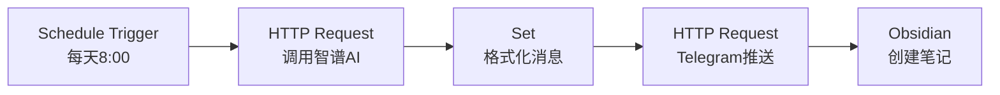
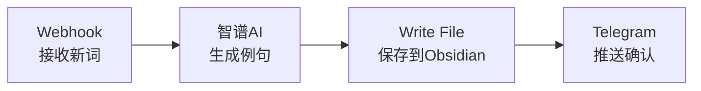
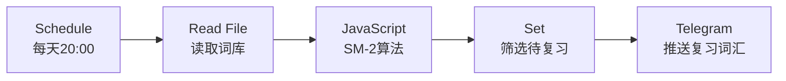
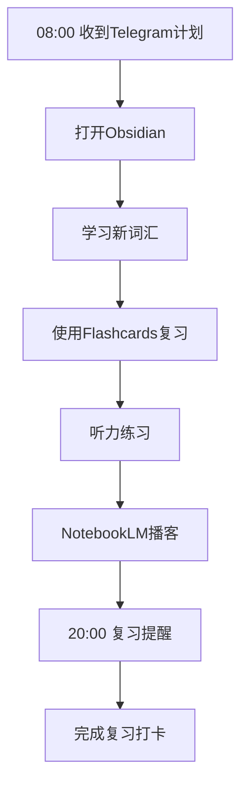

# 🚀 智能英语日语学习系统部署指南

> 基于《智能学习系统整合方案》的完整部署手册，助你快速搭建个人智能学习助手

---

## 📋 目录

1. [前置准备](#前置准备)
2. [第一阶段：基础环境搭建](#第一阶段基础环境搭建1-2天)
3. [第二阶段：自动化引擎部署](#第二阶段自动化引擎部署2-3天)
4. [第三阶段：智能助手配置](#第三阶段智能助手配置2-3天)
5. [第四阶段：学习系统上线](#第四阶段学习系统上线1-2天)
6. [日常使用指南](#日常使用指南)
7. [常见问题排查](#常见问题排查)

---

## 📦 前置准备

### 硬件需求
| 设备 | 要求 | 备注 |
|------|------|------|
| 电脑 | Windows/Mac/Linux | 用于配置和管理 |
| NAS（可选） | 群晖/威联通 | 推荐部署n8n和Grafana |
| 手机 | iOS/Android | 安装Telegram、Obsidian移动端 |

### 账号注册清单（按优先级）

> [!IMPORTANT]
> 请在开始部署前完成所有账号注册，预计需要 **30-60分钟**

| 优先级 | 服务 | 申请地址 | 免费额度 | 用途 |
|:------:|------|----------|----------|------|
| ⭐⭐⭐ | Telegram | [telegram.org](https://telegram.org) | 完全免费 | 消息推送核心 |
| ⭐⭐⭐ | 智谱AI | [open.bigmodel.cn](https://open.bigmodel.cn) | 500万tokens | 日常AI任务 |
| ⭐⭐⭐ | Gemini API | [ai.google.dev](https://ai.google.dev) | 免费tier | 复杂任务处理 |
| ⭐⭐ | 通义千问 | [dashscope.aliyun.com](https://dashscope.aliyun.com) | 100万tokens/月 | 备选LLM |
| ⭐⭐ | 讯飞开放平台 | [xfyun.cn](https://xfyun.cn) | 10万次/月 | 语音合成/识别 |
| ⭐⭐ | NotebookLM | [notebooklm.google.com](https://notebooklm.google.com) | 免费 | AI播客生成 |
| ⭐ | DeepSeek | [platform.deepseek.com](https://platform.deepseek.com) | 500万tokens | 代码相关任务 |

### 软件下载清单
- [ ] **Obsidian** - [obsidian.md](https://obsidian.md) （桌面端+移动端）
- [ ] **Telegram** - 桌面端和移动端
- [ ] **Node.js** - [nodejs.org](https://nodejs.org) （LTS版本，用于n8n）
- [ ] **Git** - [git-scm.com](https://git-scm.com) （版本控制）
- [ ] **Docker**（可选）- [docker.com](https://docker.com) （如需容器化部署n8n）

---

## 🏗️ 第一阶段：基础环境搭建（1-2天）

### Step 1.1 安装并配置 Obsidian

1. **下载安装**
   - 从 [obsidian.md](https://obsidian.md) 下载对应系统版本
   - 创建新仓库（Vault），建议路径：`D:\LearningVault`

2. **安装必备插件**
   打开设置 → 第三方插件 → 关闭安全模式 → 浏览社区插件，安装：
   
   | 插件名 | 用途 | 重要性 |
   |--------|------|:------:|
   | Spaced Repetition | 间隔重复复习 | ⭐⭐⭐ |
   | Flashcards | 单词卡片 | ⭐⭐⭐ |
   | Dataview | 数据查询 | ⭐⭐⭐ |
   | Templater | 模板引擎 | ⭐⭐ |
   | Calendar | 日历视图 | ⭐⭐ |
   | Kanban | 任务看板 | ⭐ |

3. **创建文件夹结构**
   ```
   LearningVault/
   ├── 📁 英语学习/
   │   ├── 📁 词汇库/
   │   ├── 📁 语法笔记/
   │   ├── 📁 听力材料/
   │   ├── 📁 口语练习/
   │   └── 📁 真题库/
   ├── 📁 日语学习/
   │   ├── 📁 五十音/
   │   ├── 📁 词汇库/
   │   ├── 📁 语法笔记/
   │   ├── 📁 听力材料/
   │   └── 📁 真题库/
   ├── 📁 每日学习记录/
   ├── 📁 复习计划/
   └── 📁 学习资源/
   ```

### Step 1.2 创建 Telegram Bot

1. **创建Bot**
   - 打开 Telegram，搜索 `@BotFather`
   - 发送 `/newbot`
   - 按提示输入Bot名称（如：`我的学习助手`）和用户名（如：`my_study_bot`）
   - **保存返回的 API Token**，格式类似：`123456789:ABCdefGHIjklMNOpqrsTUVwxyz`

2. **获取 Chat ID**
   - 向你的Bot发送一条消息
   - 访问：`https://api.telegram.org/bot<你的TOKEN>/getUpdates`
   - 在返回的JSON中找到 `chat.id`（一串数字）

3. **测试推送**
   ```bash
   curl -X POST "https://api.telegram.org/bot<TOKEN>/sendMessage" \
     -H "Content-Type: application/json" \
     -d '{"chat_id":"<CHAT_ID>","text":"🎉 Bot配置成功！"}'
   ```

### Step 1.3 配置 LLM API

#### 智谱AI (GLM-4) 配置
1. 登录 [open.bigmodel.cn](https://open.bigmodel.cn)
2. 进入控制台 → API Keys → 创建新密钥
3. 保存 API Key

#### Gemini API 配置
1. 访问 [ai.google.dev](https://ai.google.dev)
2. 点击 "Get API key" → "Create API key in new project"
3. 保存生成的 API Key

> [!TIP]
> 建议创建一个 `.env` 文件统一管理所有密钥：
> ```env
> TELEGRAM_BOT_TOKEN=your_telegram_token
> TELEGRAM_CHAT_ID=your_chat_id
> ZHIPU_API_KEY=your_zhipu_key
> GEMINI_API_KEY=your_gemini_key
> XUNFEI_APP_ID=your_xunfei_appid
> XUNFEI_API_KEY=your_xunfei_key
> ```

---

## ⚙️ 第二阶段：自动化引擎部署（2-3天）

### Step 2.1 部署 n8n

#### 方式A：本地安装（推荐入门）
```bash
# 确保已安装 Node.js (18+)
npm install n8n -g

# 启动 n8n
n8n start

# 访问 http://localhost:5678
```

#### 方式B：Docker部署（推荐生产）
```bash
docker run -d \
  --name n8n \
  -p 5678:5678 \
  -v n8n_data:/home/node/.n8n \
  n8nio/n8n
```

#### 方式C：NAS部署
1. 在群晖/威联通的Docker套件中搜索 `n8nio/n8n`
2. 配置端口映射：5678:5678
3. 配置持久化存储卷

### Step 2.2 创建核心工作流

#### 工作流1：每日学习计划推送

在n8n中创建新工作流，添加以下节点：



**Schedule Trigger 配置：**
```json
{
  "rule": {
    "interval": [{"field": "hours", "value": 8}],
    "mode": "everyDay"
  }
}
```

**智谱AI HTTP Request 配置：**
```json
{
  "url": "https://open.bigmodel.cn/api/paas/v4/chat/completions",
  "method": "POST",
  "headers": {
    "Authorization": "Bearer {{$env.ZHIPU_API_KEY}}",
    "Content-Type": "application/json"
  },
  "body": {
    "model": "glm-4-flash",
    "messages": [
      {
        "role": "system",
        "content": "你是一位专业的英语和日语学习规划师。请根据间隔重复原则，生成今日学习计划。"
      },
      {
        "role": "user", 
        "content": "请生成今日的英语和日语学习计划，包括：1.需要复习的词汇 2.新学内容 3.听力练习 4.口语练习建议"
      }
    ]
  }
}
```

**Telegram 推送配置：**
```json
{
  "url": "https://api.telegram.org/bot{{$env.TELEGRAM_BOT_TOKEN}}/sendMessage",
  "method": "POST",
  "body": {
    "chat_id": "{{$env.TELEGRAM_CHAT_ID}}",
    "text": "📚 今日学习计划\n\n{{ $json.choices[0].message.content }}",
    "parse_mode": "Markdown"
  }
}
```

#### 工作流2：词汇自动同步



#### 工作流3：复习提醒



### Step 2.3 配置 n8n 环境变量

在n8n设置中添加环境变量，或在启动时配置：

```bash
# 方式1: 直接设置
export TELEGRAM_BOT_TOKEN="your_token"
export ZHIPU_API_KEY="your_key"
n8n start

# 方式2: Docker
docker run -d \
  --name n8n \
  -e TELEGRAM_BOT_TOKEN="your_token" \
  -e ZHIPU_API_KEY="your_key" \
  -p 5678:5678 \
  n8nio/n8n
```

---

## 🤖 第三阶段：智能助手配置（2-3天）

### Step 3.1 配置语音系统

#### 讯飞TTS配置
1. 登录 [讯飞开放平台](https://xfyun.cn)
2. 创建应用 → 添加语音合成服务
3. 获取 AppID、APIKey、APISecret

#### Edge TTS配置（免费替代方案）
```bash
# 安装 edge-tts
pip install edge-tts

# 生成英语语音
edge-tts --text "Hello, welcome to your daily study!" --voice en-US-JennyNeural --write-media english.mp3

# 生成日语语音
edge-tts --text "こんにちは、今日も頑張りましょう！" --voice ja-JP-NanamiNeural --write-media japanese.mp3
```

在n8n中集成Edge TTS：
```json
{
  "node": "Execute Command",
  "command": "edge-tts --text \"{{ $json.word }}\" --voice en-US-JennyNeural --write-media D:/LearningVault/audio/{{ $json.word }}.mp3"
}
```

### Step 3.2 配置 NotebookLM

1. 访问 [notebooklm.google.com](https://notebooklm.google.com)
2. 创建新笔记本
3. 上传学习材料：
   - 英语：语法书PDF、阅读文章
   - 日语：教材PDF、N1-N5文法整理
4. 使用 "Audio Overview" 生成音频播客
5. 下载音频用于通勤学习

### Step 3.3 构建智能问答助手（可选）

使用 Coze 或 Dify 构建：

#### Coze 配置步骤
1. 访问 [coze.com](https://coze.com) 或 [coze.cn](https://coze.cn)
2. 创建新Bot
3. 配置知识库：上传学习资料
4. 配置插件：绑定你的n8n Webhook
5. 发布到Telegram

---

## 📱 第四阶段：学习系统上线（1-2天）

### Step 4.1 测试所有工作流

**测试清单：**
- [ ] 手动触发每日计划推送，确认Telegram收到消息
- [ ] 测试词汇添加Webhook
- [ ] 测试复习提醒工作流
- [ ] 测试Edge TTS语音生成
- [ ] 确认Obsidian文件正确创建

### Step 4.2 配置数据备份

#### 方式1：Git版本控制（推荐）
```bash
cd D:\LearningVault

# 初始化Git仓库
git init

# 创建 .gitignore
echo ".obsidian/workspace.json" > .gitignore

# 首次提交
git add .
git commit -m "初始化学习仓库"

# 配置远程仓库（如GitHub私有仓库）
git remote add origin https://github.com/yourusername/learning-vault.git
git push -u origin main
```

#### 方式2：坚果云同步
1. 下载安装坚果云客户端
2. 将 `LearningVault` 文件夹设为同步文件夹
3. 配置选择性同步，排除 `.obsidian/cache` 等缓存目录

### Step 4.3 配置可视化仪表盘（可选）

#### Grafana 部署
```bash
# Docker方式
docker run -d \
  --name grafana \
  -p 3000:3000 \
  grafana/grafana
```

配置学习数据面板：
1. 添加数据源（如JSON文件、SQLite）
2. 创建Dashboard：
   - 学习时长热力图
   - 词汇掌握度趋势
   - 每日完成率

---

## 📖 日常使用指南

### 每日学习流程



### 添加新词汇

**方法1：Obsidian直接添加**
在对应词库文件中添加：
```markdown
## apple
- **音标**: /ˈæp.əl/
- **释义**: 苹果
- **例句**: I eat an apple every day.
- **日期**: {{date}}
#flashcard
```

**方法2：Telegram快速添加**
向你的Bot发送：`/add apple 苹果`
（需配置对应的n8n工作流接收处理）

### 查看学习进度

1. **Obsidian**: 使用Dataview插件查询
   ```dataview
   TABLE file.cday as 添加日期, length(file.outlinks) as 复习次数
   FROM "英语学习/词汇库"
   SORT file.cday DESC
   LIMIT 20
   ```

2. **Grafana**: 访问 `http://localhost:3000` 查看仪表盘

---

## 🔧 常见问题排查

### Q1: Telegram收不到消息
- [ ] 检查Bot Token是否正确
- [ ] 确认Chat ID没有写错
- [ ] 检查网络是否能访问Telegram API
- [ ] 在n8n中查看执行日志

### Q2: n8n工作流不触发
- [ ] 检查Schedule Trigger配置
- [ ] 确认n8n服务正在运行
- [ ] 查看n8n日志排查错误

### Q3: 智谱AI返回错误
- [ ] 确认API Key有效
- [ ] 检查免费额度是否用尽
- [ ] 查看返回的错误信息

### Q4: Edge TTS不工作
- [ ] 确认Python环境已安装
- [ ] 运行 `pip install edge-tts --upgrade`
- [ ] 检查输出路径权限

### Q5: Obsidian同步冲突
- [ ] 使用Git解决冲突
- [ ] 避免同时在多设备编辑同一文件
- [ ] 配置坚果云冲突处理策略

---

## 📊 成本预估

| 项目 | 月费用 | 备注 |
|------|--------|------|
| 智谱AI | ¥0-10 | 免费额度通常够用 |
| Gemini | ¥0 | 免费tier |
| Edge TTS | ¥0 | 完全免费 |
| 讯飞语音 | ¥0 | 免费额度够用 |
| n8n | ¥0 | 自建部署 |
| Obsidian | ¥0 | 核心功能免费 |
| **总计** | **¥0-10/月** | |

---

## 🎯 快速启动检查清单

完成以下步骤即可开始学习：

- [ ] ✅ Telegram Bot创建并测试通过
- [ ] ✅ 智谱AI API Key获取
- [ ] ✅ Obsidian安装并创建仓库
- [ ] ✅ n8n部署并可访问
- [ ] ✅ 每日计划推送工作流配置完成
- [ ] ✅ 收到第一条学习计划推送

**🎉 恭喜！你的智能学习系统已就绪，开始高效学习吧！**

---

## 📚 扩展资源

- [n8n官方文档](https://docs.n8n.io)
- [Obsidian帮助文档](https://help.obsidian.md)
- [智谱AI开发文档](https://open.bigmodel.cn/dev/api)
- [Telegram Bot API](https://core.telegram.org/bots/api)

---

*最后更新：2025年12月28日*
