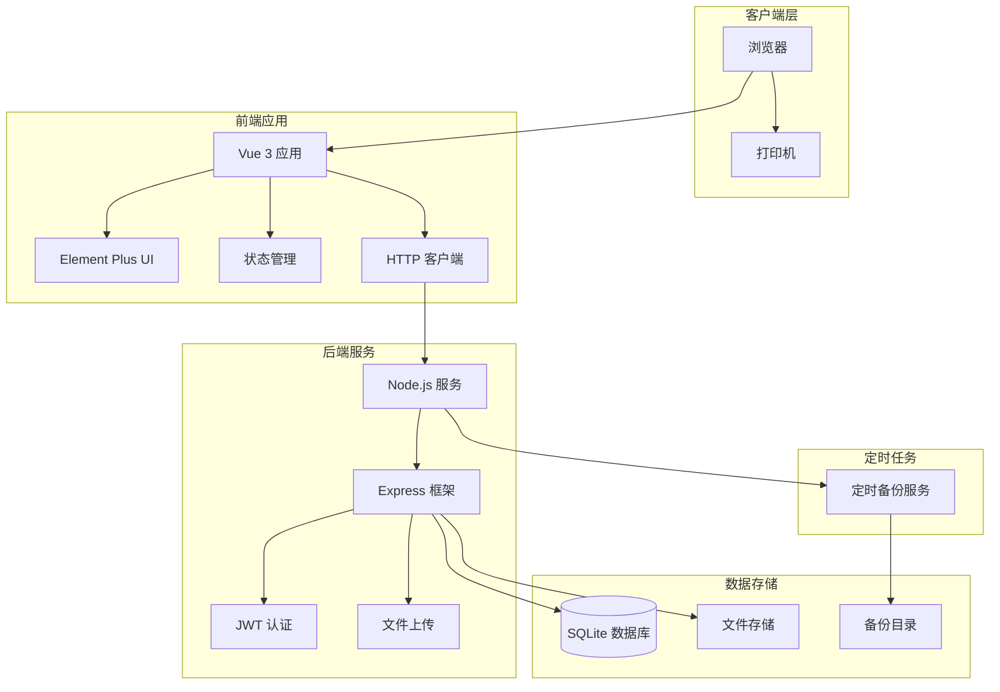
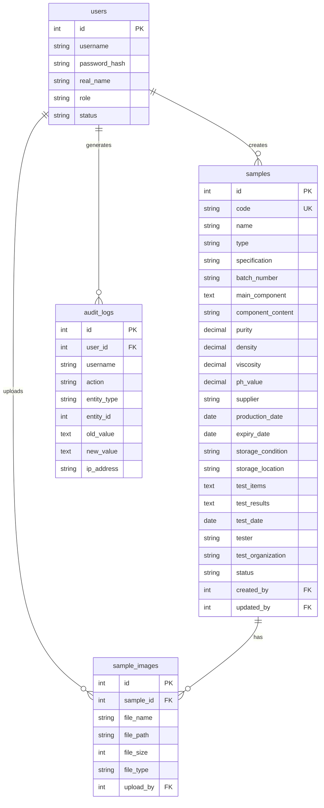
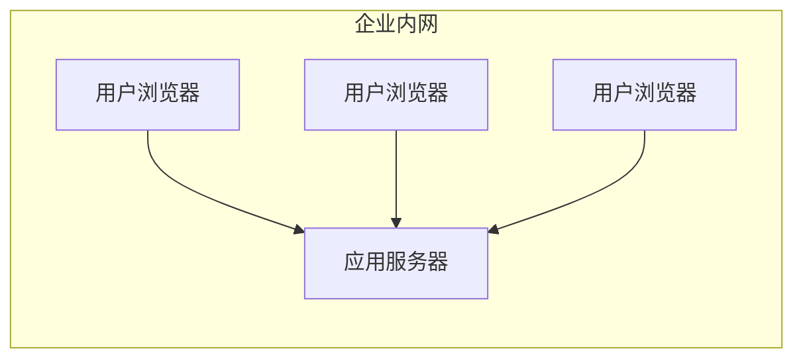

# 样品库管理系统技术设计文档

Feature Name: sample-library-management
Updated: 2026-03-05

## Description

样品库管理系统是一个企业级Web应用，采用前后端分离架构，部署于企业内网服务器。系统提供样品信息的录入、查询、编辑、导出、打印等核心功能，支持多用户协作和完善的权限管理。技术选型注重开发效率、部署便利性和维护成本。

## Architecture

### 系统架构图



### 技术选型说明

| 层级 | 技术选型 | 选型理由 |
|------|----------|----------|
| 前端框架 | Vue 3 + TypeScript | 学习曲线平缓，生态完善，适合中小型团队 |
| UI组件库 | Element Plus | 成熟的企业级UI组件，开箱即用 |
| 状态管理 | Pinia | Vue 3官方推荐，比Vuex更简洁 |
| 后端运行时 | Node.js 20 LTS | 与前端技术栈统一，降低学习成本 |
| 后端框架 | Express | 轻量灵活，中间件生态丰富 |
| 数据库 | SQLite | 零配置，无需独立数据库服务，适合内网部署 |
| 文件存储 | 本地文件系统 | 简单可靠，无需额外的存储服务 |
| 认证方案 | JWT | 无状态认证，适合分布式部署 |
| 打印方案 | 浏览器原生打印 + CSS打印样式 | 无需额外依赖，兼容性好 |

## Components and Interfaces

### 前端组件结构

```
src/
├── views/                    # 页面组件
│   ├── Login.vue            # 登录页面
│   ├── Dashboard.vue        # 仪表盘/首页
│   ├── SampleList.vue       # 样品列表
│   ├── SampleDetail.vue     # 样品详情
│   ├── SampleForm.vue       # 样品录入/编辑表单
│   ├── Statistics.vue       # 统计分析
│   ├── AuditLog.vue         # 审计日志
│   ├── UserManagement.vue   # 用户管理
│   └── Settings.vue         # 系统设置
├── components/              # 可复用组件
│   ├── SampleSearch.vue     # 样品搜索组件
│   ├── SampleCard.vue       # 样品卡片组件
│   ├── ImageUpload.vue      # 图片上传组件
│   ├── PrintLabel.vue       # 标签打印组件
│   └── ExportDialog.vue     # 导出对话框
├── stores/                  # Pinia状态管理
│   ├── auth.ts             # 认证状态
│   ├── sample.ts           # 样品数据状态
│   └── settings.ts         # 系统设置状态
├── api/                     # API接口封装
│   ├── auth.ts             # 认证接口
│   ├── sample.ts           # 样品接口
│   ├── user.ts             # 用户接口
│   └── statistics.ts       # 统计接口
├── router/                  # 路由配置
│   └── index.ts
├── utils/                   # 工具函数
│   ├── validator.ts        # 表单验证
│   ├── formatter.ts        # 数据格式化
│   └── export.ts           # 导出功能
└── styles/                  # 样式文件
    └── print.css           # 打印样式
```

### 后端模块结构

```
server/
├── src/
│   ├── controllers/         # 控制器
│   │   ├── auth.controller.ts
│   │   ├── sample.controller.ts
│   │   ├── user.controller.ts
│   │   ├── statistics.controller.ts
│   │   └── audit.controller.ts
│   ├── services/            # 业务逻辑
│   │   ├── auth.service.ts
│   │   ├── sample.service.ts
│   │   ├── user.service.ts
│   │   ├── statistics.service.ts
│   │   ├── backup.service.ts
│   │   └── export.service.ts
│   ├── models/              # 数据模型
│   │   ├── user.model.ts
│   │   ├── sample.model.ts
│   │   ├── audit-log.model.ts
│   │   └── setting.model.ts
│   ├── middlewares/         # 中间件
│   │   ├── auth.middleware.ts
│   │   ├── error.middleware.ts
│   │   ├── upload.middleware.ts
│   │   └── audit.middleware.ts
│   ├── routes/              # 路由定义
│   │   ├── auth.routes.ts
│   │   ├── sample.routes.ts
│   │   ├── user.routes.ts
│   │   └── statistics.routes.ts
│   ├── utils/               # 工具函数
│   │   ├── crypto.ts        # 加密工具
│   │   ├── logger.ts        # 日志工具
│   │   └── scheduler.ts     # 定时任务
│   └── config/              # 配置文件
│       └── index.ts
├── database/
│   ├── schema.sql           # 数据库结构
│   └── migrations/          # 迁移脚本
├── uploads/                 # 上传文件目录
├── backups/                 # 备份文件目录
└── logs/                    # 日志文件目录
```

### API接口定义

#### 认证接口

```
POST   /api/auth/login          # 用户登录
POST   /api/auth/logout         # 用户登出
GET    /api/auth/profile        # 获取当前用户信息
PUT    /api/auth/password       # 修改密码
```

#### 样品接口

```
GET    /api/samples             # 获取样品列表（支持分页、筛选）
GET    /api/samples/:id         # 获取样品详情
POST   /api/samples             # 创建样品
PUT    /api/samples/:id         # 更新样品
DELETE /api/samples/:id         # 删除样品（软删除）
POST   /api/samples/import      # 批量导入样品
GET    /api/samples/export      # 导出样品
GET    /api/samples/:id/print   # 获取打印标签数据
```

#### 用户管理接口

```
GET    /api/users               # 获取用户列表
POST   /api/users               # 创建用户
PUT    /api/users/:id           # 更新用户
DELETE /api/users/:id           # 删除用户
PUT    /api/users/:id/reset     # 重置用户密码
```

#### 统计分析接口

```
GET    /api/statistics/overview # 获取概览统计
GET    /api/statistics/trend    # 获取趋势数据
GET    /api/statistics/category # 获取分类统计
GET    /api/statistics/test     # 获取检测统计
```

#### 审计日志接口

```
GET    /api/audit-logs          # 获取审计日志列表
GET    /api/audit-logs/export   # 导出审计日志
```

#### 系统设置接口

```
GET    /api/settings            # 获取系统设置
PUT    /api/settings            # 更新系统设置
POST   /api/settings/backup     # 手动备份
POST   /api/settings/restore    # 恢复备份
```

## Data Models

### 用户表 (users)

```sql
CREATE TABLE users (
    id INTEGER PRIMARY KEY AUTOINCREMENT,
    username VARCHAR(50) NOT NULL UNIQUE,
    password_hash VARCHAR(255) NOT NULL,
    real_name VARCHAR(50) NOT NULL,
    role VARCHAR(20) NOT NULL DEFAULT 'user',  -- 'admin' or 'user'
    status VARCHAR(20) NOT NULL DEFAULT 'active',  -- 'active', 'locked', 'disabled'
    login_attempts INTEGER DEFAULT 0,
    locked_until DATETIME,
    last_login DATETIME,
    created_at DATETIME DEFAULT CURRENT_TIMESTAMP,
    updated_at DATETIME DEFAULT CURRENT_TIMESTAMP
);
```

### 样品表 (samples)

```sql
CREATE TABLE samples (
    id INTEGER PRIMARY KEY AUTOINCREMENT,
    code VARCHAR(50) NOT NULL UNIQUE,           -- 样品编码
    name VARCHAR(100) NOT NULL,                 -- 样品名称
    type VARCHAR(50),                           -- 样品类型
    specification VARCHAR(100),                 -- 规格型号
    batch_number VARCHAR(50),                   -- 批次号

    -- 成分性质
    main_component TEXT,                        -- 主要成分
    component_content VARCHAR(100),             -- 成分含量
    purity DECIMAL(10,4),                       -- 纯度
    density DECIMAL(10,4),                      -- 密度
    viscosity DECIMAL(10,4),                    -- 粘度
    ph_value DECIMAL(5,2),                      -- pH值

    -- 来源存储
    supplier VARCHAR(100),                      -- 供应商
    production_date DATE,                       -- 生产日期
    expiry_date DATE,                           -- 有效期
    storage_condition VARCHAR(200),             -- 存储条件
    storage_location VARCHAR(100),              -- 存储位置

    -- 检测信息
    test_items TEXT,                            -- 检测项目(JSON)
    test_results TEXT,                          -- 检测结果(JSON)
    test_date DATE,                             -- 检测日期
    tester VARCHAR(50),                         -- 检测人员
    test_organization VARCHAR(100),             -- 检测机构

    -- 状态与时间戳
    status VARCHAR(20) DEFAULT 'active',        -- 'active', 'deleted'
    created_by INTEGER,                         -- 创建人ID
    created_at DATETIME DEFAULT CURRENT_TIMESTAMP,
    updated_by INTEGER,                         -- 更新人ID
    updated_at DATETIME DEFAULT CURRENT_TIMESTAMP,

    FOREIGN KEY (created_by) REFERENCES users(id),
    FOREIGN KEY (updated_by) REFERENCES users(id)
);

-- 创建索引加速查询
CREATE INDEX idx_samples_code ON samples(code);
CREATE INDEX idx_samples_name ON samples(name);
CREATE INDEX idx_samples_type ON samples(type);
CREATE INDEX idx_samples_supplier ON samples(supplier);
CREATE INDEX idx_samples_created_at ON samples(created_at);
```

### 样品图片表 (sample_images)

```sql
CREATE TABLE sample_images (
    id INTEGER PRIMARY KEY AUTOINCREMENT,
    sample_id INTEGER NOT NULL,
    file_name VARCHAR(255) NOT NULL,
    file_path VARCHAR(500) NOT NULL,
    file_size INTEGER,
    file_type VARCHAR(50),
    upload_by INTEGER,
    upload_at DATETIME DEFAULT CURRENT_TIMESTAMP,
    FOREIGN KEY (sample_id) REFERENCES samples(id),
    FOREIGN KEY (upload_by) REFERENCES users(id)
);
```

### 审计日志表 (audit_logs)

```sql
CREATE TABLE audit_logs (
    id INTEGER PRIMARY KEY AUTOINCREMENT,
    user_id INTEGER,
    username VARCHAR(50),
    action VARCHAR(50) NOT NULL,          -- 'create', 'update', 'delete', 'login', 'export', 'import'
    entity_type VARCHAR(50),              -- 'sample', 'user', 'setting'
    entity_id INTEGER,
    old_value TEXT,                       -- 修改前的值(JSON)
    new_value TEXT,                       -- 修改后的值(JSON)
    ip_address VARCHAR(50),
    user_agent VARCHAR(500),
    created_at DATETIME DEFAULT CURRENT_TIMESTAMP,
    FOREIGN KEY (user_id) REFERENCES users(id)
);

CREATE INDEX idx_audit_logs_user ON audit_logs(user_id);
CREATE INDEX idx_audit_logs_action ON audit_logs(action);
CREATE INDEX idx_audit_logs_entity ON audit_logs(entity_type, entity_id);
CREATE INDEX idx_audit_logs_created_at ON audit_logs(created_at);
```

### 系统设置表 (settings)

```sql
CREATE TABLE settings (
    key VARCHAR(100) PRIMARY KEY,
    value TEXT,
    description VARCHAR(255),
    updated_at DATETIME DEFAULT CURRENT_TIMESTAMP
);
```

### 数据关系图



## Correctness Properties

### 数据完整性约束

1. **编码唯一性**：样品编码必须在全表范围内唯一
2. **外键完整性**：所有外键引用必须指向有效记录
3. **软删除保护**：删除操作仅更新status字段，保留历史数据
4. **审计完整性**：所有增删改操作必须记录到审计日志

### 业务规则约束

1. **编码格式验证**：样品编码必须符合配置的编码规则（正则表达式验证）
2. **权限验证**：非管理员用户只能修改自己创建的样品（可配置）
3. **并发控制**：使用乐观锁机制防止并发编辑冲突
4. **文件类型限制**：仅允许上传JPG、PNG、PDF格式文件

### 性能约束

1. **查询响应时间**：单次查询响应时间不超过500ms
2. **文件上传大小**：单个文件不超过10MB
3. **分页大小限制**：每页最多返回100条记录
4. **并发连接数**：支持至少20个并发用户

## Error Handling

### 错误码定义

| 错误码 | 说明 | HTTP状态码 |
|--------|------|------------|
| AUTH_001 | 用户名或密码错误 | 401 |
| AUTH_002 | 账户已被锁定 | 403 |
| AUTH_003 | 登录会话已过期 | 401 |
| AUTH_004 | 无操作权限 | 403 |
| SAMPLE_001 | 样品编码已存在 | 400 |
| SAMPLE_002 | 样品编码格式错误 | 400 |
| SAMPLE_003 | 样品不存在 | 404 |
| SAMPLE_004 | 样品正在被编辑 | 409 |
| FILE_001 | 文件格式不支持 | 400 |
| FILE_002 | 文件大小超限 | 400 |
| FILE_003 | 文件上传失败 | 500 |
| SYSTEM_001 | 数据库错误 | 500 |
| SYSTEM_002 | 备份失败 | 500 |

### 错误响应格式

```json
{
    "success": false,
    "error": {
        "code": "SAMPLE_001",
        "message": "样品编码已存在",
        "details": {
            "field": "code",
            "value": "SMP-2024-001"
        }
    }
}
```

### 异常处理策略

1. **验证错误**：返回详细的字段级错误信息，便于前端显示
2. **业务错误**：记录错误日志，返回用户友好的错误消息
3. **系统错误**：记录详细错误堆栈，返回通用错误消息，通知管理员
4. **并发冲突**：提示用户刷新页面或稍后重试

## Test Strategy

### 单元测试

- **前端测试**：使用 Vitest 测试工具函数和组件
- **后端测试**：使用 Jest 测试服务和控制器
- **测试覆盖率目标**：核心业务逻辑 >= 80%

### 集成测试

- **API测试**：使用 Supertest 测试所有API端点
- **数据库测试**：使用内存数据库进行隔离测试
- **文件操作测试**：使用临时目录进行文件操作测试

### 端到端测试

- **关键流程测试**：使用 Playwright 测试完整的用户流程
  - 用户登录流程
  - 样品创建流程
  - 样品查询流程
  - 样品导出流程
  - 标签打印流程

### 性能测试

- **负载测试**：模拟20个并发用户进行操作
- **数据库性能**：测试10000条记录下的查询性能
- **文件上传测试**：测试10MB文件上传响应时间

### 测试数据

- 使用工厂函数生成测试数据
- 准备包含各种边界情况的测试数据集
- 包含正常数据、边界数据、异常数据

## Security Considerations

### 认证安全

- 密码使用 bcrypt 加密存储（salt rounds = 12）
- JWT 密钥从环境变量读取，定期轮换
- JWT 有效期设置为2小时，支持刷新令牌
- 登录失败3次锁定账户30分钟

### 数据安全

- 敏感配置（数据库密钥等）从环境变量读取
- 上传文件重命名存储，防止路径遍历攻击
- API 输入验证防止 SQL 注入和 XSS 攻击
- 使用参数化查询操作数据库

### 权限控制

- 基于角色的访问控制（RBAC）
- API 路由级别的权限验证中间件
- 前端路由守卫防止未授权访问
- 操作级别的权限检查

## Deployment

### 部署架构



### 服务器要求

- **操作系统**：Linux (Ubuntu 22.04 推荐) 或 Windows Server
- **运行时**：Node.js 20 LTS
- **内存**：最低 2GB，推荐 4GB
- **存储**：最低 50GB（根据样品图片数量调整）
- **网络**：内网访问，无需公网IP

### 部署步骤

1. 安装 Node.js 20 LTS
2. 克隆代码仓库
3. 安装依赖：`npm install`
4. 配置环境变量
5. 初始化数据库：`npm run db:init`
6. 启动服务：`npm run start` 或使用 PM2 管理进程
7. 配置内网访问地址

### 环境变量配置

```bash
# 服务配置
PORT=3000
NODE_ENV=production

# 安全配置
JWT_SECRET=your-secure-secret-key
JWT_EXPIRES_IN=2h

# 数据库配置
DATABASE_PATH=./data/samples.db

# 文件存储配置
UPLOAD_PATH=./uploads
MAX_FILE_SIZE=10485760

# 备份配置
BACKUP_PATH=./backups
BACKUP_RETENTION_DAYS=90
```

## References

[^1]: Vue 3 官方文档 - https://vuejs.org/
[^2]: Element Plus 组件库 - https://element-plus.org/
[^3]: Express.js 框架 - https://expressjs.com/
[^4]: SQLite 数据库 - https://www.sqlite.org/
