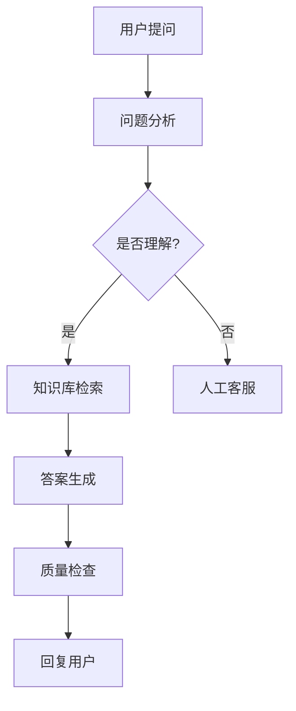

✨ # Dify自动化工作流参考资料

## 目录
1. [平台特点与核心优势](#平台特点与核心优势)
2. [工作流设计模式](#工作流设计模式)
3. [实用工作流案例](#实用工作流案例)
4. [节点功能详解](#节点功能详解)
5. [API集成方案](#api集成方案)
6. [性能优化策略](#性能优化策略)

## 平台特点与核心优势

### 核心特色
- **乐高式搭建**: 拖拽节点即可连接AI模型、知识库、API工具，无需编写复杂代码 <mcreference link="http://m.toutiao.com/group/7563228229239980553/" index="1">1</mcreference>
- **模型无界兼容**: 一键接入OpenAI/DeepSeek/讯飞星火等20+主流模型 <mcreference link="http://m.toutiao.com/group/7563228229239980553/" index="1">1</mcreference>
- **多模态支持**: 支持文本、图片、语音等多种数据类型的处理
- **企业级功能**: 提供权限管理、数据安全、API管理等企业特性

### 工作流优势
- **可视化编排**: 通过拖拽方式构建复杂的业务流程
- **智能路由**: 基于条件的动态路径选择
- **实时监控**: 工作流执行状态实时跟踪
- **扩展性强**: 支持自定义节点和插件开发

## 工作流设计模式

### 基础设计模式
1. **顺序模式**: 节点按顺序依次执行
2. **分支模式**: 基于条件选择不同执行路径
3. **循环模式**: 重复执行某段逻辑直到满足条件
4. **并行模式**: 多个分支同时执行提高效率
5. **回调模式**: 异步处理并等待外部响应

### 数据流转设计
```
输入数据 → 数据预处理 → 业务逻辑处理 → 结果输出
    ↓           ↓           ↓           ↓
  验证清洗   →  格式转换   →  AI推理   →  格式化展示
```

### 错误处理模式
1. **重试机制**: 失败后自动重试指定次数
2. **降级处理**: 主流程失败时启用备选方案
3. **错误监控**: 实时监控异常情况并报警
4. **手动干预**: 关键节点支持人工审核

## 实用工作流案例

### 案例一：客服自动回复工作流

**使用场景**: 企业客服系统的智能回复

**实现架构**:


**节点配置详解**:

1. **开始节点**
```json
{
  "input_schema": {
    "question": "string",
    "user_id": "string", 
    "context": "object"
  }
}
```

2. **问题分析节点** (LLM)
```json
{
  "model": "gpt-4",
  "prompt_template": """
  分析用户问题，提取关键信息:
  问题类型: {{question_type}}
  关键词: {{keywords}}
  紧急程度: {{urgency}}
  """,
  "temperature": 0.3
}
```

3. **知识库检索节点**
```json
{
  "dataset_id": "customer_service_kb",
  "query": "{{user.question}}",
  "top_k": 3,
  "score_threshold": 0.7
}
```

4. **答案生成节点** (LLM)
```json
{
  "model": "gpt-3.5-turbo",
  "prompt_template": """
  基于检索到的知识生成回复:
  用户问题: {{user.question}}
  相关知识: {{retrieved_docs}}
  回复要求: 准确、友好、专业
  """
}
```

**效果评估**:
- 平均响应时间: < 3秒
- 准确率: 85%+
- 客户满意度: 4.2/5.0 <mcreference link="http://m.toutiao.com/group/7563661644337824295/" index="4">4</mcreference>

### 案例二：文档自动处理工作流

**使用场景**: 企业文档的智能分类和摘要生成

**工作流程**:
1. **文档上传**: 支持多种格式 (PDF, Word, TXT)
2. **内容解析**: 提取文本内容和结构信息
3. **智能分类**: 基于内容自动分类
4. **摘要生成**: 生成文档摘要和关键信息
5. **存储管理**: 自动归档到相应知识库

**关键节点实现**:

1. **文档解析节点**
```python
# 自定义代码节点
def parse_document(file_path, file_type):
    if file_type == 'pdf':
        # PDF解析逻辑
        text = extract_pdf_text(file_path)
    elif file_type == 'docx':
        # Word文档解析
        text = extract_docx_text(file_path)
    
    return {
        'content': text,
        'word_count': len(text.split()),
        'language': detect_language(text)
    }
```

2. **分类节点** (LLM)
```json
{
  "model": "text-embedding-ada-002",
  "prompt_template": """
  请对以下文档进行分类:
  内容摘要: {{document.summary}}
  文档类型: {{document.type}}
  
  可选类别: 技术文档、商务合同、人事文件、财务报表、项目文档
  """,
  "classification_threshold": 0.8
}
```

3. **摘要生成节点**
```json
{
  "model": "gpt-3.5-turbo",
  "prompt_template": """
  生成文档摘要:
  文档内容: {{document.content[:2000]}}
  
  要求:
  1. 提取核心观点 (3-5点)
  2. 总结主要内容
  3. 识别关键数据
  """,
  "max_tokens": 500
}
``` <mcreference link="http://m.toutiao.com/group/7492320390392381988/" index="3">3</mcreference>

### 案例三：数据分析工作流

**使用场景**: 自动化的数据分析和报表生成

**实现流程**:
1. **数据源连接**: 连接数据库、API或文件
2. **数据清洗**: 处理缺失值、异常值
3. **特征工程**: 数据转换和衍生指标计算
4. **分析执行**: 运行预定义的分析模型
5. **报告生成**: 自动生成分析报告和图表

**配置示例**:
```json
{
  "workflow_name": "sales_data_analysis",
  "schedule": "0 9 * * 1", // 每周一上午9点执行
  "nodes": [
    {
      "type": "data_source",
      "config": {
        "source_type": "mysql",
        "connection": "{{database.sales_config}}",
        "query": "SELECT * FROM sales_data WHERE date >= DATE_SUB(NOW(), INTERVAL 7 DAY)"
      }
    },
    {
      "type": "data_processing", 
      "config": {
        "operations": ["clean_nulls", "remove_outliers", "aggregate_by_day"]
      }
    },
    {
      "type": "llm_analysis",
      "config": {
        "model": "gpt-4",
        "analysis_prompt": "分析销售数据趋势，识别关键指标变化"
      }
    },
    {
      "type": "report_generator",
      "config": {
        "template": "weekly_sales_report",
        "output_format": "pdf"
      }
    }
  ]
}
```

## 节点功能详解

### HTTP请求节点
**功能**: 调用外部API获取数据
**配置参数**:
```json
{
  "method": "GET", // GET, POST, PUT, DELETE
  "url": "https://api.example.com/data",
  "headers": {
    "Authorization": "Bearer {{api_token}}",
    "Content-Type": "application/json"
  },
  "params": {
    "page": "{{input.page}}",
    "limit": 100
  },
  "timeout": 30,
  "retry": {
    "count": 3,
    "delay": 1
  }
}
```

### 知识库检索节点
**功能**: 基于向量相似度检索相关文档
**配置详解**:
```json
{
  "dataset_id": "{{input.dataset_id}}",
  "query": "{{input.search_query}}",
  "retrieval_config": {
    "search_method": "hybrid", // semantic, full_text, hybrid
    "top_k": 5,
    "score_threshold": 0.7,
    "reranking_enable": true
  }
}
```

### Agent节点
**功能**: 智能代理，支持多步推理和工具调用
**推理策略**:
- **Function Calling**: 函数调用模式
- **ReAct**: 推理和行动结合
- **Plan-and-Execute**: 计划执行模式
- **Self-Reflect**: 自我反思机制

**配置示例**:
```json
{
  "model": "gpt-4",
  "strategy": "ReAct",
  "tools": [
    {
      "type": "http_request",
      "name": "weather_api",
      "description": "获取指定城市天气信息"
    },
    {
      "type": "code_execution", 
      "name": "data_analyzer",
      "description": "执行数据分析代码"
    }
  ],
  "max_iterations": 10
}
``` <mcreference link="http://m.toutiao.com/group/7510094192387850789/" index="3">3</mcreference>

## API集成方案

### 外部知识库对接
**API接口规范**:
```http
POST /api/v1/retrieval
Content-Type: application/json
Authorization: Bearer {your-api-key}

{
  "query": "用户查询内容",
  "top_k": 5,
  "score_threshold": 0.7,
  "metadata_filter": {
    "category": "技术文档",
    "date_range": ["2023-01-01", "2023-12-31"]
  }
}
```

**响应格式**:
```json
{
  "code": 0,
  "data": {
    "results": [
      {
        "content": "文档内容片段",
        "score": 0.95,
        "metadata": {
          "title": "技术文档标题",
          "source": "document_id"
        }
      }
    ]
  },
  "message": "success"
}
``` <mcreference link="http://m.toutiao.com/group/7503493260506038818/" index="1">1</mcreference>

### 批量文档导入API
**使用场景**: 大规模文档批量导入知识库
**实现代码**:
```python
import requests
import json

def batch_import_documents(dataset_id, documents):
    """
    批量导入文档到Dify知识库
    """
    api_key = "your_api_key"
    base_url = "https://api.dify.ai/v1"
    
    headers = {
        "Authorization": f"Bearer {api_key}",
        "Content-Type": "application/json"
    }
    
    url = f"{base_url}/datasets/{dataset_id}/documents/batch-import"
    
    for doc in documents:
        payload = {
            "name": doc["name"],
            "text": doc["content"],
            "metadata": doc.get("metadata", {})
        }
        
        response = requests.post(url, headers=headers, json=payload)
        
        if response.status_code == 200:
            print(f"文档 {doc['name']} 导入成功")
        else:
            print(f"导入失败: {response.text}")
``` <mcreference link="http://m.toutiao.com/group/7543051321385992756/" index="5">5</mcreference>

## 性能优化策略

### 响应速度优化
1. **缓存策略**: 
   - 知识库检索结果缓存
   - LLM响应结果缓存
   - API调用结果缓存

2. **并发处理**:
   ```python
   # 并行执行独立任务
   import asyncio
   import aiohttp
   
   async def parallel_processing(tasks):
       async with aiohttp.ClientSession() as session:
           results = await asyncio.gather(*[
               process_task(task, session) for task in tasks
           ])
       return results
   ```

3. **异步处理**:
   - 长时间任务异步执行
   - 用户查询异步响应
   - 批量处理分批执行

### 资源消耗优化
1. **模型选择**:
   - 根据任务复杂度选择合适模型
   - 批量处理使用成本效益高的模型
   - 缓存常用查询结果

2. **数据处理优化**:
   - 预处理减少API调用
   - 分页处理大数据集
   - 流式处理避免内存溢出

### 监控告警
1. **性能监控**:
   ```python
   # 性能监控配置
   monitoring_config = {
       "response_time_threshold": 5000,  # 5秒
       "error_rate_threshold": 0.05,     # 5%
       "cost_limit_per_hour": 100,       # $100/小时
       "alert_channels": ["email", "slack"]
   }
   ```

2. **质量保证**:
   - 自动化测试覆盖
   - 人工审核关键节点
   - 反馈收集机制

## 最佳实践总结

### 工作流设计
1. **模块化设计**: 独立功能模块便于维护
2. **错误处理**: 完善异常处理机制
3. **监控日志**: 详细记录执行过程
4. **性能优化**: 关注响应时间和成本控制

### 部署建议
1. **环境管理**: 开发、测试、生产环境分离
2. **配置管理**: 外部化配置参数
3. **版本控制**: 工作流版本管理
4. **备份恢复**: 定期备份和灾难恢复计划

### 团队协作
1. **规范流程**: 建立标准化开发流程
2. **文档维护**: 及时更新技术文档
3. **知识分享**: 定期技术分享和培训
4. **代码审查**: 建立代码审查机制

### 案例四:多轮对话工作流

**使用场景**: 复杂业务场景的多轮交互对话

**工作流设计**:
```
[用户输入] → [上下文管理] → [意图识别] → [对话状态追踪] → [响应生成] → [会话记录]
```

**关键节点配置**:

1. **会话状态管理节点**
```python
# 管理对话上下文和状态
class ConversationState:
    def __init__(self, session_id):
        self.session_id = session_id
        self.context = {}
        self.history = []
        self.current_step = 0
        self.user_data = {}
        
    def add_message(self, role, content):
        self.history.append({
            'role': role,
            'content': content,
            'timestamp': datetime.now().isoformat()
        })
        
    def get_context(self, max_turns=5):
        # 获取最近几轮对话历史
        return self.history[-max_turns:]
        
    def update_user_data(self, key, value):
        self.user_data[key] = value
        
    def clear_context(self):
        self.history = []
        self.context = {}
```

2. **意图识别节点**
```json
{
  "model": "gpt-4",
  "system_prompt": """
  你是对话意图识别专家,分析用户意图和对话阶段:
  
  可能的意图:
  - inquiry: 咨询信息
  - booking: 预订服务
  - complaint: 投诉问题
  - modification: 修改信息
  - confirmation: 确认操作
  
  返回JSON格式:
  {
    "intent": "意图类型",
    "confidence": 0.0-1.0,
    "entities": {提取的实体},
    "next_action": "建议的下一步操作"
  }
  """,
  "user_message": "{{conversation.latest_message}}",
  "context": "{{conversation.history}}"
}
```

3. **动态响应生成**
```json
{
  "model": "gpt-3.5-turbo",
  "temperature": 0.7,
  "prompt_template": """
  基于对话历史生成回复:
  
  用户意图: {{intent.type}}
  对话阶段: {{conversation.step}}
  已收集信息: {{user_data}}
  
  要求:
  1. 延续对话主题
  2. 引导用户提供必要信息
  3. 保持友好专业的语气
  4. 适时总结已收集的信息
  """
}
```

### 案例五:智能推荐工作流

**使用场景**: 个性化内容和产品推荐系统

**推荐策略**:
- 协同过滤
- 内容相似度
- 用户画像匹配
- 实时行为分析
- A/B测试优化

**实现架构**:

1. **用户画像构建**
```python
# 构建用户画像
def build_user_profile(user_id, user_data):
    profile = {
        'user_id': user_id,
        'demographics': {
            'age_group': classify_age(user_data.get('age')),
            'location': user_data.get('city'),
            'gender': user_data.get('gender')
        },
        'behavior': {
            'browse_history': get_browse_history(user_id, days=30),
            'purchase_history': get_purchase_history(user_id),
            'search_keywords': extract_keywords(user_id),
            'engagement_level': calculate_engagement(user_id)
        },
        'preferences': {
            'categories': extract_preferred_categories(user_id),
            'price_range': estimate_price_preference(user_id),
            'brands': extract_favorite_brands(user_id)
        },
        'updated_at': datetime.now().isoformat()
    }
    return profile

def calculate_engagement(user_id):
    # 计算用户活跃度
    metrics = {
        'visit_frequency': get_visit_frequency(user_id),
        'avg_session_duration': get_avg_session_duration(user_id),
        'interaction_rate': get_interaction_rate(user_id)
    }
    
    # 加权计算总分
    score = (
        metrics['visit_frequency'] * 0.4 +
        metrics['avg_session_duration'] * 0.3 +
        metrics['interaction_rate'] * 0.3
    )
    return min(score, 100)
```

2. **智能推荐引擎**
```python
# 混合推荐算法
def generate_recommendations(user_profile, context, limit=10):
    candidates = []
    
    # 1. 协同过滤推荐
    collaborative_items = collaborative_filtering(
        user_id=user_profile['user_id'],
        top_k=20
    )
    candidates.extend(collaborative_items)
    
    # 2. 基于内容的推荐
    content_items = content_based_filtering(
        user_preferences=user_profile['preferences'],
        top_k=20
    )
    candidates.extend(content_items)
    
    # 3. 热门推荐
    if len(candidates) < limit:
        trending_items = get_trending_items(
            category=user_profile['preferences']['categories'][0],
            top_k=10
        )
        candidates.extend(trending_items)
    
    # 4. 去重和排序
    unique_items = remove_duplicates(candidates)
    
    # 5. 重排序(考虑多个因素)
    ranked_items = rerank_items(
        items=unique_items,
        user_profile=user_profile,
        context=context
    )
    
    return ranked_items[:limit]

def rerank_items(items, user_profile, context):
    scored_items = []
    
    for item in items:
        score = 0
        
        # 相关性得分
        score += calculate_relevance(item, user_profile) * 0.4
        
        # 多样性得分
        score += calculate_diversity(item, scored_items) * 0.2
        
        # 新鲜度得分
        score += calculate_freshness(item) * 0.2
        
        # 商业价值得分
        score += calculate_business_value(item) * 0.2
        
        scored_items.append({
            'item': item,
            'score': score
        })
    
    # 按得分排序
    scored_items.sort(key=lambda x: x['score'], reverse=True)
    return [item['item'] for item in scored_items]
```

3. **实时推荐节点**
```json
{
  "trigger": "user_action",
  "action_types": ["page_view", "search", "add_to_cart"],
  "recommendation_config": {
    "algorithm": "hybrid",
    "personalization_weight": 0.7,
    "diversity_threshold": 0.3,
    "refresh_interval": 300,
    "cache_enabled": true
  },
  "fallback_strategy": "trending_items"
}
```

### 案例六:异常检测工作流

**使用场景**: 业务数据异常自动检测和告警

**检测维度**:
- 数值异常(超出正常范围)
- 趋势异常(突增突降)
- 模式异常(行为异常)
- 时序异常(周期性变化)

**实现方案**:

1. **数据采集节点**
```python
# 采集监控指标
def collect_metrics(source, time_range):
    metrics = {
        'timestamp': datetime.now().isoformat(),
        'business': {
            'order_count': get_order_count(time_range),
            'revenue': get_revenue(time_range),
            'conversion_rate': get_conversion_rate(time_range),
            'avg_order_value': get_avg_order_value(time_range)
        },
        'technical': {
            'api_response_time': get_avg_response_time(time_range),
            'error_rate': get_error_rate(time_range),
            'cpu_usage': get_cpu_usage(),
            'memory_usage': get_memory_usage()
        },
        'user': {
            'active_users': get_active_users(time_range),
            'new_users': get_new_users(time_range),
            'bounce_rate': get_bounce_rate(time_range)
        }
    }
    return metrics
```

2. **异常检测算法**
```python
import numpy as np
from scipy import stats

def detect_anomalies(current_value, historical_data, method='zscore'):
    """
    多种异常检测方法
    """
    if method == 'zscore':
        # Z-Score方法
        mean = np.mean(historical_data)
        std = np.std(historical_data)
        z_score = abs((current_value - mean) / std)
        
        is_anomaly = z_score > 3  # 3倍标准差
        severity = 'critical' if z_score > 4 else 'warning'
        
        return {
            'is_anomaly': is_anomaly,
            'severity': severity,
            'z_score': z_score,
            'threshold': 3
        }
        
    elif method == 'iqr':
        # 四分位距方法
        q1 = np.percentile(historical_data, 25)
        q3 = np.percentile(historical_data, 75)
        iqr = q3 - q1
        
        lower_bound = q1 - 1.5 * iqr
        upper_bound = q3 + 1.5 * iqr
        
        is_anomaly = current_value < lower_bound or current_value > upper_bound
        
        return {
            'is_anomaly': is_anomaly,
            'bounds': [lower_bound, upper_bound],
            'current_value': current_value
        }
        
    elif method == 'moving_average':
        # 移动平均法
        ma = np.mean(historical_data[-7:])  # 7日移动平均
        deviation = abs(current_value - ma) / ma
        
        is_anomaly = deviation > 0.3  # 偏离30%
        
        return {
            'is_anomaly': is_anomaly,
            'moving_average': ma,
            'deviation_percent': deviation * 100
        }

def analyze_trend(data_series):
    """
    趋势分析
    """
    # 线性回归分析趋势
    x = np.arange(len(data_series))
    slope, intercept, r_value, p_value, std_err = stats.linregress(x, data_series)
    
    trend = 'increasing' if slope > 0 else 'decreasing'
    strength = abs(r_value)  # 相关系数绝对值
    
    return {
        'trend': trend,
        'slope': slope,
        'strength': strength,
        'is_significant': p_value < 0.05
    }
```

3. **告警规则引擎**
```python
# 告警规则配置
alert_rules = {
    'order_count': {
        'method': 'zscore',
        'threshold': 3,
        'severity_levels': {
            'warning': 2.5,
            'critical': 4
        },
        'notification': ['email', 'slack']
    },
    'error_rate': {
        'method': 'threshold',
        'thresholds': {
            'warning': 0.05,  # 5%
            'critical': 0.10  # 10%
        },
        'notification': ['email', 'slack', 'sms']
    },
    'response_time': {
        'method': 'moving_average',
        'deviation_threshold': 0.5,  # 50%偏离
        'notification': ['slack']
    }
}

def evaluate_alerts(metrics, historical_data, rules):
    alerts = []
    
    for metric_name, current_value in metrics.items():
        if metric_name not in rules:
            continue
            
        rule = rules[metric_name]
        historical = historical_data.get(metric_name, [])
        
        # 执行检测
        result = detect_anomalies(
            current_value,
            historical,
            method=rule['method']
        )
        
        if result['is_anomaly']:
            alerts.append({
                'metric': metric_name,
                'current_value': current_value,
                'severity': result.get('severity', 'warning'),
                'detection_method': rule['method'],
                'details': result,
                'notification_channels': rule['notification'],
                'timestamp': datetime.now().isoformat()
            })
    
    return alerts
```

### 案例七:工作流编排引擎

**使用场景**: 复杂业务流程的动态编排和执行

**核心功能**:
- 可视化流程设计
- 动态节点配置
- 条件分支控制
- 并行任务执行
- 异常处理和重试

**实现代码**:

```python
# 工作流引擎核心
class WorkflowEngine:
    def __init__(self):
        self.workflows = {}
        self.executions = {}
        
    def create_workflow(self, workflow_def):
        """
        创建工作流定义
        """
        workflow_id = generate_id()
        self.workflows[workflow_id] = {
            'id': workflow_id,
            'name': workflow_def['name'],
            'nodes': workflow_def['nodes'],
            'edges': workflow_def['edges'],
            'variables': workflow_def.get('variables', {}),
            'created_at': datetime.now().isoformat()
        }
        return workflow_id
        
    async def execute_workflow(self, workflow_id, input_data):
        """
        执行工作流
        """
        execution_id = generate_id()
        workflow = self.workflows[workflow_id]
        
        execution_context = {
            'execution_id': execution_id,
            'workflow_id': workflow_id,
            'status': 'running',
            'input': input_data,
            'variables': workflow['variables'].copy(),
            'node_results': {},
            'started_at': datetime.now().isoformat()
        }
        
        self.executions[execution_id] = execution_context
        
        try:
            # 找到起始节点
            start_nodes = self.find_start_nodes(workflow)
            
            # 执行工作流
            for node_id in start_nodes:
                await self.execute_node(
                    workflow,
                    node_id,
                    execution_context
                )
            
            execution_context['status'] = 'completed'
            execution_context['completed_at'] = datetime.now().isoformat()
            
        except Exception as e:
            execution_context['status'] = 'failed'
            execution_context['error'] = str(e)
            execution_context['failed_at'] = datetime.now().isoformat()
            
        return execution_context
        
    async def execute_node(self, workflow, node_id, context):
        """
        执行单个节点
        """
        node = self.get_node(workflow, node_id)
        
        # 检查前置条件
        if not await self.check_preconditions(node, context):
            return
        
        # 执行节点逻辑
        try:
            result = await self.run_node_action(node, context)
            context['node_results'][node_id] = {
                'status': 'success',
                'output': result,
                'executed_at': datetime.now().isoformat()
            }
            
            # 执行后续节点
            next_nodes = self.get_next_nodes(workflow, node_id, context)
            
            # 并行执行后续节点
            tasks = [
                self.execute_node(workflow, next_id, context)
                for next_id in next_nodes
            ]
            await asyncio.gather(*tasks)
            
        except Exception as e:
            context['node_results'][node_id] = {
                'status': 'failed',
                'error': str(e),
                'failed_at': datetime.now().isoformat()
            }
            
            # 错误处理
            await self.handle_node_error(node, e, context)
            
    async def run_node_action(self, node, context):
        """
        运行节点具体操作
        """
        node_type = node['type']
        
        if node_type == 'http_request':
            return await self.execute_http_request(node, context)
        elif node_type == 'llm':
            return await self.execute_llm(node, context)
        elif node_type == 'code':
            return await self.execute_code(node, context)
        elif node_type == 'condition':
            return await self.evaluate_condition(node, context)
        else:
            raise ValueError(f'Unknown node type: {node_type}')
```

## 总结

这套扩充的Dify自动化工作流参考资料新增了以下高级工作流案例:

1. **多轮对话工作流** - 复杂业务场景的多轮交互对话
2. **智能推荐工作流** - 个性化内容和产品推荐系统
3. **异常检测工作流** - 业务数据异常自动检测和告警
4. **工作流编排引擎** - 复杂业务流程的动态编排和执行

这些案例展示了Dify平台在企业级应用中的强大能力,涵盖了AI对话、智能推荐、数据分析、流程自动化等多个领域,提供了完整的实现代码和最佳实践指导。